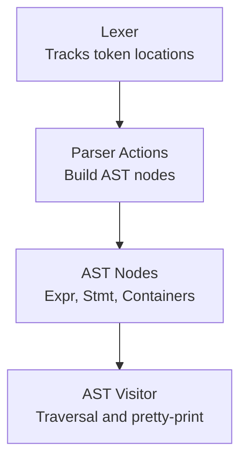
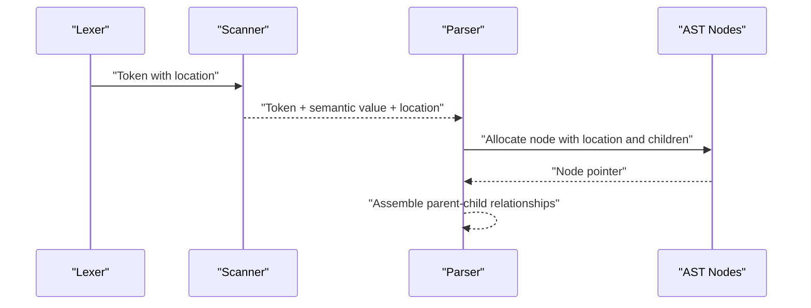
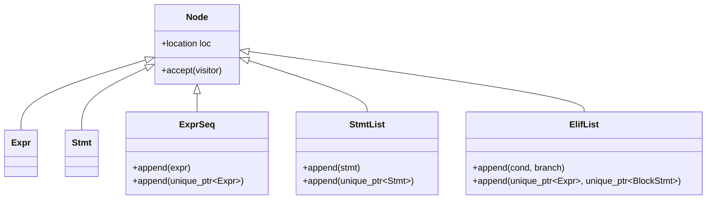
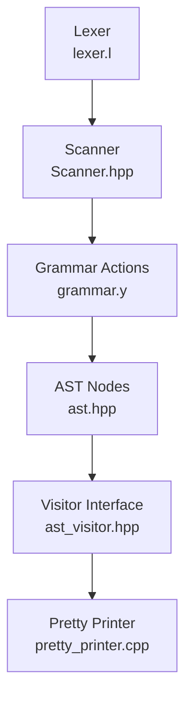

# AST Construction and Building Patterns

<cite>
**Referenced Files in This Document**
- [grammar.y](file://grammar.y)
- [ast.hpp](file://include/ast.hpp)
- [ast.cpp](file://src/ast.cpp)
- [Scanner.hpp](file://include/Scanner.hpp)
- [lexer.l](file://lexer.l)
- [pretty_printer.hpp](file://include/pretty_printer.hpp)
- [pretty_printer.cpp](file://src/pretty_printer.cpp)
- [main.cpp](file://src/main.cpp)
- [test_parser.cpp](file://tests/test_parser.cpp)
</cite>

## Table of Contents
1. [Introduction](#introduction)
2. [Project Structure](#project-structure)
3. [Core Components](#core-components)
4. [Architecture Overview](#architecture-overview)
5. [Detailed Component Analysis](#detailed-component-analysis)
6. [Dependency Analysis](#dependency-analysis)
7. [Performance Considerations](#performance-considerations)
8. [Troubleshooting Guide](#troubleshooting-guide)
9. [Conclusion](#conclusion)

## Introduction
This document explains how the parser constructs the Abstract Syntax Tree (AST) during parsing, focusing on:
- How Bison parser actions create AST nodes and assemble the tree
- Factory-like patterns in node constructors for specialized node types
- Append methods in container nodes for incremental assembly
- The role of location tracking for error reporting and debugging
- Typical construction scenarios from simple expressions to complex nested statements
- Ownership and relationship management across the AST

## Project Structure
The AST construction pipeline integrates the lexer, parser, and AST node definitions:
- The lexer tracks token locations and feeds tokens to the parser
- The parser grammar defines semantic actions that allocate and connect AST nodes
- AST nodes encapsulate typed data and relationships, with visitor support for traversal

**Section sources**
- [grammar.y:71-129](file://grammar.y#L71-L129)
- [Scanner.hpp:30-42](file://include/Scanner.hpp#L30-L42)
- [lexer.l:9-11](file://lexer.l#L9-L11)

## Core Components
- Node hierarchy: Base node with location, expression and statement subclasses, and containers for sequences and lists
- Container nodes: ExprSeq, StmtList, ElifList provide append methods to build structures incrementally
- Specialized constructors: Factory-like constructors for literals, unary/binary operators, arrays, let bindings, blocks, and if statements
- Location tracking: Tokens carry location metadata; parser actions forward locations to nodes for precise diagnostics

Key implementation references:
- Node base and containers: [ast.hpp:14-71](file://include/ast.hpp#L14-L71)
- Expression specializations: [ast.hpp:73-126](file://include/ast.hpp#L73-L126)
- Statement specializations and block/if: [ast.hpp:128-200](file://include/ast.hpp#L128-L200)
- Container append methods: [ast.hpp:27-41](file://include/ast.hpp#L27-L41), [ast.hpp:50-71](file://include/ast.hpp#L50-L71), [ast.hpp:159-172](file://include/ast.hpp#L159-L172)
- Accept implementations: [ast.cpp:7-32](file://src/ast.cpp#L7-L32)

**Section sources**
- [ast.hpp:14-200](file://include/ast.hpp#L14-L200)
- [ast.cpp:7-32](file://src/ast.cpp#L7-L32)

## Architecture Overview
The parser actions in the grammar allocate AST nodes and wire them together. The lexer updates the shared location object per token, which is captured via the @ symbol and forwarded to node constructors. This ensures accurate error reporting and pretty-printing.

**Diagram sources**
- [grammar.y:34-39](file://grammar.y#L34-L39)
- [lexer.l:9-11](file://lexer.l#L9-L11)
- [Scanner.hpp:30-42](file://include/Scanner.hpp#L30-L42)

**Section sources**
- [grammar.y:71-129](file://grammar.y#L71-L129)
- [lexer.l:9-11](file://lexer.l#L9-L11)
- [Scanner.hpp:30-42](file://include/Scanner.hpp#L30-L42)

## Detailed Component Analysis

### Parser Actions and AST Construction
Parser actions allocate nodes and pass locations and child nodes:
- Program root: [grammar.y:72](file://grammar.y#L72)
- Statement list: [grammar.y:75-77](file://grammar.y#L75-L77)
- Block statement: [grammar.y:79](file://grammar.y#L79)
- If statement: [grammar.y:81](file://grammar.y#L81)
- Elif list: [grammar.y:84-86](file://grammar.y#L84-L86)
- Optional else: [grammar.y:87-89](file://grammar.y#L87-L89)
- Expressions: [grammar.y:102-123](file://grammar.y#L102-L123)
- Expression sequences: [grammar.y:98-101](file://grammar.y#L98-L101)

Each action forwards the location (@$) and child nodes to constructors, ensuring nodes capture precise source positions.

**Section sources**
- [grammar.y:71-129](file://grammar.y#L71-L129)

### Factory-like Node Constructors
AST nodes use constructors that act as factories for specialized types:
- Literals: IntLitExpr, FloatLitExpr, StringLitExpr
- Unary/Binary ops: UnaryExpr, BinOpExpr
- Array literal: ArrayExpr
- Let binding: LetExpr
- Statement wrappers: ExprStmt, BlockStmt
- Control flow: IfStmt with ElifList and optional else

These constructors accept either raw pointers or unique_ptr arguments, enabling seamless integration with parser actions that manage ownership.

Examples of constructor usage in actions:
- Unary minus: [grammar.y:105](file://grammar.y#L105)
- Binary operators: [grammar.y:107-120](file://grammar.y#L107-L120)
- Array literal: [grammar.y:106](file://grammar.y#L106)
- Let binding: [grammar.y:121](file://grammar.y#L121)

**Section sources**
- [ast.hpp:73-143](file://include/ast.hpp#L73-L143)
- [grammar.y:102-123](file://grammar.y#L102-L123)

### Container Nodes and Incremental Assembly
Container nodes provide append methods to build structures incrementally:
- ExprSeq: [ast.hpp:27-41](file://include/ast.hpp#L27-L41)
- StmtList: [ast.hpp:50-71](file://include/ast.hpp#L50-L71)
- ElifList: [ast.hpp:159-172](file://include/ast.hpp#L159-L172)

Grammar actions leverage these methods:
- Statement list growth: [grammar.y:76](file://grammar.y#L76)
- Elif chain extension: [grammar.y:85](file://grammar.y#L85)
- Expression sequence assembly: [grammar.y:99-100](file://grammar.y#L99-L100)

**Diagram sources**
- [ast.hpp:14-71](file://include/ast.hpp#L14-L71)
- [ast.hpp:159-172](file://include/ast.hpp#L159-L172)

**Section sources**
- [ast.hpp:27-71](file://include/ast.hpp#L27-L71)
- [ast.hpp:159-172](file://include/ast.hpp#L159-L172)
- [grammar.y:75-101](file://grammar.y#L75-L101)

### Location Tracking and Error Reporting
Location tracking is enabled and propagated throughout:
- Grammar enables locations: [grammar.y:11](file://grammar.y#L11)
- Parser actions use @$ to capture token locations: [grammar.y:79, 81, 98-123](file://grammar.y#L79,L81,L98-L123)
- Lexer updates position per token: [lexer.l:9-11](file://lexer.l#L9-L11)
- Scanner exposes location to parser: [Scanner.hpp:30](file://include/Scanner.hpp#L30)

This ensures error messages and pretty-printing reflect accurate source positions.

**Section sources**
- [grammar.y:11](file://grammar.y#L11)
- [grammar.y:79, 81, 98-123](file://grammar.y#L79,L81,L98-L123)
- [lexer.l:9-11](file://lexer.l#L9-L11)
- [Scanner.hpp:30](file://include/Scanner.hpp#L30)

### Typical Construction Scenarios
- Simple expression: Integer literal
  - Action: [grammar.y:102](file://grammar.y#L102)
  - Node: IntLitExpr
- Arithmetic expression: Binary addition
  - Action: [grammar.y:115](file://grammar.y#L115)
  - Node: BinOpExpr
- Unary negation:
  - Action: [grammar.y:105](file://grammar.y#L105)
  - Node: UnaryExpr
- Array literal:
  - Action: [grammar.y:106](file://grammar.y#L106)
  - Node: ArrayExpr with ExprSeq
- Let binding:
  - Action: [grammar.y:121](file://grammar.y#L121)
  - Node: LetExpr
- If statement with elif chain and else:
  - Actions: [grammar.y:81](file://grammar.y#L81), [grammar.y:84-89](file://grammar.y#L84-L89)
  - Nodes: IfStmt, ElifList, BlockStmt
- Statement list:
  - Actions: [grammar.y:75-77](file://grammar.y#L75-L77)
  - Node: StmtList

**Section sources**
- [grammar.y:75-123](file://grammar.y#L75-L123)
- [ast.hpp:73-143](file://include/ast.hpp#L73-L143)

### Integration Between Parser Actions and AST Creation
- Ownership model:
  - Parser actions allocate raw pointers for newly created nodes
  - Container nodes store either raw pointers or unique_ptr variants depending on constructor overload used
  - Pretty printer and visitor traverse nodes via accept(), which is implemented consistently across node types
- Relationship management:
  - Parent nodes own child nodes via raw pointers or unique_ptr
  - Containers maintain vectors of owned children
  - Indentation propagation in blocks and if statements demonstrates hierarchical traversal and forwarding

References:
- Container append overloads: [ast.hpp:27-41](file://include/ast.hpp#L27-L41), [ast.hpp:50-71](file://include/ast.hpp#L50-L71), [ast.hpp:159-172](file://include/ast.hpp#L159-L172)
- Accept implementations: [ast.cpp:7-32](file://src/ast.cpp#L7-L32)
- Visitor interface: [pretty_printer.hpp:9-35](file://include/pretty_printer.hpp#L9-L35), [pretty_printer.cpp:7-95](file://src/pretty_printer.cpp#L7-L95)

**Section sources**
- [ast.hpp:27-172](file://include/ast.hpp#L27-L172)
- [ast.cpp:7-32](file://src/ast.cpp#L7-L32)
- [pretty_printer.hpp:9-35](file://include/pretty_printer.hpp#L9-L35)
- [pretty_printer.cpp:7-95](file://src/pretty_printer.cpp#L7-L95)

## Dependency Analysis
The following diagram shows how parser actions depend on AST node constructors and containers:

**Diagram sources**
- [grammar.y:71-129](file://grammar.y#L71-L129)
- [ast.hpp:14-200](file://include/ast.hpp#L14-L200)
- [pretty_printer.hpp:9-35](file://include/pretty_printer.hpp#L9-L35)
- [pretty_printer.cpp:7-95](file://src/pretty_printer.cpp#L7-L95)
- [lexer.l:9-11](file://lexer.l#L9-L11)
- [Scanner.hpp:30-42](file://include/Scanner.hpp#L30-L42)

**Section sources**
- [grammar.y:71-129](file://grammar.y#L71-L129)
- [ast.hpp:14-200](file://include/ast.hpp#L14-L200)
- [pretty_printer.hpp:9-35](file://include/pretty_printer.hpp#L9-L35)
- [pretty_printer.cpp:7-95](file://src/pretty_printer.cpp#L7-L95)
- [lexer.l:9-11](file://lexer.l#L9-L11)
- [Scanner.hpp:30-42](file://include/Scanner.hpp#L30-L42)

## Performance Considerations
- Prefer move semantics in container append methods to avoid unnecessary copies when integrating with parser actions that already own unique_ptr instances
- Keep node constructors lightweight; defer heavy operations to visitor passes
- Use vector capacity hints if constructing very large sequences to reduce reallocations

## Troubleshooting Guide
Common issues and remedies:
- Parsing failures producing no AST:
  - Verify parser actions return valid nodes and that the root assignment occurs at program level
  - Reference: [grammar.y:72](file://grammar.y#L72)
- Incorrect locations in errors:
  - Ensure lexer updates positions per token and parser actions capture @$
  - References: [lexer.l:9-11](file://lexer.l#L9-L11), [grammar.y:79, 81, 98-123](file://grammar.y#L79,L81,L98-L123)
- Memory ownership confusion:
  - Confirm container append overloads match whether actions pass raw pointers or unique_ptr
  - References: [ast.hpp:27-41](file://include/ast.hpp#L27-L41), [ast.hpp:50-71](file://include/ast.hpp#L50-L71), [ast.hpp:159-172](file://include/ast.hpp#L159-L172)
- Visitor traversal problems:
  - Ensure accept() is implemented for all node types and invoked by PrettyPrinter
  - References: [ast.cpp:7-32](file://src/ast.cpp#L7-L32), [pretty_printer.cpp:7-95](file://src/pretty_printer.cpp#L7-L95)

**Section sources**
- [grammar.y:72](file://grammar.y#L72)
- [lexer.l:9-11](file://lexer.l#L9-L11)
- [ast.hpp:27-172](file://include/ast.hpp#L27-L172)
- [ast.cpp:7-32](file://src/ast.cpp#L7-L32)
- [pretty_printer.cpp:7-95](file://src/pretty_printer.cpp#L7-L95)

## Conclusion
The parser’s semantic actions construct a robust AST by:
- Capturing precise token locations and forwarding them to node constructors
- Using factory-like constructors to instantiate specialized node types
- Leveraging container append methods for incremental assembly of complex structures
- Integrating with a visitor-based traversal for pretty-printing and diagnostics

This design yields a clear separation of concerns, strong ownership semantics, and accurate source positioning for reliable error reporting and debugging.