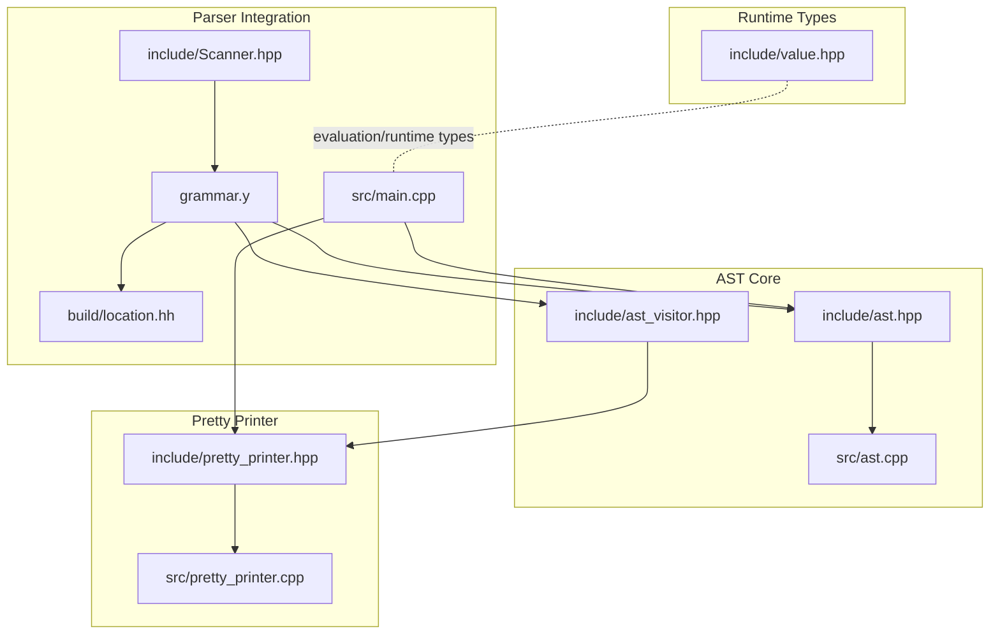
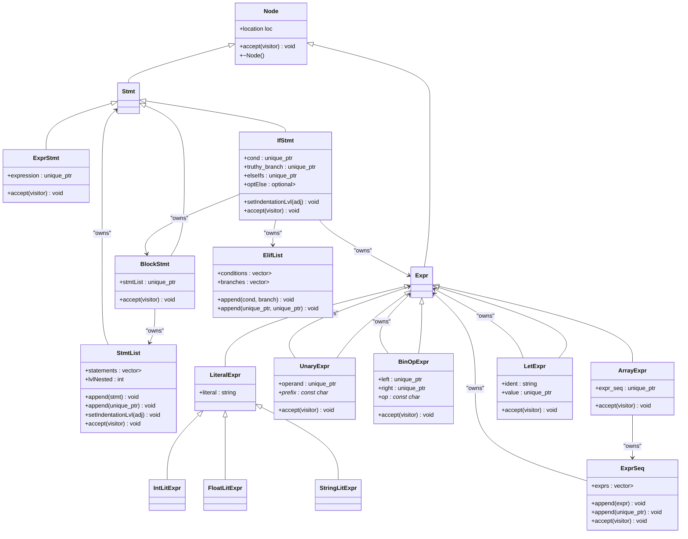
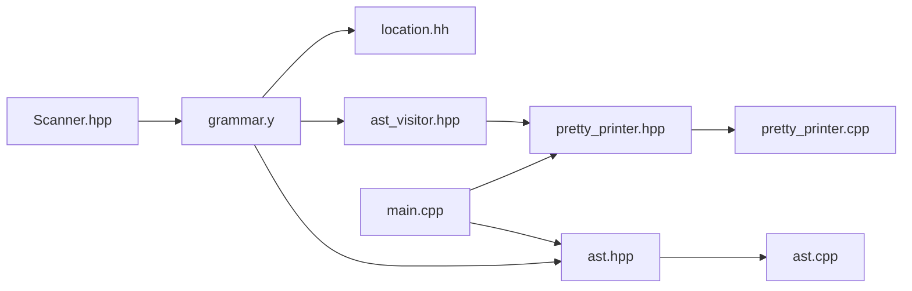
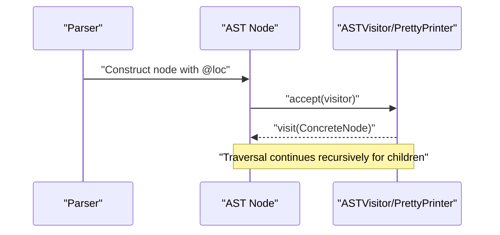

# AST Framework

<cite>
**Referenced Files in This Document**
- [ast.hpp](file://include/ast.hpp)
- [ast_visitor.hpp](file://include/ast_visitor.hpp)
- [ast.cpp](file://src/ast.cpp)
- [pretty_printer.hpp](file://include/pretty_printer.hpp)
- [pretty_printer.cpp](file://src/pretty_printer.cpp)
- [location.hh](file://build/location.hh)
- [Scanner.hpp](file://include/Scanner.hpp)
- [grammar.y](file://grammar.y)
- [main.cpp](file://src/main.cpp)
- [value.hpp](file://include/value.hpp)
</cite>

## Update Summary
**Changes Made**
- Added comprehensive documentation for the new LetExpr node type
- Updated architecture overview to include LetExpr in the inheritance hierarchy
- Enhanced visitor pattern documentation with LetExpr integration
- Updated grammar integration section to cover let statement support
- Added LetExpr-specific examples and usage patterns

## Table of Contents
1. [Introduction](#introduction)
2. [Project Structure](#project-structure)
3. [Core Components](#core-components)
4. [Architecture Overview](#architecture-overview)
5. [Detailed Component Analysis](#detailed-component-analysis)
6. [Dependency Analysis](#dependency-analysis)
7. [Performance Considerations](#performance-considerations)
8. [Troubleshooting Guide](#troubleshooting-guide)
9. [Conclusion](#conclusion)
10. [Appendices](#appendices)

## Introduction
This document describes the Abstract Syntax Tree (AST) framework used by the Monkey programming language REPL. It explains the hierarchical node structure, the visitor pattern for traversal and transformation, memory management with smart pointers and RAII, location tracking for error reporting, and how the AST integrates with the parser to support extensible language features. It also provides examples of AST node creation, traversal patterns, and integration with the visitor pattern for pretty printing and other output formats.

**Updated** Added documentation for the new LetExpr node type that provides support for let statements in the Monkey language.

## Project Structure
The AST framework is organized around a small set of header and implementation files:
- Core AST types and visitor interface live in include/ast.hpp and include/ast_visitor.hpp.
- Visitor implementations (e.g., pretty printer) live in include/pretty_printer.hpp and src/pretty_printer.cpp.
- The visitor dispatch implementations are provided in src/ast.cpp.
- Location tracking is provided by build/location.hh generated by Bison/Flex.
- The parser grammar (grammar.y) constructs AST nodes and passes ownership to the caller.
- The REPL entry point (src/main.cpp) demonstrates AST traversal via the visitor pattern.

**Diagram sources**
- [ast.hpp:10-194](file://include/ast.hpp#L10-L194)
- [ast_visitor.hpp:21-43](file://include/ast_visitor.hpp#L21-L43)
- [ast.cpp:5-56](file://src/ast.cpp#L5-L56)
- [pretty_printer.hpp:9-38](file://include/pretty_printer.hpp#L9-L38)
- [pretty_printer.cpp:5-96](file://src/pretty_printer.cpp#L5-L96)
- [grammar.y:17-129](file://grammar.y#L17-L129)
- [location.hh:57-307](file://build/location.hh#L57-L307)
- [Scanner.hpp:11-44](file://include/Scanner.hpp#L11-L44)
- [main.cpp:25-84](file://src/main.cpp#L25-L84)
- [value.hpp:10-226](file://include/value.hpp#L10-L226)

**Section sources**
- [ast.hpp:10-194](file://include/ast.hpp#L10-L194)
- [ast_visitor.hpp:21-43](file://include/ast_visitor.hpp#L21-L43)
- [ast.cpp:5-56](file://src/ast.cpp#L5-L56)
- [pretty_printer.hpp:9-38](file://include/pretty_printer.hpp#L9-L38)
- [pretty_printer.cpp:5-96](file://src/pretty_printer.cpp#L5-L96)
- [grammar.y:17-129](file://grammar.y#L17-L129)
- [location.hh:57-307](file://build/location.hh#L57-L307)
- [Scanner.hpp:11-44](file://include/Scanner.hpp#L11-L44)
- [main.cpp:25-84](file://src/main.cpp#L25-L84)
- [value.hpp:10-226](file://include/value.hpp#L10-L226)

## Core Components
- Base Node and location tracking: Every AST node inherits from a base Node that carries a location for error reporting and debugging.
- Expression and statement hierarchies: Expr and Stmt derive from Node, forming the foundation for expressions and statements respectively.
- Composite containers: ExprSeq and StmtList aggregate sequences of expressions and statements, managing child lifetimes with smart pointers.
- Concrete node types: Literal values (int, float, string), unary/binary operators, arrays, **let bindings**, blocks, and if/elif/else constructs.
- Visitor interface: ASTVisitor defines pure virtual visit methods for each node type, enabling transformations and output formats.
- Pretty printer: A concrete visitor that renders the AST to a formatted string, leveraging indentation and location-aware output.

**Updated** Added let bindings to the concrete node types list, highlighting the new LetExpr support.

Key design characteristics:
- Hierarchical inheritance from Node ensures a uniform accept mechanism for traversal.
- Smart pointers (std::unique_ptr and std::shared_ptr) manage ownership and lifetime.
- RAII is used to ensure cleanup of owned children.
- Location tracking via monkey::location enables precise diagnostics.

**Section sources**
- [ast.hpp:14-194](file://include/ast.hpp#L14-L194)
- [ast_visitor.hpp:21-43](file://include/ast_visitor.hpp#L21-L43)
- [ast.cpp:7-56](file://src/ast.cpp#L7-L56)
- [pretty_printer.hpp:9-38](file://include/pretty_printer.hpp#L9-L38)
- [pretty_printer.cpp:7-96](file://src/pretty_printer.cpp#L7-L96)

## Architecture Overview
The AST framework integrates with the parser to construct nodes during parsing, then exposes them to visitors for output or transformation. The visitor pattern decouples traversal logic from node types, enabling multiple consumers (pretty printer, evaluator, code generator).

**Updated** Enhanced the architecture diagram to include the new LetExpr node type and its relationships.

**Diagram sources**
- [ast.hpp:14-194](file://include/ast.hpp#L14-L194)

## Detailed Component Analysis

### Node and Location Tracking
- Base Node stores a location of type monkey::location, enabling precise error reporting and debugging.
- The accept method is the core of the visitor pattern, delegating to the visitor's visit method for the concrete type.

Design implications:
- Every node participates in traversal uniformly.
- Location is preserved across node copies and moves, aiding diagnostics.

**Section sources**
- [ast.hpp:14-21](file://include/ast.hpp#L14-L21)
- [location.hh:166-232](file://build/location.hh#L166-L232)

### Expression and Statement Hierarchies
- Expr and Stmt derive from Node, providing a clean separation between expression and statement contexts.
- Stmt adds nesting level management for indentation-sensitive output.

Key points:
- Stmt includes a nested_lvl field and a setIndentationLvl hook to propagate indentation adjustments.
- This design allows pretty printing to render structured blocks with consistent indentation.

**Section sources**
- [ast.hpp:23-48](file://include/ast.hpp#L23-L48)

### Composite Containers: ExprSeq and StmtList
- ExprSeq aggregates a vector of unique_ptr<Expr> and provides append overloads for raw pointers and smart pointers.
- StmtList aggregates a vector of unique_ptr<Stmt>, tracks nesting level, and propagates indentation to children.

Memory management:
- Ownership is transferred via std::move when passing unique_ptr instances.
- RAII ensures children are destroyed when containers go out of scope.

**Section sources**
- [ast.hpp:27-41](file://include/ast.hpp#L27-L41)
- [ast.hpp:50-71](file://include/ast.hpp#L50-L71)

### Literal Values
- LiteralExpr holds a string literal value and is the base for typed literals.
- IntLitExpr, FloatLitExpr, and StringLitExpr specialize behavior for different primitive types.

Visitor integration:
- Each type overrides accept to call the corresponding visit overload on ASTVisitor.

**Section sources**
- [ast.hpp:73-95](file://include/ast.hpp#L73-L95)
- [ast.cpp:8-15](file://src/ast.cpp#L8-L15)

### Operators and Arrays
- UnaryExpr stores a unique_ptr<Expr> operand and a prefix operator string.
- BinOpExpr stores left and right operands and an operator string.
- ArrayExpr wraps an ExprSeq to represent array literals.

Ownership and traversal:
- All composite nodes own their children via unique_ptr, ensuring safe destruction.
- accept delegates to the visitor, enabling pretty printing and other transformations.

**Section sources**
- [ast.hpp:97-126](file://include/ast.hpp#L97-L126)
- [ast.cpp:11-19](file://src/ast.cpp#L11-L19)

### Let Bindings and Control Flow
**Updated** Added comprehensive documentation for the new LetExpr node type.

- LetExpr binds an identifier to an expression value, providing let statement support in the Monkey language.
- BlockStmt contains a StmtList and manages indentation propagation.
- IfStmt encapsulates a condition, a truthy branch, an optional ElifList, and an optional else branch.

LetExpr implementation details:
- Stores ident as a std::string for the binding identifier
- Owns value via std::unique_ptr<Expr> for the expression being bound
- Provides accept method for visitor pattern integration
- Supports both raw pointer and smart pointer construction patterns

Indentation handling:
- IfStmt::setIndentationLvl propagates indentation to nested blocks, ensuring consistent formatting.

**Section sources**
- [ast.hpp:130-139](file://include/ast.hpp#L130-L139)
- [ast.hpp:159-172](file://include/ast.hpp#L159-L172)
- [ast.hpp:174-200](file://include/ast.hpp#L174-L200)
- [ast.cpp:25-27](file://src/ast.cpp#L25-L27)
- [ast.cpp:44-54](file://src/ast.cpp#L44-L54)

### Visitor Pattern Implementation
**Updated** Enhanced visitor pattern documentation to include LetExpr support.

- ASTVisitor declares pure virtual visit methods for each node type, including LetExpr.
- Each concrete node type implements accept to call the corresponding visit overload.
- PrettyPrinter implements ASTVisitor to render the AST to a string, including LetExpr support.

Traversal mechanics:
- accept forms a bridge between node and visitor, enabling polymorphic dispatch.
- LetExpr::accept calls visitor.visit(*this) to integrate with the visitor pattern.

**Section sources**
- [ast_visitor.hpp:21-43](file://include/ast_visitor.hpp#L21-L43)
- [ast.cpp:7-56](file://src/ast.cpp#L7-L56)
- [pretty_printer.hpp:9-38](file://include/pretty_printer.hpp#L9-L38)
- [pretty_printer.cpp:7-96](file://src/pretty_printer.cpp#L7-L96)

### Pretty Printing Workflow
**Updated** Added LetExpr pretty printing integration.

- The REPL constructs an AST via the parser and then traverses it using a PrettyPrinter.
- PrettyPrinter::visit methods render nodes with indentation and location-aware output for strings.
- LetExpr is rendered as "let ident = value" format, preserving the let statement syntax.

Integration points:
- main.cpp creates a PrettyPrinter, calls node.accept(printer), and prints the result string.
- PrettyPrinter::visit(LetExpr&) handles let statement formatting consistently with the visitor pattern.

**Section sources**
- [main.cpp:36-55](file://src/main.cpp#L36-L55)
- [pretty_printer.cpp:7-96](file://src/pretty_printer.cpp#L7-L96)

### AST Construction During Parsing
**Updated** Enhanced grammar integration documentation to include LetExpr.

- grammar.y defines tokens and non-terminals for expressions, statements, blocks, and if/elif/else constructs.
- Production rules allocate AST nodes and pass ownership to the parser's parse stack, which is later moved into a std::unique_ptr<Node> for the caller.
- LetExpr is constructed with the production rule: | LET Ident ASSIGN expr { $$ = new ast::LetExpr(@$, $2, $4); }

Examples of construction:
- Literal expressions create IntLitExpr, FloatLitExpr, and StringLitExpr.
- Binary operators create BinOpExpr with left/right operands and operator strings.
- Arrays create ArrayExpr wrapping an ExprSeq.
- **Let expressions create LetExpr with identifier and value expressions**.
- Control flow constructs create IfStmt, BlockStmt, and StmtList.

**Section sources**
- [grammar.y:48-123](file://grammar.y#L48-L123)
- [grammar.y:121](file://grammar.y#L121)

### Memory Management and RAII
- Unique ownership is expressed via std::unique_ptr for child nodes, ensuring single ownership and automatic cleanup.
- Shared ownership is used for runtime objects (eval::ObjectPtr) in the evaluation layer (value.hpp), separate from AST node ownership.
- RAII is enforced by default destructors and move semantics in constructors.

Benefits:
- Prevents memory leaks and dangling pointers.
- Simplifies ownership transfer between containers and parents.

**Section sources**
- [ast.hpp:27-126](file://include/ast.hpp#L27-L126)
- [value.hpp:20-226](file://include/value.hpp#L20-L226)

### Extensibility and Design Decisions
**Updated** Enhanced extensibility documentation to include LetExpr as a reference implementation.

- Adding a new node type:
  - Derive from Node (or Expr/Stmt) and implement accept to call the corresponding visit overload.
  - Add a visit overload in ASTVisitor and implement it in PrettyPrinter or other consumers.
  - Update grammar.y to construct the new node type in relevant productions.
  - **LetExpr serves as a reference implementation for simple expression-based nodes**.
- Extending containers:
  - Use std::unique_ptr for owned children and provide append overloads for both raw and smart-pointer arguments.
- Maintaining location:
  - Pass @loc from grammar.y to node constructors to preserve source positions for diagnostics.

**Section sources**
- [ast.hpp:14-194](file://include/ast.hpp#L14-L194)
- [ast_visitor.hpp:21-43](file://include/ast_visitor.hpp#L21-L43)
- [grammar.y:17-129](file://grammar.y#L17-L129)

## Dependency Analysis
The AST framework exhibits low coupling and high cohesion:
- Nodes depend only on the visitor interface and their contained children.
- The visitor interface is forward-declared in ast.hpp and fully defined in ast_visitor.hpp.
- PrettyPrinter depends on both the visitor interface and AST node types.
- The parser grammar depends on AST node types and location tracking.

**Diagram sources**
- [grammar.y:17-129](file://grammar.y#L17-L129)
- [ast.hpp:10-194](file://include/ast.hpp#L10-L194)
- [ast_visitor.hpp:21-43](file://include/ast_visitor.hpp#L21-L43)
- [ast.cpp:5-56](file://src/ast.cpp#L5-L56)
- [pretty_printer.hpp:9-38](file://include/pretty_printer.hpp#L9-L38)
- [pretty_printer.cpp:5-96](file://src/pretty_printer.cpp#L5-L96)
- [location.hh:57-307](file://build/location.hh#L57-L307)
- [Scanner.hpp:11-44](file://include/Scanner.hpp#L11-L44)
- [main.cpp:25-84](file://src/main.cpp#L25-L84)

**Section sources**
- [ast.hpp:10-194](file://include/ast.hpp#L10-L194)
- [ast_visitor.hpp:21-43](file://include/ast_visitor.hpp#L21-L43)
- [ast.cpp:5-56](file://src/ast.cpp#L5-L56)
- [pretty_printer.hpp:9-38](file://include/pretty_printer.hpp#L9-L38)
- [pretty_printer.cpp:5-96](file://src/pretty_printer.cpp#L5-L96)
- [grammar.y:17-129](file://grammar.y#L17-L129)
- [location.hh:57-307](file://build/location.hh#L57-L307)
- [Scanner.hpp:11-44](file://include/Scanner.hpp#L11-L44)
- [main.cpp:25-84](file://src/main.cpp#L25-L84)

## Performance Considerations
- Traversal cost: O(N) where N is the number of nodes, as each node is visited exactly once per traversal.
- Memory: std::unique_ptr avoids shared ownership overhead and prevents accidental copying of heavy subtrees.
- Output: PrettyPrinter uses std::ostringstream for efficient string building; indentation is computed once per node.
- Location printing: StringLitExpr includes location-aware output, which can be disabled for performance-sensitive scenarios.
- **LetExpr performance**: Minimal overhead as it only stores identifier and value expressions with standard smart pointer management.

## Troubleshooting Guide
Common issues and resolutions:
- Parsing produces no AST:
  - Ensure grammar.y constructs nodes and assigns them to ppRoot. Verify that the parser receives a unique_ptr<Node>& and that the assignment occurs in the program production.
- Incorrect indentation in pretty printed output:
  - Confirm that StmtList::setIndentationLvl and IfStmt::setIndentationLvl propagate indentation to children.
- Location mismatch in errors:
  - Verify that grammar.y passes @loc to node constructors and that Scanner sets file name and positions correctly.
- Visitor not invoked:
  - Ensure each node type overrides accept to call the corresponding visit overload.
- **LetExpr not rendering correctly**:
  - Verify that LetExpr::accept calls visitor.visit(*this) and that PrettyPrinter::visit(LetExpr&) is implemented.
  - Check that grammar.y production rule correctly constructs LetExpr with identifier and value.

**Section sources**
- [grammar.y:72-72](file://grammar.y#L72-L72)
- [ast.cpp:7-56](file://src/ast.cpp#L7-L56)
- [ast.cpp:44-54](file://src/ast.cpp#L44-L54)
- [Scanner.hpp:16-28](file://include/Scanner.hpp#L16-L28)

## Conclusion
The AST framework provides a robust, extensible foundation for representing Monkey language constructs. Its hierarchical design, visitor pattern, and smart pointer-based ownership model combine to deliver clear separation of concerns, predictable memory management, and precise location tracking. The integration with the parser and the pretty printer demonstrates how the framework supports both compilation-time transformations and user-facing output formats.

**Updated** The framework now includes comprehensive support for let statements through the new LetExpr node type, demonstrating the extensibility of the AST framework for adding new language features.

## Appendices

### Visitor Dispatch Flow

**Diagram sources**
- [ast.cpp:7-56](file://src/ast.cpp#L7-L56)
- [pretty_printer.cpp:7-96](file://src/pretty_printer.cpp#L7-L96)

### AST Construction Example Paths
- Literal expressions: [grammar.y:102-104](file://grammar.y#L102-L104)
- Binary operators: [grammar.y:107-120](file://grammar.y#L107-L120)
- Arrays: [grammar.y:106](file://grammar.y#L106)
- **Let bindings**: [grammar.y:121](file://grammar.y#L121)
- Control flow: [grammar.y:79-89](file://grammar.y#L79-L89)

**Updated** Added LetExpr construction example path.

**Section sources**
- [grammar.y:102-121](file://grammar.y#L102-L121)
- [grammar.y:79-89](file://grammar.y#L79-L89)

### LetExpr Usage Examples
**New** Comprehensive examples of LetExpr usage patterns:

- **Basic let binding**: `let x = 42;` creates LetExpr with ident="x" and value=IntLitExpr(42)
- **Let with complex expression**: `let y = x + 10;` creates LetExpr with ident="y" and value=BinOpExpr
- **Let in blocks**: `let z = [1, 2, 3];` creates LetExpr with ident="z" and value=ArrayExpr
- **Pretty printing output**: LetExpr renders as "let ident = value" format

These examples demonstrate how LetExpr integrates seamlessly with the existing AST framework while providing new language capabilities.

**Section sources**
- [ast.hpp:130-139](file://include/ast.hpp#L130-L139)
- [pretty_printer.cpp:47-50](file://src/pretty_printer.cpp#L47-L50)
- [grammar.y:121](file://grammar.y#L121)