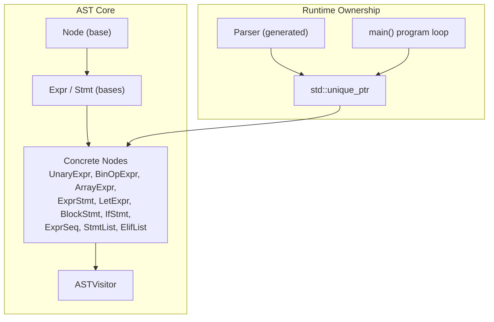
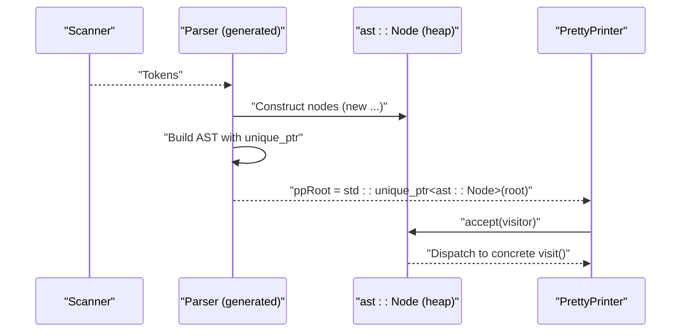
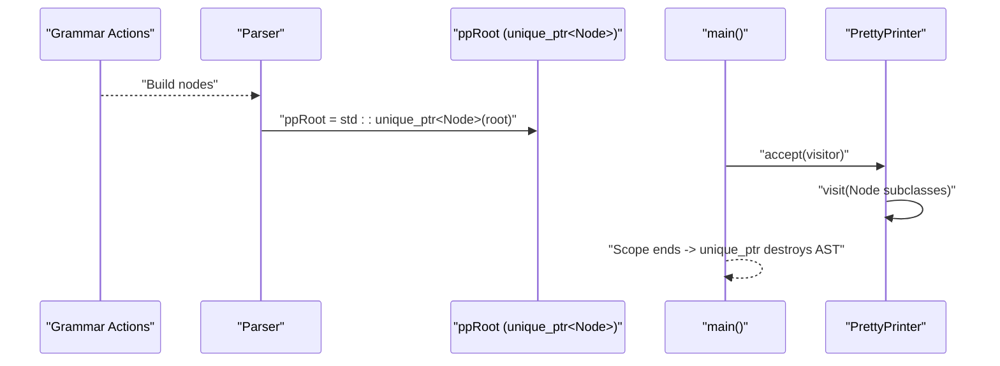
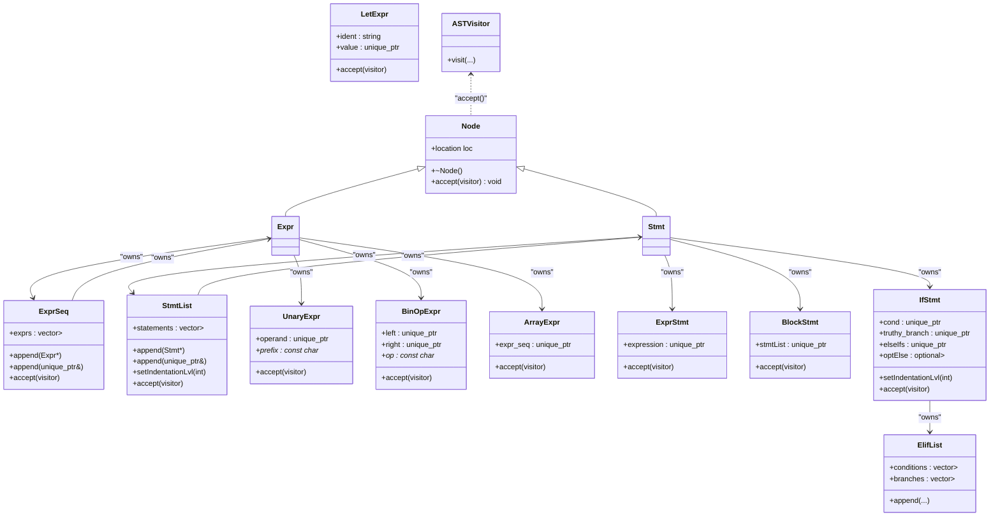

# Memory Management and RAII

<cite>
**Referenced Files in This Document**
- [ast.hpp](file://include/ast.hpp)
- [ast.cpp](file://src/ast.cpp)
- [ast_visitor.hpp](file://include/ast_visitor.hpp)
- [main.cpp](file://src/main.cpp)
- [Parser.hpp](file://build/Parser.hpp)
- [grammar.y](file://grammar.y)
</cite>

## Table of Contents
1. [Introduction](#introduction)
2. [Project Structure](#project-structure)
3. [Core Components](#core-components)
4. [Architecture Overview](#architecture-overview)
5. [Detailed Component Analysis](#detailed-component-analysis)
6. [Dependency Analysis](#dependency-analysis)
7. [Performance Considerations](#performance-considerations)
8. [Troubleshooting Guide](#troubleshooting-guide)
9. [Conclusion](#conclusion)

## Introduction
This document explains the memory management strategies used in the AST framework, focusing on RAII and smart pointers. It details how unique_ptr is used to enforce single ownership of AST nodes, how move semantics enable efficient ownership transfer, and how destructors automatically clean up child nodes. It also covers best practices for extending the AST with new node types and highlights common pitfalls to avoid.

## Project Structure
The AST memory model centers around a small set of header-only node definitions and a visitor interface. Parsing produces heap-allocated nodes owned by a unique_ptr stored in the parser, which is then transferred to higher-level components.

**Diagram sources**
- [ast.hpp:14-202](file://include/ast.hpp#L14-L202)
- [ast_visitor.hpp:21-40](file://include/ast_visitor.hpp#L21-L40)
- [Parser.hpp:2091-2092](file://build/Parser.hpp#L2091-L2092)
- [main.cpp:34-55](file://src/main.cpp#L34-L55)

**Section sources**
- [ast.hpp:14-202](file://include/ast.hpp#L14-L202)
- [ast_visitor.hpp:21-40](file://include/ast_visitor.hpp#L21-L40)
- [Parser.hpp:2091-2092](file://build/Parser.hpp#L2091-L2092)
- [main.cpp:34-55](file://src/main.cpp#L34-L55)

## Core Components
- Node hierarchy with virtual destructors ensures derived nodes are destroyed polymorphically.
- Unique ownership enforced via unique_ptr for all child containers and optional members.
- Move semantics in constructors and append methods transfer ownership efficiently.
- Visitor pattern decouples traversal and operations from node definitions.

Key design decisions:
- All child containers are vectors of unique_ptr to guarantee single ownership and prevent shallow copies.
- Append overloads accept raw pointers for convenience and unique_ptr references for explicit move semantics.
- Optional child nodes are modeled as std::optional<unique_ptr<T>> to clearly express optional ownership.

**Section sources**
- [ast.hpp:14-202](file://include/ast.hpp#L14-L202)

## Architecture Overview
The parser constructs nodes on the heap and stores the root in a unique_ptr passed by reference. Ownership is transferred to the caller, who can then traverse the tree using the visitor interface.

**Diagram sources**
- [grammar.y:72](file://grammar.y#L72)
- [Parser.hpp:2091-2092](file://build/Parser.hpp#L2091-L2092)
- [ast.cpp:8-19](file://src/ast.cpp#L8-L19)

**Section sources**
- [grammar.y:72](file://grammar.y#L72)
- [Parser.hpp:2091-2092](file://build/Parser.hpp#L2091-L2092)
- [ast.cpp:8-19](file://src/ast.cpp#L8-L19)

## Detailed Component Analysis

### Node Base Classes and RAII
- Node defines a virtual destructor to ensure derived types are destroyed correctly.
- Expr and Stmt derive from Node; Stmt adds indentation support with a virtual setter.

RAII implications:
- Polymorphic destruction is guaranteed by the virtual destructor chain.
- Child containers holding unique_ptr automatically destroy owned nodes when the parent is destroyed.

**Section sources**
- [ast.hpp:14-48](file://include/ast.hpp#L14-L48)

### Container Ownership with unique_ptr
- ExprSeq holds std::vector<std::unique_ptr<Expr>> and StmtList holds std::vector<std::unique_ptr<Stmt>>.
- Append overloads:
  - Accept raw pointer for convenience.
  - Accept unique_ptr reference with std::move to transfer ownership.
- ElifList holds parallel vectors of unique_ptr<Expr> and unique_ptr<BlockStmt>, ensuring paired ownership.

Best practices:
- Prefer the unique_ptr overload when you own the argument to avoid accidental copies.
- Use raw-pointer overloads only when borrowing temporarily during construction.

**Section sources**
- [ast.hpp:27-41](file://include/ast.hpp#L27-L41)
- [ast.hpp:50-71](file://include/ast.hpp#L50-L71)
- [ast.hpp:159-172](file://include/ast.hpp#L159-L172)

### Binary and Unary Expressions
- BinOpExpr and UnaryExpr store operands as std::unique_ptr<Expr>.
- Constructors accept either raw pointers (borrowing) or unique_ptr (moving ownership).
- This design prevents shallow copies and enforces single ownership per operand.

Move semantics:
- When constructing with unique_ptr, ownership transfers via std::move.
- When constructing with raw pointer, the node takes ownership of the passed pointer.

**Section sources**
- [ast.hpp:97-118](file://include/ast.hpp#L97-L118)

### Statement Containers and Indentation Propagation
- StmtList manages a vector of Stmt unique_ptr and propagates indentation adjustments to children.
- setIndentationLvl iterates children and delegates to each Stmt.

RAII benefit:
- Automatic cleanup of statements when StmtList is destroyed.

**Section sources**
- [ast.hpp:50-71](file://include/ast.hpp#L50-L71)
- [ast.cpp:21-31](file://src/ast.cpp#L21-L31)

### Conditional Constructs and Optional Branches
- IfStmt holds:
  - cond: unique_ptr<Expr>
  - truthy_branch: unique_ptr<BlockStmt>
  - elseIfs: unique_ptr<ElifList>
  - optElse: std::optional<std::unique_ptr<BlockStmt>>
- The constructor accepting unique_ptr variants moves ownership into the node.

Optional ownership:
- optElse uses std::optional<unique_ptr<BlockStmt>> to represent absence of an else branch cleanly.

**Section sources**
- [ast.hpp:174-200](file://include/ast.hpp#L174-L200)

### Array and Expression Sequences
- ArrayExpr holds std::unique_ptr<ExprSeq>.
- ExprSeq supports appending expressions with either raw pointer or unique_ptr.

Ownership transfer:
- Using the unique_ptr append overload transfers ownership to the container.

**Section sources**
- [ast.hpp:120-126](file://include/ast.hpp#L120-L126)
- [ast.hpp:27-41](file://include/ast.hpp#L27-L41)

### Visitor Pattern and Polymorphic Dispatch
- Node declares a pure virtual accept method.
- Concrete accept implementations dispatch to the visitor’s visit overloads.
- ASTVisitor defines virtual visit methods for all node types.

RAII and visitors:
- Visitors operate on existing nodes; they do not manage node lifetimes.
- Destruction remains the responsibility of owning containers and unique_ptr holders.

**Section sources**
- [ast.hpp:14-21](file://include/ast.hpp#L14-L21)
- [ast.cpp:8-19](file://src/ast.cpp#L8-L19)
- [ast_visitor.hpp:21-40](file://include/ast_visitor.hpp#L21-L40)

### Ownership Transfer in Parsing and Runtime
- Grammar action sets the parser’s ppRoot to a unique_ptr wrapping the constructed program node.
- The Parser is generated with a reference to a unique_ptr<ast::Node>&, enabling safe ownership handoff.
- In main(), the parsed AST is accepted by PrettyPrinter; the unique_ptr ensures automatic cleanup after printing.

**Diagram sources**
- [grammar.y:72](file://grammar.y#L72)
- [Parser.hpp:2091-2092](file://build/Parser.hpp#L2091-L2092)
- [main.cpp:34-55](file://src/main.cpp#L34-L55)

**Section sources**
- [grammar.y:72](file://grammar.y#L72)
- [Parser.hpp:2091-2092](file://build/Parser.hpp#L2091-L2092)
- [main.cpp:34-55](file://src/main.cpp#L34-L55)

## Dependency Analysis
The AST nodes depend on:
- std::unique_ptr for ownership
- std::vector for ordered collections
- std::optional for optional child nodes
- ASTVisitor for traversal and operations

**Diagram sources**
- [ast.hpp:14-202](file://include/ast.hpp#L14-L202)
- [ast_visitor.hpp:21-40](file://include/ast_visitor.hpp#L21-L40)

**Section sources**
- [ast.hpp:14-202](file://include/ast.hpp#L14-L202)
- [ast_visitor.hpp:21-40](file://include/ast_visitor.hpp#L21-L40)

## Performance Considerations
- Using unique_ptr avoids shared ownership overhead and prevents accidental sharing that could lead to extra copies.
- Move semantics in constructors and append methods eliminate unnecessary deep copies of child nodes.
- Vector growth is amortized; prefer reserving when building large sequences if profiling indicates contention.
- Visiting the tree is O(N) in node count; keep visitor operations linear in node size.

## Troubleshooting Guide
Common pitfalls and remedies:
- Shallow copying nodes:
  - Symptom: Duplicate destruction or dangling pointers.
  - Fix: Always pass unique_ptr to constructors and append methods; use the unique_ptr overload to transfer ownership.
  - Reference: [ast.hpp:97-118](file://include/ast.hpp#L97-L118), [ast.hpp:27-41](file://include/ast.hpp#L27-L41), [ast.hpp:50-71](file://include/ast.hpp#L50-L71)

- Mixing raw and unique_ptr ownership:
  - Symptom: Double-delete or use-after-free.
  - Fix: If you construct with a raw pointer, ensure no other unique_ptr owns the same address; prefer unique_ptr overloads when you own the node.
  - Reference: [ast.hpp:97-118](file://include/ast.hpp#L97-L118), [ast.hpp:27-41](file://include/ast.hpp#L27-L41)

- Forgetting to move when appending:
  - Symptom: Compiler errors or unexpected copies.
  - Fix: Pass unique_ptr by reference-to-unique_ptr and rely on std::move in the append implementation.
  - Reference: [ast.hpp:27-41](file://include/ast.hpp#L27-L41), [ast.hpp:50-71](file://include/ast.hpp#L50-L71)

- Optional branches not moved:
  - Symptom: Compilation errors or unintended copies.
  - Fix: Use the unique_ptr constructor overload for IfStmt to move optElse.
  - Reference: [ast.hpp:174-200](file://include/ast.hpp#L174-L200)

- Visitor misuse:
  - Symptom: Accessing deleted nodes or incorrect traversal.
  - Fix: Ensure the AST remains alive while visiting; use the visitor only on nodes owned by unique_ptr containers.
  - Reference: [ast.cpp:8-19](file://src/ast.cpp#L8-L19), [ast_visitor.hpp:21-40](file://include/ast_visitor.hpp#L21-L40)

## Conclusion
The AST framework enforces robust memory safety through RAII and unique_ptr-based ownership. Move semantics and explicit append overloads ensure efficient and correct ownership transfer, while virtual destructors guarantee proper cleanup. By following the documented patterns—preferencing unique_ptr overloads, using optional<unique_ptr<T>> for optional children, and leveraging the visitor pattern—you can safely extend the AST with new node types and maintain leak-free code.