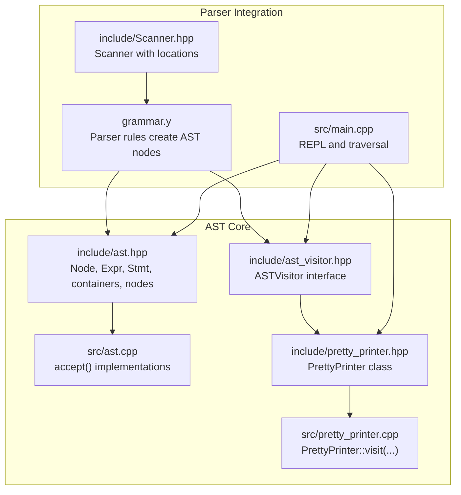
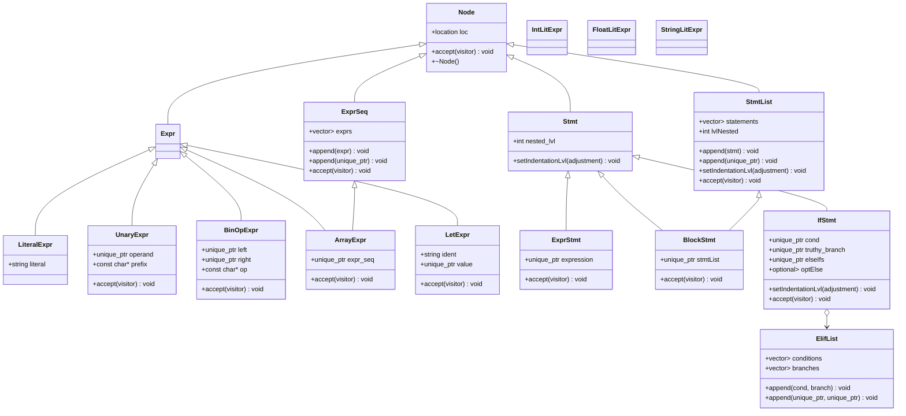
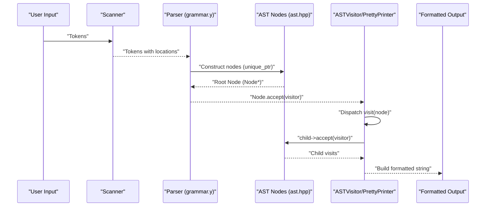
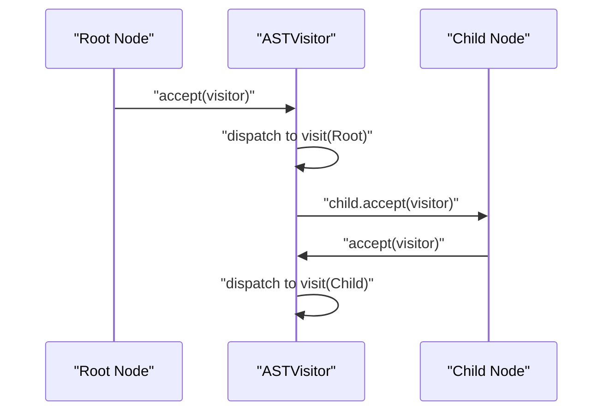
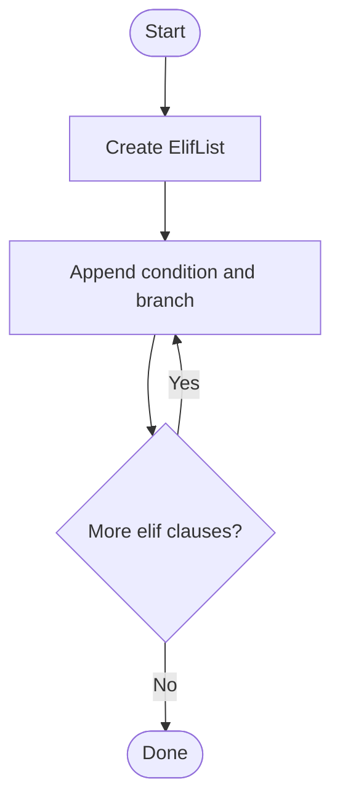
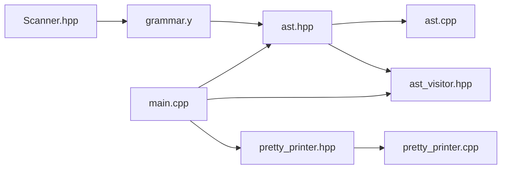

# Node Hierarchy and Types

<cite>
**Referenced Files in This Document**
- [ast.hpp](file://include/ast.hpp)
- [ast.cpp](file://src/ast.cpp)
- [ast_visitor.hpp](file://include/ast_visitor.hpp)
- [pretty_printer.hpp](file://include/pretty_printer.hpp)
- [pretty_printer.cpp](file://src/pretty_printer.cpp)
- [Scanner.hpp](file://include/Scanner.hpp)
- [grammar.y](file://grammar.y)
- [main.cpp](file://src/main.cpp)
- [type_table.hpp](file://include/type_table.hpp)
</cite>

## Table of Contents
1. [Introduction](#introduction)
2. [Project Structure](#project-structure)
3. [Core Components](#core-components)
4. [Architecture Overview](#architecture-overview)
5. [Detailed Component Analysis](#detailed-component-analysis)
6. [Dependency Analysis](#dependency-analysis)
7. [Performance Considerations](#performance-considerations)
8. [Troubleshooting Guide](#troubleshooting-guide)
9. [Conclusion](#conclusion)

## Introduction
This document explains the Abstract Syntax Tree (AST) node hierarchy and type system used by the Monkey language compiler. It focuses on the base Node class with location tracking and the virtual accept mechanism, the inheritance from Node into Expr and Stmt, and the specialized node types that represent language constructs such as literals, unary and binary operators, arrays, expressions-as-statements, let bindings, blocks, and conditionals. It also documents container nodes for sequences and lists, and the ElifList structure for handling elif chains. The design rationale behind the hierarchy, memory management with unique_ptr smart pointers, and the role of each node type in the overall AST are covered, along with examples of instantiation and parent-child relationships.

## Project Structure
The AST definition resides in the header include/ast.hpp, with accept() implementations in src/ast.cpp. Visitor interfaces are declared in include/ast_visitor.hpp, and a concrete PrettyPrinter visitor is implemented in include/pretty_printer.hpp and src/pretty_printer.cpp. The parser grammar in grammar.y defines how tokens and productions construct AST nodes, and the Scanner in include/Scanner.hpp integrates with the lexer. The REPL entry point in src/main.cpp demonstrates traversal of the AST via the visitor pattern.

**Diagram sources**
- [ast.hpp:14-203](file://include/ast.hpp#L14-L203)
- [ast.cpp:5-32](file://src/ast.cpp#L5-L32)
- [ast_visitor.hpp:21-40](file://include/ast_visitor.hpp#L21-L40)
- [pretty_printer.hpp:9-35](file://include/pretty_printer.hpp#L9-L35)
- [pretty_printer.cpp:7-95](file://src/pretty_printer.cpp#L7-L95)
- [grammar.y:48-123](file://grammar.y#L48-L123)
- [Scanner.hpp:13-42](file://include/Scanner.hpp#L13-L42)
- [main.cpp:25-84](file://src/main.cpp#L25-L84)

**Section sources**
- [ast.hpp:14-203](file://include/ast.hpp#L14-L203)
- [ast.cpp:5-32](file://src/ast.cpp#L5-L32)
- [ast_visitor.hpp:21-40](file://include/ast_visitor.hpp#L21-L40)
- [pretty_printer.hpp:9-35](file://include/pretty_printer.hpp#L9-L35)
- [pretty_printer.cpp:7-95](file://src/pretty_printer.cpp#L7-L95)
- [grammar.y:48-123](file://grammar.y#L48-L123)
- [Scanner.hpp:13-42](file://include/Scanner.hpp#L13-L42)
- [main.cpp:25-84](file://src/main.cpp#L25-L84)

## Core Components
- Base Node: Provides location tracking and a pure virtual accept method for the visitor pattern.
- Expr and Stmt: Abstract base classes for expressions and statements, inheriting from Node.
- Container nodes:
  - ExprSeq: A sequence of expressions.
  - StmtList: A list of statements with indentation support.
- Specialized nodes:
  - Literals: IntLitExpr, FloatLitExpr, StringLitExpr under LiteralExpr.
  - Operators: UnaryExpr, BinOpExpr, ArrayExpr.
  - Control flow: IfStmt with ElifList and optional else branch; BlockStmt; ExprStmt; LetExpr.
- Visitor: ASTVisitor declares visit methods for each node type; PrettyPrinter implements them.

Key characteristics:
- Location tracking: All nodes store a location object for error reporting and pretty printing.
- Virtual accept: Each node exposes accept(ASTVisitor&) to dispatch to the correct visit method.
- Memory management: unique_ptr is used for owned children to ensure RAII and prevent leaks.
- Indentation: Stmt-derived nodes carry nested level information for pretty printing.

**Section sources**
- [ast.hpp:14-203](file://include/ast.hpp#L14-L203)
- [ast.cpp:7-19](file://src/ast.cpp#L7-L19)
- [ast_visitor.hpp:21-40](file://include/ast_visitor.hpp#L21-L40)
- [pretty_printer.cpp:58-72](file://src/pretty_printer.cpp#L58-L72)

## Architecture Overview
The AST is a tree of polymorphic nodes. The visitor pattern decouples traversal and formatting from node definitions. The parser grammar constructs nodes and passes ownership via unique_ptr. The PrettyPrinter traverses the tree and formats output.

**Diagram sources**
- [ast.hpp:14-203](file://include/ast.hpp#L14-L203)

## Detailed Component Analysis

### Base Node and Visitor Pattern
- Node stores a location and defines a pure virtual accept method. This enables double dispatch through the visitor.
- ASTVisitor declares visit methods for all node types, allowing concrete visitors (e.g., PrettyPrinter) to implement formatting or analysis.
- accept() implementations in ast.cpp forward to the visitor’s visit method for each node type.

Design rationale:
- Polymorphism with virtual accept enables extensibility without changing node classes.
- Visitor separation allows multiple traversals (pretty-printing, type-checking, evaluation) without embedding logic into nodes.

**Section sources**
- [ast.hpp:14-21](file://include/ast.hpp#L14-L21)
- [ast.cpp:7-19](file://src/ast.cpp#L7-L19)
- [ast_visitor.hpp:21-40](file://include/ast_visitor.hpp#L21-L40)

### Containers: ExprSeq and StmtList
- ExprSeq holds a vector of unique_ptr<Expr> and supports appending both raw pointers and unique_ptr variants. It forwards accept to the visitor.
- StmtList holds a vector of unique_ptr<Stmt>, tracks indentation level, and propagates indentation adjustments to children. It also forwards accept to the visitor.

Usage example (conceptual):
- An ExprSeq can be constructed and populated during parsing of comma-separated expressions.
- A StmtList can be appended with statements and later formatted with consistent indentation.

**Section sources**
- [ast.hpp:27-41](file://include/ast.hpp#L27-L41)
- [ast.hpp:50-71](file://include/ast.hpp#L50-L71)
- [ast.cpp:15-19](file://src/ast.cpp#L15-L19)

### Literals: IntLitExpr, FloatLitExpr, StringLitExpr
- All derive from LiteralExpr, which stores a string literal value.
- They expose accept to route to the visitor.

Usage example (conceptual):
- During parsing, tokens for integers, floats, and strings are transformed into IntLitExpr, FloatLitExpr, or StringLitExpr respectively.

**Section sources**
- [ast.hpp:73-95](file://include/ast.hpp#L73-L95)
- [ast.cpp:8-10](file://src/ast.cpp#L8-L10)

### Unary and Binary Operations
- UnaryExpr holds a unique_ptr<Expr> operand and a prefix operator string; it accepts the visitor.
- BinOpExpr holds unique_ptr<Expr> left and right operands plus an operator string; it accepts the visitor.

Usage example (conceptual):
- A minus sign followed by an expression becomes a UnaryExpr with prefix "-" wrapping the sub-expression.
- Arithmetic and logical operators become BinOpExpr nodes with left/right children.

**Section sources**
- [ast.hpp:97-118](file://include/ast.hpp#L97-L118)
- [ast.cpp:11-12](file://src/ast.cpp#L11-L12)

### Arrays and Expressions
- ArrayExpr wraps an ExprSeq and accepts the visitor.
- ExprSeq itself accepts the visitor and iterates over its expressions.

Usage example (conceptual):
- Parsing [a, b, c] creates an ArrayExpr containing an ExprSeq with three expressions.

**Section sources**
- [ast.hpp:120-126](file://include/ast.hpp#L120-L126)
- [ast.cpp:13-15](file://src/ast.cpp#L13-L15)

### Let Bindings
- LetExpr stores an identifier and a unique_ptr<Expr> value, then accepts the visitor.

Usage example (conceptual):
- Parsing let x = 42 creates a LetExpr binding the identifier "x" to an IntLitExpr.

**Section sources**
- [ast.hpp:136-143](file://include/ast.hpp#L136-L143)
- [ast.cpp:14-14](file://src/ast.cpp#L14-L14)

### Expressions as Statements and Blocks
- ExprStmt wraps an expression and prints it semicolon-terminated.
- BlockStmt holds a StmtList and sets indentation for its children; it accepts the visitor.

Usage example (conceptual):
- An expression followed by a semicolon becomes an ExprStmt.
- A block { stmt1; stmt2; } becomes a BlockStmt containing a StmtList.

**Section sources**
- [ast.hpp:128-134](file://include/ast.hpp#L128-L134)
- [ast.hpp:145-156](file://include/ast.hpp#L145-L156)
- [ast.cpp:16-17](file://src/ast.cpp#L16-L17)

### Conditionals: IfStmt and ElifList
- IfStmt holds a condition, a truthy branch (BlockStmt), an optional ElifList, and an optional else branch (BlockStmt).
- ElifList stores vectors of conditions and branches, with append overloads for raw pointers and unique_ptr variants.
- IfStmt overrides setIndentationLvl to propagate indentation to all branches.

Usage example (conceptual):
- if cond { ... } elif altCond { ... } else { ... } produces an IfStmt with an ElifList and an optional else branch.

**Section sources**
- [ast.hpp:159-172](file://include/ast.hpp#L159-L172)
- [ast.hpp:174-200](file://include/ast.hpp#L174-L200)
- [ast.cpp:21-31](file://src/ast.cpp#L21-L31)

### Visitor Implementation: PrettyPrinter
- PrettyPrinter implements all visit methods to format nodes into a string stream.
- It uses indentation derived from Stmt::nested_lvl for blocks and statements.
- It delegates to child nodes via accept to traverse the tree.

Example traversal flow:
- Node::accept dispatches to the appropriate visit method.
- visit methods call child->accept(*this) to continue traversal.

**Section sources**
- [pretty_printer.hpp:9-35](file://include/pretty_printer.hpp#L9-L35)
- [pretty_printer.cpp:7-95](file://src/pretty_printer.cpp#L7-L95)

### Parser Integration and Node Instantiation
- The grammar rules in grammar.y construct AST nodes and pass ownership via unique_ptr.
- Tokens and productions map directly to constructors of the corresponding node types.
- The Scanner provides location information used to initialize Node::loc.

Examples of instantiation (from grammar rules):
- Integer, float, and string literals instantiate IntLitExpr, FloatLitExpr, and StringLitExpr.
- Unary minus and binary operators instantiate UnaryExpr and BinOpExpr.
- Arrays instantiate ArrayExpr with an ExprSeq.
- Let bindings instantiate LetExpr.
- Blocks instantiate BlockStmt with a StmtList.
- If statements instantiate IfStmt with an ElifList and optional else.

**Section sources**
- [grammar.y:48-123](file://grammar.y#L48-L123)
- [Scanner.hpp:13-42](file://include/Scanner.hpp#L13-L42)

### Memory Management with unique_ptr
- Children are stored as unique_ptr to ensure automatic cleanup.
- Constructors accept both raw pointers and unique_ptr variants to accommodate different ownership contexts during parsing.
- Move semantics are used to transfer ownership when constructing nodes.

Benefits:
- Automatic resource management prevents leaks.
- Clear ownership semantics reduce errors.

**Section sources**
- [ast.hpp:97-126](file://include/ast.hpp#L97-L126)
- [ast.hpp:136-156](file://include/ast.hpp#L136-L156)
- [ast.hpp:174-196](file://include/ast.hpp#L174-L196)

### Role in the Overall AST Structure
- Node forms the root of all AST nodes and carries location for diagnostics.
- Expr and Stmt separate expression and statement constructs, enabling distinct visitor specializations.
- Containers (ExprSeq, StmtList) aggregate sequences and lists of nodes.
- Specialized nodes represent concrete language constructs, enabling precise traversal and analysis.

**Section sources**
- [ast.hpp:14-203](file://include/ast.hpp#L14-L203)

## Architecture Overview

**Diagram sources**
- [grammar.y:48-123](file://grammar.y#L48-L123)
- [ast.hpp:14-203](file://include/ast.hpp#L14-L203)
- [ast.cpp:7-19](file://src/ast.cpp#L7-L19)
- [pretty_printer.cpp:7-95](file://src/pretty_printer.cpp#L7-L95)

## Detailed Component Analysis

### Class Relationships and Responsibilities
- Node: Base for all AST nodes; provides location and accept.
- Expr/Stmt: Abstract bases for expressions/statements; Stmt adds indentation support.
- Containers: ExprSeq and StmtList aggregate sequences/lists; they accept the visitor.
- Expressions: LiteralExpr and its specializations, UnaryExpr, BinOpExpr, ArrayExpr, LetExpr.
- Statements: ExprStmt, BlockStmt, IfStmt; IfStmt composes ElifList and optional else.

Design rationale:
- Separation of concerns: nodes encapsulate structure; visitors handle traversal/formatting.
- Extensibility: Adding new node types requires minimal changes to existing visitor infrastructure.

**Section sources**
- [ast.hpp:14-203](file://include/ast.hpp#L14-L203)

### Visitor Dispatch Flow

**Diagram sources**
- [ast.cpp:7-19](file://src/ast.cpp#L7-L19)
- [ast_visitor.hpp:21-40](file://include/ast_visitor.hpp#L21-L40)

### Conditional Chain Construction (ElifList)

**Diagram sources**
- [ast.hpp:159-172](file://include/ast.hpp#L159-L172)

### Type System Context
While the AST nodes themselves do not enforce types, the evaluator’s type system defines built-in types and categories. This complements AST construction by enabling downstream type checking and evaluation.

- Built-in types include null, bool, int, float, string, and list.
- Categories distinguish primitives, objects, and user-defined types.
- Helpers determine type categories by ID.

**Section sources**
- [type_table.hpp:12-167](file://include/type_table.hpp#L12-L167)

## Dependency Analysis

**Diagram sources**
- [ast.hpp:1-203](file://include/ast.hpp#L1-L203)
- [ast.cpp:1-33](file://src/ast.cpp#L1-L33)
- [ast_visitor.hpp:1-43](file://include/ast_visitor.hpp#L1-L43)
- [pretty_printer.hpp:1-38](file://include/pretty_printer.hpp#L1-L38)
- [pretty_printer.cpp:1-96](file://src/pretty_printer.cpp#L1-L96)
- [grammar.y:1-129](file://grammar.y#L1-L129)
- [Scanner.hpp:1-44](file://include/Scanner.hpp#L1-L44)
- [main.cpp:1-84](file://src/main.cpp#L1-L84)

**Section sources**
- [ast.hpp:1-203](file://include/ast.hpp#L1-L203)
- [ast.cpp:1-33](file://src/ast.cpp#L1-L33)
- [ast_visitor.hpp:1-43](file://include/ast_visitor.hpp#L1-L43)
- [pretty_printer.hpp:1-38](file://include/pretty_printer.hpp#L1-L38)
- [pretty_printer.cpp:1-96](file://src/pretty_printer.cpp#L1-L96)
- [grammar.y:1-129](file://grammar.y#L1-L129)
- [Scanner.hpp:1-44](file://include/Scanner.hpp#L1-L44)
- [main.cpp:1-84](file://src/main.cpp#L1-L84)

## Performance Considerations
- Unique_ptr usage ensures zero-copy ownership transfers and deterministic cleanup.
- Vector-based containers (ExprSeq, StmtList) provide cache-friendly storage for sequential nodes.
- Visitor dispatch is O(n) over the number of nodes; avoid deep recursion in visitor logic.
- PrettyPrinter uses string streams; consider pre-sizing buffers for very large outputs.

## Troubleshooting Guide
Common issues and remedies:
- Incorrect indentation in blocks: Verify StmtList::setIndentationLvl propagation and IfStmt::setIndentationLvl forwarding.
- Missing accept implementations: Ensure each node type has a corresponding accept override and a visit overload in the visitor.
- Ownership confusion: Prefer passing unique_ptr variants to constructors to avoid double-deletion or dangling pointers.
- Location reporting: Confirm Scanner and Parser supply locations to Node constructors for accurate diagnostics.

**Section sources**
- [ast.cpp:21-31](file://src/ast.cpp#L21-L31)
- [ast.hpp:198-200](file://include/ast.hpp#L198-L200)
- [Scanner.hpp:13-42](file://include/Scanner.hpp#L13-L42)
- [grammar.y:36-38](file://grammar.y#L36-L38)

## Conclusion
The AST node hierarchy cleanly separates structure from traversal via the visitor pattern. The inheritance from Node into Expr and Stmt, combined with specialized nodes and container structures, models the Monkey language constructs precisely. unique_ptr ensures robust memory management, while location tracking and indentation support enable accurate diagnostics and readable output. The PrettyPrinter demonstrates how visitors can transform the AST into formatted text, and the grammar rules show how parser actions construct the AST.