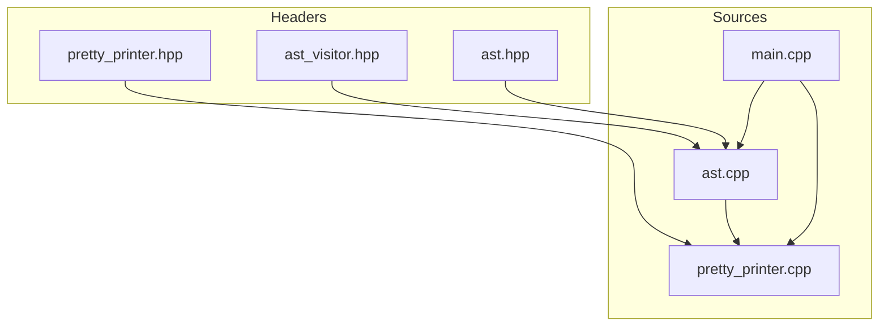
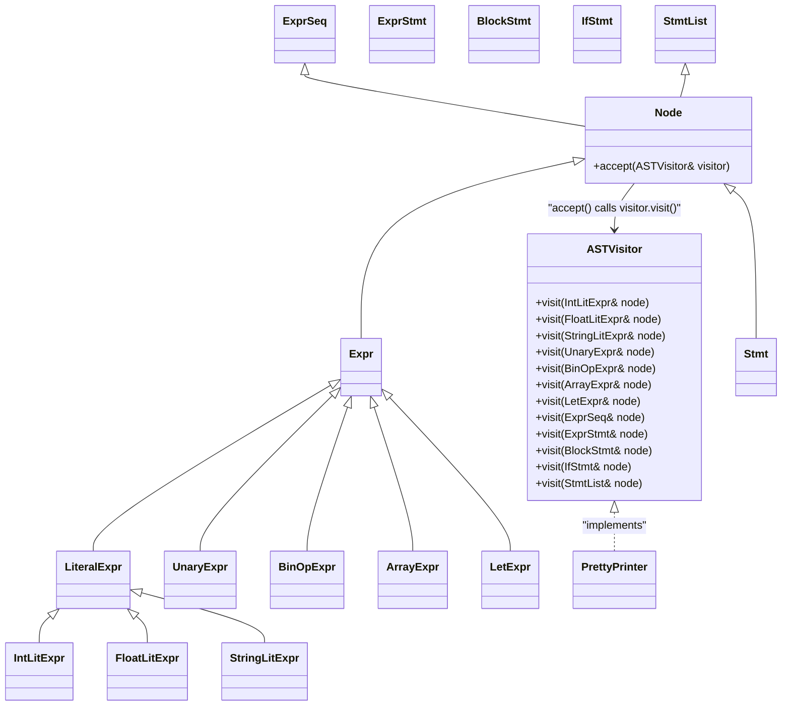
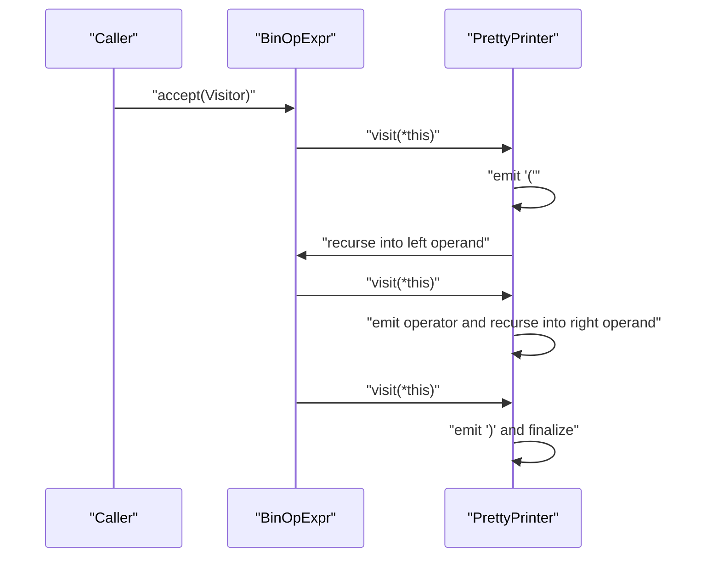
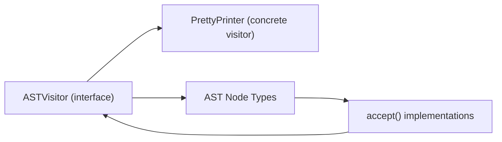

# Visitor Pattern Implementation

<cite>
**Referenced Files in This Document**
- [ast_visitor.hpp](file://include/ast_visitor.hpp)
- [pretty_printer.hpp](file://include/pretty_printer.hpp)
- [ast.hpp](file://include/ast.hpp)
- [ast.cpp](file://src/ast.cpp)
- [pretty_printer.cpp](file://src/pretty_printer.cpp)
- [main.cpp](file://src/main.cpp)
</cite>

## Table of Contents
1. [Introduction](#introduction)
2. [Project Structure](#project-structure)
3. [Core Components](#core-components)
4. [Architecture Overview](#architecture-overview)
5. [Detailed Component Analysis](#detailed-component-analysis)
6. [Dependency Analysis](#dependency-analysis)
7. [Performance Considerations](#performance-considerations)
8. [Troubleshooting Guide](#troubleshooting-guide)
9. [Conclusion](#conclusion)

## Introduction
This document explains the AST visitor pattern implementation used to traverse and render the Abstract Syntax Tree (AST) of a Monkey programming language compiler. The visitor pattern enables clean separation between the AST node hierarchy and output/formatting logic. Instead of embedding formatting or analysis code inside node classes, the AST delegates operations to external visitor implementations via an abstract interface. This design allows multiple output formats (e.g., pretty-printing), transformations, and analyses to coexist without modifying the node classes.

## Project Structure
The visitor implementation spans header and implementation files under include/ and src/. The AST node hierarchy is defined in include/ast.hpp, the visitor interface in include/ast_visitor.hpp, and a concrete visitor (PrettyPrinter) in include/pretty_printer.hpp and its implementation in src/pretty_printer.cpp. The accept() method is implemented in src/ast.cpp for each node type. The main program demonstrates usage by constructing an AST and invoking the visitor.

**Diagram sources**
- [ast_visitor.hpp:1-43](file://include/ast_visitor.hpp#L1-L43)
- [pretty_printer.hpp:1-38](file://include/pretty_printer.hpp#L1-L38)
- [ast.hpp:1-203](file://include/ast.hpp#L1-L203)
- [ast.cpp:1-33](file://src/ast.cpp#L1-L33)
- [pretty_printer.cpp:1-96](file://src/pretty_printer.cpp#L1-L96)
- [main.cpp:1-84](file://src/main.cpp#L1-L84)

**Section sources**
- [ast.hpp:1-203](file://include/ast.hpp#L1-L203)
- [ast_visitor.hpp:1-43](file://include/ast_visitor.hpp#L1-L43)
- [pretty_printer.hpp:1-38](file://include/pretty_printer.hpp#L1-L38)
- [ast.cpp:1-33](file://src/ast.cpp#L1-L33)
- [pretty_printer.cpp:1-96](file://src/pretty_printer.cpp#L1-L96)
- [main.cpp:1-84](file://src/main.cpp#L1-L84)

## Core Components
- Abstract visitor interface: Defines pure virtual visit() methods for each AST node type. See [ast_visitor.hpp:21-40](file://include/ast_visitor.hpp#L21-L40).
- Concrete visitor: PrettyPrinter implements the visitor interface to produce formatted output. See [pretty_printer.hpp:9-35](file://include/pretty_printer.hpp#L9-L35) and [pretty_printer.cpp:7-93](file://src/pretty_printer.cpp#L7-L93).
- AST node base and accept(): Node and derived nodes expose accept(ASTVisitor&) to dispatch to the appropriate visit() overload. See [ast.hpp:14-21](file://include/ast.hpp#L14-L21) and [ast.cpp:8-19](file://src/ast.cpp#L8-L19).
- Node hierarchy: Expressions (IntLitExpr, FloatLitExpr, StringLitExpr, UnaryExpr, BinOpExpr, ArrayExpr, LetExpr, ExprSeq) and statements (ExprStmt, BlockStmt, IfStmt, StmtList). See [ast.hpp:23-200](file://include/ast.hpp#L23-L200).

Benefits:
- Extensibility: New visitors (e.g., a code generator or analyzer) can be added without changing node classes.
- Separation of concerns: Formatting and traversal logic live in visitors, keeping nodes focused on structure.
- Double dispatch: accept() calls visitor.visit(*this), enabling the visitor to select the correct overload based on the runtime node type.

**Section sources**
- [ast_visitor.hpp:21-40](file://include/ast_visitor.hpp#L21-L40)
- [pretty_printer.hpp:9-35](file://include/pretty_printer.hpp#L9-L35)
- [ast.hpp:14-21](file://include/ast.hpp#L14-L21)
- [ast.cpp:8-19](file://src/ast.cpp#L8-L19)
- [ast.hpp:23-200](file://include/ast.hpp#L23-L200)

## Architecture Overview
The visitor architecture centers on the accept() method pattern and the ASTVisitor interface. Each node implements accept(ASTVisitor&) to call visitor.visit(*this). The PrettyPrinter implements visit() overloads for each node type to format output.

**Diagram sources**
- [ast_visitor.hpp:21-40](file://include/ast_visitor.hpp#L21-L40)
- [ast.hpp:14-21](file://include/ast.hpp#L14-L21)
- [ast.hpp:23-200](file://include/ast.hpp#L23-L200)
- [ast.cpp:8-19](file://src/ast.cpp#L8-L19)
- [pretty_printer.hpp:9-35](file://include/pretty_printer.hpp#L9-L35)

## Detailed Component Analysis

### Abstract Visitor Interface (ASTVisitor)
- Purpose: Declares visit() overloads for all node types, forming the contract for concrete visitors.
- Design: Pure virtual methods ensure each visitor implements all necessary operations.
- Coverage: Includes expressions and statements, enabling traversal of the entire AST.

Implementation reference:
- [ast_visitor.hpp:21-40](file://include/ast_visitor.hpp#L21-L40)

**Section sources**
- [ast_visitor.hpp:21-40](file://include/ast_visitor.hpp#L21-L40)

### Concrete Visitor: PrettyPrinter
- Role: Produces human-readable, formatted output of the AST.
- Mechanism: Overrides visit() for each node type to emit textual representations and recurse into child nodes.
- Output behavior:
  - Literals wrap values with parentheses or include location metadata.
  - Unary and binary operators recurse into operands and print operator symbols.
  - Arrays enclose sequences produced by visiting an ExprSeq.
  - Blocks and statements indent according to nesting level.
- Accessor: Provides a result() method to retrieve the final formatted string.

Implementation references:
- [pretty_printer.hpp:9-35](file://include/pretty_printer.hpp#L9-L35)
- [pretty_printer.cpp:7-93](file://src/pretty_printer.cpp#L7-L93)

**Section sources**
- [pretty_printer.hpp:9-35](file://include/pretty_printer.hpp#L9-L35)
- [pretty_printer.cpp:7-93](file://src/pretty_printer.cpp#L7-L93)

### Node Base and accept() Method Pattern
- Node base: Provides a virtual accept(ASTVisitor&) method that concrete nodes override.
- accept() implementations: Each node forwards to visitor.visit(*this), enabling dynamic dispatch to the correct visit() overload.
- Statement indentation: Some statement nodes adjust indentation levels for pretty printing.

Implementation references:
- [ast.hpp:14-21](file://include/ast.hpp#L14-L21)
- [ast.cpp:8-19](file://src/ast.cpp#L8-L19)
- [ast.hpp:43-48](file://include/ast.hpp#L43-L48)

**Section sources**
- [ast.hpp:14-21](file://include/ast.hpp#L14-L21)
- [ast.cpp:8-19](file://src/ast.cpp#L8-L19)
- [ast.hpp:43-48](file://include/ast.hpp#L43-L48)

### Double Dispatch Mechanism
Double dispatch occurs in two stages:
1. Node calls accept(visitor).
2. accept() invokes visitor.visit(*this), selecting the correct overload based on the node’s runtime type.

This pattern ensures that:
- Visitors remain decoupled from node types.
- Adding new node types requires updating accept() and the visitor interface, but existing visitors continue to compile.
- Adding new visitors does not change node classes.

Sequence diagram for traversing a binary operation:

**Diagram sources**
- [ast.cpp:12-12](file://src/ast.cpp#L12-L12)
- [pretty_printer.cpp:24-30](file://src/pretty_printer.cpp#L24-L30)

**Section sources**
- [ast.cpp:12-12](file://src/ast.cpp#L12-L12)
- [pretty_printer.cpp:24-30](file://src/pretty_printer.cpp#L24-L30)

### Usage in the Main Program
The main program constructs an AST and uses PrettyPrinter to render it:
- Creates a PrettyPrinter instance.
- Calls accept() on the root AST node.
- Prints the formatted output.

Reference:
- [main.cpp:41-43](file://src/main.cpp#L41-L43)
- [main.cpp:74-76](file://src/main.cpp#L74-L76)

**Section sources**
- [main.cpp:41-43](file://src/main.cpp#L41-L43)
- [main.cpp:74-76](file://src/main.cpp#L74-L76)

### Implementing a Custom Visitor
To implement a custom visitor:
1. Derive from ASTVisitor and override the visit() overloads for the node types you need.
2. Implement traversal logic inside each visit() method, recursing into children as appropriate.
3. Instantiate the visitor and pass it to accept() on the root node.

Example steps (no code shown):
- Define a new class that inherits from ASTVisitor.
- Override the visit() methods for nodes you want to handle.
- Call accept() on the AST root with your visitor instance.

Reference:
- [ast_visitor.hpp:21-40](file://include/ast_visitor.hpp#L21-L40)
- [ast.cpp:8-19](file://src/ast.cpp#L8-L19)

**Section sources**
- [ast_visitor.hpp:21-40](file://include/ast_visitor.hpp#L21-L40)
- [ast.cpp:8-19](file://src/ast.cpp#L8-L19)

## Dependency Analysis
The visitor pattern introduces minimal coupling:
- Nodes depend on the visitor interface but not on concrete visitors.
- Concrete visitors depend on the node types to traverse them.
- The accept() implementations centralize dispatch logic.

**Diagram sources**
- [ast_visitor.hpp:21-40](file://include/ast_visitor.hpp#L21-L40)
- [ast.hpp:14-21](file://include/ast.hpp#L14-L21)
- [ast.cpp:8-19](file://src/ast.cpp#L8-L19)
- [pretty_printer.hpp:9-35](file://include/pretty_printer.hpp#L9-L35)

**Section sources**
- [ast_visitor.hpp:21-40](file://include/ast_visitor.hpp#L21-L40)
- [ast.hpp:14-21](file://include/ast.hpp#L14-L21)
- [ast.cpp:8-19](file://src/ast.cpp#L8-L19)
- [pretty_printer.hpp:9-35](file://include/pretty_printer.hpp#L9-L35)

## Performance Considerations
- Recursion depth: Traversal is linear in the number of nodes. Depth depends on the AST shape.
- Memory: PrettyPrinter uses an internal stream buffer; output grows with AST size.
- Overhead: Virtual calls in accept() and visit() introduce small overhead compared to inlined code, but improve modularity and extensibility.

[No sources needed since this section provides general guidance]

## Troubleshooting Guide
Common issues and resolutions:
- Missing visit() overload: If a new node type is added, ensure accept() is implemented and the visitor interface declares the corresponding visit() method. See [ast.cpp:8-19](file://src/ast.cpp#L8-L19) and [ast_visitor.hpp:21-40](file://include/ast_visitor.hpp#L21-L40).
- Incorrect traversal: Verify that visit() methods recurse into child nodes as expected. See [pretty_printer.cpp:19-30](file://src/pretty_printer.cpp#L19-L30) and [pretty_printer.cpp:32-45](file://src/pretty_printer.cpp#L32-L45).
- Indentation problems: For statement nodes, confirm that setIndentationLvl is invoked appropriately. See [ast.hpp:47-68](file://include/ast.hpp#L47-L68) and [ast.cpp:21-31](file://src/ast.cpp#L21-L31).

**Section sources**
- [ast.cpp:8-19](file://src/ast.cpp#L8-L19)
- [ast_visitor.hpp:21-40](file://include/ast_visitor.hpp#L21-L40)
- [pretty_printer.cpp:19-30](file://src/pretty_printer.cpp#L19-L30)
- [pretty_printer.cpp:32-45](file://src/pretty_printer.cpp#L32-L45)
- [ast.hpp:47-68](file://include/ast.hpp#L47-L68)
- [ast.cpp:21-31](file://src/ast.cpp#L21-L31)

## Conclusion
The visitor pattern cleanly separates AST structure from output and analysis logic. The accept() method pattern and ASTVisitor interface enable double dispatch, allowing PrettyPrinter and future custom visitors to traverse the AST without modifying node classes. This design supports extensible output formats, transformation passes, and analysis operations while preserving a stable node hierarchy.

[No sources needed since this section summarizes without analyzing specific files]