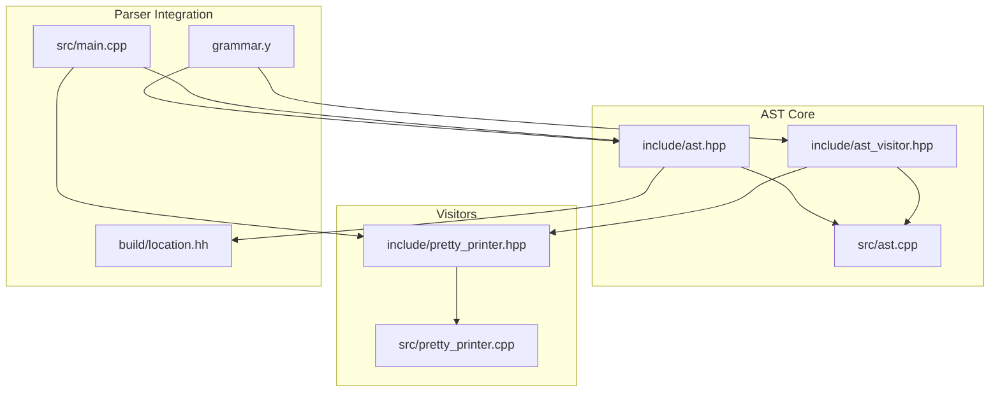
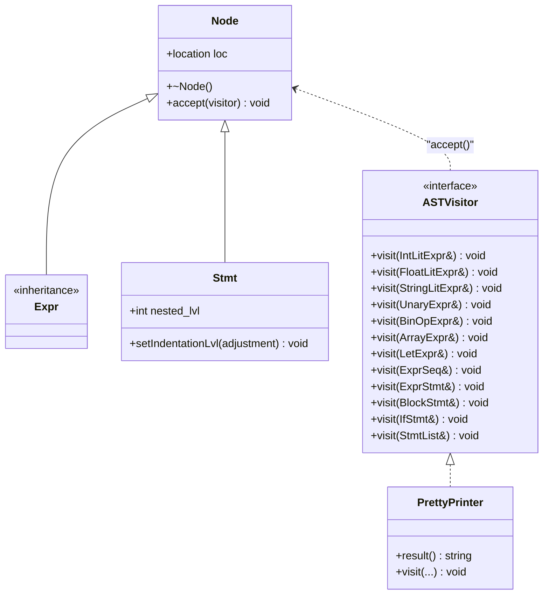
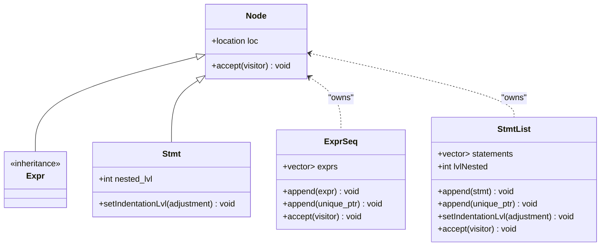
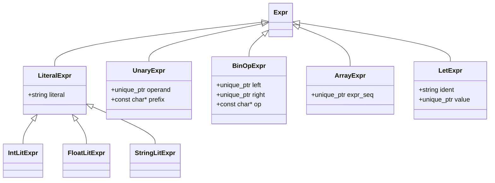
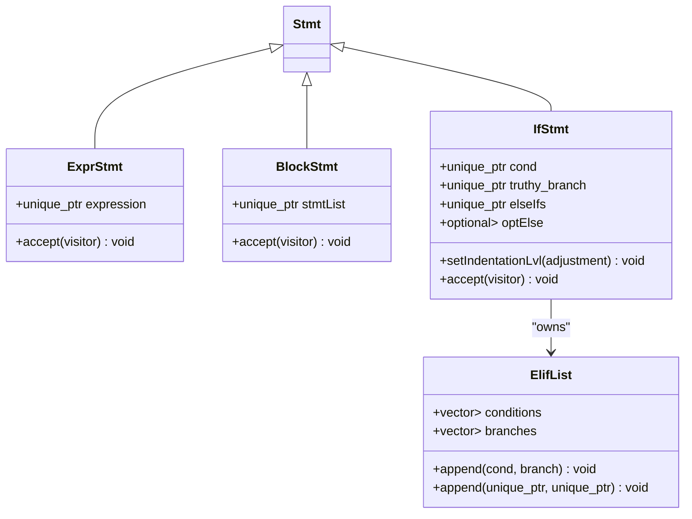
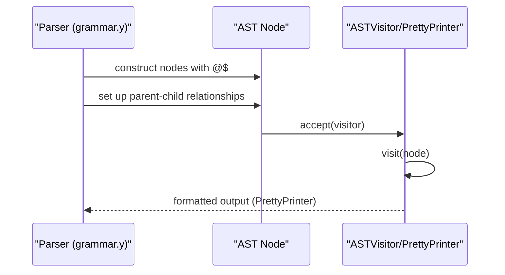
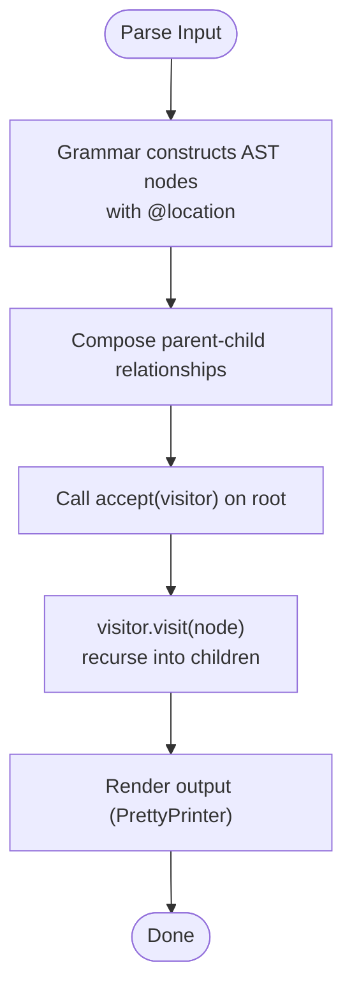
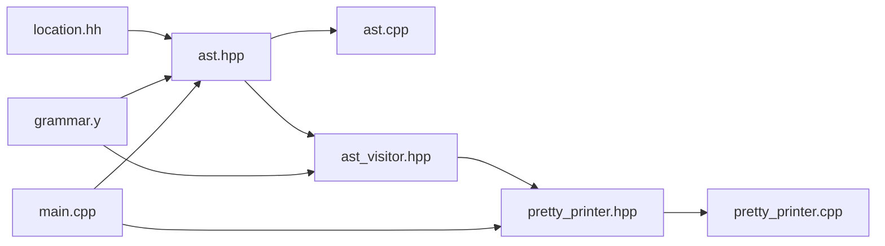

# AST Framework

<cite>
**Referenced Files in This Document**
- [ast.hpp](file://include/ast.hpp)
- [ast_visitor.hpp](file://include/ast_visitor.hpp)
- [ast.cpp](file://src/ast.cpp)
- [pretty_printer.hpp](file://include/pretty_printer.hpp)
- [pretty_printer.cpp](file://src/pretty_printer.cpp)
- [grammar.y](file://grammar.y)
- [main.cpp](file://src/main.cpp)
- [location.hh](file://build/location.hh)
</cite>

## Table of Contents
1. [Introduction](#introduction)
2. [Project Structure](#project-structure)
3. [Core Components](#core-components)
4. [Architecture Overview](#architecture-overview)
5. [Detailed Component Analysis](#detailed-component-analysis)
6. [Dependency Analysis](#dependency-analysis)
7. [Performance Considerations](#performance-considerations)
8. [Troubleshooting Guide](#troubleshooting-guide)
9. [Conclusion](#conclusion)

## Introduction
This document explains the Abstract Syntax Tree (AST) framework used by the Monkey programming language compiler. It covers the hierarchical node structure, the visitor pattern implementation, memory management with smart pointers, and the location tracking system for precise error reporting. It also documents design rationale, traversal patterns, and extensibility mechanisms for adding new node types.

## Project Structure
The AST framework is organized around a small set of header files defining the node types and the visitor interface, and a small set of implementation files wiring the accept() methods and providing a concrete visitor for pretty-printing.

**Diagram sources**
- [ast.hpp:10-203](file://include/ast.hpp#L10-L203)
- [ast_visitor.hpp:21-40](file://include/ast_visitor.hpp#L21-L40)
- [ast.cpp:5-32](file://src/ast.cpp#L5-L32)
- [pretty_printer.hpp:9-35](file://include/pretty_printer.hpp#L9-L35)
- [pretty_printer.cpp:5-95](file://src/pretty_printer.cpp#L5-L95)
- [grammar.y:11-56](file://grammar.y#L11-L56)
- [main.cpp:25-84](file://src/main.cpp#L25-L84)
- [location.hh:166-232](file://build/location.hh#L166-L232)

**Section sources**
- [ast.hpp:10-203](file://include/ast.hpp#L10-L203)
- [ast_visitor.hpp:21-40](file://include/ast_visitor.hpp#L21-L40)
- [ast.cpp:5-32](file://src/ast.cpp#L5-L32)
- [pretty_printer.hpp:9-35](file://include/pretty_printer.hpp#L9-L35)
- [pretty_printer.cpp:5-95](file://src/pretty_printer.cpp#L5-L95)
- [grammar.y:11-56](file://grammar.y#L11-L56)
- [main.cpp:25-84](file://src/main.cpp#L25-L84)
- [location.hh:166-232](file://build/location.hh#L166-L232)

## Core Components
- Base Node: Provides a virtual destructor, a location field, and a pure virtual accept method. All nodes inherit from this base.
- Expression hierarchy (Expr): Represents evaluative constructs such as literals, unary/binary operators, arrays, and let-bindings.
- Statement hierarchy (Stmt): Represents executable constructs such as expression statements, blocks, and if-elif-else constructs.
- Visitor interface (ASTVisitor): Declares visit methods for each node type, enabling double dispatch.
- Accept implementations: Each node type implements accept to call the corresponding visitor method.
- PrettyPrinter: A concrete visitor that renders the AST to a formatted string, leveraging location information for diagnostics.

Key design characteristics:
- Hierarchical inheritance separates expressions and statements, enabling targeted visitor specialization.
- Smart pointers manage ownership and lifetime, preventing leaks and simplifying composition.
- Location tracking integrates with the parser-generated location type for precise error reporting.

**Section sources**
- [ast.hpp:14-21](file://include/ast.hpp#L14-L21)
- [ast.hpp:23-25](file://include/ast.hpp#L23-L25)
- [ast.hpp:43-48](file://include/ast.hpp#L43-L48)
- [ast_visitor.hpp:21-40](file://include/ast_visitor.hpp#L21-L40)
- [ast.cpp:7-19](file://src/ast.cpp#L7-L19)
- [pretty_printer.hpp:9-35](file://include/pretty_printer.hpp#L9-L35)

## Architecture Overview
The AST framework centers on a visitor-driven traversal model. Nodes expose accept(), which dispatches to the visitor’s visit(node&) method. The parser constructs nodes with location metadata, and visitors traverse the tree to perform transformations, validations, or pretty-printing.

**Diagram sources**
- [ast.hpp:14-21](file://include/ast.hpp#L14-L21)
- [ast.hpp:23-25](file://include/ast.hpp#L23-L25)
- [ast.hpp:43-48](file://include/ast.hpp#L43-L48)
- [ast_visitor.hpp:21-40](file://include/ast_visitor.hpp#L21-L40)
- [pretty_printer.hpp:9-35](file://include/pretty_printer.hpp#L9-L35)

## Detailed Component Analysis

### Node Hierarchy and Memory Management
- Node: Base class with a location member and a pure virtual accept. Prevents instantiation of abstract nodes and ensures polymorphic traversal.
- Expr and Stmt: Abstract base classes for expressions and statements respectively, inheriting from Node.
- Smart pointer usage:
  - Unique ownership is expressed with std::unique_ptr for child nodes (e.g., operands, sequences, lists).
  - Move semantics are used in constructors and append methods to transfer ownership efficiently.
  - Vector containers hold unique_ptr to ensure deterministic destruction of children.
- Location tracking:
  - Each Node stores a monkey::location, populated by the parser using @$. The location type captures begin/end positions and supports streaming to human-readable form.

**Diagram sources**
- [ast.hpp:14-21](file://include/ast.hpp#L14-L21)
- [ast.hpp:23-25](file://include/ast.hpp#L23-L25)
- [ast.hpp:43-48](file://include/ast.hpp#L43-L48)
- [ast.hpp:27-41](file://include/ast.hpp#L27-L41)
- [ast.hpp:50-71](file://include/ast.hpp#L50-L71)

**Section sources**
- [ast.hpp:14-21](file://include/ast.hpp#L14-L21)
- [ast.hpp:27-41](file://include/ast.hpp#L27-L41)
- [ast.hpp:50-71](file://include/ast.hpp#L50-L71)
- [location.hh:166-232](file://build/location.hh#L166-L232)

### Expression Nodes
- LiteralExpr and derived types: IntLitExpr, FloatLitExpr, StringLitExpr store a literal string and inherit location from the base.
- UnaryExpr: Holds a unique_ptr to an operand and a prefix operator string.
- BinOpExpr: Holds unique_ptr to left and right operands and an operator string.
- ArrayExpr: Wraps an ExprSeq.
- LetExpr: Binds an identifier to an expression value.

**Diagram sources**
- [ast.hpp:73-95](file://include/ast.hpp#L73-L95)
- [ast.hpp:97-105](file://include/ast.hpp#L97-L105)
- [ast.hpp:107-118](file://include/ast.hpp#L107-L118)
- [ast.hpp:120-126](file://include/ast.hpp#L120-L126)
- [ast.hpp:136-143](file://include/ast.hpp#L136-L143)

**Section sources**
- [ast.hpp:73-95](file://include/ast.hpp#L73-L95)
- [ast.hpp:97-105](file://include/ast.hpp#L97-L105)
- [ast.hpp:107-118](file://include/ast.hpp#L107-L118)
- [ast.hpp:120-126](file://include/ast.hpp#L120-L126)
- [ast.hpp:136-143](file://include/ast.hpp#L136-L143)

### Statement Nodes and Control Flow
- ExprStmt: Wraps an expression statement with trailing semicolon semantics.
- BlockStmt: Encloses a StmtList with indentation level propagation.
- IfStmt: Contains a condition, a truthy branch, an optional ElifList, and an optional else branch. Supports nested indentation adjustments.

**Diagram sources**
- [ast.hpp:128-134](file://include/ast.hpp#L128-L134)
- [ast.hpp:145-156](file://include/ast.hpp#L145-L156)
- [ast.hpp:159-172](file://include/ast.hpp#L159-L172)
- [ast.hpp:174-200](file://include/ast.hpp#L174-L200)

**Section sources**
- [ast.hpp:128-134](file://include/ast.hpp#L128-L134)
- [ast.hpp:145-156](file://include/ast.hpp#L145-L156)
- [ast.hpp:159-172](file://include/ast.hpp#L159-L172)
- [ast.hpp:174-200](file://include/ast.hpp#L174-L200)

### Visitor Pattern Implementation
- ASTVisitor defines pure virtual visit methods for each node type, enabling double dispatch.
- Each node implements accept(ASTVisitor&) to call visitor.visit(*this).
- PrettyPrinter implements ASTVisitor to render the AST to a string, using node locations for diagnostics.

**Diagram sources**
- [grammar.y:79-81](file://grammar.y#L79-L81)
- [grammar.y:102-122](file://grammar.y#L102-L122)
- [ast.cpp:7-19](file://src/ast.cpp#L7-L19)
- [ast_visitor.hpp:21-40](file://include/ast_visitor.hpp#L21-L40)
- [pretty_printer.cpp:7-95](file://src/pretty_printer.cpp#L7-L95)

**Section sources**
- [ast_visitor.hpp:21-40](file://include/ast_visitor.hpp#L21-L40)
- [ast.cpp:7-19](file://src/ast.cpp#L7-L19)
- [pretty_printer.cpp:7-95](file://src/pretty_printer.cpp#L7-L95)

### Traversal Patterns and Examples
- Construction during parsing:
  - Grammar rules instantiate nodes with location metadata (@$) and compose parent-child relationships.
  - Examples include creating literal expressions, binary operations, arrays, let-bindings, blocks, and if statements.
- Traversal:
  - The PrettyPrinter demonstrates recursive traversal by delegating to child nodes via accept().
  - StmtList and BlockStmt propagate indentation levels to children to format structured output.

**Diagram sources**
- [grammar.y:79-81](file://grammar.y#L79-L81)
- [grammar.y:102-122](file://grammar.y#L102-L122)
- [pretty_printer.cpp:58-72](file://src/pretty_printer.cpp#L58-L72)
- [ast.cpp:7-19](file://src/ast.cpp#L7-L19)

**Section sources**
- [grammar.y:79-81](file://grammar.y#L79-L81)
- [grammar.y:102-122](file://grammar.y#L102-L122)
- [pretty_printer.cpp:58-72](file://src/pretty_printer.cpp#L58-L72)
- [ast.cpp:7-19](file://src/ast.cpp#L7-L19)

### Extensibility Mechanisms
To add a new node type:
- Define a new class deriving from Expr or Stmt and include a location parameter in the constructor.
- Store owned children as std::unique_ptr members.
- Implement accept(ASTVisitor&) to call visitor.visit(*this).
- Add a corresponding visit method in ASTVisitor and implement it in PrettyPrinter or any other visitor.
- Update grammar.y to construct the new node type when parsing relevant language constructs.

Benefits:
- Clear separation between expressions and statements.
- Ownership semantics prevent leaks and simplify composition.
- Visitor enables multiple transformations without modifying node classes.

**Section sources**
- [ast.hpp:14-21](file://include/ast.hpp#L14-L21)
- [ast.hpp:23-25](file://include/ast.hpp#L23-L25)
- [ast.hpp:43-48](file://include/ast.hpp#L43-L48)
- [ast_visitor.hpp:21-40](file://include/ast_visitor.hpp#L21-L40)
- [ast.cpp:7-19](file://src/ast.cpp#L7-L19)

## Dependency Analysis
The AST framework exhibits low coupling and high cohesion:
- ast.hpp depends on location.hh for location tracking.
- ast.cpp centralizes accept() implementations, reducing duplication.
- pretty_printer.hpp/cpp depend on ast_visitor.hpp and ast.hpp.
- grammar.y constructs nodes and passes ownership to the parser root.

**Diagram sources**
- [ast.hpp:8](file://include/ast.hpp#L8)
- [ast.cpp:1-2](file://src/ast.cpp#L1-L2)
- [pretty_printer.hpp:3](file://include/pretty_printer.hpp#L3)
- [grammar.y:24](file://grammar.y#L24)
- [main.cpp:3](file://src/main.cpp#L3)

**Section sources**
- [ast.hpp:8](file://include/ast.hpp#L8)
- [ast.cpp:1-2](file://src/ast.cpp#L1-L2)
- [pretty_printer.hpp:3](file://include/pretty_printer.hpp#L3)
- [grammar.y:24](file://grammar.y#L24)
- [main.cpp:3](file://src/main.cpp#L3)

## Performance Considerations
- Smart pointers: Using std::unique_ptr avoids shared ownership overhead and prevents accidental copying of heavy nodes.
- Move semantics: Constructors and append methods move unique_ptr arguments to minimize copies.
- Visitor dispatch: Double dispatch via accept() is efficient and enables compile-time inlining of visit methods in concrete visitors.
- Location printing: PrettyPrinter uses the location stream operator to include precise source coordinates without expensive computations.

[No sources needed since this section provides general guidance]

## Troubleshooting Guide
- Parsing failures: The parser prints errors using the location type, including file, line, and column information.
- Missing accept implementations: Ensure every new node type implements accept() to call the corresponding visitor method.
- Incorrect ownership: Verify that child nodes are stored as unique_ptr and constructed with move semantics when transferring ownership.
- Indentation issues: For block-like structures, ensure setIndentationLvl is called appropriately to propagate indentation to children.

**Section sources**
- [grammar.y:127-129](file://grammar.y#L127-L129)
- [ast.cpp:7-19](file://src/ast.cpp#L7-L19)
- [pretty_printer.cpp:58-72](file://src/pretty_printer.cpp#L58-L72)

## Conclusion
The AST framework provides a clean, extensible foundation for the Monkey language compiler. Its hierarchical node structure, visitor pattern, smart-pointer-based memory management, and integrated location tracking collectively support robust parsing, traversal, and diagnostic reporting. Extending the AST with new constructs follows a straightforward pattern that preserves these design goals.