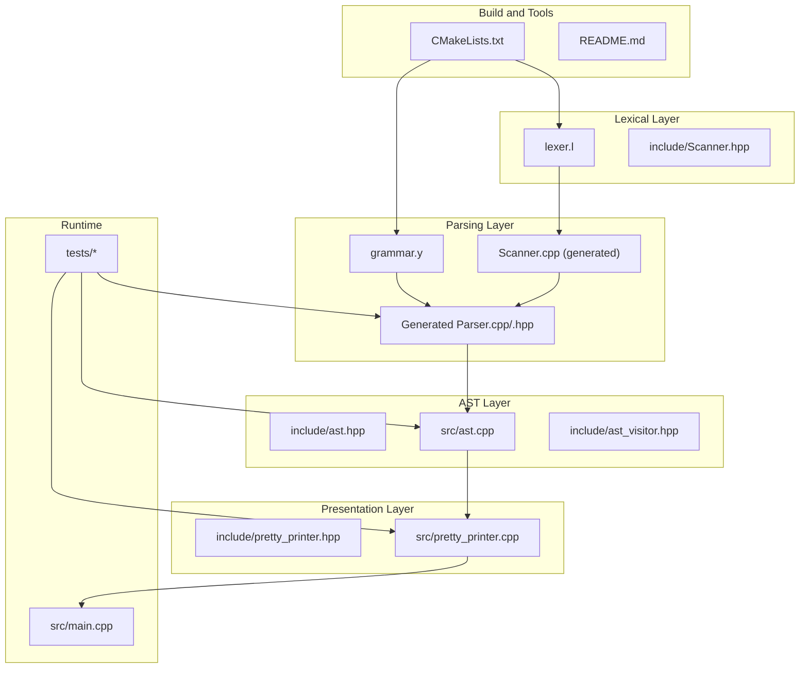
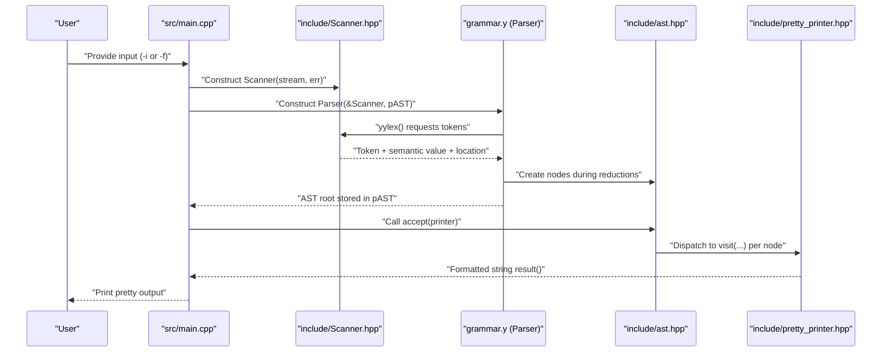
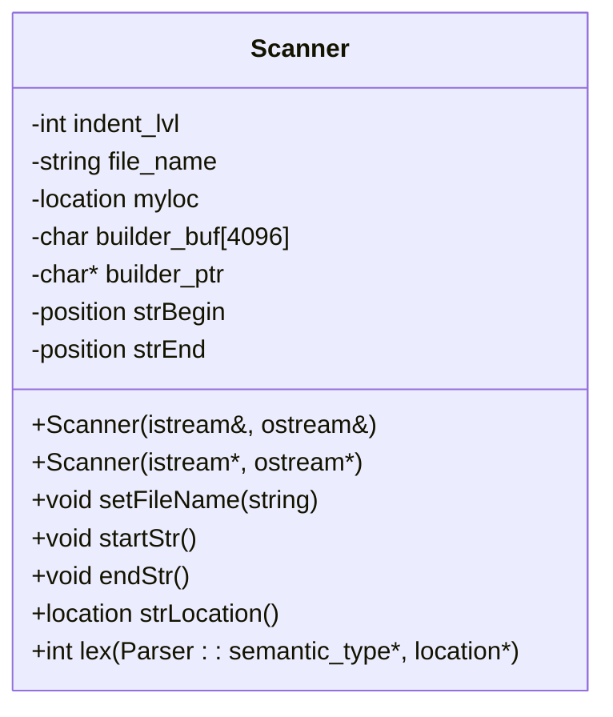
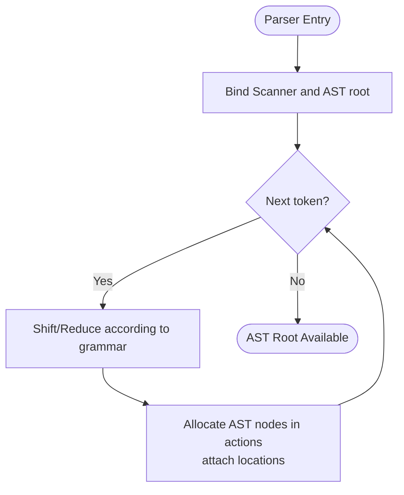
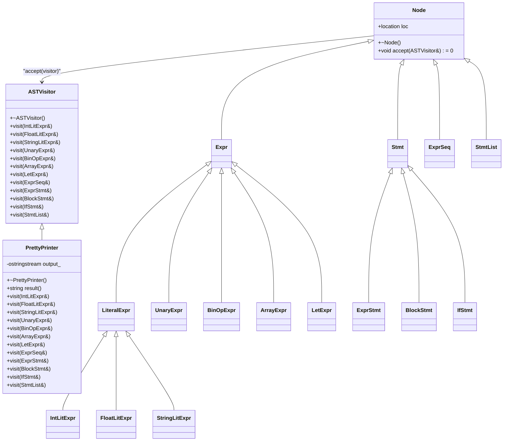
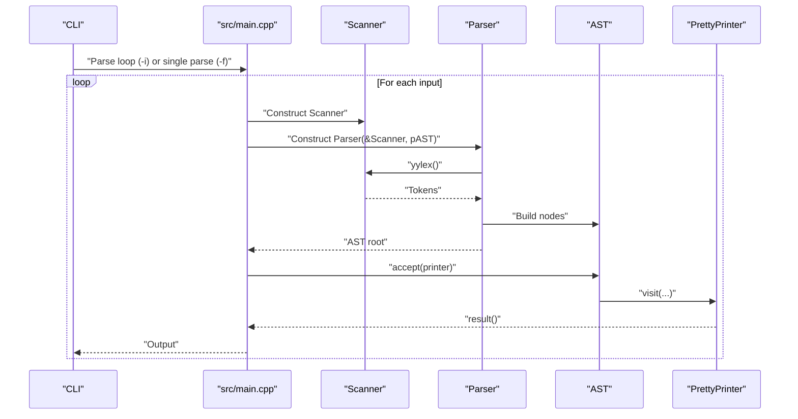
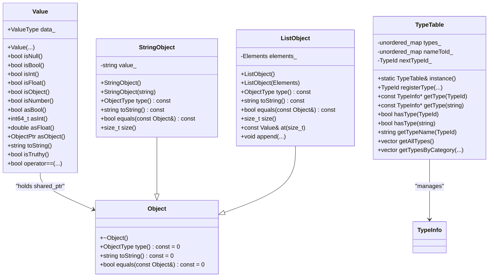
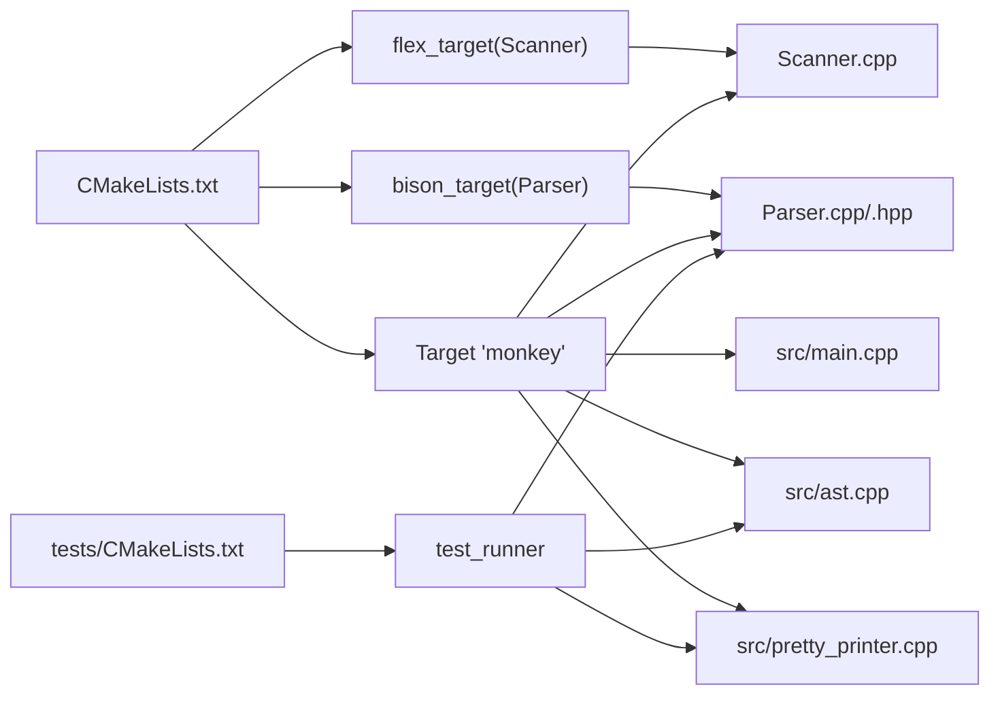

# Architecture Overview

<cite>
**Referenced Files in This Document**
- [README.md](file://README.md)
- [CMakeLists.txt](file://CMakeLists.txt)
- [grammar.y](file://grammar.y)
- [lexer.l](file://lexer.l)
- [include/Scanner.hpp](file://include/Scanner.hpp)
- [include/ast.hpp](file://include/ast.hpp)
- [include/ast_visitor.hpp](file://include/ast_visitor.hpp)
- [include/pretty_printer.hpp](file://include/pretty_printer.hpp)
- [include/value.hpp](file://include/value.hpp)
- [include/type_table.hpp](file://include/type_table.hpp)
- [src/main.cpp](file://src/main.cpp)
- [src/ast.cpp](file://src/ast.cpp)
- [src/pretty_printer.cpp](file://src/pretty_printer.cpp)
- [tests/test_parser.cpp](file://tests/test_parser.cpp)
- [tests/CMakeLists.txt](file://tests/CMakeLists.txt)
</cite>

## Table of Contents
1. [Introduction](#introduction)
2. [Project Structure](#project-structure)
3. [Core Components](#core-components)
4. [Architecture Overview](#architecture-overview)
5. [Detailed Component Analysis](#detailed-component-analysis)
6. [Dependency Analysis](#dependency-analysis)
7. [Performance Considerations](#performance-considerations)
8. [Troubleshooting Guide](#troubleshooting-guide)
9. [Conclusion](#conclusion)
10. [Appendices](#appendices)

## Introduction
This document describes the architecture of the Modern Bison compiler system for the Monkey programming language. The system integrates a Flex-generated lexer, a Bison-generated parser, and a C++ AST framework. It follows a layered design separating lexical analysis, parsing, AST generation, and pretty printing. The architecture emphasizes clean separation between language implementation and presentation, enabling educational compiler construction and extensibility.

Technology stack:
- C++23 as the implementation language
- Flex/Bison for generating the lexer and parser in C++
- CMake for build orchestration and integration with Flex/Bison

Educational goals:
- Demonstrate a working compiler pipeline from tokens to a traversable AST
- Provide a modular foundation for adding evaluation, type checking, or code generation

## Project Structure
The repository is organized into:
- include/: Public headers for Scanner, AST nodes, visitor interface, pretty printer, and evaluation support
- src/: Implementation of the main entry point, AST accept methods, and pretty printer
- tests/: Unit tests using Catch2 that exercise the parser and pretty printer
- Grammar and lexer definitions: grammar.y and lexer.l
- Top-level build and documentation: CMakeLists.txt and README.md

**Diagram sources**
- [CMakeLists.txt:19-25](file://CMakeLists.txt#L19-L25)
- [lexer.l:1-100](file://lexer.l#L1-L100)
- [grammar.y:11-18](file://grammar.y#L11-L18)
- [include/Scanner.hpp:11-44](file://include/Scanner.hpp#L11-L44)
- [include/ast.hpp:14-202](file://include/ast.hpp#L14-L202)
- [include/ast_visitor.hpp:21-40](file://include/ast_visitor.hpp#L21-L40)
- [include/pretty_printer.hpp:9-35](file://include/pretty_printer.hpp#L9-L35)
- [src/ast.cpp:1-33](file://src/ast.cpp#L1-L33)
- [src/pretty_printer.cpp:1-96](file://src/pretty_printer.cpp#L1-L96)
- [src/main.cpp:25-84](file://src/main.cpp#L25-L84)
- [tests/test_parser.cpp:12-25](file://tests/test_parser.cpp#L12-L25)

**Section sources**
- [CMakeLists.txt:19-25](file://CMakeLists.txt#L19-L25)
- [README.md:14-40](file://README.md#L14-L40)

## Core Components
- Lexical Analyzer (Scanner): A Flex-derived class that tokenizes input streams, tracks locations, and supports string literal building and indentation counting for blocks.
- Parser: A Bison-generated C++ parser configured to integrate with the Scanner and construct AST nodes directly during parsing.
- AST Framework: A visitor-driven tree of nodes representing expressions and statements, with polymorphic accept methods.
- Pretty Printer: An implementation of the AST visitor that renders the AST to a formatted string.

Key responsibilities:
- Scanner: Token emission, location tracking, and semantic value population
- Parser: Syntax-directed construction of AST nodes and error reporting
- AST: Node hierarchy with visitor contract
- Pretty Printer: Presentation formatting via the visitor pattern

**Section sources**
- [include/Scanner.hpp:13-42](file://include/Scanner.hpp#L13-L42)
- [grammar.y:31-39](file://grammar.y#L31-L39)
- [include/ast.hpp:14-202](file://include/ast.hpp#L14-L202)
- [include/ast_visitor.hpp:21-40](file://include/ast_visitor.hpp#L21-L40)
- [include/pretty_printer.hpp:9-35](file://include/pretty_printer.hpp#L9-L35)

## Architecture Overview
The system follows a layered pipeline:
1. Input stream enters the Scanner, which emits tokens with associated semantic values and locations.
2. The Parser consumes tokens and constructs AST nodes directly in reduction actions.
3. The AST is traversed by a PrettyPrinter implementing the visitor interface to produce formatted output.

**Diagram sources**
- [src/main.cpp:35-55](file://src/main.cpp#L35-L55)
- [grammar.y:20-39](file://grammar.y#L20-L39)
- [include/Scanner.hpp:30](file://include/Scanner.hpp#L30)
- [include/ast.hpp:20](file://include/ast.hpp#L20)
- [include/pretty_printer.hpp:14-31](file://include/pretty_printer.hpp#L14-L31)

## Detailed Component Analysis

### Lexical Analyzer (Scanner)
The Scanner extends the Flex-generated lexer and provides:
- Token emission with semantic values and locations
- String literal construction with escape handling
- Indentation tracking for block delimiters
- Integration hook for the parser’s yylex invocation

**Diagram sources**
- [include/Scanner.hpp:13-42](file://include/Scanner.hpp#L13-L42)

**Section sources**
- [lexer.l:1-100](file://lexer.l#L1-L100)
- [include/Scanner.hpp:13-42](file://include/Scanner.hpp#L13-L42)

### Parser and Grammar Integration
The grammar configures:
- C++ output and namespace
- Location tracking and semantic value variants
- Parser constructor parameters binding Scanner and AST root
- Reduction actions that allocate AST nodes and attach locations

**Diagram sources**
- [grammar.y:20-39](file://grammar.y#L20-L39)
- [grammar.y:72-123](file://grammar.y#L72-L123)

**Section sources**
- [grammar.y:8-18](file://grammar.y#L8-L18)
- [grammar.y:20-39](file://grammar.y#L20-L39)
- [grammar.y:72-123](file://grammar.y#L72-L123)

### AST Framework and Visitor Pattern
The AST defines a base Node with a pure virtual accept method. Each node type overrides accept to dispatch to the visitor. The visitor interface declares visit methods for all node types. The PrettyPrinter implements the visitor to render the AST.

**Diagram sources**
- [include/ast.hpp:14-202](file://include/ast.hpp#L14-L202)
- [include/ast_visitor.hpp:21-40](file://include/ast_visitor.hpp#L21-L40)
- [include/pretty_printer.hpp:9-35](file://include/pretty_printer.hpp#L9-L35)

**Section sources**
- [include/ast.hpp:14-202](file://include/ast.hpp#L14-L202)
- [include/ast_visitor.hpp:21-40](file://include/ast_visitor.hpp#L21-L40)
- [src/ast.cpp:7-31](file://src/ast.cpp#L7-L31)
- [include/pretty_printer.hpp:9-35](file://include/pretty_printer.hpp#L9-L35)
- [src/pretty_printer.cpp:7-95](file://src/pretty_printer.cpp#L7-L95)

### Runtime and REPL Flow
The main entry point supports:
- Interactive mode: reads from stdin, parses, pretty-prints, and accumulates statements
- File mode: reads from a file, parses, and pretty-prints

**Diagram sources**
- [src/main.cpp:25-84](file://src/main.cpp#L25-L84)

**Section sources**
- [src/main.cpp:25-84](file://src/main.cpp#L25-L84)

### Evaluation and Type System (Supporting Extensibility)
While not part of the core lexical/parsing/pretty-printing pipeline, the evaluation support provides:
- A typed value system with primitive and object types
- A type table for registration and lookup
- Foundation for future semantic analysis and execution

**Diagram sources**
- [include/value.hpp:25-92](file://include/value.hpp#L25-L92)
- [include/value.hpp:102-139](file://include/value.hpp#L102-L139)
- [include/value.hpp:142-192](file://include/value.hpp#L142-L192)
- [include/type_table.hpp:48-144](file://include/type_table.hpp#L48-L144)

**Section sources**
- [include/value.hpp:10-226](file://include/value.hpp#L10-L226)
- [include/type_table.hpp:1-167](file://include/type_table.hpp#L1-L167)

## Dependency Analysis
The build integrates Flex/Bison targets and links them into the executable. The generated parser and scanner are consumed by the main program and tests.

**Diagram sources**
- [CMakeLists.txt:19-25](file://CMakeLists.txt#L19-L25)
- [tests/CMakeLists.txt:2-10](file://tests/CMakeLists.txt#L2-L10)

**Section sources**
- [CMakeLists.txt:19-25](file://CMakeLists.txt#L19-L25)
- [tests/CMakeLists.txt:2-22](file://tests/CMakeLists.txt#L2-L22)

## Performance Considerations
- Memory ownership: AST nodes use smart pointers to avoid leaks and simplify composition.
- Visitor dispatch: Polymorphic accept avoids long switch statements and keeps traversal efficient.
- String building: The Scanner uses a fixed buffer for string literals to reduce allocations.
- Parsing actions: Nodes are constructed directly in grammar actions to minimize intermediate structures.

[No sources needed since this section provides general guidance]

## Troubleshooting Guide
Common issues and remedies:
- Build failures on Windows: Ensure win_flex_bison is installed and visible to CMake; the build script sets explicit paths for Flex and Bison.
- Parser errors: The grammar defines an error recovery action to continue parsing after syntax errors.
- Tokenization anomalies: Verify Scanner’s YY_USER_ACTION and YYLeng usage for accurate location tracking.

**Section sources**
- [README.md:24-40](file://README.md#L24-L40)
- [grammar.y:95-96](file://grammar.y#L95-L96)
- [lexer.l:9-11](file://lexer.l#L9-L11)

## Conclusion
The Modern Bison compiler demonstrates a clean, layered architecture:
- Lexical analysis and parsing are tightly integrated via Flex/Bison
- AST construction occurs during parsing, yielding a robust tree ready for traversal
- The visitor pattern cleanly separates presentation from language implementation
- The modular design supports extension (evaluation, type checking, code generation) while keeping educational simplicity

[No sources needed since this section summarizes without analyzing specific files]

## Appendices

### System Boundaries and Separation of Concerns
- Language implementation boundary: grammar.y and include/Scanner.hpp define the language surface and tokenization semantics
- Presentation boundary: include/pretty_printer.hpp encapsulates formatting concerns
- Integration boundary: src/main.cpp orchestrates the pipeline and maintains REPL behavior

**Section sources**
- [grammar.y:11-18](file://grammar.y#L11-L18)
- [include/Scanner.hpp:13-42](file://include/Scanner.hpp#L13-L42)
- [include/pretty_printer.hpp:9-35](file://include/pretty_printer.hpp#L9-L35)
- [src/main.cpp:25-84](file://src/main.cpp#L25-L84)

### Technology Stack and Architectural Decisions
- C++23 enables modern language features for safety and expressiveness
- Flex/Bison generate robust, maintainable lexer/parser code with minimal glue
- CMake automates generation and linking of generated sources
- Visitor pattern decouples traversal from node types for easy extension

**Section sources**
- [CMakeLists.txt:5-6](file://CMakeLists.txt#L5-L6)
- [CMakeLists.txt:19-25](file://CMakeLists.txt#L19-L25)
- [README.md:10-12](file://README.md#L10-L12)