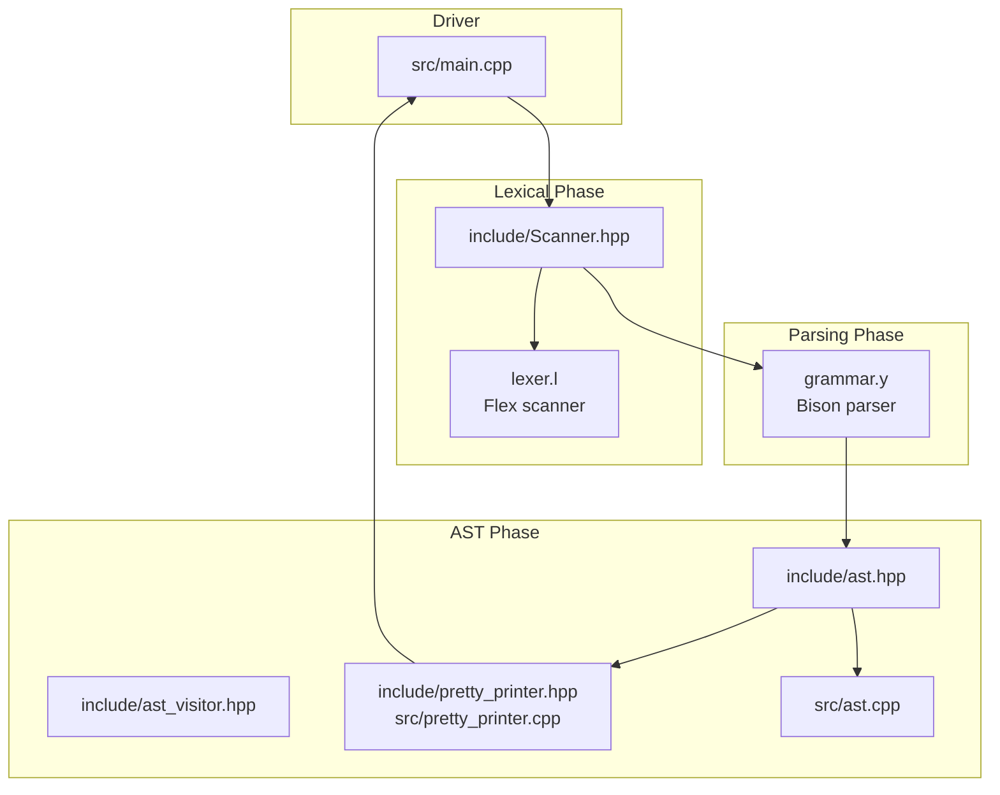
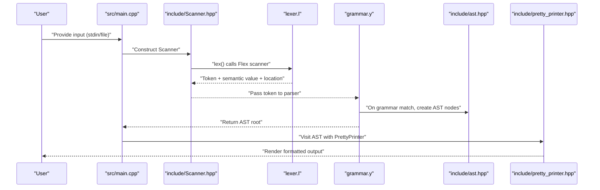
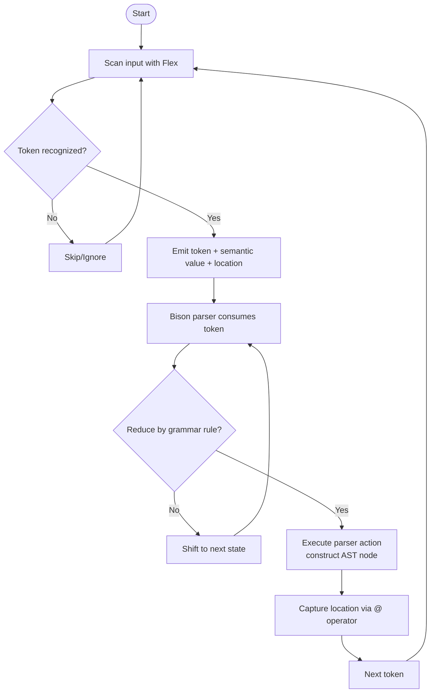

# Compiler Phases

<cite>
**Referenced Files in This Document**
- [grammar.y](file://grammar.y)
- [lexer.l](file://lexer.l)
- [include/Scanner.hpp](file://include/Scanner.hpp)
- [include/ast.hpp](file://include/ast.hpp)
- [include/ast_visitor.hpp](file://include/ast_visitor.hpp)
- [include/pretty_printer.hpp](file://include/pretty_printer.hpp)
- [src/ast.cpp](file://src/ast.cpp)
- [src/pretty_printer.cpp](file://src/pretty_printer.cpp)
- [src/main.cpp](file://src/main.cpp)
- [demo.txt](file://demo.txt)
- [README.md](file://README.md)
</cite>

## Table of Contents
1. [Introduction](#introduction)
2. [Project Structure](#project-structure)
3. [Core Components](#core-components)
4. [Architecture Overview](#architecture-overview)
5. [Detailed Component Analysis](#detailed-component-analysis)
6. [Dependency Analysis](#dependency-analysis)
7. [Performance Considerations](#performance-considerations)
8. [Troubleshooting Guide](#troubleshooting-guide)
9. [Conclusion](#conclusion)

## Introduction
This document explains the compiler phases architecture in Modern Bison for the Monkey programming language. It focuses on the three main phases:
- Lexical analysis: Flex-generated lexer tokenizes input streams into tokens.
- Parsing: Bison-generated parser processes tokens according to grammar rules.
- AST generation: Parser actions construct AST nodes during reductions.

We describe the data flow from raw input through tokenization to AST construction, the role of location tracking across phases, error propagation, integration points between phases, and how separation of concerns is maintained.

## Project Structure
The project is organized around a C++ front-end that integrates Flex and Bison:
- Grammar specification and parser actions: [grammar.y](file://grammar.y)
- Lexer specification and token recognition: [lexer.l](file://lexer.l)
- Scanner wrapper around Flex: [include/Scanner.hpp](file://include/Scanner.hpp)
- AST model and visitor framework: [include/ast.hpp](file://include/ast.hpp), [include/ast_visitor.hpp](file://include/ast_visitor.hpp)
- Pretty-printing visitor: [include/pretty_printer.hpp](file://include/pretty_printer.hpp), [src/pretty_printer.cpp](file://src/pretty_printer.cpp)
- AST accept() implementations: [src/ast.cpp](file://src/ast.cpp)
- REPL entry point and driver: [src/main.cpp](file://src/main.cpp)
- Demo input: [demo.txt](file://demo.txt)
- Build and platform notes: [README.md](file://README.md)

**Diagram sources**
- [src/main.cpp:25-84](file://src/main.cpp#L25-L84)
- [lexer.l:1-100](file://lexer.l#L1-L100)
- [include/Scanner.hpp:11-44](file://include/Scanner.hpp#L11-L44)
- [grammar.y:1-129](file://grammar.y#L1-L129)
- [include/ast.hpp:10-203](file://include/ast.hpp#L10-L203)
- [include/ast_visitor.hpp:21-40](file://include/ast_visitor.hpp#L21-L40)
- [include/pretty_printer.hpp:9-35](file://include/pretty_printer.hpp#L9-L35)
- [src/pretty_printer.cpp:1-96](file://src/pretty_printer.cpp#L1-L96)
- [src/ast.cpp:1-33](file://src/ast.cpp#L1-L33)

**Section sources**
- [README.md:14-41](file://README.md#L14-L41)
- [src/main.cpp:25-84](file://src/main.cpp#L25-L84)

## Core Components
- Flex scanner and tokenization:
  - Token recognition patterns and actions are defined in [lexer.l](file://lexer.l).
  - The scanner wraps Flex’s generated lexer and exposes a typed lex() method in [include/Scanner.hpp](file://include/Scanner.hpp).
  - Location tracking is updated per token via YY_USER_ACTION macros and position helpers.

- Bison parser and grammar:
  - Grammar rules and precedence are defined in [grammar.y](file://grammar.y).
  - Parser actions construct AST nodes and capture locations via the @ operator.
  - The parser is configured to use C++, location tracking, and a custom Scanner interface.

- AST and visitor:
  - AST node types and base classes are declared in [include/ast.hpp](file://include/ast.hpp).
  - Visitor interface and PrettyPrinter implementation are in [include/ast_visitor.hpp](file://include/ast_visitor.hpp) and [src/pretty_printer.cpp](file://src/pretty_printer.cpp).
  - accept() implementations are in [src/ast.cpp](file://src/ast.cpp).

- Driver and REPL:
  - The REPL loop creates a Scanner and Parser, invokes parse(), and pretty-prints the resulting AST in [src/main.cpp](file://src/main.cpp).

**Section sources**
- [lexer.l:1-100](file://lexer.l#L1-L100)
- [include/Scanner.hpp:11-44](file://include/Scanner.hpp#L11-L44)
- [grammar.y:1-129](file://grammar.y#L1-L129)
- [include/ast.hpp:10-203](file://include/ast.hpp#L10-L203)
- [include/ast_visitor.hpp:21-40](file://include/ast_visitor.hpp#L21-L40)
- [src/pretty_printer.cpp:1-96](file://src/pretty_printer.cpp#L1-L96)
- [src/ast.cpp:1-33](file://src/ast.cpp#L1-L33)
- [src/main.cpp:25-84](file://src/main.cpp#L25-L84)

## Architecture Overview
The compiler pipeline is a classic three-phase process with explicit boundaries and shared location tracking.

**Diagram sources**
- [src/main.cpp:25-84](file://src/main.cpp#L25-L84)
- [include/Scanner.hpp:11-44](file://include/Scanner.hpp#L11-L44)
- [lexer.l:1-100](file://lexer.l#L1-L100)
- [grammar.y:1-129](file://grammar.y#L1-L129)
- [include/ast.hpp:10-203](file://include/ast.hpp#L10-L203)
- [include/pretty_printer.hpp:9-35](file://include/pretty_printer.hpp#L9-L35)

## Detailed Component Analysis

### Lexical Analysis Phase (Flex)
- Role: Convert raw input into tokens and associated semantic values, while tracking source positions.
- Key mechanisms:
  - Token recognition patterns and actions are defined in [lexer.l](file://lexer.l).
  - The scanner class [include/Scanner.hpp](file://include/Scanner.hpp) wraps Flex’s lexer and defines the lex() signature expected by the parser.
  - YY_USER_ACTION updates the current location per matched text; FIX_MY_LINES handles newline counting.
  - Special handling for strings uses a separate state and captures start/end positions for accurate location reporting.

- Token recognition patterns (examples):
  - Numeric literals: integers and floats recognized via digit sequences and optional fractional/exponential parts.
  - Keywords and operators: reserved words and punctuation tokens mapped to parser token enums.
  - Identifiers: alpha-numeric sequences starting with alphabetic characters.
  - Whitespace and comments: skipped to keep the stream clean for the parser.
  - EOF handling: returns a terminal token to signal end-of-input.

- Location tracking:
  - The scanner maintains a current location and updates it per token via YY_USER_ACTION macros.
  - String literals capture a dedicated start/end position to reflect quoted spans.

- Integration with parser:
  - The parser obtains tokens via a callback macro that delegates to Scanner::lex().
  - The semantic value type is aligned with grammar’s %define api.value.type variant.

**Section sources**
- [lexer.l:19-94](file://lexer.l#L19-L94)
- [lexer.l:98-100](file://lexer.l#L98-L100)
- [include/Scanner.hpp:11-44](file://include/Scanner.hpp#L11-L44)

### Parsing Phase (Bison)
- Role: Transform tokens into structured AST nodes according to grammar rules, while preserving precise source locations.
- Key mechanisms:
  - Grammar rules and precedence are defined in [grammar.y](file://grammar.y).
  - The parser is configured for C++, location tracking, and a custom Scanner interface.
  - Parser actions construct AST nodes and assign locations captured via the @ operator.
  - Error recovery includes a rule that consumes spurious tokens and continues parsing.

- Data flow:
  - Tokens arrive from the scanner with semantic values and locations.
  - The parser reduces tokens into grammar symbols, invoking actions that allocate AST nodes.
  - The top-level program rule assigns the final AST root to the caller.

- Error handling:
  - A dedicated error rule consumes tokens until a newline, allowing recovery and continued parsing.

- Integration with AST:
  - Actions return pointers to AST nodes, which are owned by smart pointers in the grammar’s value variant.
  - The driver receives the root pointer and can pretty-print or process the tree.

**Section sources**
- [grammar.y:8-18](file://grammar.y#L8-L18)
- [grammar.y:20-39](file://grammar.y#L20-L39)
- [grammar.y:41-67](file://grammar.y#L41-L67)
- [grammar.y:71-123](file://grammar.y#L71-L123)
- [grammar.y:127-129](file://grammar.y#L127-L129)

### AST Generation and Visitor Pattern
- Role: Represent parsed constructs as a typed AST with location metadata and support for traversal.
- AST model:
  - Base classes Node and Expr/Stmt provide a common interface and location storage.
  - Concrete node types cover literals, expressions, statements, blocks, conditionals, and sequences.
  - Nodes store locations passed from parser actions, enabling precise diagnostics.

- Visitor framework:
  - The visitor interface declares visit methods for each AST node type.
  - PrettyPrinter implements the visitor to render the AST as a human-readable representation.

- Accept methods:
  - Each node type implements accept() to dispatch to the visitor, enabling polymorphic traversal.

- Integration with printing:
  - After parsing, the driver visits the AST with PrettyPrinter to produce output.

**Section sources**
- [include/ast.hpp:14-203](file://include/ast.hpp#L14-L203)
- [include/ast_visitor.hpp:21-40](file://include/ast_visitor.hpp#L21-L40)
- [src/ast.cpp:7-32](file://src/ast.cpp#L7-L32)
- [include/pretty_printer.hpp:9-35](file://include/pretty_printer.hpp#L9-L35)
- [src/pretty_printer.cpp:7-96](file://src/pretty_printer.cpp#L7-L96)

### REPL and Driver Integration
- Role: Orchestrate scanning, parsing, and output rendering in a loop for interactive use.
- Behavior:
  - Interactive mode reads from stdin, constructs a Scanner and Parser, parses input, and pretty-prints the AST.
  - File mode reads from a specified file, performs the same pipeline, and exits with appropriate status.
  - The driver manages ownership of the AST root and ensures cleanup.

- Data flow:
  - Scanner provides tokens to the parser.
  - Parser produces an AST root stored in a smart pointer.
  - PrettyPrinter renders the AST to stdout.

**Section sources**
- [src/main.cpp:25-84](file://src/main.cpp#L25-L84)

### Token Recognition Patterns and Parser State Transitions
- Token recognition patterns (selected examples):
  - Numeric literals: integer and float patterns recognize decimal, fractional, and exponential forms.
  - Keywords and operators: reserved words and punctuation tokens are emitted as terminals.
  - Identifiers: alphabetic sequences with alphanumeric and underscore characters.
  - Whitespace and comments: ignored to simplify parsing.
  - Strings: enter a special state, collect escaped sequences, and emit a string literal token with a semantic value.

- Parser state transitions:
  - The parser moves through states driven by tokens and grammar rules.
  - Actions construct AST nodes and pass ownership to higher-level constructs.
  - Error recovery allows the parser to continue after encountering unexpected tokens.

**Diagram sources**
- [lexer.l:19-94](file://lexer.l#L19-L94)
- [grammar.y:71-123](file://grammar.y#L71-L123)

## Dependency Analysis
The system exhibits clear separation of concerns:
- Scanner encapsulates Flex and exposes a typed lex() method to the parser.
- Parser depends on Scanner and AST types, constructing AST nodes in actions.
- AST types depend on location tracking and visitor interface.
- PrettyPrinter depends on AST visitor interface to render the tree.

**Diagram sources**
- [lexer.l:1-100](file://lexer.l#L1-L100)
- [include/Scanner.hpp:11-44](file://include/Scanner.hpp#L11-L44)
- [grammar.y:1-129](file://grammar.y#L1-L129)
- [include/ast.hpp:10-203](file://include/ast.hpp#L10-L203)
- [include/ast_visitor.hpp:21-40](file://include/ast_visitor.hpp#L21-L40)
- [include/pretty_printer.hpp:9-35](file://include/pretty_printer.hpp#L9-L35)
- [src/main.cpp:25-84](file://src/main.cpp#L25-L84)

**Section sources**
- [lexer.l:1-100](file://lexer.l#L1-L100)
- [include/Scanner.hpp:11-44](file://include/Scanner.hpp#L11-L44)
- [grammar.y:1-129](file://grammar.y#L1-L129)
- [include/ast.hpp:10-203](file://include/ast.hpp#L10-L203)
- [include/ast_visitor.hpp:21-40](file://include/ast_visitor.hpp#L21-L40)
- [include/pretty_printer.hpp:9-35](file://include/pretty_printer.hpp#L9-L35)
- [src/main.cpp:25-84](file://src/main.cpp#L25-L84)

## Performance Considerations
- Tokenization efficiency:
  - Flex’s generated scanner is optimized for fast character-level matching.
  - Using a single-pass scanner avoids buffering overhead for typical input sizes.

- Parsing efficiency:
  - Precedence declarations reduce shift/reduce conflicts and guide deterministic parsing.
  - Minimal copying of semantic values via move semantics in AST constructors.

- Memory management:
  - Smart pointers in AST nodes ensure automatic cleanup.
  - Visitor pattern enables non-destructive traversal for pretty-printing.

- I/O throughput:
  - REPL mode processes input incrementally; consider streaming large files for better responsiveness.

[No sources needed since this section provides general guidance]

## Troubleshooting Guide
- Common issues and resolutions:
  - Unrecognized tokens: Verify lexer patterns and ensure all characters are handled (e.g., EOF).
  - Location mismatches: Confirm YY_USER_ACTION macros update positions correctly for multi-character tokens and newlines.
  - Parser errors: Use the error recovery rule to consume tokens until a newline; check grammar precedence to avoid ambiguous reductions.
  - Pretty-printing problems: Ensure accept() methods are implemented for all node types.

- Error propagation:
  - The parser reports errors with location information via the error callback.
  - The driver prints error messages and continues in REPL mode.

**Section sources**
- [grammar.y:127-129](file://grammar.y#L127-L129)
- [lexer.l:9, 98-100:9-10](file://lexer.l#L9-L10)
- [src/main.cpp:25-84](file://src/main.cpp#L25-L84)

## Conclusion
Modern Bison organizes the compiler into three distinct phases with clear interfaces:
- Flex handles robust, efficient tokenization with precise location tracking.
- Bison transforms tokens into a structured AST using grammar rules and actions.
- AST and visitor enable safe, extensible traversal and rendering.

The integration points maintain separation of concerns: the scanner is decoupled from the parser, the parser constructs AST nodes without knowing the output format, and the visitor pattern cleanly separates traversal from presentation. This architecture supports iterative development and testing of new language features.