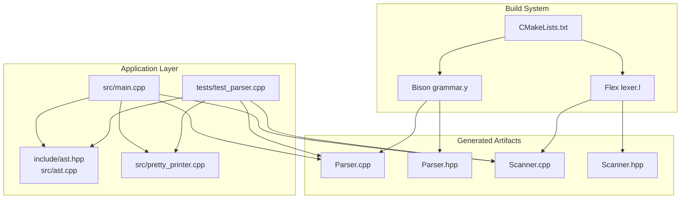
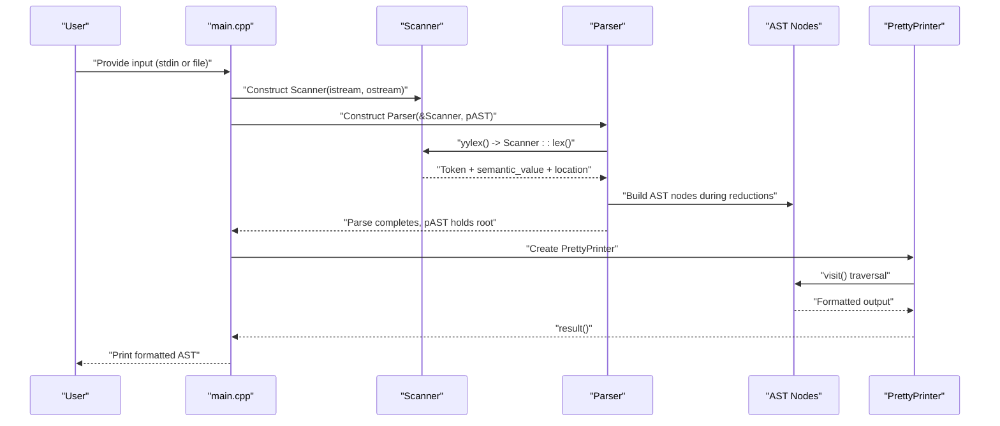
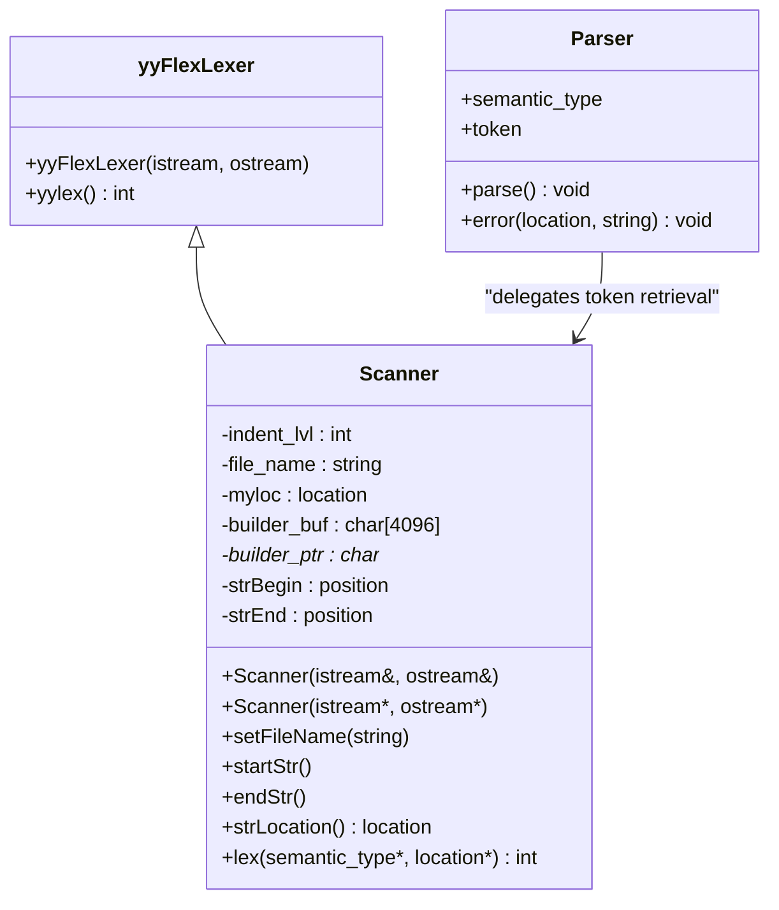
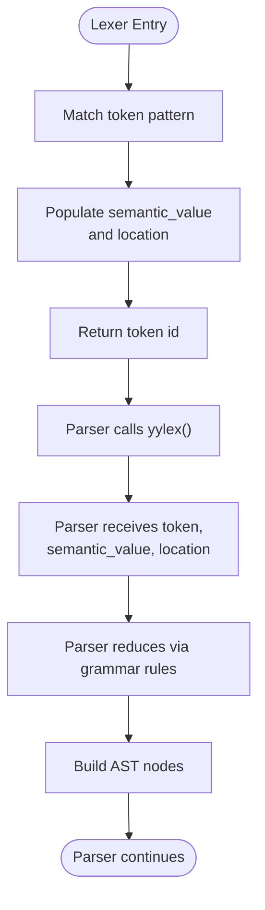
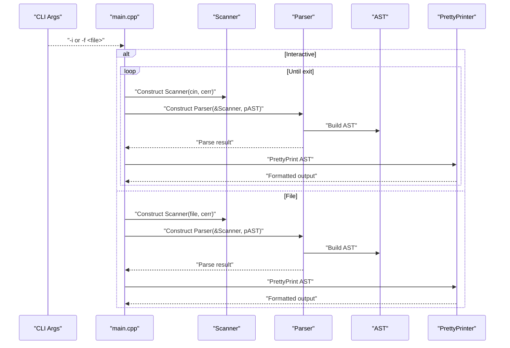
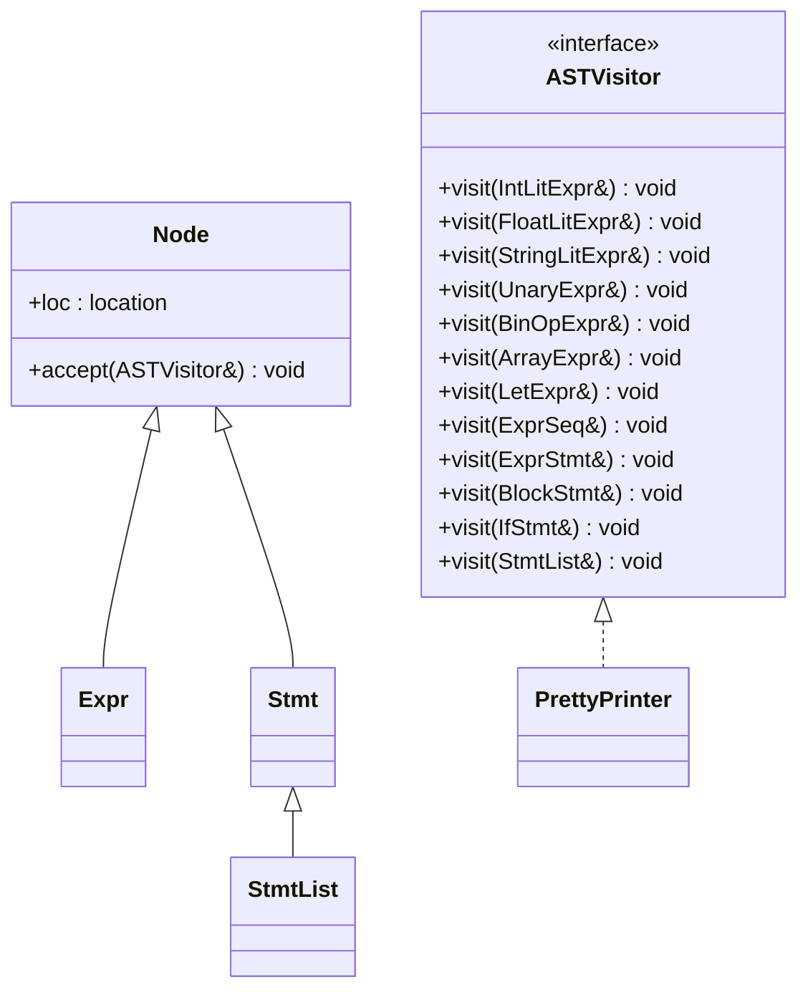
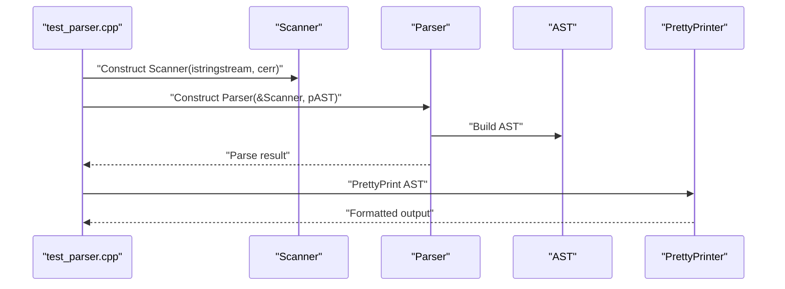
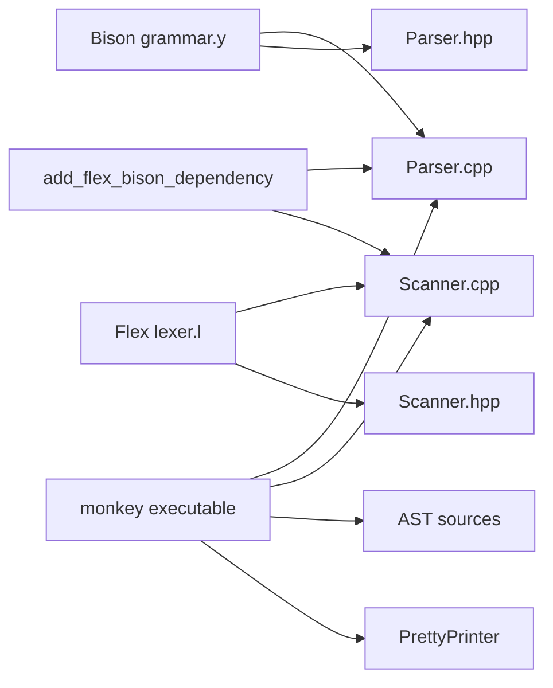

# Integration Patterns

<cite>
**Referenced Files in This Document**
- [README.md](file://README.md)
- [CMakeLists.txt](file://CMakeLists.txt)
- [grammar.y](file://grammar.y)
- [lexer.l](file://lexer.l)
- [include/Scanner.hpp](file://include/Scanner.hpp)
- [src/main.cpp](file://src/main.cpp)
- [include/ast.hpp](file://include/ast.hpp)
- [src/ast.cpp](file://src/ast.cpp)
- [include/ast_visitor.hpp](file://include/ast_visitor.hpp)
- [src/pretty_printer.cpp](file://src/pretty_printer.cpp)
- [tests/test_parser.cpp](file://tests/test_parser.cpp)
- [demo.txt](file://demo.txt)
</cite>

## Table of Contents
1. [Introduction](#introduction)
2. [Project Structure](#project-structure)
3. [Core Components](#core-components)
4. [Architecture Overview](#architecture-overview)
5. [Detailed Component Analysis](#detailed-component-analysis)
6. [Dependency Analysis](#dependency-analysis)
7. [Performance Considerations](#performance-considerations)
8. [Troubleshooting Guide](#troubleshooting-guide)
9. [Conclusion](#conclusion)
10. [Appendices](#appendices)

## Introduction
This document explains how the Modern Bison system integrates its components to form a cohesive compiler pipeline. It focuses on:
- How the Flex-generated lexer integrates with the Bison-generated parser through token passing and semantic value handling
- The scanner interface and how it bridges lexical analysis with parsing
- The main application entry point and how it orchestrates the compilation pipeline
- Data flow patterns that maintain loose coupling among components
- Examples of component initialization, error handling coordination, and resource sharing
- The modular design that enables swapping components while preserving system cohesion

## Project Structure
The project is organized around a clear separation of concerns:
- Grammar and lexer definitions drive the generation of parser and scanner source files
- The generated parser and scanner are integrated with a thin C++ wrapper (Scanner) and an AST subsystem
- The main application coordinates parsing and pretty-printing
- Tests exercise the parser/scanner integration in isolation

**Diagram sources**
- [CMakeLists.txt:19-25](file://CMakeLists.txt#L19-L25)
- [grammar.y:1-129](file://grammar.y#L1-L129)
- [lexer.l:1-100](file://lexer.l#L1-L100)
- [src/main.cpp:25-84](file://src/main.cpp#L25-L84)
- [tests/test_parser.cpp:12-25](file://tests/test_parser.cpp#L12-L25)

**Section sources**
- [CMakeLists.txt:19-25](file://CMakeLists.txt#L19-L25)
- [README.md:14-41](file://README.md#L14-L41)

## Core Components
- Scanner: A C++ wrapper around the Flex lexer that exposes a lex function returning tokens and populating semantic values and locations. It maintains internal state for indentation and string literal building.
- Parser: A C++ Bison parser configured to receive a Scanner pointer and a root AST node pointer. It delegates token retrieval to the scanner and constructs AST nodes during parsing.
- AST: An extensible tree model with visitor support for pretty-printing and future evaluation.
- Pretty Printer: A concrete visitor that renders the AST to a formatted string.
- Main Application: Orchestrates REPL or file-based parsing, initializes scanner and parser, and drives pretty-printing.

Key integration points:
- Token passing: The parser’s %parse-param passes a Scanner pointer; the parser’s %code defines yylex to delegate to Scanner::lex.
- Semantic value handling: Tokens carry semantic values via Parser::semantic_type, populated by Scanner::lex.
- Location tracking: The scanner updates a location object passed to the parser, enabling precise diagnostics.

**Section sources**
- [include/Scanner.hpp:13-42](file://include/Scanner.hpp#L13-L42)
- [grammar.y:20-39](file://grammar.y#L20-L39)
- [grammar.y:41-67](file://grammar.y#L41-L67)
- [lexer.l:7-17](file://lexer.l#L7-L17)
- [lexer.l:35-94](file://lexer.l#L35-L94)
- [include/ast.hpp:14-21](file://include/ast.hpp#L14-L21)
- [src/pretty_printer.cpp:74-93](file://src/pretty_printer.cpp#L74-L93)
- [src/main.cpp:25-84](file://src/main.cpp#L25-L84)

## Architecture Overview
The integration architecture centers on a clean handoff from lexical analysis to parsing and AST construction.

**Diagram sources**
- [src/main.cpp:37-43](file://src/main.cpp#L37-L43)
- [grammar.y:34](file://grammar.y#L34)
- [lexer.l:7](file://lexer.l#L7)
- [include/ast.hpp:14-21](file://include/ast.hpp#L14-L21)
- [src/pretty_printer.cpp:74-93](file://src/pretty_printer.cpp#L74-L93)

## Detailed Component Analysis

### Scanner Integration with Parser
The scanner is the bridge between Flex and Bison:
- The scanner inherits from the Flex base class and implements a lex function with a signature compatible with the generated parser’s expectations.
- The lexer definition sets YY_DECL to match the scanner’s lex signature and uses YY_USER_ACTION to update the location object.
- The parser’s %code defines yylex to call Scanner::lex, ensuring the parser receives tokens from the scanner.

**Diagram sources**
- [include/Scanner.hpp:13-42](file://include/Scanner.hpp#L13-L42)
- [lexer.l:7](file://lexer.l#L7)
- [grammar.y:34](file://grammar.y#L34)

**Section sources**
- [include/Scanner.hpp:13-42](file://include/Scanner.hpp#L13-L42)
- [lexer.l:7-17](file://lexer.l#L7-L17)
- [lexer.l:35-94](file://lexer.l#L35-L94)
- [grammar.y:34](file://grammar.y#L34)

### Token Passing and Semantic Value Handling
- The lexer populates Parser::semantic_type (a variant) with token-specific values (e.g., integers, floats, strings, identifiers).
- The parser’s token declarations specify which tokens carry semantic values and their types.
- The parser’s %parse-param injects the scanner pointer and the root AST node pointer into the parser, enabling it to construct the AST and report errors with precise locations.

**Diagram sources**
- [lexer.l:51-52](file://lexer.l#L51-L52)
- [lexer.l:90](file://lexer.l#L90)
- [grammar.y:41-46](file://grammar.y#L41-L46)
- [grammar.y:20](file://grammar.y#L20)

**Section sources**
- [lexer.l:51-52](file://lexer.l#L51-L52)
- [lexer.l:90](file://lexer.l#L90)
- [grammar.y:41-46](file://grammar.y#L41-L46)
- [grammar.y:20](file://grammar.y#L20)

### Main Application Orchestration
The main function coordinates the compilation pipeline:
- Parses command-line arguments to select REPL or file mode
- Initializes a Scanner with the input stream and error stream
- Constructs a Parser with the Scanner and a unique_ptr to the root AST node
- Invokes parser.parse(), checks for successful AST construction, and pretty-prints the result
- In REPL mode, accumulates statements across iterations

**Diagram sources**
- [src/main.cpp:25-84](file://src/main.cpp#L25-L84)
- [src/pretty_printer.cpp:74-93](file://src/pretty_printer.cpp#L74-L93)

**Section sources**
- [src/main.cpp:25-84](file://src/main.cpp#L25-L84)

### AST and Visitor Integration
The AST subsystem provides a visitor-driven rendering mechanism:
- The AST base classes define accept methods and a visitor interface
- PrettyPrinter implements the visitor to render nodes to a string
- The visitor pattern decouples rendering from AST node definitions, enabling easy extension

**Diagram sources**
- [include/ast_visitor.hpp:21-40](file://include/ast_visitor.hpp#L21-L40)
- [include/ast.hpp:14-21](file://include/ast.hpp#L14-L21)
- [src/ast.cpp:7-20](file://src/ast.cpp#L7-L20)
- [src/pretty_printer.cpp:74-93](file://src/pretty_printer.cpp#L74-L93)

**Section sources**
- [include/ast.hpp:14-21](file://include/ast.hpp#L14-L21)
- [include/ast_visitor.hpp:21-40](file://include/ast_visitor.hpp#L21-L40)
- [src/ast.cpp:7-20](file://src/ast.cpp#L7-L20)
- [src/pretty_printer.cpp:74-93](file://src/pretty_printer.cpp#L74-L93)

### Testing Integration Pattern
Tests demonstrate the same integration pattern used by the main application:
- Construct a Scanner with an input stream and error stream
- Construct a Parser with the Scanner and a unique_ptr to the root AST node
- Call parser.parse() and verify AST construction
- Pretty-print the AST for inspection

**Diagram sources**
- [tests/test_parser.cpp:12-25](file://tests/test_parser.cpp#L12-L25)

**Section sources**
- [tests/test_parser.cpp:12-25](file://tests/test_parser.cpp#L12-L25)

## Dependency Analysis
The build system generates parser and scanner sources and wires them into the application:
- CMake uses BISON_TARGET and FLEX_TARGET to generate Parser.cpp/Parser.hpp and Scanner.cpp/Scanner.hpp
- The generated files depend on each other via add_flex_bison_dependency
- The application executable links against the generated sources plus the application sources

**Diagram sources**
- [CMakeLists.txt:19-25](file://CMakeLists.txt#L19-L25)

**Section sources**
- [CMakeLists.txt:19-25](file://CMakeLists.txt#L19-L25)

## Performance Considerations
- The scanner uses a fixed-size buffer for string literals, which avoids frequent allocations during scanning.
- The parser’s semantic value is a variant, enabling efficient storage of different token types without dynamic dispatch overhead in the parser itself.
- The visitor pattern keeps rendering separate from AST construction, allowing potential lazy evaluation or streaming pretty-printing strategies.

[No sources needed since this section provides general guidance]

## Troubleshooting Guide
Common integration issues and resolutions:
- Unexpected EOF or token mismatch: Verify that the scanner’s lex function is invoked by the parser via the yylex macro and that the scanner’s lex signature matches the YY_DECL definition.
- Incorrect semantic values: Ensure the lexer populates the semantic_value variant with the correct type for each token category declared in the grammar.
- Location reporting problems: Confirm that YY_USER_ACTION updates the location object and that the parser’s error handler uses the location passed by the scanner.
- Build failures on Windows: Ensure win_flex_bison executables are discoverable and that the include path points to the FlexLexer header.

**Section sources**
- [lexer.l:7-17](file://lexer.l#L7-L17)
- [lexer.l:35-94](file://lexer.l#L35-L94)
- [grammar.y:34](file://grammar.y#L34)
- [grammar.y:127-129](file://grammar.y#L127-L129)
- [CMakeLists.txt:8-17](file://CMakeLists.txt#L8-L17)

## Conclusion
The Modern Bison system demonstrates a clean integration of Flex and Bison with a thin C++ layer:
- The scanner encapsulates Flex’s capabilities and exposes a controlled interface to the parser
- The parser consumes tokens and semantic values, constructing an AST with precise location information
- The main application orchestrates the pipeline, and the visitor pattern cleanly separates rendering from AST construction
- The modular design allows swapping components (e.g., different scanners or printers) while preserving cohesion

[No sources needed since this section summarizes without analyzing specific files]

## Appendices

### Example Workflows

- REPL Mode:
  - Initialize Scanner with stdin and stderr
  - Initialize Parser with Scanner and a unique_ptr to the root AST node
  - Parse input until EOF or error
  - Pretty-print the resulting AST

- File Mode:
  - Open the target file
  - Initialize Scanner with the file stream and stderr
  - Initialize Parser with Scanner and a unique_ptr to the root AST node
  - Parse the file and pretty-print the AST

- Test Mode:
  - Create an input string stream
  - Initialize Scanner with the stream and stderr
  - Initialize Parser with Scanner and a unique_ptr to the root AST node
  - Parse and pretty-print the AST for verification

**Section sources**
- [src/main.cpp:37-43](file://src/main.cpp#L37-L43)
- [src/main.cpp:70-72](file://src/main.cpp#L70-L72)
- [tests/test_parser.cpp:12-25](file://tests/test_parser.cpp#L12-L25)

### Demo Input
The demo file illustrates the language constructs supported by the grammar and scanner.

**Section sources**
- [demo.txt:1-40](file://demo.txt#L1-L40)