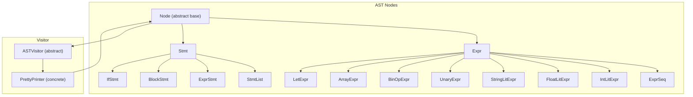
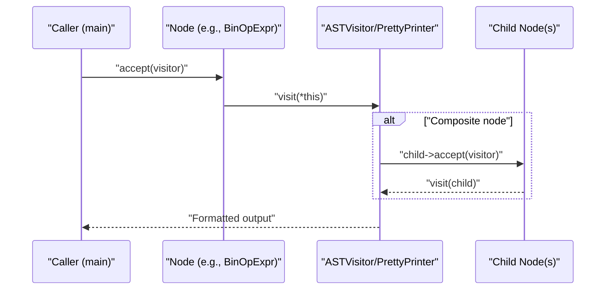
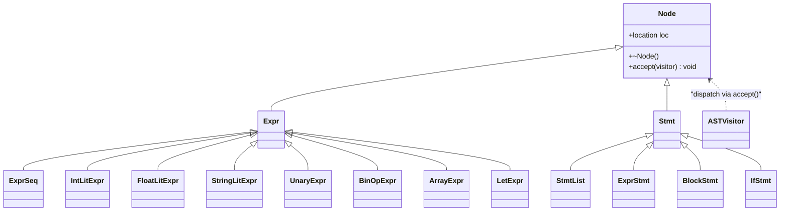
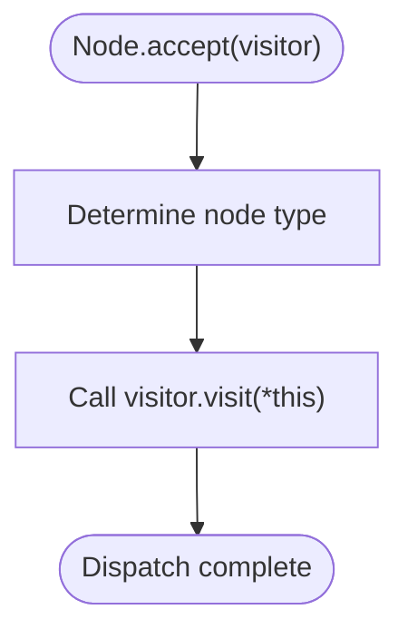
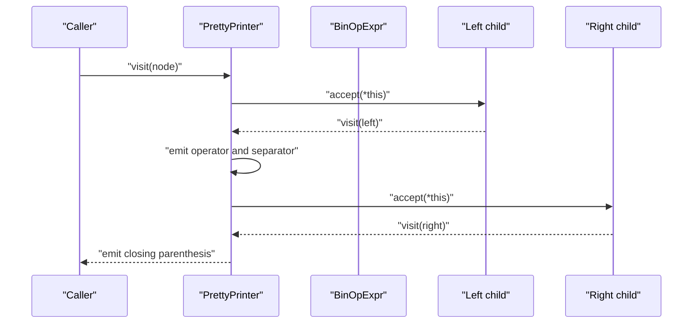
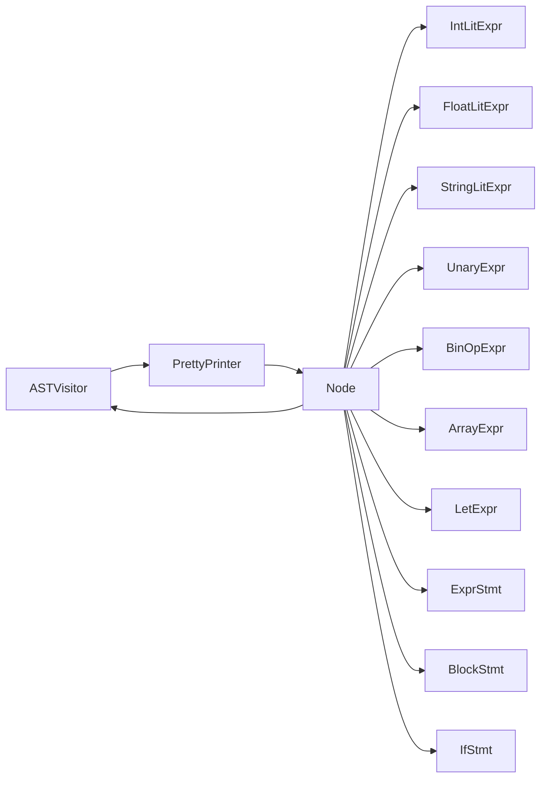

# Visitor Pattern Implementation

<cite>
**Referenced Files in This Document**
- [ast.hpp](file://include/ast.hpp)
- [ast_visitor.hpp](file://include/ast_visitor.hpp)
- [pretty_printer.hpp](file://include/pretty_printer.hpp)
- [pretty_printer.cpp](file://src/pretty_printer.cpp)
- [ast.cpp](file://src/ast.cpp)
- [main.cpp](file://src/main.cpp)
</cite>

## Table of Contents
1. [Introduction](#introduction)
2. [Project Structure](#project-structure)
3. [Core Components](#core-components)
4. [Architecture Overview](#architecture-overview)
5. [Detailed Component Analysis](#detailed-component-analysis)
6. [Dependency Analysis](#dependency-analysis)
7. [Performance Considerations](#performance-considerations)
8. [Troubleshooting Guide](#troubleshooting-guide)
9. [Conclusion](#conclusion)

## Introduction
This document explains the visitor pattern implementation in the AST system. It focuses on the abstract ASTVisitor interface, the polymorphic accept() dispatch mechanism, and the concrete PrettyPrinter visitor that produces human-readable output. It also outlines how to extend the pattern to support additional output formats (e.g., JSON, XML, bytecode) and discusses the benefits of separating algorithms from data structures.

## Project Structure
The visitor pattern spans several header and implementation files:
- Abstract visitor interface: include/ast_visitor.hpp
- AST node hierarchy and accept() dispatch: include/ast.hpp and src/ast.cpp
- Concrete visitor (pretty printer): include/pretty_printer.hpp and src/pretty_printer.cpp
- Usage example in main: src/main.cpp

**Diagram sources**
- [ast.hpp:14-203](file://include/ast.hpp#L14-L203)
- [ast_visitor.hpp:21-40](file://include/ast_visitor.hpp#L21-L40)
- [pretty_printer.hpp:9-35](file://include/pretty_printer.hpp#L9-L35)

**Section sources**
- [ast.hpp:14-203](file://include/ast.hpp#L14-L203)
- [ast_visitor.hpp:21-40](file://include/ast_visitor.hpp#L21-L40)
- [pretty_printer.hpp:9-35](file://include/pretty_printer.hpp#L9-L35)

## Core Components
- ASTVisitor: Declares virtual visit() methods for all node types. It is the abstract algorithm interface.
- Node and derived nodes: Provide accept(ASTVisitor&) to dispatch to the matching visit().
- PrettyPrinter: Implements visit() methods to render nodes to a formatted string stream.

Key responsibilities:
- Separation of concerns: Node hierarchy manages structure; visitors manage algorithms.
- Extensibility: New output formats can be implemented by adding new visitor classes without touching node classes.

**Section sources**
- [ast_visitor.hpp:21-40](file://include/ast_visitor.hpp#L21-L40)
- [ast.hpp:14-21](file://include/ast.hpp#L14-L21)
- [ast.cpp:7-19](file://src/ast.cpp#L7-L19)
- [pretty_printer.hpp:9-35](file://include/pretty_printer.hpp#L9-L35)

## Architecture Overview
The visitor pattern enables polymorphic traversal of the AST. The accept() method in each node calls the corresponding visit() on the visitor, allowing the visitor to operate on the node’s data without embedding algorithmic logic inside the nodes.

**Diagram sources**
- [ast.cpp:7-19](file://src/ast.cpp#L7-L19)
- [pretty_printer.cpp:24-30](file://src/pretty_printer.cpp#L24-L30)

**Section sources**
- [ast.cpp:7-19](file://src/ast.cpp#L7-L19)
- [pretty_printer.cpp:24-30](file://src/pretty_printer.cpp#L24-L30)

## Detailed Component Analysis

### Abstract Visitor Interface (ASTVisitor)
- Purpose: Define the contract for all visitors.
- Methods: One visit() overload per node type (expressions and statements).
- Design: Pure virtual methods enforce concrete implementations.

Benefits:
- Centralized algorithm interface.
- Clear extension points for new output formats.

**Section sources**
- [ast_visitor.hpp:21-40](file://include/ast_visitor.hpp#L21-L40)

### Node Hierarchy and accept() Dispatch
- Node base: Provides virtual accept(ASTVisitor&).
- Derived nodes: Override accept() to call visitor.visit(*this).
- Composite nodes: Recursively call accept() on children during visit().

**Diagram sources**
- [ast.hpp:14-203](file://include/ast.hpp#L14-L203)
- [ast_visitor.hpp:21-40](file://include/ast_visitor.hpp#L21-L40)

**Section sources**
- [ast.hpp:14-21](file://include/ast.hpp#L14-L21)
- [ast.hpp:27-41](file://include/ast.hpp#L27-L41)
- [ast.hpp:50-71](file://include/ast.hpp#L50-L71)
- [ast.hpp:79-95](file://include/ast.hpp#L79-L95)
- [ast.hpp:107-118](file://include/ast.hpp#L107-L118)
- [ast.hpp:120-126](file://include/ast.hpp#L120-L126)
- [ast.hpp:136-143](file://include/ast.hpp#L136-L143)
- [ast.hpp:145-156](file://include/ast.hpp#L145-L156)
- [ast.hpp:174-199](file://include/ast.hpp#L174-L199)

### Polymorphic accept() Mechanism
- Each node type implements accept(ASTVisitor&) to call visitor.visit(*this).
- This ensures the correct visit() overload is invoked based on the dynamic type of the node.

**Diagram sources**
- [ast.cpp:7-19](file://src/ast.cpp#L7-L19)

**Section sources**
- [ast.cpp:7-19](file://src/ast.cpp#L7-L19)

### PrettyPrinter Visitor
- Purpose: Render the AST to a human-readable string.
- Output storage: Uses an internal string stream to accumulate formatted output.
- Formatting logic:
  - Literals: Wrap numeric literals and print string literals with location metadata.
  - Unary expressions: Print operator and recurse into operand.
  - Binary operators: Parenthesize and print left, operator, right.
  - Sequences: Iterate and join expressions with separators.
  - Arrays: Bracketed sequences.
  - Let bindings: Print binding form and recurse into value.
  - Statements:
    - Expression statements: Recurse into expression and append semicolon.
    - Blocks: Print braces with indentation based on nested level.
    - Statement lists: Print each statement with its indentation and newline.
    - If statements: Print condition, truthy branch, optional elif blocks, and optional else.

Indentation handling:
- Stmt and StmtList expose nested_lvl and setIndentationLvl to propagate indentation levels.
- PrettyPrinter constructs indentation strings using nested_lvl and prints them before each line.

Output customization:
- The PrettyPrinter class exposes a result() accessor to retrieve the final formatted string.
- The design allows easy extension to customize formatting (e.g., color, width, alignment) by modifying visit() methods.

**Diagram sources**
- [pretty_printer.cpp:24-30](file://src/pretty_printer.cpp#L24-L30)

**Section sources**
- [pretty_printer.hpp:9-35](file://include/pretty_printer.hpp#L9-L35)
- [pretty_printer.cpp:7-17](file://src/pretty_printer.cpp#L7-L17)
- [pretty_printer.cpp:19-30](file://src/pretty_printer.cpp#L19-L30)
- [pretty_printer.cpp:32-45](file://src/pretty_printer.cpp#L32-L45)
- [pretty_printer.cpp:47-56](file://src/pretty_printer.cpp#L47-L56)
- [pretty_printer.cpp:58-72](file://src/pretty_printer.cpp#L58-L72)
- [pretty_printer.cpp:74-93](file://src/pretty_printer.cpp#L74-L93)

### Usage in main()
- The program parses input into an AST and then invokes accept() with a PrettyPrinter to produce formatted output.
- Demonstrates the visitor pattern in action: the same accept() call triggers the correct visit() based on the node’s dynamic type.

**Section sources**
- [main.cpp:41-43](file://src/main.cpp#L41-L43)
- [main.cpp:74-76](file://src/main.cpp#L74-L76)

## Dependency Analysis
- Nodes depend on ASTVisitor for dispatch but not on concrete visitors.
- Concrete visitors depend on ASTVisitor and nodes’ public interfaces.
- PrettyPrinter depends on node types to render them.

**Diagram sources**
- [ast_visitor.hpp:21-40](file://include/ast_visitor.hpp#L21-L40)
- [ast.hpp:14-203](file://include/ast.hpp#L14-L203)
- [pretty_printer.hpp:9-35](file://include/pretty_printer.hpp#L9-L35)

**Section sources**
- [ast_visitor.hpp:21-40](file://include/ast_visitor.hpp#L21-L40)
- [ast.hpp:14-203](file://include/ast.hpp#L14-L203)
- [pretty_printer.hpp:9-35](file://include/pretty_printer.hpp#L9-L35)

## Performance Considerations
- Dispatch cost: accept() adds a small indirection per node. This is negligible compared to parsing and memory overhead.
- Memory: PrettyPrinter uses a string stream; consider reserving capacity for very large outputs to reduce reallocations.
- Recursion depth: Deeply nested ASTs can increase stack usage. For extremely deep inputs, consider iterative traversal patterns.
- I/O: Printing to stdout is typically the bottleneck; keep formatting logic efficient and avoid unnecessary allocations.

[No sources needed since this section provides general guidance]

## Troubleshooting Guide
Common issues and resolutions:
- Missing visit() overload: If a new node type is added, ensure ASTVisitor declares a visit() for it and PrettyPrinter implements it.
- Incorrect indentation: Verify setIndentationLvl is called appropriately during AST construction and that PrettyPrinter reads nested_lvl correctly.
- Composite recursion: Ensure composite nodes call accept() on children in visit() to traverse the entire subtree.
- Output not produced: Confirm accept() is invoked with a visitor and result() is called to retrieve the formatted string.

**Section sources**
- [ast_visitor.hpp:21-40](file://include/ast_visitor.hpp#L21-L40)
- [ast.cpp:7-19](file://src/ast.cpp#L7-L19)
- [pretty_printer.cpp:58-72](file://src/pretty_printer.cpp#L58-L72)

## Conclusion
The visitor pattern cleanly separates AST structure from output algorithms. The accept() dispatch mechanism enables polymorphic traversal, while concrete visitors like PrettyPrinter encapsulate formatting logic. This design makes it straightforward to add new output formats (JSON, XML, bytecode) by implementing additional visitor classes without modifying node classes. The pattern thus supports extensibility, maintainability, and clear separation of concerns.