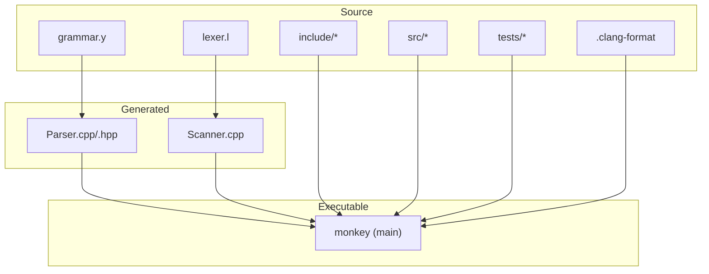
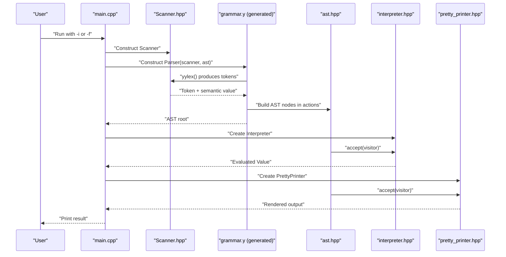
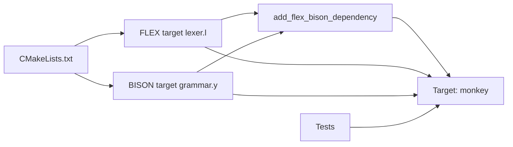

# Development Guide

<cite>
**Referenced Files in This Document**
- [.clang-format](file://.clang-format)
- [README.md](file://README.md)
- [CMakeLists.txt](file://CMakeLists.txt)
- [grammar.y](file://grammar.y)
- [lexer.l](file://lexer.l)
- [include/Scanner.hpp](file://include/Scanner.hpp)
- [include/ast.hpp](file://include/ast.hpp)
- [include/ast_visitor.hpp](file://include/ast_visitor.hpp)
- [include/pretty_printer.hpp](file://include/pretty_printer.hpp)
- [include/value.hpp](file://include/value.hpp)
- [include/type_table.hpp](file://include/type_table.hpp)
- [include/interpreter.hpp](file://include/interpreter.hpp)
- [include/context.hpp](file://include/context.hpp)
- [src/main.cpp](file://src/main.cpp)
- [src/ast.cpp](file://src/ast.cpp)
- [src/interpreter.cpp](file://src/interpreter.cpp)
- [src/pretty_printer.cpp](file://src/pretty_printer.cpp)
- [tests/test_parser.cpp](file://tests/test_parser.cpp)
- [tests/CMakeLists.txt](file://tests/CMakeLists.txt)
- [demo.txt](file://demo.txt)
</cite>

## Update Summary
**Changes Made**
- Updated Evaluation Types and Type System section to reflect the modern object-oriented design with StringObject and ArrayObject classes
- Removed references to the old TypedPtr-based value system and previous type system limitations
- Added comprehensive documentation for the new Value class with variant-based design
- Updated interpreter implementation details to reflect the current evaluation architecture
- Enhanced type system documentation with TypeTable singleton pattern and type categorization
- Added context management documentation for the new evaluation framework

## Table of Contents
1. [Introduction](#introduction)
2. [Project Structure](#project-structure)
3. [Core Components](#core-components)
4. [Architecture Overview](#architecture-overview)
5. [Detailed Component Analysis](#detailed-component-analysis)
6. [Dependency Analysis](#dependency-analysis)
7. [Performance Considerations](#performance-considerations)
8. [Formatting Standards](#formatting-standards)
9. [Troubleshooting Guide](#troubleshooting-guide)
10. [Development Workflow](#development-workflow)
11. [Extending the Language](#extending-the-language)
12. [Build System Integration](#build-system-integration)
13. [Cross-Platform Considerations](#cross-platform-considerations)
14. [Deployment Strategies](#deployment-strategies)
15. [Contributing Guidelines](#contributing-guidelines)
16. [Conclusion](#conclusion)

## Introduction
This guide documents how to extend and modify the Modern Bison compiler for the Monkey programming language. It explains how to add new language features (grammar, lexer, AST nodes), implement AST visitors, add custom output formats, maintain backward compatibility, resolve parser conflicts, and manage incremental improvements. It also covers testing, debugging, build integration, cross-platform support, and contribution best practices.

**Updated** The project now features a modern object-oriented design with a comprehensive type system replacing the previous TypedPtr-based approach.

## Project Structure
The project follows a layered structure:
- Grammar and lexer define tokens and parsing rules.
- Generated parser and scanner integrate with the AST.
- AST nodes form an extensible visitor-based model.
- Pretty printer demonstrates a concrete visitor implementation.
- Interpreter provides evaluation capabilities with the new object-oriented type system.
- Tests validate parsing behavior and evaluation results.
- CMake orchestrates generation and linking of parser/scanner.

**Diagram sources**
- [CMakeLists.txt:19-25](file://CMakeLists.txt#L19-L25)
- [grammar.y:1-20](file://grammar.y#L1-L20)
- [lexer.l:1-20](file://lexer.l#L1-L20)
- [src/main.cpp:1-25](file://src/main.cpp#L1-L25)
- [.clang-format:1-14](file://.clang-format#L1-L14)

**Section sources**
- [README.md:14-41](file://README.md#L14-L41)
- [CMakeLists.txt:1-40](file://CMakeLists.txt#L1-L40)

## Core Components
- Grammar specification defines tokens, non-terminals, precedence, and production rules. It integrates with the generated parser and scanner.
- Lexer recognizes tokens and manages locations, including string literals and indentation for blocks.
- AST provides a visitor-driven model for expressions and statements.
- Pretty printer is a concrete visitor that renders the AST to text.
- Interpreter provides evaluation capabilities using the new object-oriented type system.
- Main entry supports interactive and file-based modes, invoking the scanner and parser and printing results via a visitor.
- Tests exercise parsing and visitor rendering.
- .clang-format establishes standardized C++ formatting across all source files.

Key implementation references:
- Grammar and precedence: [grammar.y:41-69](file://grammar.y#L41-L69)
- Tokens and nterms: [grammar.y:41-56](file://grammar.y#L41-L56)
- Productions and actions: [grammar.y:71-125](file://grammar.y#L71-L125)
- Lexer tokens and rules: [lexer.l:51-94](file://lexer.l#L51-L94)
- AST node hierarchy: [include/ast.hpp:14-203](file://include/ast.hpp#L14-L203)
- Visitor interface: [include/ast_visitor.hpp:21-40](file://include/ast_visitor.hpp#L21-L40)
- Pretty printer visitor: [include/pretty_printer.hpp:9-35](file://include/pretty_printer.hpp#L9-L35)
- Interpreter implementation: [include/interpreter.hpp:12-40](file://include/interpreter.hpp#L12-L40)
- Main entry and REPL loop: [src/main.cpp:25-84](file://src/main.cpp#L25-L84)
- Code formatting: [.clang-format:1-14](file://.clang-format#L1-L14)

**Section sources**
- [grammar.y:41-129](file://grammar.y#L41-L129)
- [lexer.l:1-100](file://lexer.l#L1-L100)
- [include/ast.hpp:1-203](file://include/ast.hpp#L1-L203)
- [include/ast_visitor.hpp:1-43](file://include/ast_visitor.hpp#L1-L43)
- [include/pretty_printer.hpp:1-38](file://include/pretty_printer.hpp#L1-L38)
- [include/interpreter.hpp:1-43](file://include/interpreter.hpp#L1-L43)
- [src/main.cpp:1-84](file://src/main.cpp#L1-L84)
- [.clang-format:1-14](file://.clang-format#L1-L14)

## Architecture Overview
The system generates a C++ parser and scanner from the grammar and lexer specifications, then builds an executable that parses input into an AST and prints it via a visitor. The interpreter provides evaluation capabilities using the modern object-oriented type system.

**Diagram sources**
- [src/main.cpp:25-84](file://src/main.cpp#L25-L84)
- [include/Scanner.hpp:13-42](file://include/Scanner.hpp#L13-L42)
- [grammar.y:1-20](file://grammar.y#L1-L20)
- [include/ast.hpp:14-203](file://include/ast.hpp#L14-L203)
- [include/interpreter.hpp:12-40](file://include/interpreter.hpp#L12-L40)
- [include/pretty_printer.hpp:9-35](file://include/pretty_printer.hpp#L9-L35)

## Detailed Component Analysis

### Grammar and Parser (grammar.y)
- Uses C++ binding, location tracking, and variant-based semantic values.
- Defines tokens for literals, keywords, operators, and punctuation.
- Declares non-terminals for expressions, statements, blocks, and lists.
- Establishes precedence and associativity for operators.
- Production actions construct AST nodes and set the root.

Key areas:
- Token declarations: [grammar.y:41-46](file://grammar.y#L41-L46)
- Non-terminal declarations: [grammar.y:48-56](file://grammar.y#L48-L56)
- Precedence: [grammar.y:58-67](file://grammar.y#L58-L67)
- Productions and actions: [grammar.y:71-125](file://grammar.y#L71-L125)
- Error handling: [grammar.y:127-129](file://grammar.y#L127-L129)

**Section sources**
- [grammar.y:1-129](file://grammar.y#L1-L129)

### Lexer (lexer.l)
- Generates a C++ scanner with custom lex function signature.
- Manages locations and tracks line/column advances.
- Handles string literals with escape sequences and multi-line support.
- Emits tokens for keywords, operators, literals, and punctuation.
- Tracks indentation for block delimiters.

Key areas:
- YY_DECL and YY_USER_ACTION: [lexer.l:6-11](file://lexer.l#L6-L11)
- String state and escapes: [lexer.l:31-49](file://lexer.l#L31-L49)
- Keyword and operator tokens: [lexer.l:53-94](file://lexer.l#L53-L94)
- Newline and EOF handling: [lexer.l:90-94](file://lexer.l#L90-L94)

**Section sources**
- [lexer.l:1-100](file://lexer.l#L1-L100)

### AST and Visitor Framework (ast.hpp, ast_visitor.hpp, ast.cpp)
- Base Node with location and virtual accept method.
- Hierarchical nodes for expressions (literals, unary, binary, array, let, expr-seq) and statements (expr-stmt, block, if/elif/else, stmt-list).
- Visitor interface declares visit methods for each node type.
- accept() implementations delegate to visitors.

Key areas:
- Node hierarchy: [include/ast.hpp:14-203](file://include/ast.hpp#L14-L203)
- Visitor interface: [include/ast_visitor.hpp:21-40](file://include/ast_visitor.hpp#L21-L40)
- accept() implementations: [src/ast.cpp:7-20](file://src/ast.cpp#L7-L20)
- IfStmt indentation propagation: [src/ast.cpp:21-31](file://src/ast.cpp#L21-L31)

**Section sources**
- [include/ast.hpp:1-203](file://include/ast.hpp#L1-L203)
- [include/ast_visitor.hpp:1-43](file://include/ast_visitor.hpp#L1-L43)
- [src/ast.cpp:1-33](file://src/ast.cpp#L1-L33)

### Pretty Printer Visitor (pretty_printer.hpp, pretty_printer.cpp)
- Concrete visitor that renders AST nodes to a formatted string.
- Handles expressions, arrays, let bindings, statements, blocks, and if chains.

Key areas:
- Visitor class and methods: [include/pretty_printer.hpp:9-35](file://include/pretty_printer.hpp#L9-L35)
- Visit implementations: [src/pretty_printer.cpp:7-95](file://src/pretty_printer.cpp#L7-L95)

**Section sources**
- [include/pretty_printer.hpp:1-38](file://include/pretty_printer.hpp#L1-L38)
- [src/pretty_printer.cpp:1-96](file://src/pretty_printer.cpp#L1-L96)

### Interpreter and Evaluation System (interpreter.hpp, interpreter.cpp)
- Provides evaluation capabilities using the new object-oriented type system.
- Implements ASTVisitor to traverse and evaluate AST nodes.
- Manages variable contexts and evaluates expressions with proper type handling.
- Supports arithmetic, comparison, logical operations, and compound data structures.

Key areas:
- Interpreter class and visit methods: [include/interpreter.hpp:12-40](file://include/interpreter.hpp#L12-L40)
- Expression evaluation: [src/interpreter.cpp:8-244](file://src/interpreter.cpp#L8-L244)
- Context management: [include/context.hpp:10-39](file://include/context.hpp#L10-L39)

**Section sources**
- [include/interpreter.hpp:1-43](file://include/interpreter.hpp#L1-L43)
- [src/interpreter.cpp:1-244](file://src/interpreter.cpp#L1-L244)
- [include/context.hpp:1-42](file://include/context.hpp#L1-L42)

### Main Entry Point (main.cpp)
- Supports interactive (-i) and file (-f) modes.
- Constructs Scanner and Parser, runs parse, and prints via PrettyPrinter.
- Accumulates statement lists across REPL iterations.

Key areas:
- Mode selection and usage: [src/main.cpp:17-23](file://src/main.cpp#L17-L23)
- Interactive loop: [src/main.cpp:32-56](file://src/main.cpp#L32-L56)
- File mode: [src/main.cpp:58-84](file://src/main.cpp#L58-L84)

**Section sources**
- [src/main.cpp:1-84](file://src/main.cpp#L1-L84)

### Scanner (Scanner.hpp)
- Wraps Flex lexer, exposes lex function with Parser's semantic type and location.
- Tracks file name, indentation level, and string literal positions.

Key areas:
- Class definition and lex signature: [include/Scanner.hpp:13-31](file://include/Scanner.hpp#L13-L31)
- String location helpers: [include/Scanner.hpp:26-28](file://include/Scanner.hpp#L26-L28)

**Section sources**
- [include/Scanner.hpp:1-44](file://include/Scanner.hpp#L1-L44)

### Evaluation Types and Type System (value.hpp, type_table.hpp)
- **Updated** Modern object-oriented design with Value class using std::variant for type-safe storage.
- Value class stores primitives (Null, Bool, int64_t, double) and shared_ptr<Object> for heap-allocated objects.
- Object hierarchy includes StringObject and ArrayObject with proper polymorphic behavior.
- TypeTable provides singleton pattern for type registration and lookup with category classification.
- Comprehensive type checking, conversion, and equality comparison capabilities.

Key areas:
- Value variants and accessors: [include/value.hpp:25-92](file://include/value.hpp#L25-L92)
- Object base and derived types: [include/value.hpp:97-170](file://include/value.hpp#L97-L170)
- TypeTable registration and lookup: [include/type_table.hpp:67-133](file://include/type_table.hpp#L67-L133)
- Type identification and conversion: [include/value.hpp:172-206](file://include/value.hpp#L172-L206)

**Section sources**
- [include/value.hpp:1-249](file://include/value.hpp#L1-L249)
- [include/type_table.hpp:1-138](file://include/type_table.hpp#L1-L138)

## Dependency Analysis
The build system integrates Flex/Bison generation with CMake, linking generated sources into the executable and enabling tests.

**Diagram sources**
- [CMakeLists.txt:19-25](file://CMakeLists.txt#L19-L25)

**Section sources**
- [CMakeLists.txt:1-40](file://CMakeLists.txt#L1-L40)

## Performance Considerations
- Prefer concise grammar productions to reduce shift/reduce conflicts and parser stack depth.
- Keep semantic actions lightweight; defer heavy work to later passes (e.g., evaluation).
- Use location tracking judiciously; it adds overhead but improves diagnostics.
- Avoid deep recursion in AST traversal by using iterative visitors when appropriate.
- **Updated** The new object-oriented design with shared_ptr<Object> provides efficient memory management for complex data structures.
- Variant-based Value class ensures type-safe storage with minimal overhead.

## Formatting Standards

The project enforces standardized C++ formatting using .clang-format with the following configuration:

### Configuration Details
- **Style**: LLVM (consistent with modern C++ standards)
- **Indentation**: 4 spaces per level
- **Line Length**: Maximum 120 characters
- **Brace Placement**: Attach braces to line above (Attach style)
- **Pointer Alignment**: Left alignment
- **Template Declarations**: Always break template declarations
- **Include Sorting**: Disabled (maintains logical grouping)

### Formatting Rules Applied
- Consistent 4-space indentation for all code blocks
- Maximum 120-character line length with intelligent wrapping
- Attach braces to containing statement for compactness
- Left-aligned pointer and reference operators
- Template declarations always broken to new lines
- Control statement spacing (if/for/while) with parentheses

### Files Covered by Formatting
- AST framework and node definitions
- Type system and evaluation classes
- Visitor implementations and pretty printer
- Interpreter and context management
- Main entry point and utility functions
- All header and implementation files

**Section sources**
- [.clang-format:1-14](file://.clang-format#L1-L14)

## Troubleshooting Guide
Common issues and remedies:
- Parser conflicts
  - Symptom: Shift/reduce or reduce/reduce conflicts during generation.
  - Action: Adjust precedence/associativity or refactor ambiguous productions.
  - References: [grammar.y:58-67](file://grammar.y#L58-L67), [grammar.y:71-125](file://grammar.y#L71-L125)
- Lexical errors
  - Symptom: Unmatched input or unterminated strings.
  - Action: Extend lexer rules for new tokens and improve string state handling.
  - References: [lexer.l:31-49](file://lexer.l#L31-L49), [lexer.l:90-94](file://lexer.l#L90-L94)
- AST traversal issues
  - Symptom: Missing visitor methods or incorrect dispatch.
  - Action: Add missing visit() methods and ensure accept() delegates correctly.
  - References: [include/ast_visitor.hpp:21-40](file://include/ast_visitor.hpp#L21-L40), [src/ast.cpp:7-20](file://src/ast.cpp#L7-L20)
- REPL behavior
  - Symptom: No output or repeated prompts.
  - Action: Verify Scanner construction and Parser.parse() invocation.
  - References: [src/main.cpp:32-56](file://src/main.cpp#L32-L56)
- **Updated** Type system issues
  - Symptom: Runtime errors when accessing values or type mismatches.
  - Action: Use Value.isXxx() methods for type checking before casting, ensure proper object lifetime with shared_ptr.
  - References: [include/value.hpp:40-92](file://include/value.hpp#L40-L92), [include/interpreter.hpp:12-40](file://include/interpreter.hpp#L12-L40)
- Formatting conflicts
  - Symptom: Code style warnings or CI failures.
  - Action: Run clang-format locally before committing changes.
  - References: [.clang-format:1-14](file://.clang-format#L1-L14)

**Section sources**
- [grammar.y:58-125](file://grammar.y#L58-L125)
- [lexer.l:31-94](file://lexer.l#L31-L94)
- [include/ast_visitor.hpp:21-40](file://include/ast_visitor.hpp#L21-L40)
- [src/ast.cpp:7-20](file://src/ast.cpp#L7-L20)
- [src/main.cpp:32-56](file://src/main.cpp#L32-L56)
- [include/value.hpp:40-92](file://include/value.hpp#L40-L92)
- [include/interpreter.hpp:12-40](file://include/interpreter.hpp#L12-L40)
- [.clang-format:1-14](file://.clang-format#L1-L14)

## Development Workflow

**Updated** All development workflow steps now include mandatory code formatting compliance and consideration for the new object-oriented type system.

From concept to implementation:
1. **Setup**: Ensure .clang-format is applied to all new and modified code
2. Define the feature in the grammar (tokens, non-terminals, precedence)
3. Update the lexer to recognize new tokens
4. Add AST node types and update accept() implementations
5. Implement visitor methods for new nodes
6. **Updated** Add or modify interpreter visit methods to handle new AST nodes with proper type system integration
7. Add or update tests to validate parsing and evaluation behavior
8. Run clang-format to ensure consistent formatting
9. Build and run the executable in interactive or file mode
10. Iterate on conflicts, diagnostics, and output formatting

### Code Formatting Requirements
- Run `clang-format -i` on all modified files before committing
- Verify formatting matches .clang-format configuration
- Use IDE integration for automatic formatting on save
- Check for formatting compliance in CI pipeline

### Validation Steps
- Parse representative inputs and confirm AST structure
- Use PrettyPrinter to verify textual output
- **Updated** Test interpreter evaluation with new AST nodes and proper type handling
- Run tests to ensure regressions are caught
- Verify code formatting compliance

References:
- Grammar and lexer: [grammar.y:1-129](file://grammar.y#L1-L129), [lexer.l:1-100](file://lexer.l#L1-L100)
- AST and visitor: [include/ast.hpp:1-203](file://include/ast.hpp#L1-L203), [include/ast_visitor.hpp:1-43](file://include/ast_visitor.hpp#L1-L43)
- Interpreter and type system: [include/interpreter.hpp:1-43](file://include/interpreter.hpp#L1-L43), [include/value.hpp:1-249](file://include/value.hpp#L1-L249)
- Tests: [tests/test_parser.cpp:1-52](file://tests/test_parser.cpp#L1-L52)
- Formatting: [.clang-format:1-14](file://.clang-format#L1-L14)

**Section sources**
- [grammar.y:1-129](file://grammar.y#L1-L129)
- [lexer.l:1-100](file://lexer.l#L1-L100)
- [include/ast.hpp:1-203](file://include/ast.hpp#L1-L203)
- [include/ast_visitor.hpp:1-43](file://include/ast_visitor.hpp#L1-L43)
- [include/interpreter.hpp:1-43](file://include/interpreter.hpp#L1-L43)
- [include/value.hpp:1-249](file://include/value.hpp#L1-L249)
- [tests/test_parser.cpp:1-52](file://tests/test_parser.cpp#L1-L52)
- [.clang-format:1-14](file://.clang-format#L1-L14)

## Extending the Language
Step-by-step guides for common tasks:

### Adding a New Operator
1. Add token in lexer: [lexer.l:53-94](file://lexer.l#L53-L94)
2. Declare operator in grammar: [grammar.y:41-46](file://grammar.y#L41-L46)
3. Set precedence/associativity: [grammar.y:58-67](file://grammar.y#L58-L67)
4. Add production in expr rule: [grammar.y:102-123](file://grammar.y#L102-L123)
5. Implement visitor method: [include/ast_visitor.hpp:21-40](file://include/ast_visitor.hpp#L21-L40), [src/pretty_printer.cpp:24-30](file://src/pretty_printer.cpp#L24-L30)
6. **Updated** Add interpreter visit method for the new operator with proper type checking and evaluation logic

### Adding a Control Structure (e.g., while loop)
1. Add keyword token: [lexer.l:53-61](file://lexer.l#L53-L61)
2. Add WhileStmt node: [include/ast.hpp:145-156](file://include/ast.hpp#L145-L156)
3. Add WhileStmt accept(): [src/ast.cpp:17-18](file://src/ast.cpp#L17-L18)
4. Add WhileStmt visitor: [include/ast_visitor.hpp:35-40](file://include/ast_visitor.hpp#L35-L40), [src/pretty_printer.cpp:58-63](file://src/pretty_printer.cpp#L58-L63)
5. Add grammar production: [grammar.y:79-96](file://grammar.y#L79-L96)
6. **Updated** Add WhileStmt visit method in interpreter with proper evaluation logic

### Adding a Data Type (e.g., list literals)
1. Add token(s) for brackets and separators: [lexer.l:80-88](file://lexer.l#L80-L88)
2. Add ArrayExpr node: [include/ast.hpp:120-126](file://include/ast.hpp#L120-L126)
3. Implement accept() and PrettyPrinter visit: [src/ast.cpp:13-14](file://src/ast.cpp#L13-L14), [src/pretty_printer.cpp:41-45](file://src/pretty_printer.cpp#L41-L45)
4. Add grammar production: [grammar.y:106-106](file://grammar.y#L106-L106)
5. **Updated** Modify interpreter ArrayExpr visit method to use new Value and Object system for proper type handling

### Adding a New Statement Form
1. Extend Stmt hierarchy: [include/ast.hpp:43-48](file://include/ast.hpp#L43-L48)
2. Implement accept() and PrettyPrinter visit
3. Add grammar rule in stmt: [grammar.y:91-96](file://grammar.y#L91-L96)
4. **Updated** Add visit method in interpreter for the new statement type

### Extending the AST Framework
- Add new node types under existing hierarchies (Expr/Stmt).
- Ensure accept() delegates to visitor.
- Keep location forwarding consistent.
- Apply .clang-format to all new node definitions.

### Adding a New Visitor Implementation
- Derive from ASTVisitor and implement all visit() methods.
- Use visitor for custom output formats (e.g., JSON, bytecode).
- Ensure proper formatting of new visitor classes.

### Incorporating Custom Output Formats
- Implement a new visitor class similar to PrettyPrinter.
- Add a command-line option to select the visitor.
- Maintain consistent formatting across all visitor implementations.

**Section sources**
- [lexer.l:53-94](file://lexer.l#L53-L94)
- [grammar.y:41-67](file://grammar.y#L41-L67)
- [grammar.y:79-123](file://grammar.y#L79-L123)
- [include/ast.hpp:43-156](file://include/ast.hpp#L43-L156)
- [include/ast_visitor.hpp:21-40](file://include/ast_visitor.hpp#L21-L40)
- [src/ast.cpp:7-20](file://src/ast.cpp#L7-L20)
- [src/pretty_printer.cpp:7-45](file://src/pretty_printer.cpp#L7-L45)
- [.clang-format:1-14](file://.clang-format#L1-L14)

## Build System Integration
- CMake finds Flex/Bison, generates Parser.cpp/Parser.hpp and Scanner.cpp, and links them into the executable.
- Windows-specific detection for win_flex_bison.
- Tests linked against Catch2 and generated sources.

Key references:
- Generation and dependencies: [CMakeLists.txt:19-25](file://CMakeLists.txt#L19-L25)
- Windows integration: [CMakeLists.txt:8-17](file://CMakeLists.txt#L8-L17)
- Test configuration: [tests/CMakeLists.txt:2-22](file://tests/CMakeLists.txt#L2-L22)

**Section sources**
- [CMakeLists.txt:1-40](file://CMakeLists.txt#L1-L40)
- [tests/CMakeLists.txt:1-22](file://tests/CMakeLists.txt#L1-L22)

## Cross-Platform Considerations
- On Windows, the build expects win_flex_bison on PATH or in a specific folder; CMake detects it automatically.
- On Linux/WSL, Flex/Bison and CMake are installed via package manager.
- The lexer uses platform-specific headers and flags; ensure proper toolchain setup.

References:
- Windows build instructions: [README.md:24-40](file://README.md#L24-L40)
- Linux/WSL build instructions: [README.md:16-22](file://README.md#L16-L22)
- CMake Windows detection: [CMakeLists.txt:8-17](file://CMakeLists.txt#L8-L17)

**Section sources**
- [README.md:16-40](file://README.md#L16-L40)
- [CMakeLists.txt:8-17](file://CMakeLists.txt#L8-L17)

## Deployment Strategies
- Build with CMake in Debug or Release mode.
- Distribute the executable along with any required runtime libraries for Flex/Bison on Windows.
- For educational forks, keep grammar and lexer changes minimal and well-documented to preserve learning value.

References:
- Build commands: [README.md:16-40](file://README.md#L16-L40)

**Section sources**
- [README.md:16-40](file://README.md#L16-L40)

## Contributing Guidelines

**Updated** Added formatting compliance requirements for all contributions and guidance for the new object-oriented type system.

### Code Quality Standards
- **Formatting**: All code must comply with .clang-format configuration before submission
- **Consistency**: Maintain consistent formatting across all source files
- **Documentation**: Update documentation when adding new features
- **Testing**: Add comprehensive tests for new functionality
- **Type Safety**: Follow the new object-oriented type system patterns when implementing new features

### Development Process
1. Fork the repository and create feature branches
2. Implement changes with proper formatting
3. Write or update tests as needed
4. Verify formatting compliance with clang-format
5. **Updated** Test new features with the interpreter and type system
6. Submit pull request with clear description

### Formatting Compliance Checklist
- [ ] All new and modified code formatted with clang-format
- [ ] No trailing whitespace or formatting inconsistencies
- [ ] Consistent indentation (4 spaces) throughout
- [ ] Proper brace placement according to LLVM style
- [ ] Line length within 120-character limit

### Best Practices
- Maintain backward compatibility by avoiding breaking changes to existing tokens and productions
- Resolve parser conflicts early; prefer explicit precedence over ambiguity
- Keep incremental improvements small and testable
- Add tests for new features and edge cases
- Document changes to grammar and visitor interfaces
- Apply .clang-format to all contributed code
- **Updated** Follow the new object-oriented design patterns when extending the type system or interpreter

References:
- Testing pattern: [tests/test_parser.cpp:12-25](file://tests/test_parser.cpp#L12-L25)
- Demo inputs: [demo.txt:1-40](file://demo.txt#L1-L40)
- Formatting configuration: [.clang-format:1-14](file://.clang-format#L1-L14)

**Section sources**
- [tests/test_parser.cpp:1-52](file://tests/test_parser.cpp#L1-L52)
- [demo.txt:1-40](file://demo.txt#L1-L40)
- [.clang-format:1-14](file://.clang-format#L1-L14)

## Conclusion
This guide outlined how to extend the Modern Bison compiler for Monkey, covering grammar and lexer updates, AST node additions, visitor implementations, interpreter evaluation, testing, debugging, and build integration. The transition to the modern object-oriented type system with StringObject and ArrayObject classes provides a robust foundation for extending the language with proper type safety and memory management. The addition of .clang-format ensures consistent code formatting across all contributions. By following the step-by-step procedures, formatting requirements, and best practices, contributors can safely introduce new language features while preserving clarity, educational value, and code quality.