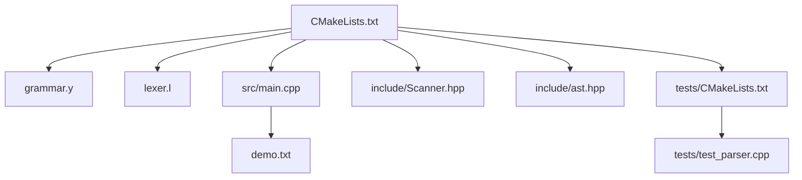
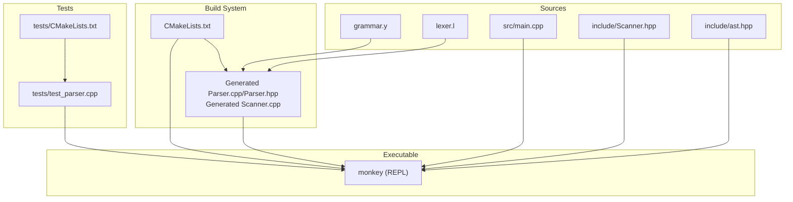
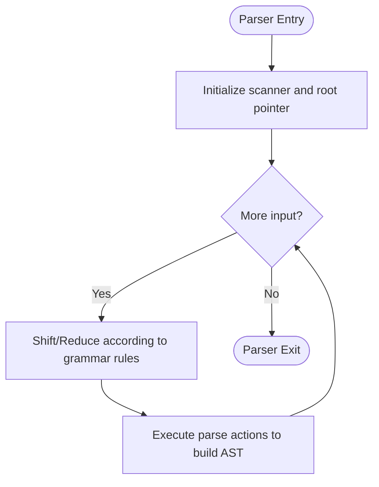
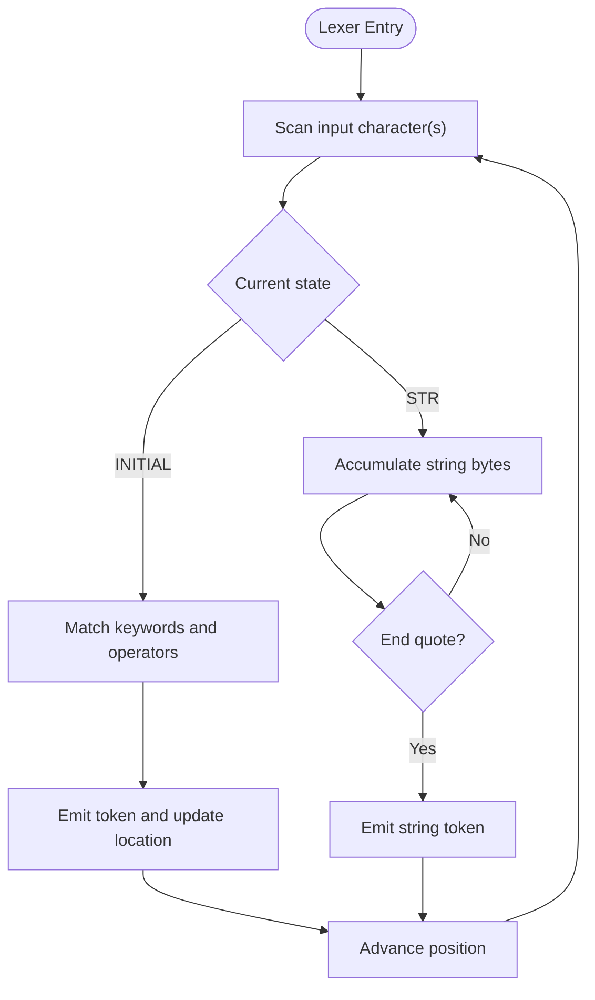
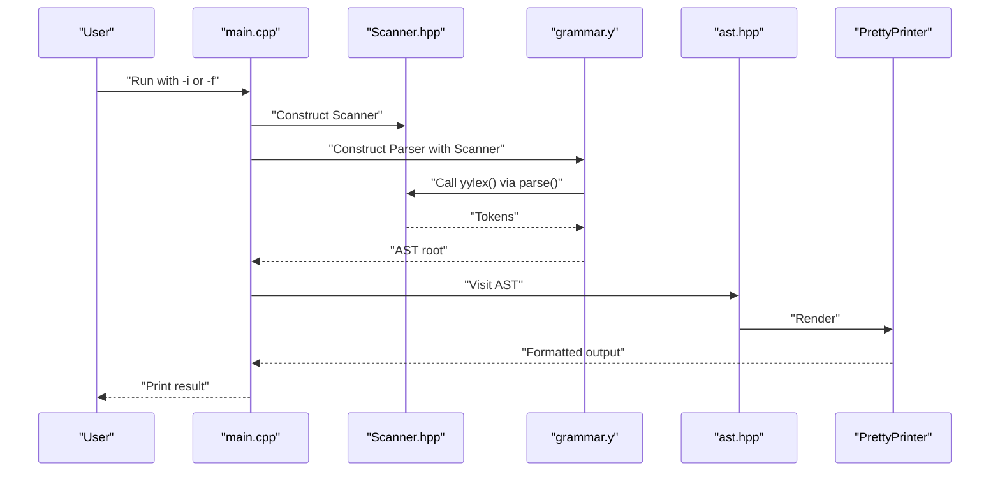
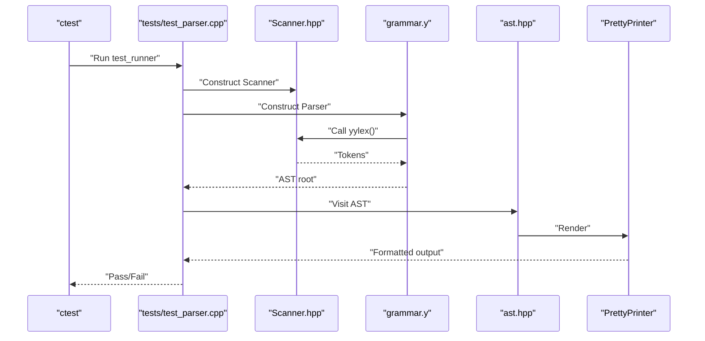
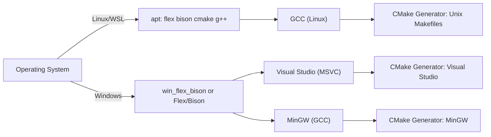

# Getting Started

<cite>
**Referenced Files in This Document**
- [README.md](file://README.md)
- [CMakeLists.txt](file://CMakeLists.txt)
- [grammar.y](file://grammar.y)
- [lexer.l](file://lexer.l)
- [build.bat](file://build.bat)
- [src/main.cpp](file://src/main.cpp)
- [include/Scanner.hpp](file://include/Scanner.hpp)
- [include/ast.hpp](file://include/ast.hpp)
- [tests/test_parser.cpp](file://tests/test_parser.cpp)
- [tests/CMakeLists.txt](file://tests/CMakeLists.txt)
- [demo.txt](file://demo.txt)
</cite>

## Table of Contents
1. [Introduction](#introduction)
2. [Project Structure](#project-structure)
3. [Core Components](#core-components)
4. [Architecture Overview](#architecture-overview)
5. [Detailed Component Analysis](#detailed-component-analysis)
6. [Dependency Analysis](#dependency-analysis)
7. [Performance Considerations](#performance-considerations)
8. [Troubleshooting Guide](#troubleshooting-guide)
9. [Conclusion](#conclusion)
10. [Appendices](#appendices)

## Introduction
This guide helps you install prerequisites, configure your environment, build, and run the Modern Bison project. The project demonstrates a compiler toolchain for the Monkey programming language using Flex and Bison to generate a C++ lexer and parser, then compiles and runs a REPL that parses Monkey input and pretty-prints the resulting AST.

The project supports:
- Linux/WSL with system packages
- Windows with Visual Studio (native toolchain) and MinGW (GCC-based)
- Automated detection of win_flex_bison on Windows
- CMake-driven build with generated sources and tests

## Project Structure
At a high level, the repository contains:
- Grammar and lexer definitions for the Monkey language
- C++ sources for the REPL and AST
- CMake build scripts that integrate Flex/Bison and generate sources
- Tests using the Catch2 framework
- A demo input file for quick verification

**Diagram sources**
- [CMakeLists.txt:1-40](file://CMakeLists.txt#L1-L40)
- [grammar.y:1-129](file://grammar.y#L1-L129)
- [lexer.l:1-100](file://lexer.l#L1-L100)
- [src/main.cpp:1-84](file://src/main.cpp#L1-L84)
- [include/Scanner.hpp:1-44](file://include/Scanner.hpp#L1-L44)
- [include/ast.hpp:1-203](file://include/ast.hpp#L1-L203)
- [tests/CMakeLists.txt:1-22](file://tests/CMakeLists.txt#L1-L22)
- [tests/test_parser.cpp:1-52](file://tests/test_parser.cpp#L1-L52)
- [demo.txt:1-40](file://demo.txt#L1-L40)

**Section sources**
- [CMakeLists.txt:1-40](file://CMakeLists.txt#L1-L40)
- [README.md:14-41](file://README.md#L14-L41)

## Core Components
- Grammar and Parser: The Bison grammar defines tokens, non-terminals, precedence, and actions that construct AST nodes. It integrates with a custom C++ scanner.
- Lexer: The Flex scanner tokenizes input and communicates with the parser via a custom interface.
- REPL: The main program provides an interactive REPL and a file-based mode to parse Monkey code and pretty-print the AST.
- AST and Visitor: The AST nodes represent Monkey constructs, and a visitor prints them in a human-readable form.
- Tests: Automated tests validate parsing behavior using the Catch2 framework.

Key build-time integration:
- CMake locates Flex/Bison, generates Parser.cpp/Parser.hpp and Scanner.cpp, and links them into the executable.
- On Windows, CMake can detect win_flex_bison installed under a specific path.

Verification:
- The README provides commands to build and run the project on Linux/WSL and Windows.
- The demo file contains sample Monkey code to test parsing.

**Section sources**
- [grammar.y:1-129](file://grammar.y#L1-L129)
- [lexer.l:1-100](file://lexer.l#L1-L100)
- [src/main.cpp:1-84](file://src/main.cpp#L1-L84)
- [include/Scanner.hpp:1-44](file://include/Scanner.hpp#L1-L44)
- [include/ast.hpp:1-203](file://include/ast.hpp#L1-L203)
- [tests/test_parser.cpp:1-52](file://tests/test_parser.cpp#L1-L52)
- [README.md:14-41](file://README.md#L14-L41)

## Architecture Overview
The build pipeline integrates Flex and Bison with CMake to generate C++ sources, then compiles and links them into the executable. The REPL consumes input, delegates lexical analysis to the scanner, and parsing to the parser, producing an AST that is pretty-printed.

**Diagram sources**
- [CMakeLists.txt:19-25](file://CMakeLists.txt#L19-L25)
- [grammar.y:21-23](file://grammar.y#L21-L23)
- [lexer.l:21-31](file://lexer.l#L21-L31)
- [src/main.cpp:1-84](file://src/main.cpp#L1-L84)
- [include/Scanner.hpp:1-44](file://include/Scanner.hpp#L1-L44)
- [include/ast.hpp:1-203](file://include/ast.hpp#L1-L203)
- [tests/CMakeLists.txt:1-22](file://tests/CMakeLists.txt#L1-L22)
- [tests/test_parser.cpp:1-52](file://tests/test_parser.cpp#L1-L52)

## Detailed Component Analysis

### Grammar and Parser (Bison)
- Language and version: The grammar targets C++ and declares a minimum Bison version requirement.
- Tokens and non-terminals: Defines tokens for literals, operators, keywords, and punctuation, plus non-terminals representing expressions, statements, blocks, and conditionals.
- Precedence and associativity: Establishes operator precedence and associativity to resolve ambiguities.
- Parse actions: Construct AST nodes and set the root pointer passed from the scanner to the parser.
- Error handling: Provides a custom error handler that prints locations.

**Diagram sources**
- [grammar.y:17-129](file://grammar.y#L17-L129)

**Section sources**
- [grammar.y:8-18](file://grammar.y#L8-L18)
- [grammar.y:41-67](file://grammar.y#L41-L67)
- [grammar.y:71-125](file://grammar.y#L71-L125)
- [grammar.y:127-129](file://grammar.y#L127-L129)

### Lexer (Flex)
- C++ mode and options: Uses C++ lexer generation with interactive mode and custom actions.
- Tokenization: Recognizes integers, floats, strings, keywords, operators, and punctuation.
- Location tracking: Updates positions and tracks string literals with embedded escapes.
- Windows-specific handling: Disables certain headers to avoid conflicts on Windows.

**Diagram sources**
- [lexer.l:19-95](file://lexer.l#L19-L95)

**Section sources**
- [lexer.l:19-31](file://lexer.l#L19-L31)
- [lexer.l:51-94](file://lexer.l#L51-L94)
- [lexer.l:12-16](file://lexer.l#L12-L16)

### REPL and AST
- REPL modes: Supports interactive mode and file-based mode.
- Scanner and parser integration: Creates scanner and parser instances and invokes parse.
- AST pretty-printing: Uses a visitor to render the AST to stdout.
- Demo input: The demo file contains Monkey code to test parsing.

**Diagram sources**
- [src/main.cpp:25-84](file://src/main.cpp#L25-L84)
- [include/Scanner.hpp:13-44](file://include/Scanner.hpp#L13-L44)
- [grammar.y:20-39](file://grammar.y#L20-L39)
- [include/ast.hpp:14-21](file://include/ast.hpp#L14-L21)

**Section sources**
- [src/main.cpp:17-23](file://src/main.cpp#L17-L23)
- [src/main.cpp:58-82](file://src/main.cpp#L58-L82)
- [demo.txt:1-40](file://demo.txt#L1-L40)

### Tests
- Test harness: Uses Catch2 macros to define test cases.
- Parsing pipeline: Constructs scanner and parser, runs parse, and pretty-prints the AST.
- CMake integration: Adds test executable and registers a test target.

**Diagram sources**
- [tests/test_parser.cpp:12-25](file://tests/test_parser.cpp#L12-L25)
- [tests/CMakeLists.txt:2-10](file://tests/CMakeLists.txt#L2-L10)

**Section sources**
- [tests/test_parser.cpp:1-52](file://tests/test_parser.cpp#L1-L52)
- [tests/CMakeLists.txt:1-22](file://tests/CMakeLists.txt#L1-L22)

## Dependency Analysis
- Prerequisites:
  - Linux/WSL: Flex, Bison, CMake, and a C++ compiler.
  - Windows: win_flex_bison (detected automatically by CMake) or Flex/Bison; Visual Studio with Desktop development with C++ workload; or MinGW.
- Toolchain differences:
  - Visual Studio: Uses MSVC toolchain; run from the x64 Native Tools Command Prompt for VS.
  - MinGW: Uses GCC toolchain; pass the MinGW generator to CMake.
  - Native Linux: Uses GCC toolchain via system packages.

**Diagram sources**
- [README.md:16-40](file://README.md#L16-L40)
- [CMakeLists.txt:8-17](file://CMakeLists.txt#L8-L17)

**Section sources**
- [README.md:16-40](file://README.md#L16-L40)
- [CMakeLists.txt:8-17](file://CMakeLists.txt#L8-L17)

## Performance Considerations
- Generated sources: Flex/Bison generate large translation units; expect longer compile times during first build.
- Debug builds: Recommended for development; release builds can improve runtime performance.
- REPL loop: Interactive mode continuously constructs scanner/parser instances; consider batching input for heavy workloads.
- Memory: AST nodes use smart pointers; ensure tests and REPL clean up allocations.

[No sources needed since this section provides general guidance]

## Troubleshooting Guide
Common issues and resolutions:
- CMake cannot find Flex/Bison on Windows:
  - Ensure win_flex_bison is installed and CMake detects it automatically, or set the executable paths manually.
  - Verify the environment path includes the win_flex_bison bin directory.
- Running on Windows with Visual Studio:
  - Use the x64 Native Tools Command Prompt for VS to ensure toolchain variables are configured.
- Running on Windows with MinGW:
  - Pass the MinGW generator to CMake and ensure MinGW is installed and in PATH.
- Build fails due to missing headers:
  - On Windows, ensure the FlexLexer.h header is available (included by win_flex_bison).
- Parser errors:
  - The grammar provides a custom error handler that prints locations; review the error messages to fix input.
- Tests fail:
  - Ensure CMake FetchContent downloads Catch2 and that include paths are correct.

**Section sources**
- [CMakeLists.txt:8-17](file://CMakeLists.txt#L8-L17)
- [README.md:24-40](file://README.md#L24-L40)
- [grammar.y:127-129](file://grammar.y#L127-L129)

## Conclusion
You now have the essentials to install prerequisites, configure your environment, build, and run the Modern Bison project. Use the provided commands for Linux/WSL and Windows, verify the build with the demo input, and explore the REPL and tests. For platform-specific differences, follow the generator and toolchain guidance.

[No sources needed since this section summarizes without analyzing specific files]

## Appendices

### Installation and Build Instructions

- Linux/WSL
  - Install prerequisites: Flex, Bison, CMake, and a C++ compiler.
  - Configure and build:
    - Generate build system and build the project.
    - Run the REPL with interactive mode.
  - References:
    - [README.md:16-22](file://README.md#L16-L22)

- Windows with Visual Studio
  - Install win_flex_bison (or place in the default path detected by CMake).
  - Install Visual Studio with the “Desktop development with C++” workload.
  - Open the x64 Native Tools Command Prompt for VS.
  - Configure and build:
    - Generate build system and build the project.
    - Run the test executable from the build directory.
  - References:
    - [README.md:24-33](file://README.md#L24-L33)
    - [CMakeLists.txt:8-17](file://CMakeLists.txt#L8-L17)

- Windows with MinGW
  - Install MinGW and win_flex_bison.
  - Configure and build:
    - Pass the MinGW generator to CMake.
    - Build the project.
    - Run the executable from the build directory.
  - References:
    - [README.md:35-40](file://README.md#L35-L40)

- Verification Steps
  - Interactive REPL:
    - Run the REPL with the interactive flag and type input; press Ctrl-D to parse and Ctrl-C to exit.
  - File-based parsing:
    - Run the REPL with the file flag and a Monkey input file to parse and pretty-print the AST.
  - Demo input:
    - Use the included demo file to verify parsing behavior.
  - References:
    - [src/main.cpp:17-23](file://src/main.cpp#L17-L23)
    - [src/main.cpp:58-82](file://src/main.cpp#L58-L82)
    - [demo.txt:1-40](file://demo.txt#L1-L40)

- Platform-Specific Notes
  - Visual Studio vs MinGW vs Linux:
    - Visual Studio uses the MSVC toolchain; MinGW uses GCC; Linux uses GCC via system packages.
    - Choose the appropriate generator for CMake and ensure the toolchain is available in PATH.
  - References:
    - [README.md:24-40](file://README.md#L24-L40)