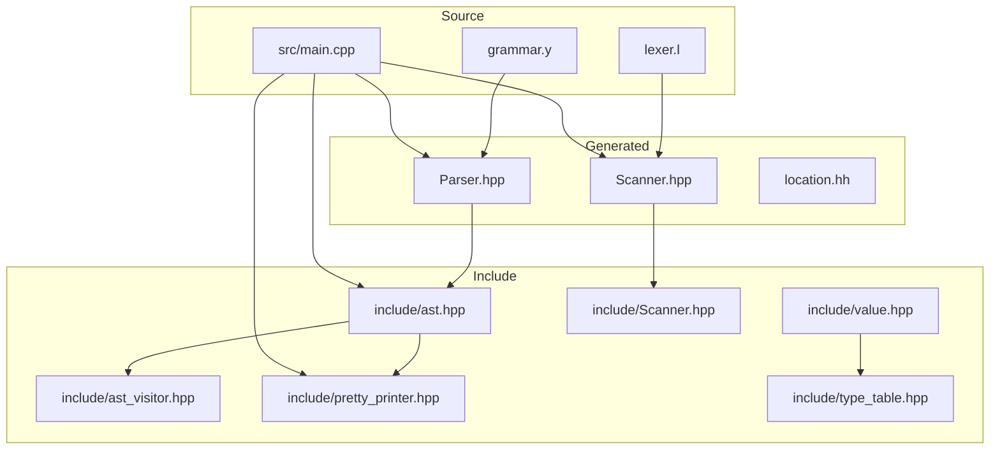
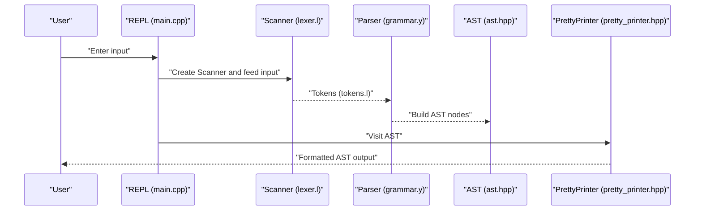
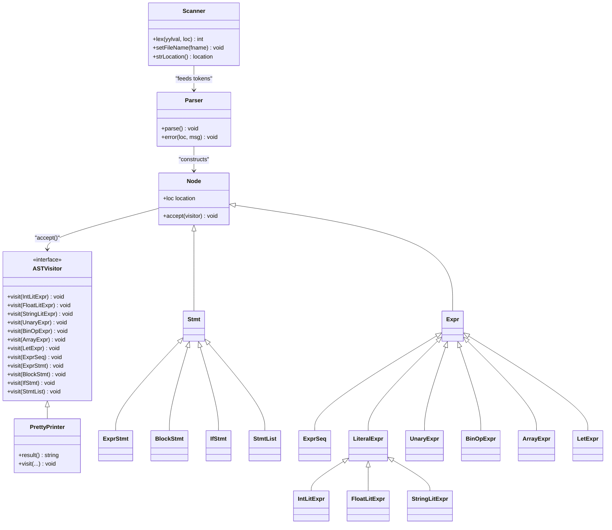
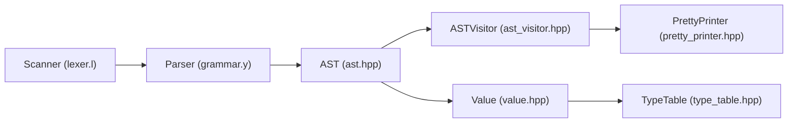

# Language Specification

<cite>
**Referenced Files in This Document**
- [grammar.y](file://grammar.y)
- [lexer.l](file://lexer.l)
- [demo.txt](file://demo.txt)
- [README.md](file://README.md)
- [include/ast.hpp](file://include/ast.hpp)
- [include/Scanner.hpp](file://include/Scanner.hpp)
- [include/pretty_printer.hpp](file://include/pretty_printer.hpp)
- [include/ast_visitor.hpp](file://include/ast_visitor.hpp)
- [include/value.hpp](file://include/value.hpp)
- [include/type_table.hpp](file://include/type_table.hpp)
- [src/main.cpp](file://src/main.cpp)
</cite>

## Table of Contents
1. [Introduction](#introduction)
2. [Project Structure](#project-structure)
3. [Core Components](#core-components)
4. [Architecture Overview](#architecture-overview)
5. [Detailed Component Analysis](#detailed-component-analysis)
6. [Dependency Analysis](#dependency-analysis)
7. [Performance Considerations](#performance-considerations)
8. [Troubleshooting Guide](#troubleshooting-guide)
9. [Conclusion](#conclusion)
10. [Appendices](#appendices)

## Introduction
This document specifies the Monkey programming language implemented with Modern Bison and Flex. It covers the complete grammar, expression syntax, statement types, operator precedence and associativity, lexical rules, supported data types, operators, control flow constructs, and practical examples from the demo file. It also documents parsing rules, precedence tables, and how ambiguities are resolved, along with language limitations, reserved keywords, and naming conventions.

## Project Structure
The project is organized around a generated parser and lexer, with AST nodes and evaluation support in include/, and a simple REPL in src/.

**Diagram sources**
- [grammar.y:1-129](file://grammar.y#L1-L129)
- [lexer.l:1-100](file://lexer.l#L1-L100)
- [src/main.cpp:1-84](file://src/main.cpp#L1-L84)
- [include/ast.hpp:1-203](file://include/ast.hpp#L1-L203)
- [include/Scanner.hpp:1-44](file://include/Scanner.hpp#L1-L44)
- [include/pretty_printer.hpp:1-38](file://include/pretty_printer.hpp#L1-L38)
- [include/ast_visitor.hpp:1-43](file://include/ast_visitor.hpp#L1-L43)
- [include/value.hpp:1-226](file://include/value.hpp#L1-L226)
- [include/type_table.hpp:1-167](file://include/type_table.hpp#L1-L167)

**Section sources**
- [README.md:1-41](file://README.md#L1-L41)
- [src/main.cpp:25-84](file://src/main.cpp#L25-L84)

## Core Components
- Grammar and Parser: Defined in grammar.y, generating a C++ parser with Bison 3.7.4. It defines tokens, non-terminals, precedence, and production rules for expressions, statements, blocks, and if/elif/else constructs.
- Lexer: Defined in lexer.l, using Flex to tokenize input into tokens recognized by the parser. It handles integers, floats, strings, identifiers, keywords, and punctuation.
- AST: Nodes in include/ast.hpp represent parsed constructs (expressions, statements, blocks, if/elif/else) and are visited by pretty printers.
- Scanner: Wrapper around Flex’s lexer in include/Scanner.hpp, providing location tracking and indentation level handling for blocks.
- REPL: src/main.cpp orchestrates interactive and file-based parsing, printing the AST via a pretty printer.

**Section sources**
- [grammar.y:41-129](file://grammar.y#L41-L129)
- [lexer.l:19-95](file://lexer.l#L19-L95)
- [include/ast.hpp:14-203](file://include/ast.hpp#L14-L203)
- [include/Scanner.hpp:13-44](file://include/Scanner.hpp#L13-L44)
- [src/main.cpp:25-84](file://src/main.cpp#L25-L84)

## Architecture Overview
The language pipeline is:
- Input stream -> Flex Scanner -> Bison Parser -> AST -> Pretty Printer

**Diagram sources**
- [src/main.cpp:34-55](file://src/main.cpp#L34-L55)
- [lexer.l:35-94](file://lexer.l#L35-L94)
- [grammar.y:71-125](file://grammar.y#L71-L125)
- [include/ast.hpp:14-203](file://include/ast.hpp#L14-L203)
- [include/pretty_printer.hpp:9-38](file://include/pretty_printer.hpp#L9-L38)

## Detailed Component Analysis

### Lexical Analysis Rules
- Tokens and Reserved Keywords:
  - Keywords: let, fn, for, return, if, else, elif, true, false, and, or, not.
  - Operators: arithmetic (+, -, *, /, %), comparison (<, >, <=, >=, ==, !=), exponentiation (^), factorial (!), assignment (=), grouping ((), [], {}), separators (,), colon (:), dot (.), semicolon (;).
  - Identifiers: start with alphabetic character, followed by alphanumeric or underscore.
  - Strings: delimited by double quotes, with escape sequences handled during scanning.
  - Numbers: integers and floats with optional exponents.
- Token Recognition:
  - Integer and float literals are captured as strings and returned as tokens.
  - Strings are scanned in a separate state, building a buffer and returning a string token with precise locations.
  - Whitespace and comments are skipped; newline increments line counts.
- Location Tracking:
  - The scanner updates positions and tracks string boundaries for accurate error reporting.

**Section sources**
- [lexer.l:21-29](file://lexer.l#L21-L29)
- [lexer.l:35-94](file://lexer.l#L35-L94)
- [include/Scanner.hpp:26-28](file://include/Scanner.hpp#L26-L28)

### Grammar and Precedence
- Non-terminals:
  - program, stmt_list, block_stmt, if_stmt, elif_list, opt_else, stmt, expr_seq, expr.
- Start Symbol:
  - program.
- Precedence and Associativity:
  - Non-associative: ASSIGN
  - Left: OR
  - Left: AND
  - Non-associative: NOT
  - Non-associative: GT, LT, GE, LE, EQ, NOT_EQ
  - Left: PLUS, MINUS
  - Left: MULTIPLY, DIVIDE, MODULO
  - Precedence: UMINUS (unary minus)
  - Precedence: FACTORIAL
  - Right: EXPONENT
- Productions:
  - Program is a statement list.
  - Statements include empty lines, expression statements, blocks, if/elif/else, and error recovery.
  - Expressions include literals, unary minus, arrays, binary operators, let-bindings, and parentheses.
  - If/elif/else chains are modeled with an elif_list and optional else branch.

**Section sources**
- [grammar.y:58-67](file://grammar.y#L58-L67)
- [grammar.y:71-125](file://grammar.y#L71-L125)

### Data Types and Values
- Primitive types:
  - Integer: 64-bit signed integer.
  - Float: 64-bit floating point.
  - Boolean: true/false.
  - Null: null.
- Object types:
  - String: heap-allocated string.
  - List: heap-allocated list.
- Type system:
  - Built-in type IDs and categories are registered in a type table.
  - Values are stored in a variant holding primitives or object pointers, with helpers for truthiness and equality.

**Section sources**
- [include/value.hpp:25-92](file://include/value.hpp#L25-L92)
- [include/type_table.hpp:18-139](file://include/type_table.hpp#L18-L139)

### Operators and Expressions
- Arithmetic:
  - Binary: +, -, *, /, %.
  - Exponentiation: ^ (right associative).
  - Unary minus: - (left associative via UMINUS precedence).
  - Factorial: ! (non-associative).
- Logical:
  - and, or (left associative).
  - not (non-associative).
- Comparison:
  - <, >, <=, >=, ==, != (non-associative).
- Assignment:
  - let x = expr binds a variable to an expression.
- Grouping and Sequences:
  - Parentheses group expressions.
  - Arrays are constructed from expression sequences.

**Section sources**
- [grammar.y:102-123](file://grammar.y#L102-L123)
- [lexer.l:71-77](file://lexer.l#L71-L77)

### Control Flow
- Blocks:
  - Curly braces enclose a statement list; indentation level is tracked by the scanner.
- If/Elif/Else:
  - if_stmt consists of a condition, a truthy block, a chain of elif conditions and blocks, and an optional else block.
- Statement List:
  - A sequence of statements separated by newlines.

**Section sources**
- [grammar.y:79-89](file://grammar.y#L79-L89)
- [grammar.y:174-200](file://grammar.y#L174-L200)
- [lexer.l:82-83](file://lexer.l#L82-L83)

### AST and Visitor Pattern
- AST Nodes:
  - Expressions: literals, unary/binary ops, arrays, let-bindings, expression sequences.
  - Statements: expression statements, blocks, if/elif/else, statement lists.
- Visitor:
  - PrettyPrinter implements ASTVisitor to render the AST as formatted text.

**Section sources**
- [include/ast.hpp:23-203](file://include/ast.hpp#L23-L203)
- [include/ast_visitor.hpp:21-40](file://include/ast_visitor.hpp#L21-L40)
- [include/pretty_printer.hpp:9-38](file://include/pretty_printer.hpp#L9-L38)

### Practical Examples from Demo
The demo illustrates:
- Variable binding with integers and arithmetic expressions.
- String literals and boolean values.
- Arrays containing objects (maps).
- Functions (user-defined and built-in).
- Nested if/else logic and recursion.
- Higher-order functions and closures.

Examples are shown in the demo file and demonstrate correct usage patterns for the language constructs defined by the grammar.

**Section sources**
- [demo.txt:1-40](file://demo.txt#L1-L40)

## Architecture Overview
The language architecture integrates lexical analysis, parsing, AST construction, and pretty printing.

**Diagram sources**
- [include/Scanner.hpp:13-44](file://include/Scanner.hpp#L13-L44)
- [grammar.y:31-39](file://grammar.y#L31-L39)
- [include/ast_visitor.hpp:21-40](file://include/ast_visitor.hpp#L21-L40)
- [include/pretty_printer.hpp:9-38](file://include/pretty_printer.hpp#L9-L38)
- [include/ast.hpp:14-203](file://include/ast.hpp#L14-L203)

## Detailed Component Analysis

### Operator Precedence and Associativity
Precedence levels from highest to lowest:
- UMINUS (unary minus)
- FACTORIAL
- EXPONENT (right)
- MULTIPLY, DIVIDE, MODULO (left)
- PLUS, MINUS (left)
- NOT (non-associative)
- GT, LT, GE, LE, EQ, NOT_EQ (non-associative)
- AND (left)
- OR (left)
- ASSIGN (non-associative)

Associativity and precedence resolve conflicts such as:
- Binary operators are left-associative except exponentiation, which is right-associative.
- Unary minus binds tightly via UMINUS.
- Logical and comparison operators are non-associative to avoid ambiguous chains.

**Section sources**
- [grammar.y:58-67](file://grammar.y#L58-L67)

### Parsing Rules and Ambiguity Resolution
- Expression parsing:
  - Parentheses override precedence.
  - Unary minus is parsed as a prefix operator with UMINUS precedence.
  - Factorial is parsed as postfix and non-associative.
- If/elif/else:
  - The grammar uses a dedicated elif_list and optional else branch to avoid shift/reduce conflicts.
- Error Recovery:
  - The grammar includes an error token with newline recovery to continue parsing after syntax errors.

**Section sources**
- [grammar.y:105-123](file://grammar.y#L105-L123)
- [grammar.y:84-89](file://grammar.y#L84-L89)
- [grammar.y:95](file://grammar.y#L95)

### Lexical Rules Summary
- Identifiers: alphabetic start, followed by alphanumeric or underscore.
- Strings: double-quoted with escape sequences handled during scanning.
- Numbers: integers and floats with optional fractional and exponential parts.
- Keywords and operators: matched by explicit rules and returned as tokens.

**Section sources**
- [lexer.l:21-29](file://lexer.l#L21-L29)
- [lexer.l:51-64](file://lexer.l#L51-L64)
- [lexer.l:71-88](file://lexer.l#L71-L88)

### AST Construction and Visitor
- The parser constructs AST nodes for expressions and statements.
- PrettyPrinter traverses the AST to produce human-readable output.

**Section sources**
- [grammar.y:71-125](file://grammar.y#L71-L125)
- [include/pretty_printer.hpp:9-38](file://include/pretty_printer.hpp#L9-L38)

### REPL Integration
- Interactive mode reads from stdin, parses each input into an AST, and prints it.
- File mode reads from a given file and prints the AST.

**Section sources**
- [src/main.cpp:32-55](file://src/main.cpp#L32-L55)
- [src/main.cpp:58-82](file://src/main.cpp#L58-L82)

## Dependency Analysis
- Parser depends on Scanner for tokens and location tracking.
- AST nodes depend on the visitor interface for pretty printing.
- Value and type table support runtime typing and object representation.

**Diagram sources**
- [lexer.l:35-94](file://lexer.l#L35-L94)
- [grammar.y:71-125](file://grammar.y#L71-L125)
- [include/ast.hpp:14-203](file://include/ast.hpp#L14-L203)
- [include/ast_visitor.hpp:21-40](file://include/ast_visitor.hpp#L21-L40)
- [include/pretty_printer.hpp:9-38](file://include/pretty_printer.hpp#L9-L38)
- [include/value.hpp:25-92](file://include/value.hpp#L25-L92)
- [include/type_table.hpp:48-144](file://include/type_table.hpp#L48-L144)

**Section sources**
- [grammar.y:31-39](file://grammar.y#L31-L39)
- [include/ast.hpp:14-203](file://include/ast.hpp#L14-L203)
- [include/value.hpp:25-92](file://include/value.hpp#L25-L92)
- [include/type_table.hpp:48-144](file://include/type_table.hpp#L48-L144)

## Performance Considerations
- Tokenization is linear in input length; string scanning uses a buffer and a separate state to minimize overhead.
- Parsing uses deterministic LR-style rules; precedence tables guide reductions efficiently.
- AST traversal for pretty printing is O(N) in the number of nodes.
- No explicit optimizations are present in the grammar or lexer; performance is adequate for a learning compiler.

[No sources needed since this section provides general guidance]

## Troubleshooting Guide
- Parsing errors:
  - The parser reports errors with location information; use the printed location to identify problematic input.
- Unexpected EOF:
  - Ensure balanced delimiters (parentheses, brackets, braces) and complete statements.
- Indentation and blocks:
  - The scanner tracks indentation for braces; mismatched blocks cause parsing failures.
- Type mismatches:
  - The type table and value system distinguish primitives and objects; ensure operations match expected types.

**Section sources**
- [grammar.y:127-129](file://grammar.y#L127-L129)
- [lexer.l:82-83](file://lexer.l#L82-L83)
- [include/value.hpp:25-92](file://include/value.hpp#L25-L92)
- [include/type_table.hpp:18-139](file://include/type_table.hpp#L18-L139)

## Conclusion
The Monkey language specification implemented here defines a small but expressive subset suitable for experimentation. The grammar, lexer, and AST are cleanly separated, with clear precedence rules and robust error reporting. The demo showcases typical usage patterns, and the REPL enables rapid iteration on language features.

[No sources needed since this section summarizes without analyzing specific files]

## Appendices

### Reserved Keywords
- let, fn, for, return, if, else, elif, true, false, and, or, not.

**Section sources**
- [lexer.l:53-64](file://lexer.l#L53-L64)

### Identifier Conventions
- Must start with an alphabetic character and may include alphanumeric characters and underscores.

**Section sources**
- [lexer.l:29](file://lexer.l#L29)

### Numeric Formats
- Integers: decimal digits.
- Floats: optional fractional part and optional exponent.

**Section sources**
- [lexer.l:27-28](file://lexer.l#L27-L28)

### Practical Examples Index
- Variables and arithmetic: [demo.txt:1](file://demo.txt#L1)
- Strings and booleans: [demo.txt:3-8](file://demo.txt#L3-L8)
- Arrays and maps: [demo.txt:9-11](file://demo.txt#L9-L11)
- Functions and closures: [demo.txt:13-39](file://demo.txt#L13-L39)