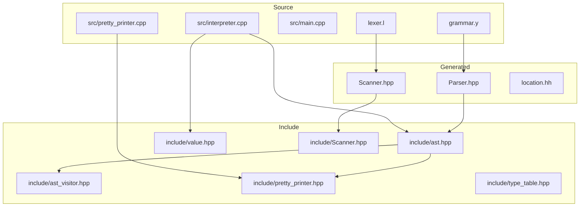
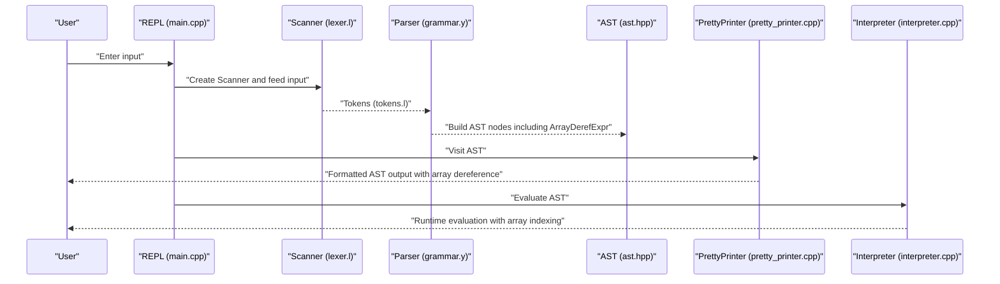
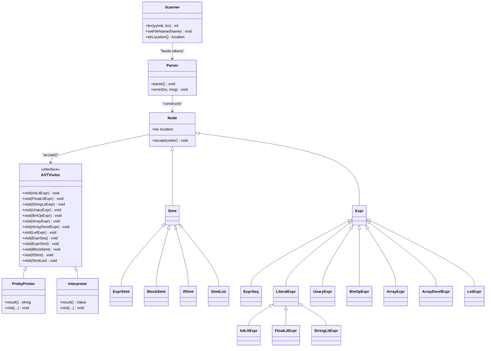
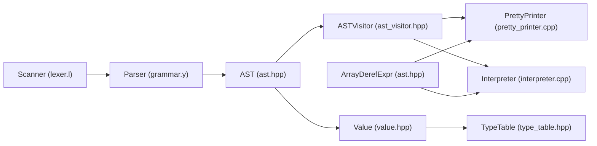

# Language Specification

<cite>
**Referenced Files in This Document**
- [grammar.y](file://grammar.y)
- [lexer.l](file://lexer.l)
- [demo.txt](file://demo.txt)
- [README.md](file://README.md)
- [include/ast.hpp](file://include/ast.hpp)
- [include/Scanner.hpp](file://include/Scanner.hpp)
- [include/pretty_printer.hpp](file://include/pretty_printer.hpp)
- [include/ast_visitor.hpp](file://include/ast_visitor.hpp)
- [include/value.hpp](file://include/value.hpp)
- [include/type_table.hpp](file://include/type_table.hpp)
- [src/main.cpp](file://src/main.cpp)
- [src/pretty_printer.cpp](file://src/pretty_printer.cpp)
- [src/interpreter.cpp](file://src/interpreter.cpp)
- [tests/test_interpreter.cpp](file://tests/test_interpreter.cpp)
- [tests/test_parser.cpp](file://tests/test_parser.cpp)
</cite>

## Update Summary
**Changes Made**
- Added comprehensive documentation for the new ArrayDerefExpr implementation
- Updated operator precedence and associativity sections to include array dereference expressions
- Enhanced AST and interpreter documentation to cover array indexing functionality
- Added practical examples demonstrating array dereference syntax and usage patterns
- Updated grammar rules to reflect the new ARRAY_DEREF precedence level

## Table of Contents
1. [Introduction](#introduction)
2. [Project Structure](#project-structure)
3. [Core Components](#core-components)
4. [Architecture Overview](#architecture-overview)
5. [Detailed Component Analysis](#detailed-component-analysis)
6. [Dependency Analysis](#dependency-analysis)
7. [Performance Considerations](#performance-considerations)
8. [Troubleshooting Guide](#troubleshooting-guide)
9. [Conclusion](#conclusion)
10. [Appendices](#appendices)

## Introduction
This document specifies the Monkey programming language implemented with Modern Bison and Flex. It covers the complete grammar, expression syntax, statement types, operator precedence and associativity, lexical rules, supported data types, operators, control flow constructs, and practical examples from the demo file. It also documents parsing rules, precedence tables, and how ambiguities are resolved, along with language limitations, reserved keywords, and naming conventions.

**Updated** Added comprehensive documentation for the new ArrayDerefExpr implementation - array dereference expressions (a[0], arr[index], matrix[i][j]) with proper precedence handling and runtime validation.

## Project Structure
The project is organized around a generated parser and lexer, with AST nodes and evaluation support in include/, and a simple REPL in src/.

**Diagram sources**
- [grammar.y:1-132](file://grammar.y#L1-L132)
- [lexer.l:1-100](file://lexer.l#L1-L100)
- [src/main.cpp:1-81](file://src/main.cpp#L1-L81)
- [src/pretty_printer.cpp:1-107](file://src/pretty_printer.cpp#L1-L107)
- [src/interpreter.cpp:1-265](file://src/interpreter.cpp#L1-L265)
- [include/ast.hpp:1-214](file://include/ast.hpp#L1-L214)
- [include/Scanner.hpp:1-40](file://include/Scanner.hpp#L1-L40)
- [include/pretty_printer.hpp:1-38](file://include/pretty_printer.hpp#L1-L38)
- [include/ast_visitor.hpp:1-43](file://include/ast_visitor.hpp#L1-L43)
- [include/value.hpp:1-226](file://include/value.hpp#L1-L226)
- [include/type_table.hpp:1-167](file://include/type_table.hpp#L1-L167)

**Section sources**
- [README.md:1-41](file://README.md#L1-L41)
- [src/main.cpp:23-81](file://src/main.cpp#L23-L81)

## Core Components
- Grammar and Parser: Defined in grammar.y, generating a C++ parser with Bison 3.7.4. It defines tokens, non-terminals, precedence, and production rules for expressions, statements, blocks, and if/elif/else constructs. **Updated** Now includes comprehensive array dereference support through the ArrayDerefExpr AST node and proper precedence handling.
- Lexer: Defined in lexer.l, using Flex to tokenize input into tokens recognized by the parser. It handles integers, floats, strings, identifiers, keywords, and punctuation. **Updated** Recognizes "let" as a reserved keyword token.
- AST: Nodes in include/ast.hpp represent parsed constructs (expressions, statements, blocks, if/elif/else, **Updated** including ArrayDerefExpr for array indexing) and are visited by pretty printers and interpreters.
- Scanner: Wrapper around Flex's lexer in include/Scanner.hpp, providing location tracking and indentation level handling for blocks.
- REPL: src/main.cpp orchestrates interactive and file-based parsing, printing the AST via a pretty printer. **Updated** Pretty printer now handles ArrayDerefExpr nodes with proper formatting.
- Interpreter: src/interpreter.cpp evaluates AST nodes including ArrayDerefExpr with runtime validation for array indexing operations.

**Section sources**
- [grammar.y:41-132](file://grammar.y#L41-L132)
- [lexer.l:19-95](file://lexer.l#L19-L95)
- [include/ast.hpp:130-140](file://include/ast.hpp#L130-L140)
- [include/Scanner.hpp:13-40](file://include/Scanner.hpp#L13-L40)
- [src/main.cpp:23-81](file://src/main.cpp#L23-L81)
- [src/pretty_printer.cpp:51-56](file://src/pretty_printer.cpp#L51-L56)
- [src/interpreter.cpp:188-207](file://src/interpreter.cpp#L188-L207)

## Architecture Overview
The language pipeline is:
- Input stream -> Flex Scanner -> Bison Parser -> AST -> Pretty Printer/Interpreter

**Diagram sources**
- [src/main.cpp:32-55](file://src/main.cpp#L32-L55)
- [lexer.l:35-94](file://lexer.l#L35-L94)
- [grammar.y:108](file://grammar.y#L108)
- [include/ast.hpp:130-140](file://include/ast.hpp#L130-L140)
- [src/pretty_printer.cpp:51-56](file://src/pretty_printer.cpp#L51-L56)
- [src/interpreter.cpp:188-207](file://src/interpreter.cpp#L188-L207)

## Detailed Component Analysis

### Lexical Analysis Rules
- Tokens and Reserved Keywords:
  - Keywords: **Updated** let, fn, for, return, if, else, elif, true, false, and, or, not.
  - Operators: arithmetic (+, -, *, /, %), comparison (<, >, <=, >=, ==, !=), exponentiation (^), factorial (!), assignment (=), grouping ((), [], {}), separators (,), colon (:), dot (.), semicolon (;).
  - Identifiers: start with alphabetic character, followed by alphanumeric or underscore.
  - Strings: delimited by double quotes, with escape sequences handled during scanning.
  - Numbers: integers and floats with optional exponents.
- Token Recognition:
  - Integer and float literals are captured as strings and returned as tokens.
  - Strings are scanned in a separate state, building a buffer and returning a string token with precise locations.
  - Whitespace and comments are skipped; newline increments line counts.
- Location Tracking:
  - The scanner updates positions and tracks string boundaries for accurate error reporting.

**Section sources**
- [lexer.l:21-29](file://lexer.l#L21-L29)
- [lexer.l:35-94](file://lexer.l#L35-L94)
- [include/Scanner.hpp:26-28](file://include/Scanner.hpp#L26-L28)

### Grammar and Precedence
- Non-terminals:
  - program, stmt_list, block_stmt, if_stmt, elif_list, opt_else, stmt, expr_seq, expr.
- Start Symbol:
  - program.
- Precedence and Associativity:
  - Non-associative: ASSIGN
  - Left: OR
  - Left: AND
  - Non-associative: NOT
  - Non-associative: GT, LT, GE, LE, EQ, NOT_EQ
  - Left: PLUS, MINUS
  - Left: MULTIPLY, DIVIDE, MODULO
  - Precedence: UMINUS (unary minus)
  - Precedence: FACTORIAL
  - Right: EXPONENT
  - **Updated** Precedence: ARRAY_DEREF (array dereference)
- Productions:
  - Program is a statement list.
  - Statements include empty lines, expression statements, blocks, if/elif/else, and error recovery.
  - **Updated** Expressions include literals, unary minus, arrays, binary operators, **Updated** let-bindings, array dereference expressions, and parentheses.
  - If/elif/else chains are modeled with an elif_list and optional else branch.

**Updated** The grammar now includes comprehensive array dereference support through the production rule `expr LBRACKET expr RBRACKET %prec ARRAY_DEREF` that creates ArrayDerefExpr nodes.

**Section sources**
- [grammar.y:58-68](file://grammar.y#L58-L68)
- [grammar.y:71-132](file://grammar.y#L71-L132)
- [grammar.y:108](file://grammar.y#L108)

### Data Types and Values
- Primitive types:
  - Integer: 64-bit signed integer.
  - Float: 64-bit floating point.
  - Boolean: true/false.
  - Null: null.
- Object types:
  - String: heap-allocated string.
  - List: heap-allocated list.
  - **Updated** Array: heap-allocated array with runtime validation.
- Type system:
  - Built-in type IDs and categories are registered in a type table.
  - Values are stored in a variant holding primitives or object pointers, with helpers for truthiness and equality.
  - **Updated** Array objects store elements with type validation and bounds checking.

**Section sources**
- [include/value.hpp:25-92](file://include/value.hpp#L25-L92)
- [include/type_table.hpp:18-139](file://include/type_table.hpp#L18-L139)

### Operators and Expressions
- Arithmetic:
  - Binary: +, -, *, /, %.
  - Exponentiation: ^ (right associative).
  - Unary minus: - (left associative via UMINUS precedence).
  - Factorial: ! (non-associative).
- Logical:
  - and, or (left associative).
  - not (non-associative).
- Comparison:
  - <, >, <=, >=, ==, != (non-associative).
- **Updated** Array Dereference:
  - Syntax: `target[index]` where target is any expression and index is any expression.
  - **Updated** Precedence: ARRAY_DEREF (higher than logical operators, lower than exponentiation).
  - **Updated** Runtime validation: ensures target is an array, index is an integer, and index is within bounds.
  - **Updated** Chaining: supports nested array dereference like `matrix[i][j]`.
- **Updated** Assignment and Variable Declarations:
  - let x = expr binds a variable to an expression.
  - let statements can declare variables with any expression value including literals, function calls, arrays, array dereference expressions, and complex expressions.
- Grouping and Sequences:
  - Parentheses group expressions.
  - Arrays are constructed from expression sequences.

**Updated** Added comprehensive documentation for array dereference expressions including syntax, precedence, and runtime validation.

**Section sources**
- [grammar.y:108](file://grammar.y#L108)
- [lexer.l:71-77](file://lexer.l#L71-L77)
- [grammar.y:121](file://grammar.y#L121)
- [src/interpreter.cpp:188-207](file://src/interpreter.cpp#L188-L207)

### Control Flow
- Blocks:
  - Curly braces enclose a statement list; indentation level is tracked by the scanner.
- If/Elif/Else:
  - if_stmt consists of a condition, a truthy block, a chain of elif conditions and blocks, and an optional else block.
- Statement List:
  - A sequence of statements separated by newlines.

**Section sources**
- [grammar.y:79-89](file://grammar.y#L79-L89)
- [grammar.y:174-200](file://grammar.y#L174-L200)
- [lexer.l:82-83](file://lexer.l#L82-L83)

### AST and Visitor Pattern
- AST Nodes:
  - **Updated** Expressions: literals, unary/binary ops, arrays, **Updated** let-bindings, **Updated** array dereference expressions, expression sequences.
  - Statements: expression statements, blocks, if/elif/else, statement lists.
- **Updated** ArrayDerefExpr Node:
  - New AST node type for array indexing operations.
  - Contains target expression pointer and index expression pointer.
  - Supports both raw pointers and unique_ptr variants for flexibility.
  - **Updated** Used in grammar rule: `expr LBRACKET expr RBRACKET %prec ARRAY_DEREF`.
- **Updated** LetExpr Node:
  - New AST node type for let statement declarations.
  - Contains identifier string and value expression pointer.
  - Supports both raw pointers and unique_ptr variants for flexibility.
- Visitor:
  - PrettyPrinter implements ASTVisitor to render the AST as formatted text, **Updated** including proper formatting for array dereference expressions as `TARGET[INDEX]`.

**Updated** Added comprehensive documentation for the new ArrayDerefExpr AST node and its integration into the visitor pattern.

**Section sources**
- [include/ast.hpp:130-140](file://include/ast.hpp#L130-L140)
- [include/ast.hpp:150-159](file://include/ast.hpp#L150-L159)
- [include/ast_visitor.hpp:21-43](file://include/ast_visitor.hpp#L21-L43)
- [include/pretty_printer.hpp:9-38](file://include/pretty_printer.hpp#L9-L38)
- [src/pretty_printer.cpp:51-56](file://src/pretty_printer.cpp#L51-L56)

### Practical Examples from Demo
The demo illustrates:
- **Updated** Variable binding with integers and arithmetic expressions using let statements.
- String literals and boolean values.
- Arrays containing objects (maps).
- Functions (user-defined and built-in).
- Nested if/else logic and recursion.
- Higher-order functions and closures.
- **Updated** Complex let statement usage including function assignments and closure creation.
- **Updated** Array dereference expressions with variable indexing and function calls.

**Updated** Enhanced demo examples now showcase the full capabilities of the new array dereference syntax.

Examples are shown in the demo file and demonstrate correct usage patterns for the language constructs defined by the grammar, including comprehensive array dereference examples.

**Section sources**
- [demo.txt:1-40](file://demo.txt#L1-L40)

### Runtime Validation and Error Handling
- **Updated** Array dereference validation:
  - Ensures target expression evaluates to an array object.
  - Validates that index expression is an integer type.
  - Performs bounds checking to prevent out-of-range access.
  - Throws descriptive runtime errors for invalid operations.
- **Updated** Error messages:
  - "Cannot index non-array value" for non-array targets.
  - "Array index must be an integer" for non-integer indices.
  - "Array index out of bounds" for invalid index ranges.
- **Updated** Test coverage:
  - Comprehensive test suite validates all array dereference scenarios.
  - Tests cover basic indexing, expression-based indices, chaining, and error cases.

**Updated** Added comprehensive runtime validation documentation for array dereference operations.

**Section sources**
- [src/interpreter.cpp:188-207](file://src/interpreter.cpp#L188-L207)
- [tests/test_interpreter.cpp:340-392](file://tests/test_interpreter.cpp#L340-L392)

## Architecture Overview
The language architecture integrates lexical analysis, parsing, AST construction, and pretty printing with comprehensive array dereference support.

**Updated** Added ArrayDerefExpr to the class diagram to reflect the new AST node type.

**Diagram sources**
- [include/Scanner.hpp:13-40](file://include/Scanner.hpp#L13-L40)
- [grammar.y:31-39](file://grammar.y#L31-L39)
- [include/ast_visitor.hpp:21-43](file://include/ast_visitor.hpp#L21-L43)
- [include/pretty_printer.hpp:9-38](file://include/pretty_printer.hpp#L9-L38)
- [include/ast.hpp:130-159](file://include/ast.hpp#L130-L159)
- [src/interpreter.cpp:188-207](file://src/interpreter.cpp#L188-L207)

## Detailed Component Analysis

### Operator Precedence and Associativity
Precedence levels from highest to lowest:
- UMINUS (unary minus)
- FACTORIAL
- EXPONENT (right)
- MULTIPLY, DIVIDE, MODULO (left)
- PLUS, MINUS (left)
- NOT (non-associative)
- GT, LT, GE, LE, EQ, NOT_EQ (non-associative)
- AND (left)
- OR (left)
- **Updated** ARRAY_DEREF (array dereference)
- ASSIGN (non-associative)

Associativity and precedence resolve conflicts such as:
- Binary operators are left-associative except exponentiation, which is right-associative.
- Unary minus binds tightly via UMINUS.
- Logical and comparison operators are non-associative to avoid ambiguous chains.
- **Updated** Array dereference has higher precedence than logical operators but lower than exponentiation, allowing expressions like `arr[0] and true` to be parsed correctly.

**Section sources**
- [grammar.y:58-68](file://grammar.y#L58-L68)

### Parsing Rules and Ambiguity Resolution
- Expression parsing:
  - Parentheses override precedence.
  - Unary minus is parsed as a prefix operator with UMINUS precedence.
  - Factorial is parsed as postfix and non-associative.
  - **Updated** Array dereference is parsed using the ARRAY_DEREF precedence rule: `expr LBRACKET expr RBRACKET %prec ARRAY_DEREF`.
  - **Updated** Let statements are parsed as expressions using the production rule `LET Ident ASSIGN expr`.
- If/elif/else:
  - The grammar uses a dedicated elif_list and optional else branch to avoid shift/reduce conflicts.
- Error Recovery:
  - The grammar includes an error token with newline recovery to continue parsing after syntax errors.

**Updated** Added documentation for array dereference parsing rules and how they integrate with the existing grammar.

**Section sources**
- [grammar.y:108](file://grammar.y#L108)
- [grammar.y:121](file://grammar.y#L121)
- [grammar.y:84-89](file://grammar.y#L84-L89)
- [grammar.y:95](file://grammar.y#L95)

### Lexical Rules Summary
- Identifiers: alphabetic start, followed by alphanumeric or underscore.
- Strings: double-quoted with escape sequences handled during scanning.
- Numbers: integers and floats with optional fractional and exponential parts.
- **Updated** Keywords and operators: matched by explicit rules and returned as tokens, **Updated** including "let" as a reserved keyword.

**Updated** Enhanced lexical rules to include the new let keyword token.

**Section sources**
- [lexer.l:21-29](file://lexer.l#L21-L29)
- [lexer.l:51-64](file://lexer.l#L51-L64)
- [lexer.l:71-88](file://lexer.l#L71-L88)
- [lexer.l:53](file://lexer.l#L53)

### AST Construction and Visitor
- The parser constructs AST nodes for expressions and statements, **Updated** including ArrayDerefExpr nodes for array indexing operations.
- PrettyPrinter traverses the AST to produce human-readable output, **Updated** with proper formatting for array dereference expressions as `TARGET[INDEX]`.
- **Updated** Interpreter evaluates ArrayDerefExpr nodes with runtime validation, ensuring safe array access operations.

**Updated** Enhanced AST construction and visitor documentation to include ArrayDerefExpr handling.

**Section sources**
- [grammar.y:108](file://grammar.y#L108)
- [include/pretty_printer.hpp:9-38](file://include/pretty_printer.hpp#L9-L38)
- [src/pretty_printer.cpp:51-56](file://src/pretty_printer.cpp#L51-L56)
- [src/interpreter.cpp:188-207](file://src/interpreter.cpp#L188-L207)

### REPL Integration
- Interactive mode reads from stdin, parses each input into an AST, and prints it.
- File mode reads from a given file and prints the AST.
- **Updated** REPL now properly handles and displays array dereference expressions with correct formatting.
- **Updated** REPL integrates with the interpreter to evaluate array indexing operations at runtime.

**Updated** REPL integration documentation now reflects array dereference support.

**Section sources**
- [src/main.cpp:32-55](file://src/main.cpp#L32-L55)
- [src/main.cpp:58-81](file://src/main.cpp#L58-L81)

## Dependency Analysis
- Parser depends on Scanner for tokens and location tracking.
- AST nodes depend on the visitor interface for pretty printing and interpretation.
- Value and type table support runtime typing and object representation.
- **Updated** Pretty printer depends on ArrayDerefExpr visitor implementation for proper array dereference formatting.
- **Updated** Interpreter depends on ArrayDerefExpr visitor implementation for runtime array indexing evaluation.

**Updated** Added dependency information for the new ArrayDerefExpr node and its visitor implementations.

**Diagram sources**
- [lexer.l:35-94](file://lexer.l#L35-L94)
- [grammar.y:108](file://grammar.y#L108)
- [include/ast.hpp:130-140](file://include/ast.hpp#L130-L140)
- [include/ast_visitor.hpp:21-43](file://include/ast_visitor.hpp#L21-L43)
- [include/pretty_printer.hpp:9-38](file://include/pretty_printer.hpp#L9-L38)
- [src/pretty_printer.cpp:51-56](file://src/pretty_printer.cpp#L51-L56)
- [src/interpreter.cpp:188-207](file://src/interpreter.cpp#L188-L207)
- [include/value.hpp:25-92](file://include/value.hpp#L25-L92)
- [include/type_table.hpp:48-144](file://include/type_table.hpp#L48-L144)

**Section sources**
- [grammar.y:31-39](file://grammar.y#L31-L39)
- [include/ast.hpp:130-140](file://include/ast.hpp#L130-L140)
- [include/value.hpp:25-92](file://include/value.hpp#L25-L92)
- [include/type_table.hpp:48-144](file://include/type_table.hpp#L48-L144)

## Performance Considerations
- Tokenization is linear in input length; string scanning uses a buffer and a separate state to minimize overhead.
- Parsing uses deterministic LR-style rules; precedence tables guide reductions efficiently.
- AST traversal for pretty printing is O(N) in the number of nodes.
- **Updated** Array dereference evaluation adds minimal overhead with constant-time validation checks.
- **Updated** Let statement processing adds minimal overhead as it follows the standard expression parsing pattern.
- No explicit optimizations are present in the grammar or lexer; performance is adequate for a learning compiler.

**Updated** Performance considerations now include array dereference processing overhead.

## Troubleshooting Guide
- Parsing errors:
  - The parser reports errors with location information; use the printed location to identify problematic input.
- Unexpected EOF:
  - Ensure balanced delimiters (parentheses, brackets, braces) and complete statements.
  - **Updated** For array dereference expressions, ensure proper syntax: `TARGET[INDEX]` with balanced brackets.
  - **Updated** For let statements, ensure proper syntax: `let IDENTIFIER = EXPRESSION;`
- Indentation and blocks:
  - The scanner tracks indentation for braces; mismatched blocks cause parsing failures.
- Type mismatches:
  - The type table and value system distinguish primitives and objects; ensure operations match expected types.
- **Updated** Array dereference issues:
  - Ensure target expression evaluates to an array object.
  - Verify that index expression is an integer type.
  - Check that index is within valid bounds (0 to array length - 1).
  - **Updated** For chained array dereference like `matrix[i][j]`, ensure intermediate results are arrays.
- **Updated** Let statement issues:
  - Ensure proper identifier naming (alphabetic start, alphanumeric/underscore only).
  - Verify that let statements are terminated with semicolons when used as standalone statements.
  - Check that expression values are valid according to the grammar rules.

**Updated** Added troubleshooting guidance for array dereference and let statement syntax.

**Section sources**
- [grammar.y:127-132](file://grammar.y#L127-L132)
- [lexer.l:82-83](file://lexer.l#L82-L83)
- [include/value.hpp:25-92](file://include/value.hpp#L25-L92)
- [include/type_table.hpp:18-139](file://include/type_table.hpp#L18-L139)
- [src/interpreter.cpp:188-207](file://src/interpreter.cpp#L188-L207)

## Conclusion
The Monkey language specification implemented here defines a small but expressive subset suitable for experimentation. The grammar, lexer, and AST are cleanly separated, with clear precedence rules and robust error reporting. **Updated** The addition of comprehensive array dereference support enhances the language's usability for data manipulation with proper runtime validation. **Updated** The new ArrayDerefExpr implementation provides safe array indexing with bounds checking and descriptive error messages. The demo showcases typical usage patterns, including extensive array dereference examples, and the REPL enables rapid iteration on language features.

**Updated** Enhanced conclusion reflecting the successful integration of array dereference syntax and runtime validation into the language specification.

## Appendices

### Reserved Keywords
- **Updated** let, fn, for, return, if, else, elif, true, false, and, or, not.

**Updated** Added let to the reserved keywords list.

**Section sources**
- [lexer.l:53-64](file://lexer.l#L53-L64)

### Identifier Conventions
- Must start with an alphabetic character and may include alphanumeric characters and underscores.
- **Updated** Valid for let statement identifiers and other identifier contexts.

**Updated** Enhanced identifier conventions to include let statement usage.

**Section sources**
- [lexer.l:29](file://lexer.l#L29)

### Numeric Formats
- Integers: decimal digits.
- Floats: optional fractional part and optional exponent.

**Section sources**
- [lexer.l:27-28](file://lexer.l#L27-L28)

### Practical Examples Index
- **Updated** Variables and arithmetic with let statements: [demo.txt:1](file://demo.txt#L1)
- Strings and booleans: [demo.txt:3-8](file://demo.txt#L3-L8)
- Arrays and maps: [demo.txt:9-11](file://demo.txt#L9-L11)
- Functions and closures: [demo.txt:13-39](file://demo.txt#L13-L39)
- **Updated** Function assignments and closures with let: [demo.txt:14](file://demo.txt#L14), [demo.txt:34-36](file://demo.txt#L34-L36)
- **Updated** Array dereference expressions: [demo.txt:15-16](file://demo.txt#L15-L16)

**Updated** Added comprehensive array dereference examples to the practical examples index.