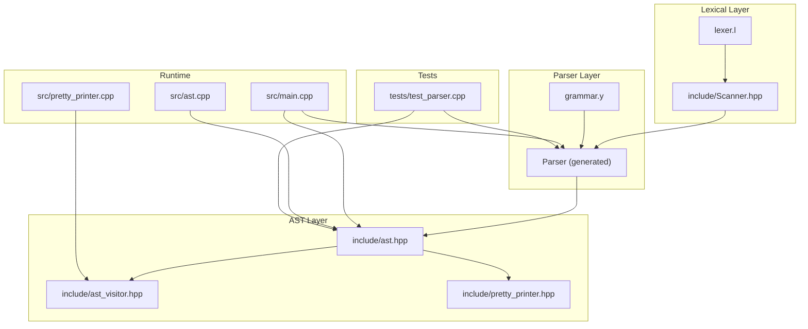
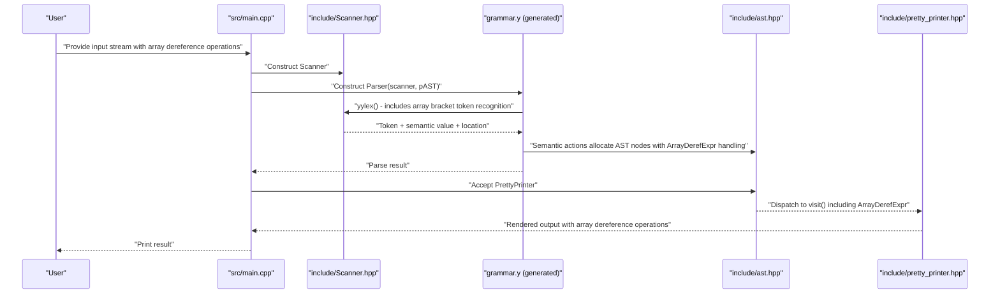
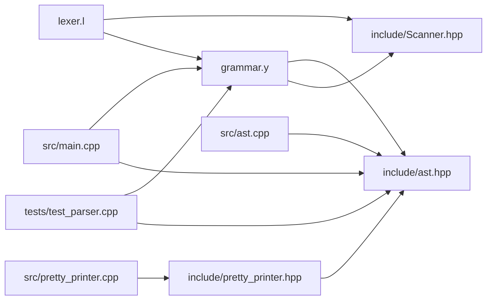

# Parser Implementation

<cite>
**Referenced Files in This Document**
- [grammar.y](file://grammar.y)
- [lexer.l](file://lexer.l)
- [include/ast.hpp](file://include/ast.hpp)
- [include/ast_visitor.hpp](file://include/ast_visitor.hpp)
- [include/Scanner.hpp](file://include/Scanner.hpp)
- [include/pretty_printer.hpp](file://include/pretty_printer.hpp)
- [src/ast.cpp](file://src/ast.cpp)
- [src/pretty_printer.cpp](file://src/pretty_printer.cpp)
- [src/main.cpp](file://src/main.cpp)
- [tests/test_parser.cpp](file://tests/test_parser.cpp)
- [README.md](file://README.md)
- [demo.txt](file://demo.txt)
</cite>

## Update Summary
**Changes Made**
- Added new array dereference grammar rules with %precedence ARRAY_DEREF declaration
- Implemented ArrayDerefExpr AST node type for handling array indexing operations
- Extended visitor pattern to support ArrayDerefExpr in pretty printing
- Added comprehensive test coverage for array dereference functionality
- Updated demo to demonstrate array indexing with dictionary access
- Enhanced grammar to properly handle precedence of array dereference operations

## Table of Contents
1. [Introduction](#introduction)
2. [Project Structure](#project-structure)
3. [Core Components](#core-components)
4. [Architecture Overview](#architecture-overview)
5. [Detailed Component Analysis](#detailed-component-analysis)
6. [Dependency Analysis](#dependency-analysis)
7. [Performance Considerations](#performance-considerations)
8. [Troubleshooting Guide](#troubleshooting-guide)
9. [Conclusion](#conclusion)
10. [Appendices](#appendices)

## Introduction
This document describes the Bison-based parser implementation for a Monkey-like language. It explains the grammar specification, operator precedence and associativity, semantic actions, and how parser actions construct AST nodes. The parser now supports array dereference operations through the new ArrayDerefExpr node type, enabling proper indexing of arrays and dictionaries. It also covers the integration with the AST framework and visitor pattern, conflict resolution strategies, semantic value handling, error recovery, and debugging techniques. Finally, it outlines how to extend the language with new constructs by modifying the grammar.

## Project Structure
The project follows a layered structure:
- Grammar and parser: grammar.y defines the language syntax and semantic actions, including array dereference support through the new ArrayDerefExpr node type.
- Lexer: lexer.l defines tokens and lexical scanning behavior, including array bracket token recognition.
- AST and visitor: include/ast.hpp and include/ast_visitor.hpp define the AST model and visitor interface, including ArrayDerefExpr support.
- Runtime and presentation: src/main.cpp orchestrates parsing and pretty-printing; include/pretty_printer.hpp and src/pretty_printer.cpp implement a pretty-printing visitor with ArrayDerefExpr support.
- Scanner bridge: include/Scanner.hpp connects the lexer to the parser.
- Tests: tests/test_parser.cpp validates parsing behavior including array dereference operations.
- Demo: demo.txt demonstrates language features including array indexing and dictionary access.

**Diagram sources**
- [grammar.y:1-132](file://grammar.y#L1-L132)
- [lexer.l:1-100](file://lexer.l#L1-L100)
- [include/Scanner.hpp:1-40](file://include/Scanner.hpp#L1-L40)
- [include/ast.hpp:1-214](file://include/ast.hpp#L1-L214)
- [include/ast_visitor.hpp:1-47](file://include/ast_visitor.hpp#L1-L47)
- [include/pretty_printer.hpp:1-38](file://include/pretty_printer.hpp#L1-L38)
- [src/ast.cpp:1-62](file://src/ast.cpp#L1-L62)
- [src/pretty_printer.cpp:1-107](file://src/pretty_printer.cpp#L1-L107)
- [src/main.cpp:1-81](file://src/main.cpp#L1-L81)
- [tests/test_parser.cpp:1-105](file://tests/test_parser.cpp#L1-L105)

**Section sources**
- [README.md:1-41](file://README.md#L1-L41)
- [grammar.y:1-132](file://grammar.y#L1-L132)
- [lexer.l:1-100](file://lexer.l#L1-L100)
- [include/ast.hpp:1-214](file://include/ast.hpp#L1-L214)
- [include/ast_visitor.hpp:1-47](file://include/ast_visitor.hpp#L1-L47)
- [include/pretty_printer.hpp:1-38](file://include/pretty_printer.hpp#L1-L38)
- [src/ast.cpp:1-62](file://src/ast.cpp#L1-L62)
- [src/pretty_printer.cpp:1-107](file://src/pretty_printer.cpp#L1-L107)
- [src/main.cpp:1-81](file://src/main.cpp#L1-L81)
- [tests/test_parser.cpp:1-105](file://tests/test_parser.cpp#L1-L105)

## Core Components
- Grammar specification and semantic actions: grammar.y declares tokens, nonterminals, precedence, and production rules with embedded actions that construct AST nodes, including ArrayDerefExpr support for array indexing operations.
- Lexer and scanner bridge: lexer.l defines tokens and lexical actions, including array bracket token recognition for '[' and ']' characters; include/Scanner.hpp adapts Flex to Bison's API.
- AST framework: include/ast.hpp defines the AST node hierarchy and visitor interface, including ArrayDerefExpr node type; src/ast.cpp implements accept() dispatch.
- Visitor pattern: include/pretty_printer.hpp and src/pretty_printer.cpp implement a pretty-printing visitor with ArrayDerefExpr support.
- Runtime orchestration: src/main.cpp parses input streams and pretty-prints the resulting AST.
- Tests: tests/test_parser.cpp validates parsing behavior including array dereference operations.
- Demo: demo.txt demonstrates language features including array indexing and dictionary access.

Key responsibilities:
- grammar.y: Defines language syntax, precedence, and semantic actions that allocate AST nodes including ArrayDerefExpr handling for array indexing and wire them together.
- lexer.l: Tokenizes input and populates semantic values (strings, integers, floats, identifiers), including array bracket token recognition for '[' and ']' characters.
- include/Scanner.hpp: Provides a bridge between Flex and Bison, managing locations and token emission.
- include/ast.hpp: Provides the AST node types including ArrayDerefExpr and visitor contract.
- include/pretty_printer.hpp and src/pretty_printer.cpp: Implement a concrete visitor to render the AST including ArrayDerefExpr pretty-printing.
- src/main.cpp: Integrates scanner, parser, and pretty printer; demonstrates REPL and file modes.
- tests/test_parser.cpp: Exercises the parser with representative inputs including array dereference operations.

**Section sources**
- [grammar.y:1-132](file://grammar.y#L1-L132)
- [lexer.l:1-100](file://lexer.l#L1-L100)
- [include/Scanner.hpp:1-40](file://include/Scanner.hpp#L1-L40)
- [include/ast.hpp:1-214](file://include/ast.hpp#L1-L214)
- [include/ast_visitor.hpp:1-47](file://include/ast_visitor.hpp#L1-L47)
- [include/pretty_printer.hpp:1-38](file://include/pretty_printer.hpp#L1-L38)
- [src/ast.cpp:1-62](file://src/ast.cpp#L1-L62)
- [src/pretty_printer.cpp:1-107](file://src/pretty_printer.cpp#L1-L107)
- [src/main.cpp:1-81](file://src/main.cpp#L1-L81)
- [tests/test_parser.cpp:1-105](file://tests/test_parser.cpp#L1-L105)

## Architecture Overview
The parser pipeline:
- The lexer (Flex) scans input and emits tokens to the parser, including array bracket token recognition for '[' and ']' characters.
- The parser (Bison) recognizes grammar productions and executes semantic actions, including ArrayDerefExpr handling for array indexing operations.
- Semantic actions allocate AST nodes and attach child nodes, properly handling array dereference precedence and associativity.
- The AST is traversed by a visitor (e.g., PrettyPrinter) to produce output, including ArrayDerefExpr pretty-printing.

**Diagram sources**
- [src/main.cpp:23-81](file://src/main.cpp#L23-L81)
- [include/Scanner.hpp:12-40](file://include/Scanner.hpp#L12-L40)
- [grammar.y:68](file://grammar.y#L68)
- [grammar.y:108](file://grammar.y#L108)
- [include/ast.hpp:130-140](file://include/ast.hpp#L130-L140)
- [include/pretty_printer.hpp:1-38](file://include/pretty_printer.hpp#L1-L38)

## Detailed Component Analysis

### Grammar Specification and Precedence
The grammar defines:
- Tokens: literals, operators, keywords, punctuation, and identifiers, including array bracket tokens LBRACKET and RBRACKET.
- Nonterminals: program, stmt_list, block_stmt, if_stmt, elif_list, opt_else, stmt, expr_seq, expr.
- Precedence declarations establish operator precedence and associativity:
  - Nonassociative: assignment, logical not, comparison operators.
  - Left associative: logical or, logical and.
  - Left associative: addition/subtraction.
  - Left associative: multiplication, division, modulo.
  - Right associative: exponentiation.
  - Unary minus precedence and factorial precedence are declared.
  - **New**: Nonassociative precedence for ARRAY_DEREF to handle array indexing operations.
- Start symbol: program.
- Semantic values: variant-based values carry either integer counts (for brace indentation) or strings/values for tokens, and pointers to AST nodes for nonterminals.

**Enhanced** Added ArrayDerefExpr support for proper array and dictionary indexing operations, enabling syntax like `arr[index]` and `obj["key"]`.

Precedence and associativity guide shift/reduce decisions and disambiguate expressions. For example:
- Multiplicative operators bind tighter than additive operators.
- Exponentiation is right-associative, so "a^b^c" groups as "a^(b^c)".
- Assignment operators are nonassociative, preventing chained assignments.
- **New**: Array dereference has nonassociative precedence, preventing ambiguous chained indexing like `a[1][2]` without proper grouping.
- Unary minus binds tightly due to explicit precedence declaration.

Ambiguity resolution:
- Explicit %prec clauses in productions resolve conflicts (e.g., unary minus).
- Error recovery uses %prec and error tokens to recover quickly after syntax errors.
- **New**: ARRAY_DEREF precedence prevents ambiguous array indexing chains.

Examples of grammar rules and semantic actions:
- Program root sets the global AST pointer to the statement list.
- Statement lists accumulate statements.
- Blocks capture indentation level and wrap a statement list.
- If/elif/else constructs assemble condition, branch blocks, and optional else.
- Expressions handle literals, arrays, unary ops, binary ops, assignments, parentheses, grouping, let statements, and **new** array dereference operations.
- **Enhanced**: Array dereference creates ArrayDerefExpr nodes with proper target and index handling.

**Section sources**
- [grammar.y:41-69](file://grammar.y#L41-L69)
- [grammar.y:71-126](file://grammar.y#L71-L126)
- [grammar.y:68](file://grammar.y#L68)
- [grammar.y:108](file://grammar.y#L108)

### Lexer and Tokenization
The lexer:
- Uses Flex rules to recognize integers, floats, strings, keywords, operators, and punctuation, including array bracket token recognition for '[' and ']' characters.
- Manages string literal scanning with a separate state and builds the string buffer.
- Tracks locations via positions and updates the Bison location object.
- Emits tokens with semantic values (e.g., strings for identifiers and literals, integers for brace counts).

**Enhanced** Added array bracket token recognition with dedicated rules `"[" { return Parser::token::LBRACKET; }` and `"]" { return Parser::token::RBRACKET; }` to properly handle array indexing operations.

Key behaviors:
- Whitespace and comments are skipped.
- Indentation is tracked by counting braces; the scanner passes the indentation level to the parser.
- EOF is recognized and returned as a terminal.
- **Enhanced**: The lexer now recognizes '[' and ']' characters as LBRACKET and RBRACKET tokens, enabling proper array dereference parsing.
- **Enhanced**: Dictionary access syntax is supported through the same bracket mechanism.

**Section sources**
- [lexer.l:19-94](file://lexer.l#L19-L94)
- [lexer.l:80-81](file://lexer.l#L80-L81)
- [include/Scanner.hpp:12-40](file://include/Scanner.hpp#L12-L40)

### AST Framework and Visitor Pattern
The AST hierarchy:
- Base node types: Node, Expr, Stmt, and specialized variants for expressions and statements.
- Expression nodes: LiteralExpr (IntLitExpr, FloatLitExpr, StringLitExpr), UnaryExpr, BinOpExpr, ArrayExpr, **ArrayDerefExpr**, LetExpr.
- Statement nodes: ExprStmt, BlockStmt, IfStmt, StmtList, ElifList.
- Visitor interface: ASTVisitor defines virtual visit methods for each node type, including ArrayDerefExpr.

**Enhanced** Added ArrayDerefExpr node type to handle array and dictionary indexing operations with proper AST representation.

Visitor pattern:
- Each node implements accept(ASTVisitor&) to dispatch to the corresponding visit method.
- PrettyPrinter implements a concrete visitor to render the AST to a string, including ArrayDerefExpr pretty-printing.

Integration:
- Parser actions allocate AST nodes including ArrayDerefExpr handling and wire them together.
- After parsing, the AST is traversed by a visitor to produce output, including ArrayDerefExpr pretty-printing.

**Section sources**
- [include/ast.hpp:130-140](file://include/ast.hpp#L130-L140)
- [include/ast_visitor.hpp:15](file://include/ast_visitor.hpp#L15)
- [include/ast_visitor.hpp:35](file://include/ast_visitor.hpp#L35)
- [src/ast.cpp:28](file://src/ast.cpp#L28)
- [include/pretty_printer.hpp:1-38](file://include/pretty_printer.hpp#L1-L38)
- [src/pretty_printer.cpp:51-56](file://src/pretty_printer.cpp#L51-L56)

### Semantic Value Handling and Type Checking Integration
Semantic values:
- Variant-based values carry either integer counts (brace indentation) or strings/values for tokens.
- Nonterminal values are pointers to AST nodes, enabling tree construction in actions.

**Enhanced** ArrayDerefExpr semantic actions now handle array indexing values and properly distinguish them from other operations.

Type checking integration:
- The AST nodes carry typed semantic information (e.g., literal strings, identifiers).
- While the current grammar does not enforce type checking in actions, the AST structure supports future type checks by adding typed fields and validation routines.
- **Enhanced**: ArrayDerefExpr nodes properly store both target and index values for array/dictionary access operations.

**Section sources**
- [grammar.y:14-15](file://grammar.y#L14-L15)
- [grammar.y:41-56](file://grammar.y#L41-L56)
- [grammar.y:108](file://grammar.y#L108)
- [lexer.l:51-52](file://lexer.l#L51-L52)
- [lexer.l:90](file://lexer.l#L90)
- [include/ast.hpp:130-140](file://include/ast.hpp#L130-L140)

### Parser Actions and AST Construction
Parser actions:
- Construct AST nodes in semantic actions for each production, including ArrayDerefExpr handling for array indexing operations.
- Pass location information to nodes for precise diagnostics.
- Build composite structures like StmtList, ExprSeq, ElifList, and IfStmt.

**Enhanced** Added ArrayDerefExpr handling in semantic actions for proper array dereference parsing.

Examples:
- Program sets the root pointer to the parsed statement list.
- Statement list accumulates statements and ignores nulls.
- Block captures indentation level and wraps a statement list.
- If/elif/else constructs assemble condition, branch blocks, and optional else.
- Expressions create literal, unary, binary, array, and **new** array dereference nodes.
- **Enhanced**: Array dereference creates ArrayDerefExpr nodes with proper target and index handling.

**Section sources**
- [grammar.y:71-126](file://grammar.y#L71-L126)
- [grammar.y:108](file://grammar.y#L108)

### Error Recovery Mechanisms
Error recovery:
- An error token is handled with a rule that consumes tokens until a newline, then calls yyerrok to reset the parser.
- The parser error handler prints the location and message.

This strategy allows the parser to continue after encountering unexpected input, minimizing cascading errors.

**Section sources**
- [grammar.y:96](file://grammar.y#L96)
- [grammar.y:130-132](file://grammar.y#L130-L132)

### Runtime Orchestration and REPL
The runtime:
- Supports interactive mode and file mode.
- Constructs a Scanner and Parser, runs parse(), and pretty-prints the resulting AST.
- Demonstrates REPL behavior by repeatedly parsing input and printing results.

**Section sources**
- [src/main.cpp:23-81](file://src/main.cpp#L23-L81)

### Testing and Validation
Tests:
- tests/test_parser.cpp constructs a Scanner and Parser, runs parse(), and pretty-prints the AST.
- Validates basic arithmetic, floating-point expressions, comments, assignment operators, let statements, and **new** array dereference operations.
- **Enhanced**: Comprehensive test coverage for array dereference including simple indexing, expression indices, and chained dereference operations.

**Enhanced** Added extensive test coverage for ArrayDerefExpr parsing and pretty-printing across various contexts.

**Section sources**
- [tests/test_parser.cpp:12-25](file://tests/test_parser.cpp#L12-L25)
- [tests/test_parser.cpp:80-99](file://tests/test_parser.cpp#L80-L99)
- [tests/test_parser.cpp:48-67](file://tests/test_parser.cpp#L48-L67)

## Dependency Analysis
The parser implementation exhibits clear separation of concerns:
- grammar.y depends on include/ast.hpp for AST node types and include/Scanner.hpp for the lexer bridge, including ArrayDerefExpr support.
- lexer.l depends on include/Scanner.hpp and Parser header to emit tokens, including array bracket tokens for '[' and ']' characters.
- src/main.cpp depends on Scanner, Parser, and PrettyPrinter to drive parsing and output.
- PrettyPrinter depends on ASTVisitor and AST node types, including ArrayDerefExpr.

**Diagram sources**
- [grammar.y:22-39](file://grammar.y#L22-L39)
- [lexer.l:2-7](file://lexer.l#L2-L7)
- [include/Scanner.hpp:1-8](file://include/Scanner.hpp#L1-L8)
- [include/ast.hpp:1-9](file://include/ast.hpp#L1-L9)
- [include/pretty_printer.hpp:1-6](file://include/pretty_printer.hpp#L1-L6)
- [src/ast.cpp:1-2](file://src/ast.cpp#L1-L2)
- [src/pretty_printer.cpp:1-3](file://src/pretty_printer.cpp#L1-L3)
- [src/main.cpp:1-6](file://src/main.cpp#L1-L6)
- [tests/test_parser.cpp:1-10](file://tests/test_parser.cpp#L1-L10)

**Section sources**
- [grammar.y:22-39](file://grammar.y#L22-L39)
- [lexer.l:2-7](file://lexer.l#L2-L7)
- [include/Scanner.hpp:1-8](file://include/Scanner.hpp#L1-L8)
- [include/ast.hpp:1-9](file://include/ast.hpp#L1-L9)
- [include/pretty_printer.hpp:1-6](file://include/pretty_printer.hpp#L1-L6)
- [src/ast.cpp:1-2](file://src/ast.cpp#L1-L2)
- [src/pretty_printer.cpp:1-3](file://src/pretty_printer.cpp#L1-L3)
- [src/main.cpp:1-6](file://src/main.cpp#L1-L6)
- [tests/test_parser.cpp:1-10](file://tests/test_parser.cpp#L1-L10)

## Performance Considerations
- Prefer compact grammar rules to reduce parser state size and conflicts.
- Use precedence declarations to avoid deep recursion in semantic actions.
- Minimize allocations in hot paths; reuse buffers for string literals when feasible.
- Keep semantic actions simple; delegate heavy work to later stages (e.g., type checking, code generation).
- Enable parser tracing during development to identify bottlenecks in shift/reduce decisions.
- **Enhanced**: Array dereference performance is optimized through efficient token recognition and minimal overhead in semantic actions.

## Troubleshooting Guide
Common issues and remedies:
- Shift/reduce or reduce/reduce conflicts:
  - Add explicit %prec to disambiguate.
  - Restructure grammar to eliminate ambiguity.
  - Use precedence declarations to guide reductions.
- Incorrect operator precedence:
  - Adjust precedence levels and associativity declarations.
  - Verify %prec usage in unary and binary rules.
- Location reporting problems:
  - Ensure YY_USER_ACTION updates the location object.
  - Confirm the scanner passes the location to the parser.
- Error recovery loops:
  - Ensure error rules consume sufficient tokens and call yyerrok.
  - Avoid infinite loops by not re-emitting the same error token.
- Pretty-printing mismatches:
  - Verify accept() dispatch in AST nodes.
  - Ensure visitor methods match AST node types.
- **Enhanced**: Array dereference parsing issues:
  - Verify LBRACKET and RBRACKET tokens are properly recognized in the lexer.
  - Check that ARRAY_DEREF precedence is correctly declared as nonassociative.
  - Ensure semantic actions handle ArrayDerefExpr values appropriately.
  - Verify PrettyPrinter.visit() methods handle ArrayDerefExpr nodes.

Debugging techniques:
- Enable parser tracing via %verbose and parse.trace to observe state transitions.
- Print locations and tokens during lexing to validate scanner behavior.
- Use small test inputs to isolate problematic rules.
- Add temporary logging in semantic actions to track AST construction.
- **Enhanced**: Test ArrayDerefExpr parsing with simple cases before complex expressions.

**Section sources**
- [grammar.y:17-18](file://grammar.y#L17-L18)
- [grammar.y:68](file://grammar.y#L68)
- [grammar.y:96](file://grammar.y#L96)
- [lexer.l:9-11](file://lexer.l#L9-L11)
- [src/ast.cpp:28](file://src/ast.cpp#L28)
- [tests/test_parser.cpp:12-25](file://tests/test_parser.cpp#L12-L25)

## Conclusion
The parser implementation integrates a Bison-generated parser with a Flex-based lexer and a typed AST framework. Enhanced ArrayDerefExpr support enables proper array and dictionary indexing operations, while operator precedence and associativity declarations resolve ambiguities. Semantic actions construct AST nodes that represent language constructs including array dereference operations and let statements. The visitor pattern enables extensible output transformations, and error recovery ensures robust parsing. The design supports incremental feature additions by extending grammar rules and AST nodes, as demonstrated by the successful implementation of enhanced array indexing capabilities.

## Appendices

### Grammar Rules and AST Node Construction Examples
- Program: Sets the root to the parsed statement list.
- Statement list: Builds a StmtList and appends statements.
- Block: Wraps a StmtList with indentation level.
- If/elif/else: Assembles condition, branches, and optional else.
- Expressions: Create literal, unary, binary, array, and **new** array dereference nodes.
- **Enhanced**: Array dereference: Create ArrayDerefExpr nodes with proper target and index handling.
- **Enhanced**: Let statements: Create LetExpr nodes with identifier and expression values.

These behaviors are implemented in grammar rules and semantic actions, including ArrayDerefExpr support.

**Section sources**
- [grammar.y:71-126](file://grammar.y#L71-L126)
- [grammar.y:108](file://grammar.y#L108)

### Adding New Language Constructs
To add a new construct:
1. Extend the lexer to recognize new tokens (keywords, operators).
2. Declare tokens and nonterminals in grammar.y.
3. Add precedence and associativity as needed.
4. Implement semantic actions to construct AST nodes.
5. Extend the visitor interface and implement a visitor method.
6. Add tests to validate parsing and pretty-printing.

**Enhanced** The process now includes ArrayDerefExpr as a reference implementation for new operator constructs.

**Section sources**
- [lexer.l:80-81](file://lexer.l#L80-L81)
- [grammar.y:41-69](file://grammar.y#L41-L69)
- [include/ast_visitor.hpp:15](file://include/ast_visitor.hpp#L15)
- [include/ast.hpp:130-140](file://include/ast.hpp#L130-L140)

### Demo Inputs
The demo file illustrates language features such as variable bindings, strings, booleans, arrays, and nested control flow, including comprehensive array indexing and dictionary access capabilities.

**Enhanced** Enhanced demo to showcase ArrayDerefExpr capabilities with various expression types and indexing scenarios.

**Section sources**
- [demo.txt:1-40](file://demo.txt#L1-L40)

### Array Dereference Implementation Details
The array dereference operator implementation includes:

**Grammar Rule**: `expr LBRACKET expr RBRACKET %prec ARRAY_DEREF { $$ = new ast::ArrayDerefExpr(@$, $1, $3); }`
- Recognizes array and dictionary indexing operations with proper precedence and associativity
- Creates ArrayDerefExpr nodes with location information, target expression, and index expression
- Nonassociative precedence prevents ambiguous chained indexing operations

**Precedence Declaration**: `%precedence ARRAY_DEREF`
- Declares nonassociative precedence for array dereference operations
- Ensures proper operator precedence relative to other operations
- Prevents ambiguous chained indexing like `a[1][2]` without explicit grouping

**Lexer Rules**: `"[" { return Parser::token::LBRACKET; }` and `"]" { return Parser::token::RBRACKET; }`
- Properly recognizes '[' and ']' characters as LBRACKET and RBRACKET tokens
- Enables both array indexing (`arr[0]`) and dictionary access (`obj["key"]`) syntax

**AST Node**: ArrayDerefExpr
- Inherits from Expr base class
- Stores target expression (array/dictionary) and index expression
- Implements accept() method for visitor pattern dispatch

**Visitor Support**: PrettyPrinter.visit(ArrayDerefExpr&)
- Outputs array dereference expressions with proper bracket formatting
- Handles nested expressions within array indexing
- Maintains proper operator precedence in pretty-printed output

**Testing Coverage**: Comprehensive test suite validates:
- Simple array indexing (e.g., "a[0];")
- Expression-based indices (e.g., "arr[1 + 2];")
- Chained dereference operations (e.g., "matrix[i][j];")
- Dictionary access syntax (e.g., "person['name'];")
- Complex nested expressions within array indexing

**Section sources**
- [grammar.y:108](file://grammar.y#L108)
- [grammar.y:68](file://grammar.y#L68)
- [lexer.l:80-81](file://lexer.l#L80-L81)
- [include/ast.hpp:130-140](file://include/ast.hpp#L130-L140)
- [include/ast_visitor.hpp:35](file://include/ast_visitor.hpp#L35)
- [src/ast.cpp:28](file://src/ast.cpp#L28)
- [src/pretty_printer.cpp:51-56](file://src/pretty_printer.cpp#L51-L56)
- [tests/test_parser.cpp:80-99](file://tests/test_parser.cpp#L80-L99)
- [demo.txt:14-16](file://demo.txt#L14-L16)