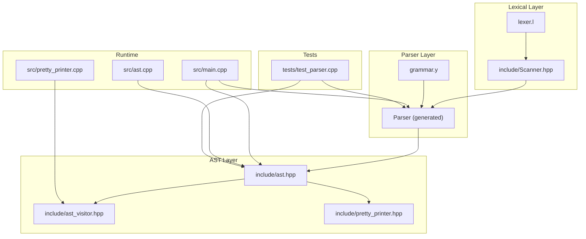
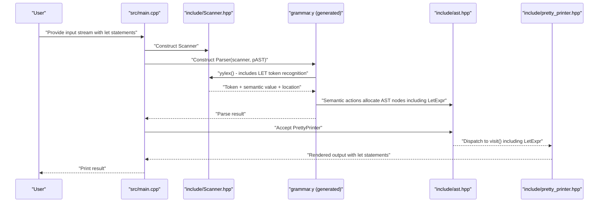
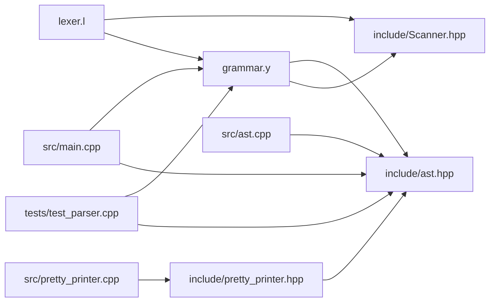

# Parser Implementation

<cite>
**Referenced Files in This Document**
- [grammar.y](file://grammar.y)
- [lexer.l](file://lexer.l)
- [include/ast.hpp](file://include/ast.hpp)
- [include/ast_visitor.hpp](file://include/ast_visitor.hpp)
- [include/Scanner.hpp](file://include/Scanner.hpp)
- [include/pretty_printer.hpp](file://include/pretty_printer.hpp)
- [src/ast.cpp](file://src/ast.cpp)
- [src/pretty_printer.cpp](file://src/pretty_printer.cpp)
- [src/main.cpp](file://src/main.cpp)
- [tests/test_parser.cpp](file://tests/test_parser.cpp)
- [README.md](file://README.md)
- [demo.txt](file://demo.txt)
</cite>

## Update Summary
**Changes Made**
- Added comprehensive documentation for new let statement parsing capabilities
- Updated grammar specification to include LET token recognition and LetExpr semantic actions
- Enhanced AST framework documentation to cover LetExpr node type
- Added visitor pattern documentation for LetExpr handling
- Updated testing documentation to include let statement test cases
- Enhanced demo documentation to showcase let statement usage

## Table of Contents
1. [Introduction](#introduction)
2. [Project Structure](#project-structure)
3. [Core Components](#core-components)
4. [Architecture Overview](#architecture-overview)
5. [Detailed Component Analysis](#detailed-component-analysis)
6. [Dependency Analysis](#dependency-analysis)
7. [Performance Considerations](#performance-considerations)
8. [Troubleshooting Guide](#troubleshooting-guide)
9. [Conclusion](#conclusion)
10. [Appendices](#appendices)

## Introduction
This document describes the Bison-based parser implementation for a Monkey-like language. It explains the grammar specification, operator precedence and associativity, semantic actions, and how parser actions construct AST nodes. The parser now supports let statements for variable binding, enabling immutable variable declarations with expressions. It also covers the integration with the AST framework and visitor pattern, conflict resolution strategies, semantic value handling, error recovery, and debugging techniques. Finally, it outlines how to extend the language with new constructs by modifying the grammar.

## Project Structure
The project follows a layered structure:
- Grammar and parser: grammar.y defines the language syntax and semantic actions, including new let statement support.
- Lexer: lexer.l defines tokens and lexical scanning behavior, including LET token recognition.
- AST and visitor: include/ast.hpp and include/ast_visitor.hpp define the AST model and visitor interface, including LetExpr support.
- Runtime and presentation: src/main.cpp orchestrates parsing and pretty-printing; include/pretty_printer.hpp and src/pretty_printer.cpp implement a pretty-printing visitor with LetExpr support.
- Scanner bridge: include/Scanner.hpp connects the lexer to the parser.
- Tests: tests/test_parser.cpp validates parsing behavior including let statements.
- Demo: demo.txt demonstrates language features including let statements.

**Diagram sources**
- [grammar.y:1-129](file://grammar.y#L1-L129)
- [lexer.l:1-100](file://lexer.l#L1-L100)
- [include/Scanner.hpp:1-40](file://include/Scanner.hpp#L1-L40)
- [include/ast.hpp:1-194](file://include/ast.hpp#L1-L194)
- [include/ast_visitor.hpp:1-43](file://include/ast_visitor.hpp#L1-L43)
- [include/pretty_printer.hpp:1-38](file://include/pretty_printer.hpp#L1-L38)
- [src/ast.cpp:1-56](file://src/ast.cpp#L1-L56)
- [src/pretty_printer.cpp:1-96](file://src/pretty_printer.cpp#L1-L96)
- [src/main.cpp:1-81](file://src/main.cpp#L1-L81)
- [tests/test_parser.cpp:1-73](file://tests/test_parser.cpp#L1-L73)

**Section sources**
- [README.md:1-41](file://README.md#L1-L41)
- [grammar.y:1-129](file://grammar.y#L1-L129)
- [lexer.l:1-100](file://lexer.l#L1-L100)
- [include/ast.hpp:1-194](file://include/ast.hpp#L1-L194)
- [include/ast_visitor.hpp:1-43](file://include/ast_visitor.hpp#L1-L43)
- [include/pretty_printer.hpp:1-38](file://include/pretty_printer.hpp#L1-L38)
- [src/ast.cpp:1-56](file://src/ast.cpp#L1-L56)
- [src/pretty_printer.cpp:1-96](file://src/pretty_printer.cpp#L1-L96)
- [src/main.cpp:1-81](file://src/main.cpp#L1-L81)
- [tests/test_parser.cpp:1-73](file://tests/test_parser.cpp#L1-L73)

## Core Components
- Grammar specification and semantic actions: grammar.y declares tokens, nonterminals, precedence, and production rules with embedded actions that construct AST nodes, including new LetExpr support for let statements.
- Lexer and scanner bridge: lexer.l defines tokens and lexical actions, including LET token recognition; include/Scanner.hpp adapts Flex to Bison's API.
- AST framework: include/ast.hpp defines the AST node hierarchy and visitor interface, including LetExpr node type; src/ast.cpp implements accept() dispatch.
- Visitor pattern: include/pretty_printer.hpp and src/pretty_printer.cpp implement a pretty-printing visitor with LetExpr support.
- Runtime orchestration: src/main.cpp parses input streams and pretty-prints the resulting AST.
- Tests: tests/test_parser.cpp validates parsing behavior including let statements.
- Demo: demo.txt demonstrates language features including let statements.

Key responsibilities:
- grammar.y: Defines language syntax, precedence, and semantic actions that allocate AST nodes including LetExpr for let statements and wire them together.
- lexer.l: Tokenizes input and populates semantic values (strings, integers, floats, identifiers), including LET token recognition.
- include/Scanner.hpp: Provides a bridge between Flex and Bison, managing locations and token emission.
- include/ast.hpp: Provides the AST node types including LetExpr and visitor contract.
- include/pretty_printer.hpp and src/pretty_printer.cpp: Implement a concrete visitor to render the AST including LetExpr pretty-printing.
- src/main.cpp: Integrates scanner, parser, and pretty printer; demonstrates REPL and file modes.
- tests/test_parser.cpp: Exercises the parser with representative inputs including let statements.

**Section sources**
- [grammar.y:1-129](file://grammar.y#L1-L129)
- [lexer.l:1-100](file://lexer.l#L1-L100)
- [include/Scanner.hpp:1-40](file://include/Scanner.hpp#L1-L40)
- [include/ast.hpp:1-194](file://include/ast.hpp#L1-L194)
- [include/ast_visitor.hpp:1-43](file://include/ast_visitor.hpp#L1-L43)
- [include/pretty_printer.hpp:1-38](file://include/pretty_printer.hpp#L1-L38)
- [src/ast.cpp:1-56](file://src/ast.cpp#L1-L56)
- [src/pretty_printer.cpp:1-96](file://src/pretty_printer.cpp#L1-L96)
- [src/main.cpp:1-81](file://src/main.cpp#L1-L81)
- [tests/test_parser.cpp:1-73](file://tests/test_parser.cpp#L1-L73)

## Architecture Overview
The parser pipeline:
- The lexer (Flex) scans input and emits tokens to the parser, including new LET token recognition.
- The parser (Bison) recognizes grammar productions and executes semantic actions, including LetExpr creation.
- Semantic actions allocate AST nodes including LetExpr and attach child nodes.
- The AST is traversed by a visitor (e.g., PrettyPrinter) to produce output, including LetExpr pretty-printing.

**Diagram sources**
- [src/main.cpp:23-81](file://src/main.cpp#L23-L81)
- [include/Scanner.hpp:12-40](file://include/Scanner.hpp#L12-L40)
- [grammar.y:31-39](file://grammar.y#L31-L39)
- [include/ast.hpp:14-194](file://include/ast.hpp#L14-L194)
- [include/pretty_printer.hpp:9-38](file://include/pretty_printer.hpp#L9-L38)

## Detailed Component Analysis

### Grammar Specification and Precedence
The grammar defines:
- Tokens: literals, operators, keywords, punctuation, and identifiers, including new LET token.
- Nonterminals: program, stmt_list, block_stmt, if_stmt, elif_list, opt_else, stmt, expr_seq, expr.
- Precedence declarations establish operator precedence and associativity:
  - Nonassociative: assignment, logical not, comparison operators.
  - Left associative: logical or, logical and.
  - Left associative: addition/subtraction.
  - Left associative: multiplication, division, modulo.
  - Right associative: exponentiation.
  - Unary minus precedence and factorial precedence are declared.
- Start symbol: program.
- Semantic values: variant-based values carry either integer counts (for brace indentation) or strings/values for tokens, and pointers to AST nodes for nonterminals.

**Updated** Added LET token recognition and LetExpr semantic actions for let statement parsing.

Precedence and associativity guide shift/reduce decisions and disambiguate expressions. For example:
- Multiplicative operators bind tighter than additive operators.
- Exponentiation is right-associative, so "a^b^c" groups as "a^(b^c)".
- Unary minus binds tightly due to explicit precedence declaration.

Ambiguity resolution:
- Explicit %prec clauses in productions resolve conflicts (e.g., unary minus).
- Error recovery uses %prec and error tokens to recover quickly after syntax errors.

Examples of grammar rules and semantic actions:
- Program root sets the global AST pointer to the statement list.
- Statement lists accumulate statements.
- Blocks capture indentation level and wrap a statement list.
- If/elif/else constructs assemble condition, branch blocks, and optional else.
- Expressions handle literals, arrays, unary ops, binary ops, assignments, parentheses, grouping, and new let statements.
- **New**: Let statements are parsed using the rule: `LET Ident ASSIGN expr { $$ = new ast::LetExpr(@$, $2, $4); }`.

**Section sources**
- [grammar.y:41-69](file://grammar.y#L41-L69)
- [grammar.y:71-123](file://grammar.y#L71-L123)
- [grammar.y:121](file://grammar.y#L121)
- [grammar.y:127-129](file://grammar.y#L127-L129)

### Lexer and Tokenization
The lexer:
- Uses Flex rules to recognize integers, floats, strings, keywords, operators, and punctuation, including new LET token recognition.
- Manages string literal scanning with a separate state and builds the string buffer.
- Tracks locations via positions and updates the Bison location object.
- Emits tokens with semantic values (e.g., strings for identifiers and literals, integers for brace counts).

**Updated** Added LET token recognition with dedicated rule `"let" { return Parser::token::LET; }`.

Key behaviors:
- Whitespace and comments are skipped.
- Indentation is tracked by counting braces; the scanner passes the indentation level to the parser.
- EOF is recognized and returned as a terminal.
- **New**: The lexer now recognizes "let" as a reserved keyword and returns the LET token.

**Section sources**
- [lexer.l:19-94](file://lexer.l#L19-L94)
- [lexer.l:53](file://lexer.l#L53)
- [include/Scanner.hpp:12-40](file://include/Scanner.hpp#L12-L40)

### AST Framework and Visitor Pattern
The AST hierarchy:
- Base node types: Node, Expr, Stmt, and specialized variants for expressions and statements.
- Expression nodes: LiteralExpr (IntLitExpr, FloatLitExpr, StringLitExpr), UnaryExpr, BinOpExpr, ArrayExpr, **LetExpr**, ExprSeq.
- Statement nodes: ExprStmt, BlockStmt, IfStmt, StmtList, ElifList.
- Visitor interface: ASTVisitor defines virtual visit methods for each node type, including LetExpr.

**Updated** Added LetExpr node type to the AST framework with proper accept() implementation.

Visitor pattern:
- Each node implements accept(ASTVisitor&) to dispatch to the corresponding visit method.
- PrettyPrinter implements a concrete visitor to render the AST to a string, including LetExpr pretty-printing.

Integration:
- Parser actions allocate AST nodes including LetExpr and wire them together.
- After parsing, the AST is traversed by a visitor to produce output, including LetExpr pretty-printing.

**Section sources**
- [include/ast.hpp:14-194](file://include/ast.hpp#L14-L194)
- [include/ast_visitor.hpp:21-43](file://include/ast_visitor.hpp#L21-L43)
- [src/ast.cpp:7-56](file://src/ast.cpp#L7-L56)
- [include/pretty_printer.hpp:9-38](file://include/pretty_printer.hpp#L9-L38)
- [src/pretty_printer.cpp:7-96](file://src/pretty_printer.cpp#L7-L96)

### Semantic Value Handling and Type Checking Integration
Semantic values:
- Variant-based values carry either integer counts (brace indentation) or strings/values for tokens.
- Nonterminal values are pointers to AST nodes, enabling tree construction in actions.

**Updated** LetExpr semantic actions now handle identifier strings and expression values.

Type checking integration:
- The AST nodes carry typed semantic information (e.g., literal strings, identifiers).
- While the current grammar does not enforce type checking in actions, the AST structure supports future type checks by adding typed fields and validation routines.
- **New**: LetExpr stores both the identifier string and the assigned expression value.

**Section sources**
- [grammar.y:14-15](file://grammar.y#L14-L15)
- [grammar.y:41-56](file://grammar.y#L41-L56)
- [grammar.y:121](file://grammar.y#L121)
- [lexer.l:51-52](file://lexer.l#L51-L52)
- [lexer.l:90](file://lexer.l#L90)
- [include/ast.hpp:130-139](file://include/ast.hpp#L130-L139)

### Parser Actions and AST Construction
Parser actions:
- Construct AST nodes in semantic actions for each production, including new LetExpr creation.
- Pass location information to nodes for precise diagnostics.
- Build composite structures like StmtList, ExprSeq, ElifList, and IfStmt.

**Updated** Added LetExpr creation in semantic actions for let statements.

Examples:
- Program sets the root pointer to the parsed statement list.
- Statement list accumulates statements and ignores nulls.
- Block captures indentation level and wraps a statement list.
- If/elif/else constructs assemble condition, branch blocks, and optional else.
- Expressions create literal, unary, binary, array, and assignment nodes.
- **New**: Let statements create LetExpr nodes with identifier and expression values.

**Section sources**
- [grammar.y:71-123](file://grammar.y#L71-L123)
- [grammar.y:121](file://grammar.y#L121)

### Error Recovery Mechanisms
Error recovery:
- An error token is handled with a rule that consumes tokens until a newline, then calls yyerrok to reset the parser.
- The parser error handler prints the location and message.

This strategy allows the parser to continue after encountering unexpected input, minimizing cascading errors.

**Section sources**
- [grammar.y:95](file://grammar.y#L95)
- [grammar.y:127-129](file://grammar.y#L127-L129)

### Runtime Orchestration and REPL
The runtime:
- Supports interactive mode and file mode.
- Constructs a Scanner and Parser, runs parse(), and pretty-prints the resulting AST.
- Demonstrates REPL behavior by repeatedly parsing input and printing results.

**Section sources**
- [src/main.cpp:23-81](file://src/main.cpp#L23-L81)

### Testing and Validation
Tests:
- tests/test_parser.cpp constructs a Scanner and Parser, runs parse(), and pretty-prints the AST.
- Validates basic arithmetic, floating-point expressions, comments, and **newly added let statement tests**.
- **New**: Comprehensive test coverage for let statements including simple assignments, expressions, and string values.

**Updated** Added extensive test coverage for let statement parsing and pretty-printing.

**Section sources**
- [tests/test_parser.cpp:12-25](file://tests/test_parser.cpp#L12-L25)
- [tests/test_parser.cpp:27-73](file://tests/test_parser.cpp#L27-L73)
- [tests/test_parser.cpp:48-67](file://tests/test_parser.cpp#L48-L67)

## Dependency Analysis
The parser implementation exhibits clear separation of concerns:
- grammar.y depends on include/ast.hpp for AST node types and include/Scanner.hpp for the lexer bridge, including LetExpr support.
- lexer.l depends on include/Scanner.hpp and Parser header to emit tokens, including LET token.
- src/main.cpp depends on Scanner, Parser, and PrettyPrinter to drive parsing and output.
- PrettyPrinter depends on ASTVisitor and AST node types, including LetExpr.

**Diagram sources**
- [grammar.y:22-39](file://grammar.y#L22-L39)
- [lexer.l:2-7](file://lexer.l#L2-L7)
- [include/Scanner.hpp:1-8](file://include/Scanner.hpp#L1-L8)
- [include/ast.hpp:1-9](file://include/ast.hpp#L1-L9)
- [include/pretty_printer.hpp:1-6](file://include/pretty_printer.hpp#L1-L6)
- [src/ast.cpp:1-2](file://src/ast.cpp#L1-L2)
- [src/pretty_printer.cpp:1-3](file://src/pretty_printer.cpp#L1-L3)
- [src/main.cpp:1-6](file://src/main.cpp#L1-L6)
- [tests/test_parser.cpp:1-10](file://tests/test_parser.cpp#L1-L10)

**Section sources**
- [grammar.y:22-39](file://grammar.y#L22-L39)
- [lexer.l:2-7](file://lexer.l#L2-L7)
- [include/Scanner.hpp:1-8](file://include/Scanner.hpp#L1-L8)
- [include/ast.hpp:1-9](file://include/ast.hpp#L1-L9)
- [include/pretty_printer.hpp:1-6](file://include/pretty_printer.hpp#L1-L6)
- [src/ast.cpp:1-2](file://src/ast.cpp#L1-L2)
- [src/pretty_printer.cpp:1-3](file://src/pretty_printer.cpp#L1-L3)
- [src/main.cpp:1-6](file://src/main.cpp#L1-L6)
- [tests/test_parser.cpp:1-10](file://tests/test_parser.cpp#L1-L10)

## Performance Considerations
- Prefer compact grammar rules to reduce parser state size and conflicts.
- Use precedence declarations to avoid deep recursion in semantic actions.
- Minimize allocations in hot paths; reuse buffers for string literals when feasible.
- Keep semantic actions simple; delegate heavy work to later stages (e.g., type checking, code generation).
- Enable parser tracing during development to identify bottlenecks in shift/reduce decisions.
- **New**: Let statement parsing performance is optimized through efficient LetExpr node creation and minimal overhead in semantic actions.

## Troubleshooting Guide
Common issues and remedies:
- Shift/reduce or reduce/reduce conflicts:
  - Add explicit %prec to disambiguate.
  - Restructure grammar to eliminate ambiguity.
  - Use precedence declarations to guide reductions.
- Incorrect operator precedence:
  - Adjust precedence levels and associativity declarations.
  - Verify %prec usage in unary and binary rules.
- Location reporting problems:
  - Ensure YY_USER_ACTION updates the location object.
  - Confirm the scanner passes the location to the parser.
- Error recovery loops:
  - Ensure error rules consume sufficient tokens and call yyerrok.
  - Avoid infinite loops by not re-emitting the same error token.
- Pretty-printing mismatches:
  - Verify accept() dispatch in AST nodes.
  - Ensure visitor methods match AST node types.
- **New**: Let statement parsing issues:
  - Verify LET token is properly recognized in the lexer.
  - Check that LetExpr semantic actions are correctly implemented.
  - Ensure PrettyPrinter.visit(LetExpr&) handles identifier and expression values.

Debugging techniques:
- Enable parser tracing via %verbose and parse.trace to observe state transitions.
- Print locations and tokens during lexing to validate scanner behavior.
- Use small test inputs to isolate problematic rules.
- Add temporary logging in semantic actions to track AST construction.
- **New**: Test let statement parsing with simple cases before complex expressions.

**Section sources**
- [grammar.y:17-18](file://grammar.y#L17-L18)
- [grammar.y:58-67](file://grammar.y#L58-L67)
- [grammar.y:95](file://grammar.y#L95)
- [lexer.l:9-11](file://lexer.l#L9-L11)
- [src/ast.cpp:7-56](file://src/ast.cpp#L7-L56)
- [tests/test_parser.cpp:12-25](file://tests/test_parser.cpp#L12-L25)

## Conclusion
The parser implementation integrates a Bison-generated parser with a Flex-based lexer and a typed AST framework. Operator precedence and associativity declarations resolve ambiguities, while semantic actions construct AST nodes that represent language constructs including new let statements. The visitor pattern enables extensible output transformations, and error recovery ensures robust parsing. The design supports incremental feature additions by extending grammar rules and AST nodes, as demonstrated by the successful implementation of let statement parsing capabilities.

## Appendices

### Grammar Rules and AST Node Construction Examples
- Program: Sets the root to the parsed statement list.
- Statement list: Builds a StmtList and appends statements.
- Block: Wraps a StmtList with indentation level.
- If/elif/else: Assembles condition, branches, and optional else.
- Expressions: Create literal, unary, binary, array, and assignment nodes.
- **New**: Let statements: Create LetExpr nodes with identifier and expression values.

These behaviors are implemented in grammar rules and semantic actions, including new let statement support.

**Section sources**
- [grammar.y:71-123](file://grammar.y#L71-L123)
- [grammar.y:121](file://grammar.y#L121)

### Adding New Language Constructs
To add a new construct:
1. Extend the lexer to recognize new tokens (keywords, operators).
2. Declare tokens and nonterminals in grammar.y.
3. Add precedence and associativity as needed.
4. Implement semantic actions to construct AST nodes.
5. Extend the visitor interface and implement a visitor method.
6. Add tests to validate parsing and pretty-printing.

**Updated** The process now includes LetExpr as a reference implementation for new expression constructs.

**Section sources**
- [lexer.l:53-94](file://lexer.l#L53-L94)
- [grammar.y:41-69](file://grammar.y#L41-L69)
- [include/ast_visitor.hpp:21-43](file://include/ast_visitor.hpp#L21-L43)
- [include/ast.hpp:14-194](file://include/ast.hpp#L14-L194)

### Demo Inputs
The demo file illustrates language features such as variable bindings, strings, booleans, arrays, and nested control flow, including comprehensive let statement usage.

**Updated** Enhanced demo to showcase let statement capabilities with various expression types.

**Section sources**
- [demo.txt:1-40](file://demo.txt#L1-L40)

### Let Statement Implementation Details
The let statement implementation includes:

**Grammar Rule**: `LET Ident ASSIGN expr { $$ = new ast::LetExpr(@$, $2, $4); }`
- Recognizes the "let" keyword, identifier, assignment operator, and expression
- Creates a LetExpr node with location information, identifier string, and expression value

**AST Node**: LetExpr
- Inherits from Expr base class
- Stores identifier string and unique pointer to assigned expression
- Implements accept() method for visitor pattern dispatch

**Visitor Support**: PrettyPrinter.visit(LetExpr&)
- Outputs "let identifier = " followed by the expression representation
- Handles nested expressions and maintains proper formatting

**Testing Coverage**: Comprehensive test suite validates:
- Simple variable assignments (e.g., "let x = 5;")
- Expression assignments (e.g., "let result = 2 + 3 * 4;")
- String assignments (e.g., "let name = \"hello\";")
- Complex expression evaluation within let statements

**Section sources**
- [grammar.y:121](file://grammar.y#L121)
- [include/ast.hpp:130-139](file://include/ast.hpp#L130-L139)
- [include/ast_visitor.hpp:32](file://include/ast_visitor.hpp#L32)
- [src/ast.cpp:25-27](file://src/ast.cpp#L25-L27)
- [src/pretty_printer.cpp:47-50](file://src/pretty_printer.cpp#L47-L50)
- [tests/test_parser.cpp:48-67](file://tests/test_parser.cpp#L48-L67)
- [demo.txt:1-40](file://demo.txt#L1-L40)