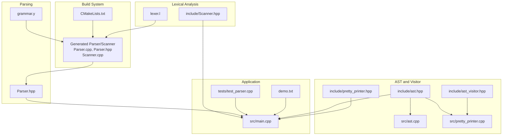
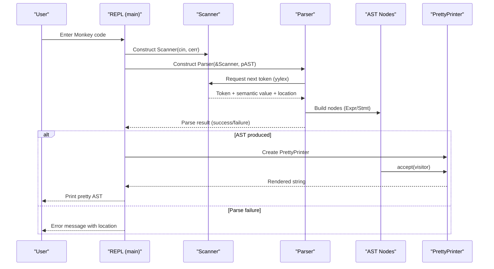
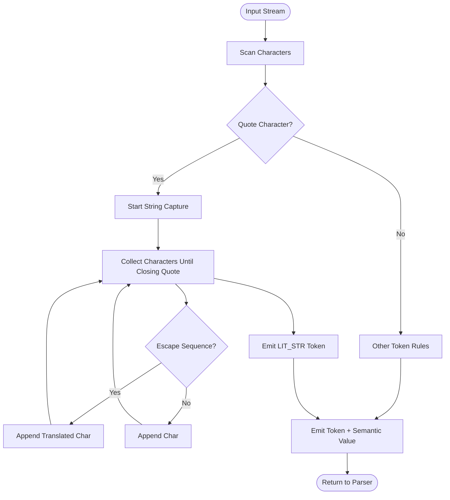
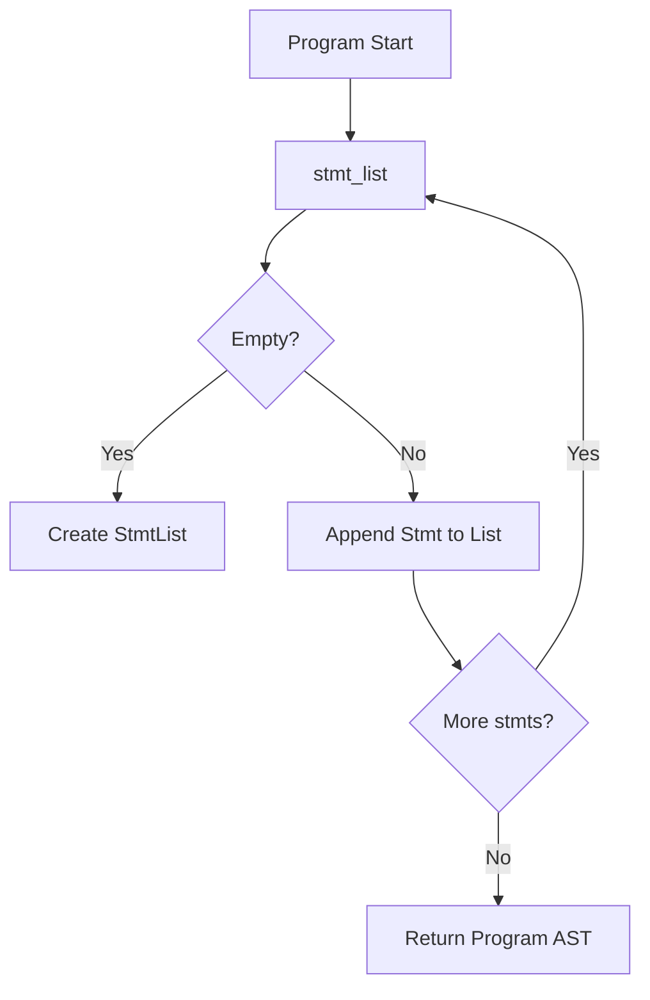
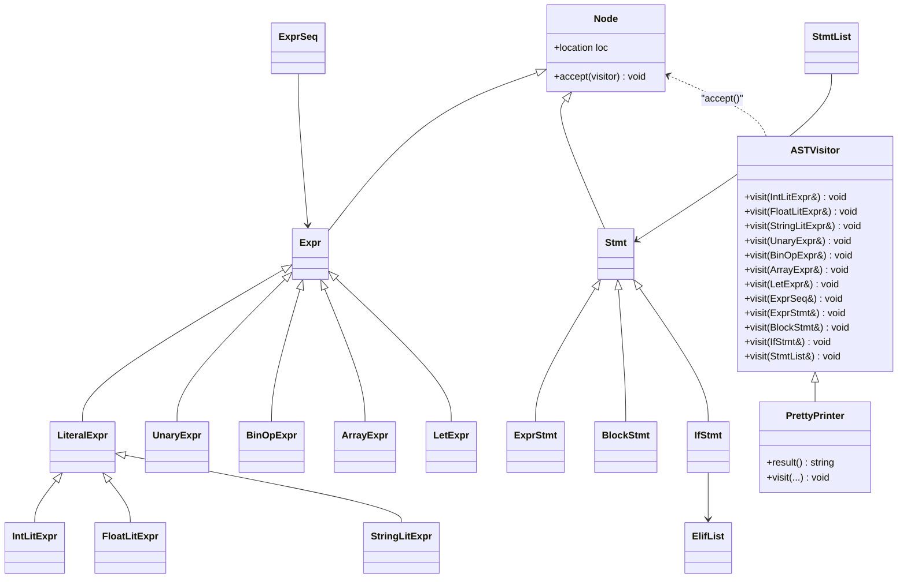
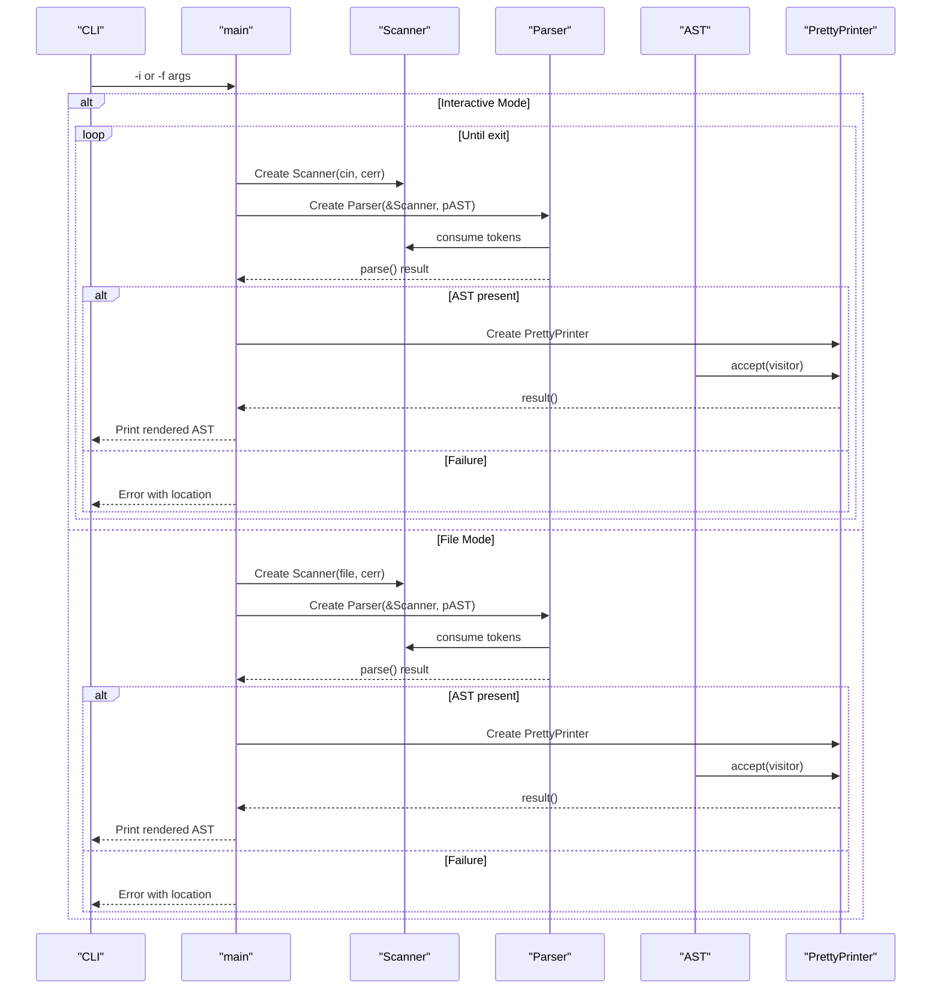
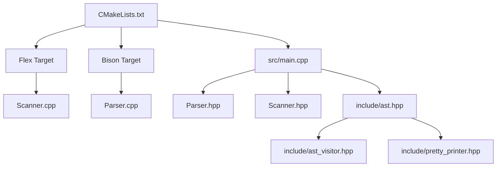

# Project Overview

<cite>
**Referenced Files in This Document**
- [README.md](file://README.md)
- [CMakeLists.txt](file://CMakeLists.txt)
- [grammar.y](file://grammar.y)
- [lexer.l](file://lexer.l)
- [src/main.cpp](file://src/main.cpp)
- [include/Scanner.hpp](file://include/Scanner.hpp)
- [include/ast.hpp](file://include/ast.hpp)
- [include/ast_visitor.hpp](file://include/ast_visitor.hpp)
- [include/pretty_printer.hpp](file://include/pretty_printer.hpp)
- [src/ast.cpp](file://src/ast.cpp)
- [src/pretty_printer.cpp](file://src/pretty_printer.cpp)
- [tests/test_parser.cpp](file://tests/test_parser.cpp)
- [demo.txt](file://demo.txt)
</cite>

## Table of Contents
1. [Introduction](#introduction)
2. [Project Structure](#project-structure)
3. [Core Components](#core-components)
4. [Architecture Overview](#architecture-overview)
5. [Detailed Component Analysis](#detailed-component-analysis)
6. [Dependency Analysis](#dependency-analysis)
7. [Performance Considerations](#performance-considerations)
8. [Troubleshooting Guide](#troubleshooting-guide)
9. [Conclusion](#conclusion)
10. [Appendices](#appendices)

## Introduction
Modern Bison is an educational compiler/interpreter tool designed to teach compiler construction fundamentals using the Monkey programming language. The project demonstrates a practical pipeline that integrates Flex and Bison to generate a C++ lexer and parser, producing an Abstract Syntax Tree (AST) that is then traversed by a visitor-based pretty printer. This hands-on approach bridges theoretical compiler concepts—lexical analysis, parsing, and AST traversal—with concrete, runnable code.

Target audience:
- Students enrolled in compiler construction courses
- Educators teaching programming language design and implementation
- Learners interested in building interpreters or compilers

Key learning objectives:
- Understand lexical analysis with Flex and how tokenization maps to language constructs
- Learn recursive descent parsing with Bison and how grammar rules translate into AST nodes
- Explore AST design patterns and visitor-based traversal for rendering or evaluation
- Practice integrating generated parsers with modern C++ idioms and RAII
- Develop skills in debugging and extending grammars and scanners

Educational value:
- Provides a minimal yet complete pipeline for language processing
- Encourages experimentation with language features by modifying grammar and scanner rules
- Demonstrates how to structure a small interpreter front-end suitable for classroom exercises
- Offers a reproducible build process across platforms using CMake and Flex/Bison

Real-world applicability:
- Serves as a foundation for larger projects (e.g., adding symbol tables, type checking, or bytecode emission)
- Highlights best practices for integrating generated parsers with modern C++ codebases
- Supports rapid prototyping of DSLs or embedded languages

## Project Structure
The repository follows a layered structure:
- Grammar and scanner definitions under the repository root
- Generated parser and scanner sources integrated into the build
- Header files in include/ defining AST, visitor interface, and scanner
- Implementation files in src/ for AST nodes, pretty printing, and the main REPL
- Tests in tests/ using Catch2 for parser validation
- Demo input in demo.txt showcasing Monkey language features

**Diagram sources**
- [CMakeLists.txt:1-40](file://CMakeLists.txt#L1-L40)
- [grammar.y:1-129](file://grammar.y#L1-L129)
- [lexer.l:1-100](file://lexer.l#L1-L100)
- [include/Scanner.hpp:1-44](file://include/Scanner.hpp#L1-L44)
- [include/ast.hpp:1-203](file://include/ast.hpp#L1-L203)
- [include/ast_visitor.hpp:1-43](file://include/ast_visitor.hpp#L1-L43)
- [include/pretty_printer.hpp:1-38](file://include/pretty_printer.hpp#L1-L38)
- [src/ast.cpp:1-33](file://src/ast.cpp#L1-L33)
- [src/pretty_printer.cpp](file://src/pretty_printer.cpp)
- [src/main.cpp:1-84](file://src/main.cpp#L1-L84)
- [tests/test_parser.cpp:1-52](file://tests/test_parser.cpp#L1-L52)
- [demo.txt:1-40](file://demo.txt#L1-L40)

**Section sources**
- [README.md:1-41](file://README.md#L1-L41)
- [CMakeLists.txt:1-40](file://CMakeLists.txt#L1-L40)

## Core Components
- Lexical analyzer (Flex): Tokenizes Monkey language input, tracks locations, and supports string literals with escape sequences and comments.
- Parser (Bison): Generates a C++ parser with location tracking, precedence rules, and actions that construct AST nodes.
- AST and Visitor: Defines a visitor-driven AST with polymorphic nodes for expressions and statements, enabling pretty-printing and future transformations.
- REPL and Tests: Provide interactive and automated ways to exercise the parser and validate grammar coverage.

Key implementation highlights:
- The scanner inherits from the generated Flex base class and exposes a lex method compatible with the parser’s semantic value type.
- The parser defines a C++ namespace and class name, integrates with the scanner via a parse parameter, and emits location-aware errors.
- The AST uses smart pointers and RAII to manage node lifetimes, and the visitor interface decouples traversal from node types.

**Section sources**
- [lexer.l:1-100](file://lexer.l#L1-L100)
- [grammar.y:1-129](file://grammar.y#L1-L129)
- [include/Scanner.hpp:1-44](file://include/Scanner.hpp#L1-L44)
- [include/ast.hpp:1-203](file://include/ast.hpp#L1-L203)
- [include/ast_visitor.hpp:1-43](file://include/ast_visitor.hpp#L1-L43)
- [src/ast.cpp:1-33](file://src/ast.cpp#L1-L33)
- [include/pretty_printer.hpp:1-38](file://include/pretty_printer.hpp#L1-L38)

## Architecture Overview
The system architecture centers on a clean separation of concerns:
- Input stream flows into the scanner, which produces tokens with associated locations.
- The parser consumes tokens and constructs AST nodes according to grammar rules.
- The AST is traversed by a visitor to render a human-readable representation.

**Diagram sources**
- [src/main.cpp:25-84](file://src/main.cpp#L25-L84)
- [include/Scanner.hpp:13-44](file://include/Scanner.hpp#L13-L44)
- [grammar.y:31-39](file://grammar.y#L31-L39)
- [include/ast.hpp:14-203](file://include/ast.hpp#L14-L203)
- [include/pretty_printer.hpp:9-38](file://include/pretty_printer.hpp#L9-L38)

## Detailed Component Analysis

### Lexical Analyzer (Flex)
Responsibilities:
- Token recognition for literals, operators, keywords, and punctuation
- Location tracking for precise error reporting
- String literal scanning with escape sequences and multi-line support
- Comment skipping and newline handling

Design patterns:
- Uses Flex’s C++ API and custom YY_DECL to integrate with the parser’s semantic type
- Maintains a position tracker to compute token locations
- Implements a string capture buffer for quoted literals

**Diagram sources**
- [lexer.l:35-94](file://lexer.l#L35-L94)

**Section sources**
- [lexer.l:1-100](file://lexer.l#L1-L100)

### Parser (Bison)
Responsibilities:
- Define Monkey grammar in Bison’s LR parser format
- Control precedence and associativity for expressions
- Construct AST nodes during parsing actions
- Report parse errors with location information

Design patterns:
- Uses C++ language support and a custom namespace/class name for the parser
- Integrates with the scanner via a parse parameter and a macro to route yylex
- Emits verbose diagnostics and location-aware error messages

**Diagram sources**
- [grammar.y:71-96](file://grammar.y#L71-L96)

**Section sources**
- [grammar.y:1-129](file://grammar.y#L1-L129)

### AST and Visitor
Responsibilities:
- Represent Monkey language constructs as typed nodes
- Provide a visitor interface to traverse and transform ASTs
- Enable pretty printing and future passes (e.g., type checking, code generation)

Design patterns:
- Base Node stores location metadata
- Polymorphic accept methods dispatch to visitor implementations
- Smart pointers manage ownership and lifetime
- PrettyPrinter implements the visitor to render a readable form

**Diagram sources**
- [include/ast.hpp:14-203](file://include/ast.hpp#L14-L203)
- [include/ast_visitor.hpp:21-40](file://include/ast_visitor.hpp#L21-L40)
- [include/pretty_printer.hpp:9-38](file://include/pretty_printer.hpp#L9-L38)

**Section sources**
- [include/ast.hpp:1-203](file://include/ast.hpp#L1-L203)
- [include/ast_visitor.hpp:1-43](file://include/ast_visitor.hpp#L1-L43)
- [src/ast.cpp:1-33](file://src/ast.cpp#L1-L33)
- [include/pretty_printer.hpp:1-38](file://include/pretty_printer.hpp#L1-L38)

### REPL and Tests
Responsibilities:
- Provide interactive mode for incremental parsing and pretty printing
- Support file-based parsing for batch processing
- Validate parser behavior with unit tests using Catch2

Design patterns:
- REPL loops over input streams, constructing fresh scanner and parser instances per iteration
- Tests isolate parsing and pretty printing to verify grammar coverage and correctness

**Diagram sources**
- [src/main.cpp:25-84](file://src/main.cpp#L25-L84)
- [tests/test_parser.cpp:12-25](file://tests/test_parser.cpp#L12-L25)

**Section sources**
- [src/main.cpp:1-84](file://src/main.cpp#L1-L84)
- [tests/test_parser.cpp:1-52](file://tests/test_parser.cpp#L1-L52)

## Dependency Analysis
The build integrates Flex and Bison via CMake targets, generating parser and scanner sources that are compiled into the executable. The scanner and parser communicate through a shared semantic type and location tracking. The AST and visitor interface decouple traversal from node types, enabling extensibility.

**Diagram sources**
- [CMakeLists.txt:19-25](file://CMakeLists.txt#L19-L25)
- [grammar.y:10-15](file://grammar.y#L10-L15)
- [lexer.l:19-19](file://lexer.l#L19-L19)
- [src/main.cpp:1-84](file://src/main.cpp#L1-84)
- [include/ast.hpp:1-203](file://include/ast.hpp#L1-L203)
- [include/ast_visitor.hpp:1-43](file://include/ast_visitor.hpp#L1-L43)
- [include/pretty_printer.hpp:1-38](file://include/pretty_printer.hpp#L1-L38)

**Section sources**
- [CMakeLists.txt:1-40](file://CMakeLists.txt#L1-L40)
- [grammar.y:10-15](file://grammar.y#L10-L15)
- [lexer.l:19-19](file://lexer.l#L19-L19)

## Performance Considerations
- Tokenization cost: The scanner performs linear scans over input; string capture uses a fixed-size buffer to reduce allocations.
- Parsing cost: The grammar favors operator precedence to minimize shift/reduce conflicts and reduce backtracking.
- Memory management: Smart pointers in AST nodes ensure deterministic cleanup; avoid deep recursion in large expressions to prevent stack overflow.
- I/O throughput: REPL reads from stdin incrementally; consider buffering for large inputs.

[No sources needed since this section provides general guidance]

## Troubleshooting Guide
Common issues and resolutions:
- Build failures on Windows: Ensure win_flex_bison executables are discoverable by CMake or configured via environment variables.
- Parser errors: Use the verbose flag and location-aware error reporting to pinpoint syntax issues.
- Scanner mismatches: Verify that the YY_DECL signature matches the parser’s expectations and that the scanner’s lex method returns the correct token types.
- Test failures: Validate that the parser returns success and that an AST is produced before pretty printing.

**Section sources**
- [README.md:14-41](file://README.md#L14-L41)
- [grammar.y:17-18](file://grammar.y#L17-L18)
- [grammar.y:127-129](file://grammar.y#L127-L129)
- [lexer.l:6-17](file://lexer.l#L6-L17)
- [tests/test_parser.cpp:18-20](file://tests/test_parser.cpp#L18-L20)

## Conclusion
Modern Bison delivers a focused, educational compiler front-end that demonstrates core compiler construction concepts through a practical, extensible pipeline. By combining Flex and Bison with a modern C++ AST and visitor design, it enables students and educators to experiment with language features, debug grammars, and explore subsequent passes such as type checking or code generation. Its modular structure and robust build integration make it an ideal platform for hands-on learning in compiler construction.

[No sources needed since this section summarizes without analyzing specific files]

## Appendices

### Monkey Language Context
The project targets the Monkey programming language, a small, dynamically typed language often used in educational contexts. The included demo illustrates typical Monkey constructs such as variable bindings, arithmetic, booleans, arrays, and control flow, providing a realistic corpus for testing and demonstration.

**Section sources**
- [demo.txt:1-40](file://demo.txt#L1-L40)
- [README.md:7-12](file://README.md#L7-L12)