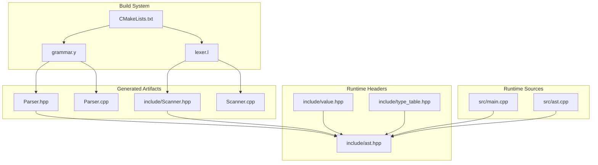
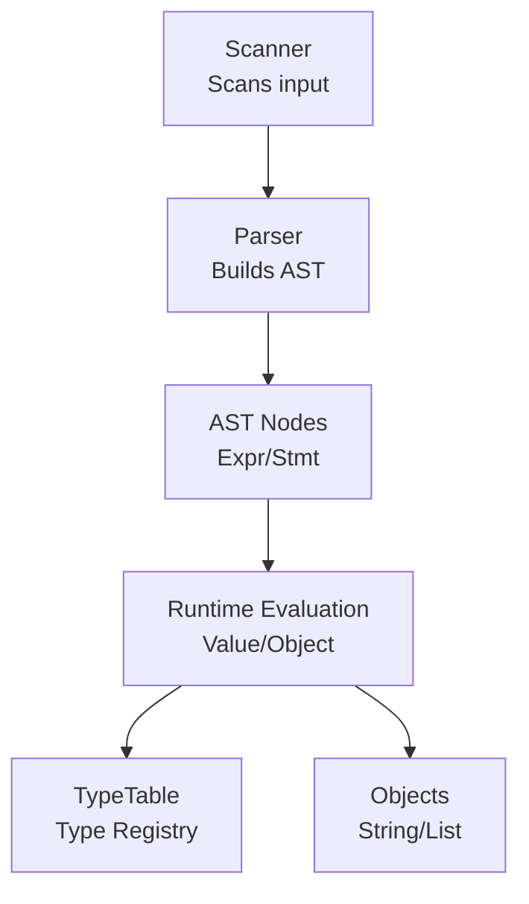
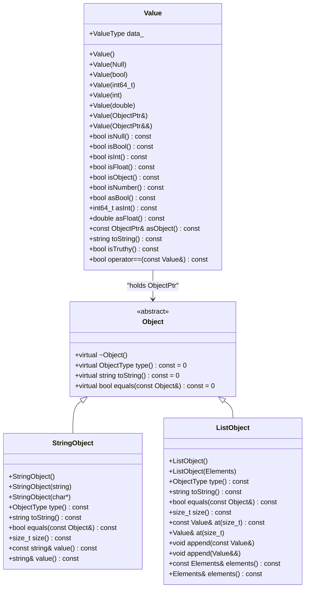
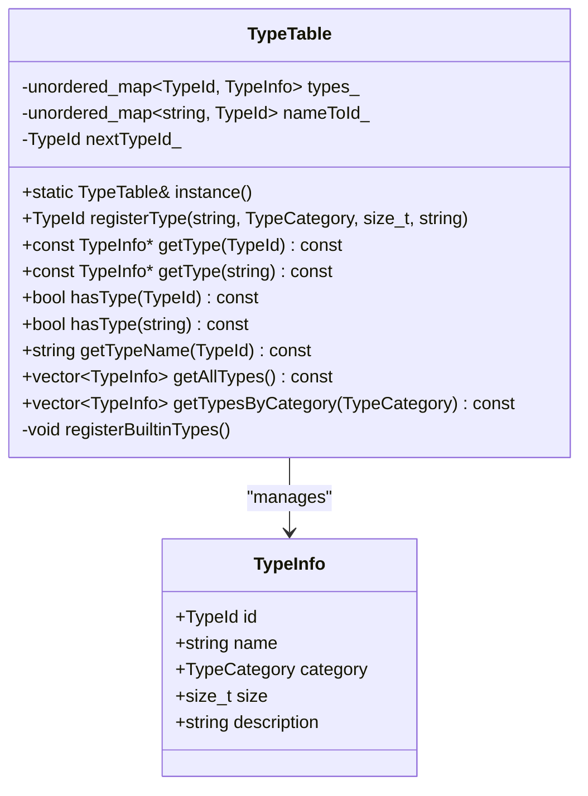
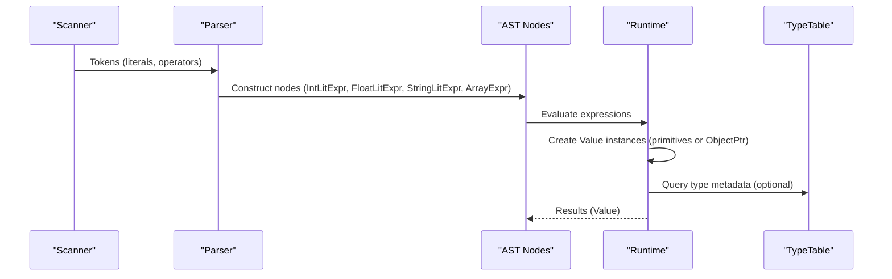
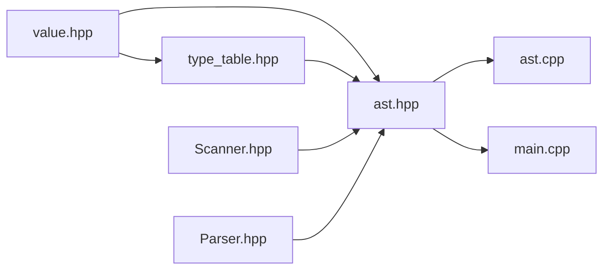

# Runtime System

<cite>
**Referenced Files in This Document**
- [value.hpp](file://include/value.hpp)
- [type_table.hpp](file://include/type_table.hpp)
- [grammar.y](file://grammar.y)
- [Scanner.hpp](file://include/Scanner.hpp)
- [ast.hpp](file://include/ast.hpp)
- [ast.cpp](file://src/ast.cpp)
- [main.cpp](file://src/main.cpp)
- [CMakeLists.txt](file://CMakeLists.txt)
- [README.md](file://README.md)
</cite>

## Table of Contents
1. [Introduction](#introduction)
2. [Project Structure](#project-structure)
3. [Core Components](#core-components)
4. [Architecture Overview](#architecture-overview)
5. [Detailed Component Analysis](#detailed-component-analysis)
6. [Dependency Analysis](#dependency-analysis)
7. [Performance Considerations](#performance-considerations)
8. [Troubleshooting Guide](#troubleshooting-guide)
9. [Conclusion](#conclusion)
10. [Appendices](#appendices)

## Introduction
This document describes the runtime system for the Monkey programming language project, focusing on the value type system and type management. The runtime centers around a variant-based Value type that holds either primitive values (null, boolean, integers, floating-point) or references to heap-allocated Objects. A TypeTable manages type registration, categories, and metadata for compile-time and runtime type validation. The system integrates with a Bison/Flex-generated parser and scanner to process source tokens into an AST, which can later be evaluated by the runtime.

## Project Structure
The project is organized into:
- include/: Public headers for the runtime (value.hpp, type_table.hpp) and AST/lexer/parser interfaces (Scanner.hpp, ast.hpp).
- src/: Implementation of the main entry point and AST visitor/printing utilities.
- grammar.y: Bison grammar that defines tokens, non-terminals, precedence, and actions for parsing.
- lexer.l: Flex lexer specification (not included here).
- CMakeLists.txt: Build configuration that generates the parser and scanner, and builds the executable.

**Diagram sources**
- [CMakeLists.txt:19-23](file://CMakeLists.txt#L19-L23)
- [grammar.y:12-14](file://grammar.y#L12-L14)
- [Scanner.hpp:1-44](file://include/Scanner.hpp#L1-L44)
- [ast.hpp:1-203](file://include/ast.hpp#L1-L203)
- [value.hpp:1-226](file://include/value.hpp#L1-L226)
- [type_table.hpp:1-167](file://include/type_table.hpp#L1-L167)
- [main.cpp:1-84](file://src/main.cpp#L1-L84)
- [ast.cpp:1-33](file://src/ast.cpp#L1-L33)

**Section sources**
- [CMakeLists.txt:19-23](file://CMakeLists.txt#L19-L23)
- [README.md:14-40](file://README.md#L14-L40)

## Core Components
- Variant-based Value: A discriminated union holding primitives and ObjectPtr references. Provides type checks, conversions, equality, and string representation.
- Object hierarchy: Base Object with derived StringObject and ListObject, enabling heap-allocated values with polymorphic behavior.
- TypeTable: Singleton registry for type metadata, including built-in types and user-defined types, with lookups by ID/name and category filtering.
- AST and Parser: Generated by Bison/Flex to parse source into an AST. The runtime system is designed to evaluate AST nodes using the Value/Object model.

Key responsibilities:
- Value: Encapsulates runtime values, enforces type safety, and provides conversions.
- Object/StringObject/ListObject: Manage heap-allocated values and define equality semantics.
- TypeTable: Centralized type registry and metadata for type-aware operations.

**Section sources**
- [value.hpp:25-92](file://include/value.hpp#L25-L92)
- [value.hpp:102-192](file://include/value.hpp#L102-L192)
- [type_table.hpp:48-144](file://include/type_table.hpp#L48-L144)

## Architecture Overview
The runtime architecture couples the generated parser with the value/object model. The scanner/tokenizer feeds tokens into the parser, which constructs AST nodes. The runtime system (when implemented) would traverse the AST, evaluate expressions, and manipulate Value/Object instances.

**Diagram sources**
- [Scanner.hpp:13-42](file://include/Scanner.hpp#L13-L42)
- [grammar.y:41-67](file://grammar.y#L41-L67)
- [ast.hpp:14-202](file://include/ast.hpp#L14-L202)
- [value.hpp:25-92](file://include/value.hpp#L25-L92)
- [type_table.hpp:48-144](file://include/type_table.hpp#L48-L144)

## Detailed Component Analysis

### Value Type System
The Value class encapsulates runtime values using a variant that holds either:
- Primitives: Null, Bool, int64_t, double
- Object references: ObjectPtr (shared_ptr to Object)

Type checking and accessors:
- isNull(), isBool(), isInt(), isFloat(), isObject()
- asBool(), asInt(), asFloat(), asObject()
- isNumber() helper
- toString() delegates to underlying object or formats primitives
- isTruthy() implements truthiness semantics
- operator== compares primitives directly or objects by value

Type conversion:
- asFloat() converts int to double; throws if not numeric
- Numeric promotion occurs implicitly in arithmetic contexts (as defined by grammar)

Equality:
- For object values, equality is delegated to the Object::equals implementation; otherwise, variant equality is used.

**Diagram sources**
- [value.hpp:25-92](file://include/value.hpp#L25-L92)
- [value.hpp:102-192](file://include/value.hpp#L102-L192)

**Section sources**
- [value.hpp:25-92](file://include/value.hpp#L25-L92)
- [value.hpp:194-223](file://include/value.hpp#L194-L223)

### Object System and Memory Management
- Object base class defines virtual interface for type identification, stringification, and equality.
- StringObject stores a std::string and implements equality by value.
- ListObject stores a vector of Value elements, supports indexing, appending, and equality by element-wise comparison.
- Smart pointers: ObjectPtr is a shared_ptr, enabling automatic reference counting and safe deletion. No manual GC is implemented; lifecycle is managed by shared ownership semantics.

Garbage collection considerations:
- Automatic reference counting via shared_ptr prevents leaks when references go out of scope.
- Cycles are not explicitly handled; if cycles form (e.g., list containing itself indirectly), consider cycle detection or weak_ptr usage in future extensions.

**Section sources**
- [value.hpp:102-192](file://include/value.hpp#L102-L192)

### Type Table and Type Registration
TypeTable is a singleton that:
- Assigns unique TypeId values starting from 100 for user-defined types.
- Registers built-in types (null, bool, int, float, string, list) with metadata (name, category, size, description).
- Supports lookups by ID or name, existence checks, and category filtering.
- Exposes helper predicates: isPrimitiveType, isObjectType, isUserDefinedType.

Built-in type IDs:
- TYPE_NULL, TYPE_BOOL, TYPE_INT, TYPE_FLOAT, TYPE_STRING, TYPE_LIST

Categories:
- PRIMITIVE, OBJECT, USER_DEFINED

**Diagram sources**
- [type_table.hpp:48-144](file://include/type_table.hpp#L48-L144)

**Section sources**
- [type_table.hpp:48-144](file://include/type_table.hpp#L48-L144)

### Relationship Between Compile-Time Type Information and Runtime Representation
- The grammar defines tokens and non-terminals for literals and expressions. While the grammar does not directly declare runtime types, it produces AST nodes that carry semantic values.
- The runtime Value/Object model provides the actual runtime representation of values and objects.
- TypeTable serves as a bridge between compile-time type concepts (names/categories) and runtime type checks performed on Values.

**Diagram sources**
- [Scanner.hpp:13-42](file://include/Scanner.hpp#L13-L42)
- [grammar.y:41-67](file://grammar.y#L41-L67)
- [ast.hpp:73-126](file://include/ast.hpp#L73-L126)
- [value.hpp:25-92](file://include/value.hpp#L25-L92)
- [type_table.hpp:48-144](file://include/type_table.hpp#L48-L144)

### Type Coercion Rules and Type Safety Mechanisms
- Explicit conversions:
  - asFloat() converts int to double; throws if not numeric.
  - asInt() extracts integer; throws if not int.
  - asBool() extracts boolean; throws if not bool.
- Implicit promotions:
  - Arithmetic operations defined in the grammar promote integers to floating-point when mixed with floats.
- Type safety:
  - Accessors validate types and throw exceptions for mismatches.
  - Equality for objects delegates to Object::equals; primitive equality uses variant equality.
  - isTruthy() ensures conditionals behave predictably across types.

Examples of scenarios (described):
- Creating a Value from an integer literal and converting to float for arithmetic.
- Comparing two lists for equality using element-wise comparison.
- Checking if a Value is an object before dereferencing its pointer.

**Section sources**
- [value.hpp:52-84](file://include/value.hpp#L52-L84)
- [value.hpp:212-223](file://include/value.hpp#L212-L223)
- [grammar.y:102-123](file://grammar.y#L102-L123)

### Extensibility Points for New Value Types and Custom Behaviors
- Adding new Object-derived types:
  - Define a new class inheriting from Object with type(), toString(), and equals().
  - Update ObjectType enum and TypeTable registration for built-in types.
- Adding new primitive-like Value variants:
  - Extend Value::ValueType and add constructors, accessors, and type checks.
  - Update equality and string conversion logic accordingly.
- Extending TypeTable:
  - Use registerType() to add user-defined types with category and size metadata.
  - Utilize helper predicates to gate operations based on type categories.

**Section sources**
- [value.hpp:95-112](file://include/value.hpp#L95-L112)
- [type_table.hpp:56-62](file://include/type_table.hpp#L56-L62)
- [type_table.hpp:117-139](file://include/type_table.hpp#L117-L139)

## Dependency Analysis
The runtime system components depend on each other as follows:
- Value depends on ObjectPtr and std::variant for storage and type checks.
- Object hierarchy depends on std::string and std::vector for concrete types.
- TypeTable depends on unordered_map for fast lookups and maintains metadata for all types.
- AST nodes depend on the runtime types to represent values in expressions/statements.

**Diagram sources**
- [value.hpp:1-226](file://include/value.hpp#L1-L226)
- [type_table.hpp:1-167](file://include/type_table.hpp#L1-L167)
- [ast.hpp:1-203](file://include/ast.hpp#L1-L203)
- [Scanner.hpp:1-44](file://include/Scanner.hpp#L1-L44)
- [ast.cpp:1-33](file://src/ast.cpp#L1-L33)
- [main.cpp:1-84](file://src/main.cpp#L1-L84)

**Section sources**
- [value.hpp:1-226](file://include/value.hpp#L1-L226)
- [type_table.hpp:1-167](file://include/type_table.hpp#L1-L167)
- [ast.hpp:1-203](file://include/ast.hpp#L1-L203)
- [Scanner.hpp:1-44](file://include/Scanner.hpp#L1-L44)
- [ast.cpp:1-33](file://src/ast.cpp#L1-L33)
- [main.cpp:1-84](file://src/main.cpp#L1-L84)

## Performance Considerations
- Value storage: The variant-based Value is compact and avoids heap allocation for primitives. ObjectPtr adds minimal overhead for heap-allocated values.
- Type checks: std::holds_alternative and std::get are O(1) checks; equality comparisons for objects delegate to equals() and are O(n) for lists proportional to element count.
- TypeTable lookups: Hash maps provide average O(1) insertion and lookup; getAllTypes/getTypesByCategory are linear in the number of registered types.
- Conversions: asFloat() and asInt() are constant-time; conversions occur only when needed.
- Garbage collection: Shared_ptr reference counting is efficient but introduces atomic increments/decrements; consider minimizing frequent allocations in hot paths.

[No sources needed since this section provides general guidance]

## Troubleshooting Guide
Common issues and resolutions:
- Type mismatch errors when accessing values:
  - Use isX() checks before asX() to prevent exceptions.
  - For arithmetic, ensure numeric types before conversion to float.
- Out-of-range access in ListObject:
  - Validate indices before calling at() to avoid std::out_of_range.
- Equality pitfalls:
  - Object equality depends on equals(); ensure derived classes implement it correctly.
- TypeTable usage:
  - Use getTypeName() to diagnose unknown types.
  - Prefer hasType() before registering new types to avoid duplicates.

**Section sources**
- [value.hpp:52-84](file://include/value.hpp#L52-L84)
- [value.hpp:173-185](file://include/value.hpp#L173-L185)
- [type_table.hpp:65-98](file://include/type_table.hpp#L65-L98)

## Conclusion
The runtime system provides a robust, extensible foundation for representing values and objects in the Monkey language. The variant-based Value cleanly separates primitives from heap-allocated objects, while the TypeTable offers centralized type metadata and lookup. Together with the generated parser and scanner, this system enables a clear separation between lexical/syntactic analysis and runtime evaluation, with strong type safety and straightforward extension points for new types and behaviors.

[No sources needed since this section summarizes without analyzing specific files]

## Appendices

### Grammar and Tokenization Integration
- The grammar defines tokens for literals and operators and constructs AST nodes for expressions and statements.
- The scanner provides token locations for error reporting and pretty printing.

**Section sources**
- [grammar.y:41-67](file://grammar.y#L41-L67)
- [Scanner.hpp:13-42](file://include/Scanner.hpp#L13-L42)

### AST Visitor Pattern
- AST nodes implement accept() to support traversal by visitors, enabling pretty printing and future evaluation passes.

**Section sources**
- [ast.hpp:20-21](file://include/ast.hpp#L20-L21)
- [ast.cpp:7-20](file://src/ast.cpp#L7-L20)