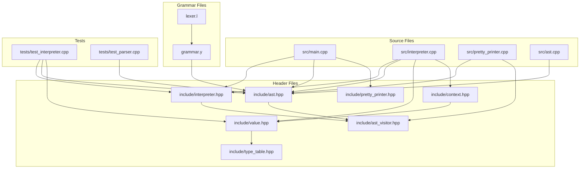
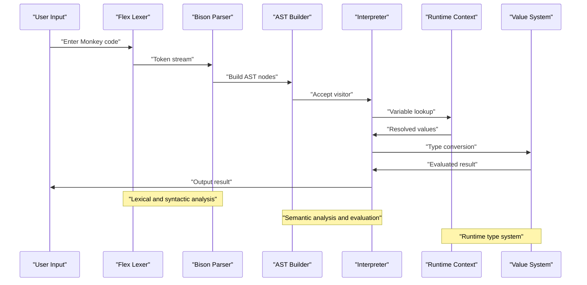
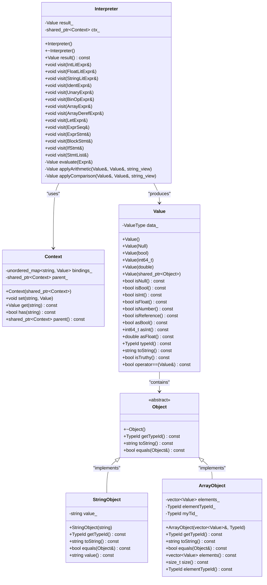
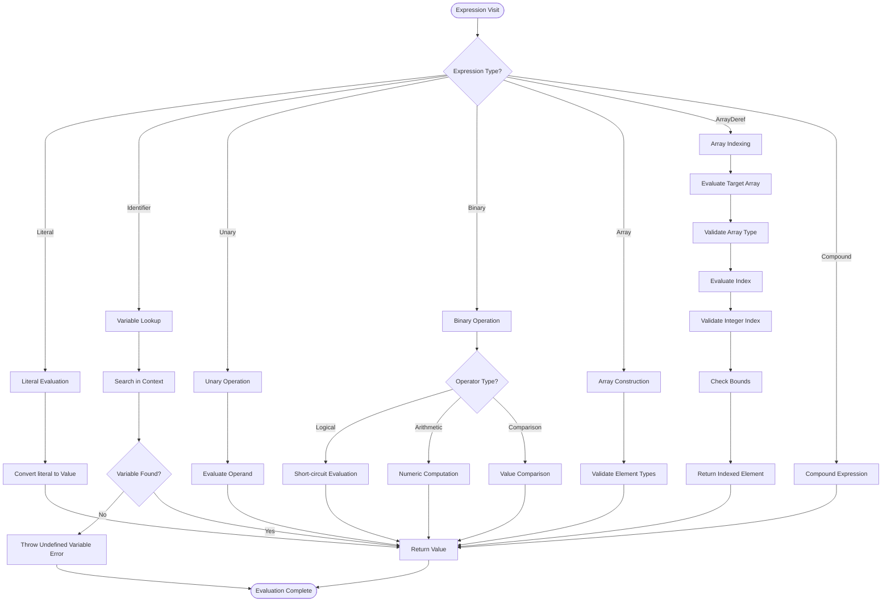
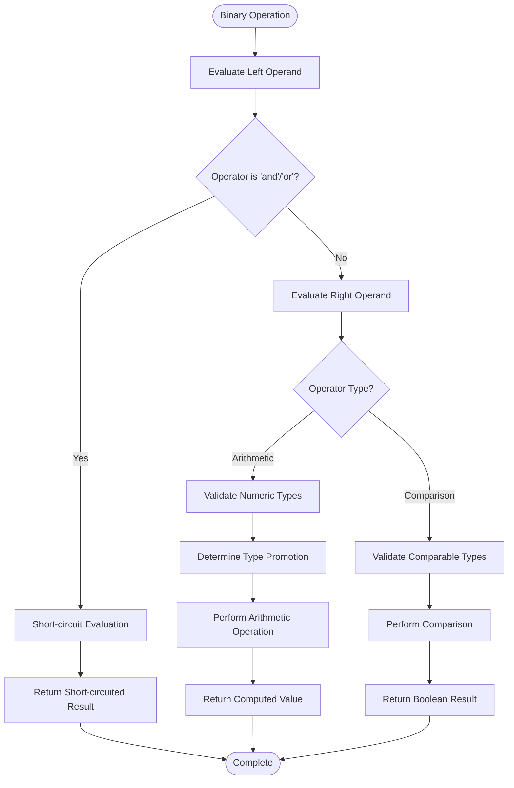
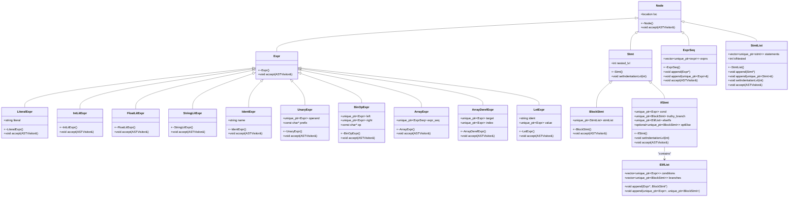
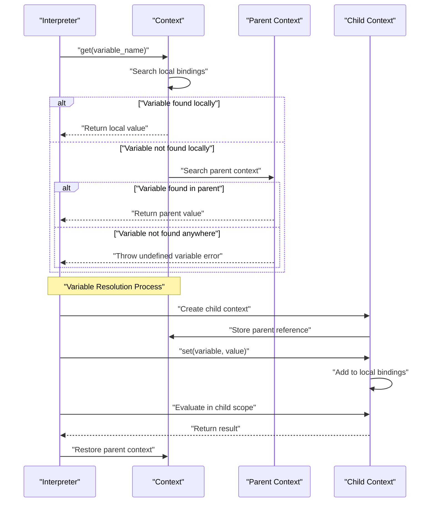
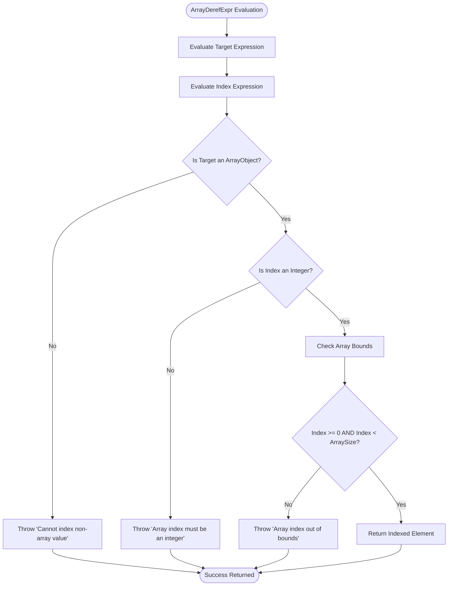
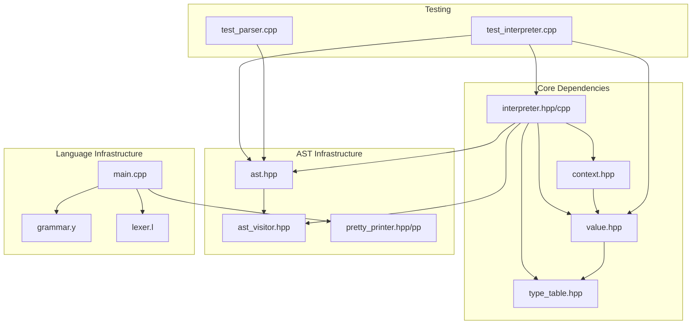

# Interpreter Implementation

<cite>
**Referenced Files in This Document**
- [README.md](file://README.md)
- [interpreter.hpp](file://include/interpreter.hpp)
- [interpreter.cpp](file://src/interpreter.cpp)
- [ast.hpp](file://include/ast.hpp)
- [ast_visitor.hpp](file://include/ast_visitor.hpp)
- [value.hpp](file://include/value.hpp)
- [context.hpp](file://include/context.hpp)
- [type_table.hpp](file://include/type_table.hpp)
- [pretty_printer.hpp](file://include/pretty_printer.hpp)
- [pretty_printer.cpp](file://src/pretty_printer.cpp)
- [main.cpp](file://src/main.cpp)
- [grammar.y](file://grammar.y)
- [lexer.l](file://lexer.l)
- [test_interpreter.cpp](file://tests/test_interpreter.cpp)
- [test_parser.cpp](file://tests/test_parser.cpp)
</cite>

## Update Summary
**Changes Made**
- Added comprehensive documentation for ArrayDerefExpr implementation
- Updated AST node structure to include ArrayDerefExpr
- Enhanced interpreter with runtime validation for array indexing
- Added grammar rules and precedence handling for array dereference operations
- Expanded test coverage for array indexing functionality

## Table of Contents
1. [Introduction](#introduction)
2. [Project Structure](#project-structure)
3. [Core Components](#core-components)
4. [Architecture Overview](#architecture-overview)
5. [Detailed Component Analysis](#detailed-component-analysis)
6. [Dependency Analysis](#dependency-analysis)
7. [Performance Considerations](#performance-considerations)
8. [Troubleshooting Guide](#troubleshooting-guide)
9. [Conclusion](#conclusion)

## Introduction
This document provides comprehensive technical documentation for the Monkey Programming Language interpreter implementation. The project demonstrates modern compiler construction techniques using Flex and Bison to generate C++ parsers, combined with an extensible interpreter architecture. The interpreter supports arithmetic operations, logical comparisons, variable binding, control flow, and heterogeneous data structures including arrays and strings.

The implementation follows a visitor pattern architecture where the AST serves as the central data structure, and specialized visitors handle different aspects of compilation and execution. The interpreter maintains a runtime context for variable scoping and evaluation, while the type system manages primitive and composite data types.

**Updated** Added comprehensive array indexing support with runtime validation for type checking, bounds checking, and appropriate error handling.

## Project Structure
The project follows a modular C++ architecture with clear separation between lexical analysis, parsing, AST construction, and interpretation phases.

**Diagram sources**
- [main.cpp:1-81](file://src/main.cpp#L1-L81)
- [interpreter.hpp:1-44](file://include/interpreter.hpp#L1-L44)
- [ast.hpp:1-214](file://include/ast.hpp#L1-L214)
- [grammar.y:1-132](file://grammar.y#L1-L132)

**Section sources**
- [README.md:1-49](file://README.md#L1-L49)
- [main.cpp:1-81](file://src/main.cpp#L1-L81)

## Core Components
The interpreter implementation consists of several interconnected components that work together to provide a complete runtime environment for the Monkey language.

### Interpreter Class
The `Interpreter` class serves as the primary execution engine, implementing the AST visitor interface to traverse and evaluate abstract syntax trees. It maintains internal state through a result value and a context stack for variable resolution.

Key responsibilities include:
- Expression evaluation through visitor pattern implementation
- Arithmetic and comparison operation handling
- Variable binding and lookup
- Control flow statement processing
- Array literal construction with type validation
- **Array indexing with runtime validation**

### Value System
The `Value` class provides a type-safe container for all runtime values, supporting both primitive types and heap-allocated objects. It uses C++ variants for type safety and includes comprehensive type checking and conversion utilities.

Supported value categories:
- Null values for uninitialized state
- Boolean values for logical operations
- Integer values for whole numbers
- Floating-point values for decimal precision
- Object references for strings, arrays, and custom types

### Context Management
The `Context` class implements a hierarchical variable scoping system using parent-child relationships. This enables proper handling of nested blocks and variable shadowing, crucial for proper language semantics.

### Type System
The `TypeTable` provides centralized type management with support for primitive types, arrays, and composite types. It generates unique type identifiers and maintains metadata for type categorization and size information.

**Updated** Enhanced array type system with proper element type validation and bounds checking.

**Section sources**
- [interpreter.hpp:12-44](file://include/interpreter.hpp#L12-L44)
- [interpreter.cpp:8-265](file://src/interpreter.cpp#L8-L265)
- [value.hpp:25-249](file://include/value.hpp#L25-L249)
- [context.hpp:10-39](file://include/context.hpp#L10-L39)
- [type_table.hpp:67-133](file://include/type_table.hpp#L67-L133)

## Architecture Overview
The interpreter follows a layered architecture with clear separation between parsing, AST construction, and execution phases.

**Diagram sources**
- [lexer.l:1-100](file://lexer.l#L1-L100)
- [grammar.y:1-132](file://grammar.y#L1-L132)
- [interpreter.cpp:8-265](file://src/interpreter.cpp#L8-L265)
- [context.hpp:10-39](file://include/context.hpp#L10-L39)

The architecture implements the Visitor pattern extensively, allowing different operations (printing, interpreting, type checking) to be performed on the same AST structure without modifying the node definitions.

**Section sources**
- [ast_visitor.hpp:22-42](file://include/ast_visitor.hpp#L22-L42)
- [ast.hpp:12-21](file://include/ast.hpp#L12-L21)
- [interpreter.cpp:8-11](file://src/interpreter.cpp#L8-L11)

## Detailed Component Analysis

### Interpreter Implementation Details
The interpreter implementation demonstrates sophisticated handling of Monkey language constructs through carefully designed visitor methods.

**Diagram sources**
- [interpreter.hpp:12-44](file://include/interpreter.hpp#L12-L44)
- [context.hpp:10-39](file://include/context.hpp#L10-L39)
- [value.hpp:25-249](file://include/value.hpp#L25-L249)

#### Expression Evaluation Flow
The interpreter handles different expression types through specialized visitor methods, each implementing specific evaluation semantics.

**Diagram sources**
- [interpreter.cpp:15-25](file://src/interpreter.cpp#L15-L25)
- [interpreter.cpp:29-31](file://src/interpreter.cpp#L29-L31)
- [interpreter.cpp:35-50](file://src/interpreter.cpp#L35-L50)
- [interpreter.cpp:169-186](file://src/interpreter.cpp#L169-L186)
- [interpreter.cpp:188-207](file://src/interpreter.cpp#L188-L207)

#### Binary Operator Processing
The binary operator evaluation demonstrates sophisticated type checking and promotion logic.

**Diagram sources**
- [interpreter.cpp:127-165](file://src/interpreter.cpp#L127-L165)
- [interpreter.cpp:54-94](file://src/interpreter.cpp#L54-L94)
- [interpreter.cpp:96-123](file://src/interpreter.cpp#L96-L123)

**Section sources**
- [interpreter.cpp:15-265](file://src/interpreter.cpp#L15-L265)
- [value.hpp:172-249](file://include/value.hpp#L172-L249)

### AST Node Structure
The AST implementation provides a comprehensive tree structure supporting all Monkey language constructs with proper location tracking and visitor pattern compliance.

**Diagram sources**
- [ast.hpp:14-214](file://include/ast.hpp#L14-L214)

**Updated** Added ArrayDerefExpr node to support array indexing operations with target and index expressions.

**Section sources**
- [ast.hpp:14-214](file://include/ast.hpp#L14-L214)

### Runtime Context Management
The context system implements proper variable scoping with hierarchical lookup and shadowing support.

**Diagram sources**
- [context.hpp:16-25](file://include/context.hpp#L16-L25)
- [interpreter.cpp:226-230](file://src/interpreter.cpp#L226-L230)

**Section sources**
- [context.hpp:10-39](file://include/context.hpp#L10-L39)
- [interpreter.cpp:226-230](file://src/interpreter.cpp#L226-L230)

### ArrayDerefExpr Implementation
The ArrayDerefExpr implementation provides comprehensive runtime validation for array indexing operations.

**Diagram sources**
- [interpreter.cpp:188-207](file://src/interpreter.cpp#L188-L207)
- [ast.hpp:130-140](file://include/ast.hpp#L130-L140)

**Updated** Added comprehensive array indexing implementation with runtime validation including type checking, bounds checking, and appropriate error handling.

**Section sources**
- [interpreter.cpp:188-207](file://src/interpreter.cpp#L188-L207)
- [ast.hpp:130-140](file://include/ast.hpp#L130-L140)

## Dependency Analysis
The interpreter implementation exhibits clean dependency management with clear interfaces between components.

**Diagram sources**
- [interpreter.hpp:3-7](file://include/interpreter.hpp#L3-L7)
- [value.hpp:11](file://include/value.hpp#L11)
- [context.hpp:3](file://include/context.hpp#L3)
- [type_table.hpp:10](file://include/type_table.hpp#L10)
- [ast.hpp:1-8](file://include/ast.hpp#L1-L8)

The dependency graph reveals a well-structured architecture where the interpreter depends on core runtime components but remains agnostic to parsing implementation details. This separation enables easy substitution of different parsers while maintaining consistent execution semantics.

**Section sources**
- [interpreter.hpp:3-7](file://include/interpreter.hpp#L3-L7)
- [ast_visitor.hpp:1-45](file://include/ast_visitor.hpp#L1-L45)

## Performance Considerations
The interpreter implementation incorporates several performance optimizations and considerations:

### Memory Management
- Smart pointer usage ensures automatic resource cleanup
- Shared ownership for object references prevents memory leaks
- RAII principles applied throughout the codebase

### Type Checking Efficiency
- Early type validation reduces runtime errors
- Variant-based type system minimizes branching overhead
- Inline type checking methods reduce function call overhead

### Evaluation Optimizations
- Short-circuit evaluation for logical operators
- Efficient array construction with pre-reserved capacity
- Minimal object creation during evaluation
- **Optimized array indexing with early validation**

### Testing and Validation
The comprehensive test suite validates performance characteristics and correctness across various scenarios, ensuring reliable operation under different usage patterns.

**Updated** Added performance considerations for array indexing operations including early validation and bounds checking optimization.

## Troubleshooting Guide
Common issues and their solutions when working with the interpreter:

### Compilation Issues
- **Missing dependencies**: Ensure Flex, Bison, and CMake are properly installed
- **Compiler compatibility**: Use supported C++ standards and compilers
- **Path configuration**: Verify include paths and library locations

### Runtime Errors
- **Division by zero**: Thrown for arithmetic operations with zero denominator
- **Undefined variables**: Context lookup failures trigger meaningful error messages
- **Type mismatches**: Operations on incompatible types raise runtime exceptions
- **Array indexing errors**: Invalid array types, non-integer indices, or out-of-bounds access trigger specific error messages

### Debugging Strategies
- Enable parser tracing for syntax analysis debugging
- Use pretty printing to visualize AST structure
- Leverage test cases as behavioral specifications

**Updated** Added troubleshooting guidance for array indexing errors including invalid array types, non-integer indices, and out-of-bounds access.

**Section sources**
- [interpreter.cpp:45-49](file://src/interpreter.cpp#L45-L49)
- [interpreter.cpp:68-69](file://src/interpreter.cpp#L68-L69)
- [interpreter.cpp:192-204](file://src/interpreter.cpp#L192-L204)
- [context.hpp:24](file://include/context.hpp#L24)

## Conclusion
The Monkey Programming Language interpreter implementation demonstrates robust compiler construction principles with clean architectural separation and comprehensive language support. The visitor pattern enables extensible functionality while maintaining type safety through careful design decisions.

Key strengths include:
- Well-designed AST hierarchy supporting all language constructs
- Comprehensive type system with proper polymorphism
- Hierarchical context management for proper scoping
- Extensive test coverage validating behavior across scenarios
- Clean separation between parsing and execution phases
- **Robust array indexing implementation with runtime validation**

The implementation provides an excellent foundation for extending the language with additional features such as advanced array operations, function calls, and enhanced type checking capabilities as outlined in the project roadmap.

**Updated** Enhanced conclusion to highlight the comprehensive array indexing implementation with runtime validation as a key feature of the interpreter.