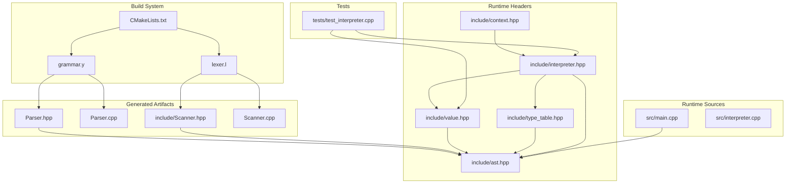
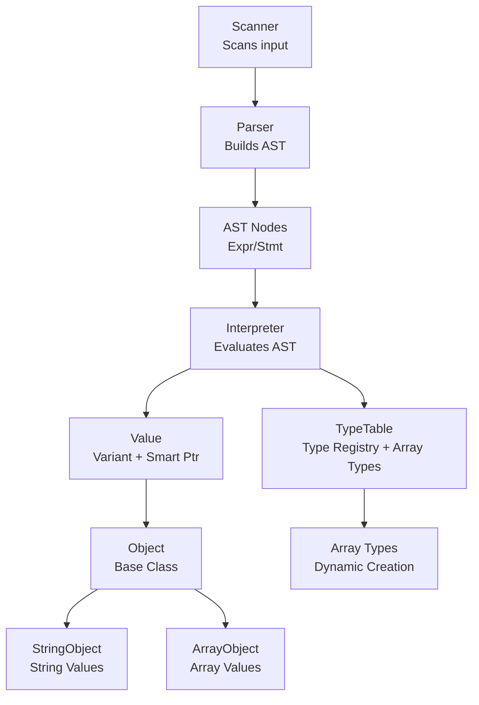
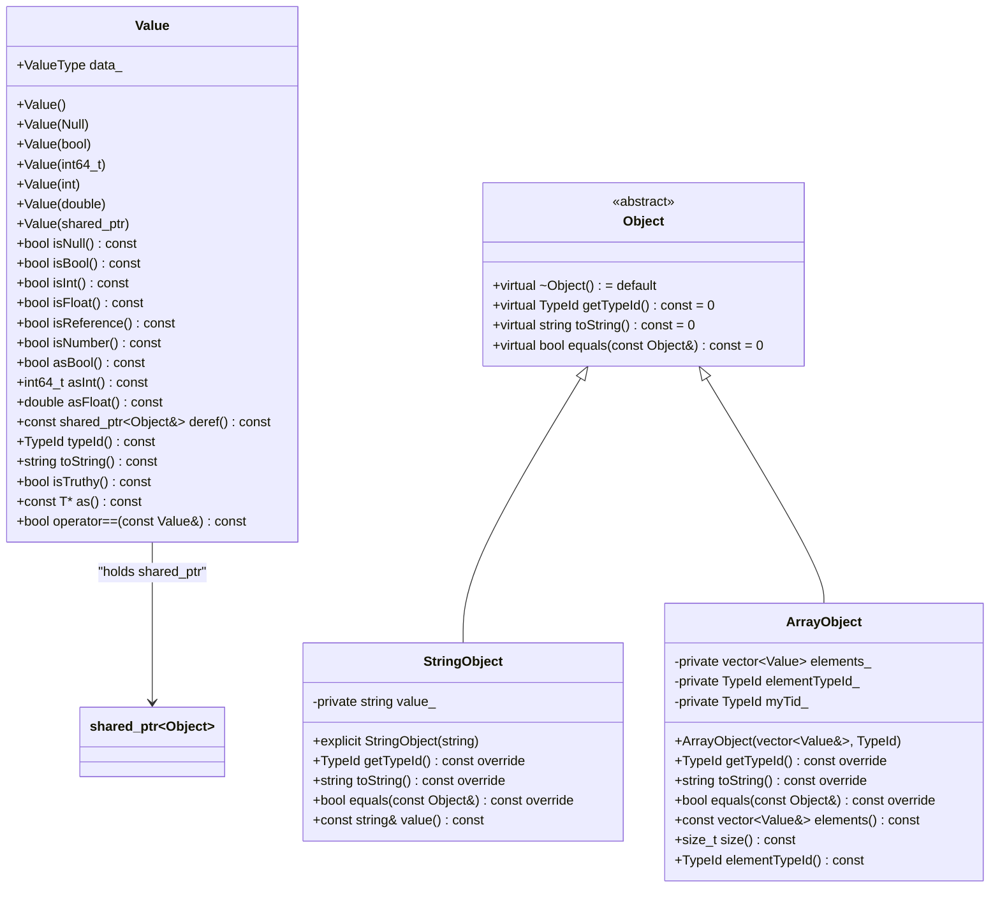
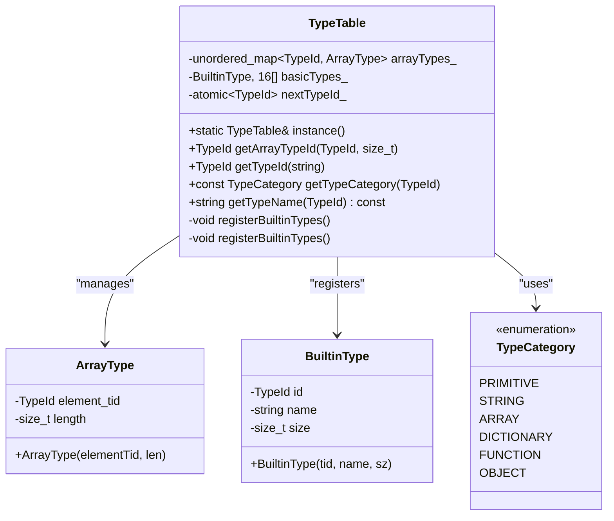
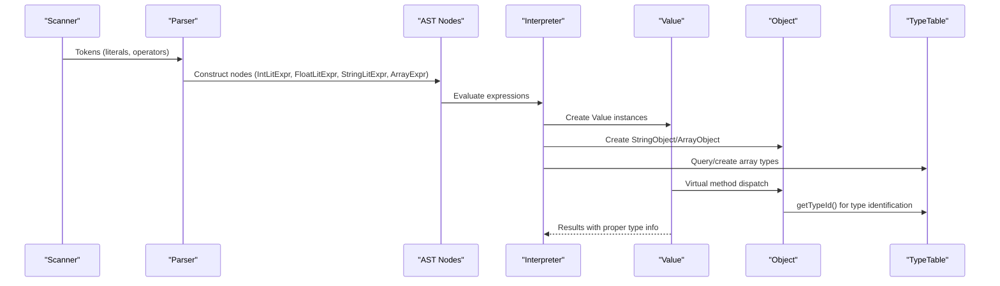
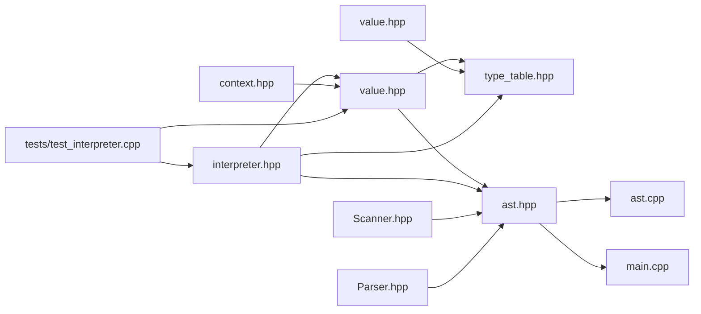

# Runtime System

<cite>
**Referenced Files in This Document**
- [value.hpp](file://include/value.hpp)
- [type_table.hpp](file://include/type_table.hpp)
- [interpreter.hpp](file://include/interpreter.hpp)
- [interpreter.cpp](file://src/interpreter.cpp)
- [grammar.y](file://grammar.y)
- [Scanner.hpp](file://include/Scanner.hpp)
- [ast.hpp](file://include/ast.hpp)
- [context.hpp](file://include/context.hpp)
- [main.cpp](file://src/main.cpp)
- [test_interpreter.cpp](file://tests/test_interpreter.cpp)
- [CMakeLists.txt](file://CMakeLists.txt)
- [README.md](file://README.md)
</cite>

## Update Summary
**Changes Made**
- Complete overhaul from TypedPtr-based to object-oriented design with std::shared_ptr<Object>
- Introduction of StringObject and ArrayObject classes for heap-allocated values
- Enhanced type system with TypeTable singleton and array type creation
- Updated Value class to use std::variant with std::shared_ptr<Object>
- Implemented virtual inheritance for object polymorphism
- Added type-safe casting with Value::as<T>() template method
- Enhanced type category system with ARRAY and DICTIONARY categories

## Table of Contents
1. [Introduction](#introduction)
2. [Project Structure](#project-structure)
3. [Core Components](#core-components)
4. [Architecture Overview](#architecture-overview)
5. [Detailed Component Analysis](#detailed-component-analysis)
6. [Dependency Analysis](#dependency-analysis)
7. [Performance Considerations](#performance-considerations)
8. [Troubleshooting Guide](#troubleshooting-guide)
9. [Conclusion](#conclusion)
10. [Appendices](#appendices)

## Introduction
This document describes the runtime system for the Monkey programming language project, focusing on the modernized object-oriented value type system and enhanced type management. The runtime centers around a variant-based Value type that holds either primitive values (null, boolean, integers, floating-point) or references to heap-allocated objects through a sophisticated object-oriented design using std::shared_ptr<Object>. A TypeTable singleton manages type registration, categories, and metadata for compile-time and runtime type validation. The system integrates with a Bison/Flex-generated parser and scanner to process source tokens into an AST, which can be evaluated by the enhanced runtime system with proper object lifecycle management and type safety.

## Project Structure
The project is organized into:
- include/: Public headers for the runtime (value.hpp, type_table.hpp, interpreter.hpp, context.hpp) and AST/lexer/parser interfaces (Scanner.hpp, ast.hpp).
- src/: Implementation of the main entry point, interpreter, and AST visitor/printing utilities.
- grammar.y: Bison grammar that defines tokens, non-terminals, precedence, and actions for parsing.
- lexer.l: Flex lexer specification (not included here).
- tests/: Comprehensive test suite validating interpreter functionality and type system behavior.
- CMakeLists.txt: Build configuration that generates the parser and scanner, and builds the executable.

**Diagram sources**
- [CMakeLists.txt:19-23](file://CMakeLists.txt#L19-L23)
- [grammar.y:12-14](file://grammar.y#L12-L14)
- [Scanner.hpp:1-44](file://include/Scanner.hpp#L1-L44)
- [ast.hpp:1-202](file://include/ast.hpp#L1-L202)
- [value.hpp:1-249](file://include/value.hpp#L1-L249)
- [type_table.hpp:1-138](file://include/type_table.hpp#L1-L138)
- [interpreter.hpp:1-43](file://include/interpreter.hpp#L1-L43)
- [context.hpp:1-42](file://include/context.hpp#L1-L42)
- [main.cpp:1-81](file://src/main.cpp#L1-L81)
- [interpreter.cpp:1-244](file://src/interpreter.cpp#L1-L244)
- [test_interpreter.cpp:1-339](file://tests/test_interpreter.cpp#L1-L339)

**Section sources**
- [CMakeLists.txt:19-23](file://CMakeLists.txt#L19-L23)
- [README.md:14-40](file://README.md#L14-L40)

## Core Components
- **Variant-based Value**: A discriminated union holding primitives and std::shared_ptr<Object> references, providing type-safe access and automatic memory management.
- **Object-Oriented Design**: Base Object class with virtual methods for type identification, string representation, and equality comparison, implemented by StringObject and ArrayObject.
- **Enhanced Type System**: TypeTable singleton managing built-in types, array types, and providing type category classification with thread-safe registration.
- **Smart Pointer Management**: Automatic memory management through std::shared_ptr<Object> eliminating manual memory allocation/deallocation complexity.
- **AST and Parser Integration**: Generated by Bison/Flex to parse source into an AST, with the runtime system evaluating AST nodes using the enhanced Value/Object model.

Key responsibilities:
- **Value**: Encapsulates runtime values with automatic memory management, type safety, and conversions.
- **Object**: Base class for heap-allocated values with virtual polymorphic behavior.
- **StringObject**: Specialized object for string literals with value semantics and type safety.
- **ArrayObject**: Specialized object for array literals with element type validation and dynamic type creation.
- **TypeTable**: Centralized type registry with array type creation and category classification.
- **Interpreter**: AST visitor implementing evaluation logic with object-oriented value handling.

**Section sources**
- [value.hpp:24-94](file://include/value.hpp#L24-L94)
- [value.hpp:96-170](file://include/value.hpp#L96-L170)
- [type_table.hpp:67-133](file://include/type_table.hpp#L67-L133)
- [interpreter.cpp:23-25](file://src/interpreter.cpp#L23-L25)
- [interpreter.cpp:169-186](file://src/interpreter.cpp#L169-L186)

## Architecture Overview
The runtime architecture couples the generated parser with the enhanced object-oriented value system. The scanner/tokenizer feeds tokens into the parser, which constructs AST nodes. The interpreter traverses the AST, evaluates expressions, and manipulates Value/Object instances with automatic memory management and type safety enforcement.

**Diagram sources**
- [Scanner.hpp:13-42](file://include/Scanner.hpp#L13-L42)
- [grammar.y:102-124](file://grammar.y#L102-L124)
- [ast.hpp:65-129](file://include/ast.hpp#L65-L129)
- [interpreter.cpp:8-11](file://src/interpreter.cpp#L8-L11)
- [value.hpp:24-94](file://include/value.hpp#L24-L94)
- [value.hpp:96-170](file://include/value.hpp#L96-L170)
- [type_table.hpp:67-133](file://include/type_table.hpp#L67-L133)

## Detailed Component Analysis

### Enhanced Value Type System
The Value class encapsulates runtime values using a variant that holds either:
- **Primitives**: Null, Bool, int64_t, double
- **Object References**: std::shared_ptr<Object> for heap-allocated values

**Key Enhancements**:
- **Automatic Memory Management**: std::shared_ptr<Object> handles object lifecycle automatically
- **Type Safety**: Virtual method dispatch through Object base class
- **Template Casting**: Value::as<T>() provides safe downcasting with dynamic_cast
- **Enhanced Type Resolution**: Value::typeId() uses virtual inheritance for accurate type identification

Type checking and accessors:
- isNull(), isBool(), isInt(), isFloat(), isReference()
- asBool(), asInt(), asFloat(), deref()
- as<T>() template method for safe object casting
- isNumber() helper and isTruthy() for conditional evaluation
- operator== with value semantics for object comparison

Type conversion:
- asFloat() converts int to double; throws if not numeric
- Numeric promotion occurs implicitly in arithmetic contexts
- Automatic conversion between compatible numeric types

Equality:
- For object values, equality delegates to Object::equals() for value semantics
- Reference equality uses pointer comparison for same object instances
- Value comparison implemented through virtual equals() method

**Updated** The Value class now uses std::shared_ptr<Object> instead of raw pointers, providing automatic memory management while maintaining type safety through virtual inheritance.

**Diagram sources**
- [value.hpp:24-94](file://include/value.hpp#L24-L94)
- [value.hpp:96-170](file://include/value.hpp#L96-L170)
- [value.hpp:109-128](file://include/value.hpp#L109-L128)
- [value.hpp:131-170](file://include/value.hpp#L131-L170)

**Section sources**
- [value.hpp:24-94](file://include/value.hpp#L24-L94)
- [value.hpp:172-246](file://include/value.hpp#L172-L246)

### Object-Oriented Design and Memory Management
The new object-oriented design introduces:
- **Virtual Inheritance**: Object base class provides polymorphic behavior
- **Smart Pointers**: std::shared_ptr<Object> for automatic memory management
- **Specialized Objects**: StringObject and ArrayObject for specific value types
- **Type Safety**: Virtual methods ensure proper type identification and comparison

**StringObject Features**:
- Stores string value with copy semantics
- Implements proper equality comparison for string content
- Provides efficient string representation for toString()

**ArrayObject Features**:
- Stores vector of Value elements with type validation
- Creates unique TypeId based on element type and length
- Implements array-specific toString() and equality semantics
- Enforces homogeneous element types in arrays

Memory management benefits:
- Automatic cleanup when last shared_ptr is destroyed
- Elimination of manual memory allocation/deallocation
- Thread-safe reference counting for concurrent access

**Updated** The object-oriented design replaces the previous TypedPtr system with proper inheritance hierarchies and automatic memory management.

**Section sources**
- [value.hpp:96-170](file://include/value.hpp#L96-L170)
- [value.hpp:109-128](file://include/value.hpp#L109-L128)
- [value.hpp:131-170](file://include/value.hpp#L131-L170)

### Enhanced Type Table and Array Type System
TypeTable is a singleton that:
- **Registers Built-in Types**: null, bool, int, float, string with metadata
- **Creates Array Types Dynamically**: getArrayTypeId() generates unique TypeIds for arrays
- **Manages Type Categories**: PRIMITIVE, STRING, ARRAY, DICTIONARY, FUNCTION, OBJECT
- **Provides Type Information**: getTypeName() with array type formatting support

**Array Type Creation**:
- Dynamic generation of unique TypeIds for different array configurations
- Element type and length combination determines array type identity
- getTypeName() formats array types as "elementType[length]"
- Efficient lookup using unordered_map for array types

**Enhanced Type Categories**:
- PRIMITIVE: null, bool, int, float
- STRING: string objects
- ARRAY: dynamically created array types
- DICTIONARY: dictionary objects (future expansion)
- FUNCTION: function objects (future expansion)
- OBJECT: composite object types

Built-in type IDs:
- TYPE_NULL, TYPE_BOOL, TYPE_INT, TYPE_FLOAT, TYPE_STRING

**Updated** The TypeTable now supports dynamic array type creation and enhanced type category classification.

**Diagram sources**
- [type_table.hpp:67-133](file://include/type_table.hpp#L67-L133)
- [type_table.hpp:55-64](file://include/type_table.hpp#L55-L64)
- [type_table.hpp:43-53](file://include/type_table.hpp#L43-L53)
- [type_table.hpp:28-40](file://include/type_table.hpp#L28-L40)

**Section sources**
- [type_table.hpp:67-133](file://include/type_table.hpp#L67-L133)
- [type_table.hpp:87-107](file://include/type_table.hpp#L87-L107)

### Interpreter Integration and Object Handling
The interpreter integrates seamlessly with the new object-oriented design:
- **String Literal Evaluation**: Creates StringObject instances with std::make_shared
- **Array Literal Evaluation**: Validates homogeneous types and creates ArrayObject
- **Type Resolution**: Uses virtual getTypeId() for accurate type identification
- **Object Casting**: Utilizes Value::as<T>() for safe object type checking

**Array Type Validation**:
- Validates all elements have the same type before creating ArrayObject
- Throws runtime_error for mixed-type arrays
- Creates unique TypeId based on element type and array length

**String Object Creation**:
- Direct mapping from string literals to StringObject instances
- Proper memory management through shared_ptr
- Type identification as TYPE_STRING

**Updated** The interpreter now handles object-oriented values with proper type safety and memory management.

**Section sources**
- [interpreter.cpp:23-25](file://src/interpreter.cpp#L23-L25)
- [interpreter.cpp:169-186](file://src/interpreter.cpp#L169-L186)
- [interpreter.cpp:173-184](file://src/interpreter.cpp#L173-L184)

### Relationship Between Compile-Time Type Information and Runtime Representation
- The grammar defines tokens and non-terminals for literals and expressions
- AST nodes carry semantic values but rely on runtime evaluation
- The enhanced Value/Object model provides actual runtime representation
- TypeTable serves as bridge between compile-time type concepts and runtime type checks
- Array types are created dynamically based on runtime evaluation results

**Diagram sources**
- [Scanner.hpp:13-42](file://include/Scanner.hpp#L13-L42)
- [grammar.y:102-124](file://grammar.y#L102-L124)
- [ast.hpp:65-129](file://include/ast.hpp#L65-L129)
- [interpreter.cpp:8-11](file://src/interpreter.cpp#L8-L11)
- [value.hpp:172-186](file://include/value.hpp#L172-L186)
- [type_table.hpp:87-107](file://include/type_table.hpp#L87-L107)

### Type Coercion Rules and Type Safety Mechanisms
- **Explicit Conversions**:
  - asFloat() converts int to double; throws if not numeric
  - asInt() extracts integer; throws if not int
  - asBool() extracts boolean; throws if not bool
  - as<T>() template method for safe object casting
- **Implicit Promotions**:
  - Arithmetic operations promote integers to floating-point when mixed with floats
  - Automatic numeric type conversion in arithmetic contexts
- **Enhanced Type Safety**:
  - Virtual method dispatch through Object base class
  - Safe casting with dynamic_cast and template specialization
  - Value semantics for object equality comparison
  - Automatic memory management prevents dangling pointers

**Type Coercion Examples**:
- Integer to float conversion in mixed arithmetic operations
- String concatenation through StringObject::toString()
- Array element access with proper type validation

**Updated** Type safety now leverages virtual inheritance and template-based casting for enhanced reliability.

**Section sources**
- [value.hpp:48-73](file://include/value.hpp#L48-L73)
- [value.hpp:202-206](file://include/value.hpp#L202-L206)
- [interpreter.cpp:54-94](file://src/interpreter.cpp#L54-L94)

### Extensibility Points for New Value Types and Custom Behaviors
- **Adding New Object Types**:
  - Define new class inheriting from Object with getTypeId(), toString(), equals()
  - Implement proper type identification and value semantics
  - Register with TypeTable for type metadata
- **Adding New Primitive-like Value Variants**:
  - Extend Value::ValueType and add constructors, accessors, and type checks
  - Update equality and string conversion logic with virtual methods
  - Ensure proper integration with TypeTable
- **Extending TypeTable**:
  - Use registerType() for user-defined types with category and size metadata
  - Utilize helper predicates to gate operations based on type categories
  - Support dynamic array type creation for new container types

**Array Type Extension**:
- New container types can leverage getArrayTypeId() for dynamic type creation
- Element type validation ensures type safety for new containers
- Type category classification supports future expansion

**Updated** The extensibility model supports both primitive and object-oriented value types with proper type system integration.

**Section sources**
- [value.hpp:96-170](file://include/value.hpp#L96-L170)
- [type_table.hpp:87-107](file://include/type_table.hpp#L87-L107)
- [type_table.hpp:119-127](file://include/type_table.hpp#L119-L127)

## Dependency Analysis
The enhanced runtime system components depend on each other as follows:
- **Value** depends on Object hierarchy and TypeTable for type metadata
- **Object classes** depend on std::string and std::vector for concrete implementations
- **TypeTable** depends on unordered_map and std::atomic for fast lookups and thread-safe registration
- **Interpreter** depends on AST nodes and Value/Object system for evaluation
- **Context** manages Value instances with proper lifetime management

**Updated** Dependencies now leverage smart pointers and virtual inheritance for better abstraction and memory management.

**Diagram sources**
- [value.hpp:1-249](file://include/value.hpp#L1-L249)
- [type_table.hpp:1-138](file://include/type_table.hpp#L1-L138)
- [interpreter.hpp:1-43](file://include/interpreter.hpp#L1-L43)
- [context.hpp:1-42](file://include/context.hpp#L1-L42)
- [ast.hpp:1-202](file://include/ast.hpp#L1-L202)
- [Scanner.hpp:1-44](file://include/Scanner.hpp#L1-L44)
- [interpreter.cpp:1-244](file://src/interpreter.cpp#L1-L244)
- [test_interpreter.cpp:1-339](file://tests/test_interpreter.cpp#L1-L339)
- [main.cpp:1-81](file://src/main.cpp#L1-L81)

**Section sources**
- [value.hpp:1-249](file://include/value.hpp#L1-L249)
- [type_table.hpp:1-138](file://include/type_table.hpp#L1-L138)
- [interpreter.hpp:1-43](file://include/interpreter.hpp#L1-L43)
- [context.hpp:1-42](file://include/context.hpp#L1-L42)
- [ast.hpp:1-202](file://include/ast.hpp#L1-L202)
- [Scanner.hpp:1-44](file://include/Scanner.hpp#L1-L44)
- [interpreter.cpp:1-244](file://src/interpreter.cpp#L1-L244)
- [test_interpreter.cpp:1-339](file://tests/test_interpreter.cpp#L1-L339)
- [main.cpp:1-81](file://src/main.cpp#L1-L81)

## Performance Considerations
- **Value Storage**: The variant-based Value remains compact with minimal overhead for primitives
- **Object Overhead**: std::shared_ptr adds small overhead but provides automatic memory management
- **Virtual Method Calls**: Slight performance cost for virtual method dispatch vs. direct function calls
- **Type Checks**: std::holds_alternative and std::get remain O(1); virtual calls are O(1) with vtable lookup
- **Array Type Creation**: Dynamic array type creation uses hash map for O(1) average lookup
- **Memory Management**: Automatic cleanup eliminates memory leaks and reduces GC pressure
- **Thread Safety**: Atomic operations for type registration provide thread-safe type creation
- **Smart Pointer Benefits**: Reference counting overhead is offset by elimination of manual memory management

**Performance Improvements**:
- Automatic memory management reduces runtime errors and cleanup complexity
- Virtual inheritance enables polymorphic behavior without manual pointer management
- Template-based casting provides compile-time type safety with runtime flexibility

**Updated** Performance analysis reflects the trade-offs between virtual method calls and automatic memory management benefits.

## Troubleshooting Guide
Common issues and resolutions:
- **Type Mismatch Errors**: Use isX() checks before asX() to prevent exceptions
- **Object Casting Issues**: Use Value::as<T>() template method for safe casting
- **Array Type Validation**: Mixed-type arrays throw runtime_error during evaluation
- **String Object Access**: Use deref() then as<StringObject>() for string-specific operations
- **Array Object Operations**: Use as<ArrayObject>() for array-specific methods like size() and elements()
- **Type Identification**: Use Value::typeId() for accurate type information
- **Memory Leaks**: No manual memory management required with std::shared_ptr
- **Virtual Method Issues**: Ensure proper Object inheritance for custom types

**New Troubleshooting Scenarios**:
- **Array Type Creation Failures**: Verify element type homogeneity before array creation
- **Object Equality Pitfalls**: Object equality now uses value semantics through virtual equals()
- **Smart Pointer Lifetime**: Understand shared_ptr reference counting for object lifecycle
- **Type Category Classification**: Use TypeTable::getTypeCategory() for proper type categorization

**Updated** Added guidance for object-oriented design patterns and smart pointer usage.

**Section sources**
- [value.hpp:48-73](file://include/value.hpp#L48-L73)
- [value.hpp:202-206](file://include/value.hpp#L202-L206)
- [interpreter.cpp:173-184](file://src/interpreter.cpp#L173-L184)
- [type_table.hpp:75-85](file://include/type_table.hpp#L75-L85)

## Conclusion
The enhanced runtime system provides a robust, extensible foundation for representing values and objects in the Monkey language. The transition from TypedPtr-based to object-oriented design with std::shared_ptr<Object> delivers automatic memory management, proper polymorphic behavior, and enhanced type safety. The new StringObject and ArrayObject classes provide specialized handling for heap-allocated values with value semantics. The enhanced TypeTable with dynamic array type creation and comprehensive type categories enables scalable type management. Together with the generated parser and scanner, this system enables a clean separation between lexical/syntactic analysis and runtime evaluation, with strong type safety, automatic memory management, and straightforward extension points for new types and behaviors.

## Appendices

### Grammar and Tokenization Integration
- The grammar defines tokens for literals and operators and constructs AST nodes for expressions and statements
- The scanner provides token locations for error reporting and pretty printing
- Enhanced integration with interpreter for object-oriented value creation

**Section sources**
- [grammar.y:102-124](file://grammar.y#L102-L124)
- [Scanner.hpp:13-42](file://include/Scanner.hpp#L13-L42)

### AST Visitor Pattern
- AST nodes implement accept() to support traversal by visitors
- Enhanced visitor pattern supports object-oriented value evaluation
- Interpreter implements comprehensive AST traversal with object handling

**Section sources**
- [ast.hpp:14-21](file://include/ast.hpp#L14-L21)
- [ast.hpp:65-129](file://include/ast.hpp#L65-L129)
- [interpreter.hpp:12-40](file://include/interpreter.hpp#L12-L40)

### Test Coverage and Validation
- Comprehensive test suite validates interpreter functionality
- Tests cover primitive types, string objects, and array objects
- Type system validation includes array type creation and equality semantics
- Memory management verified through proper object lifecycle testing

**Section sources**
- [test_interpreter.cpp:223-298](file://tests/test_interpreter.cpp#L223-L298)
- [test_interpreter.cpp:300-338](file://tests/test_interpreter.cpp#L300-L338)