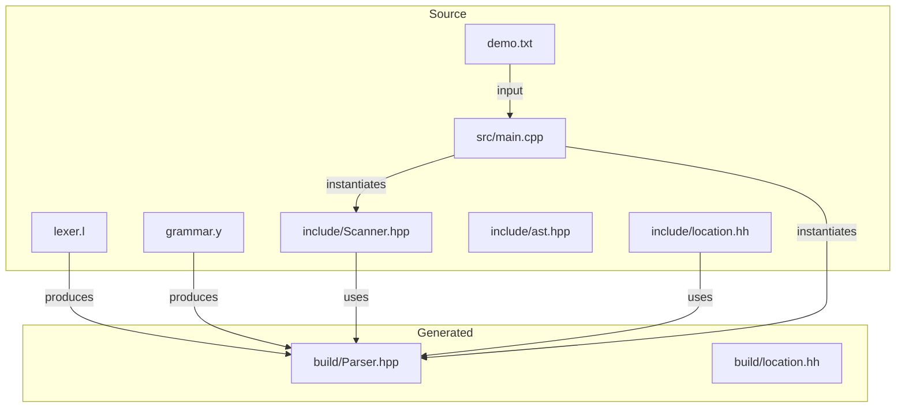
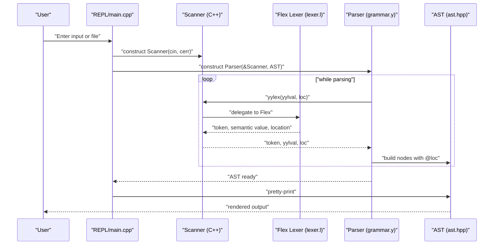
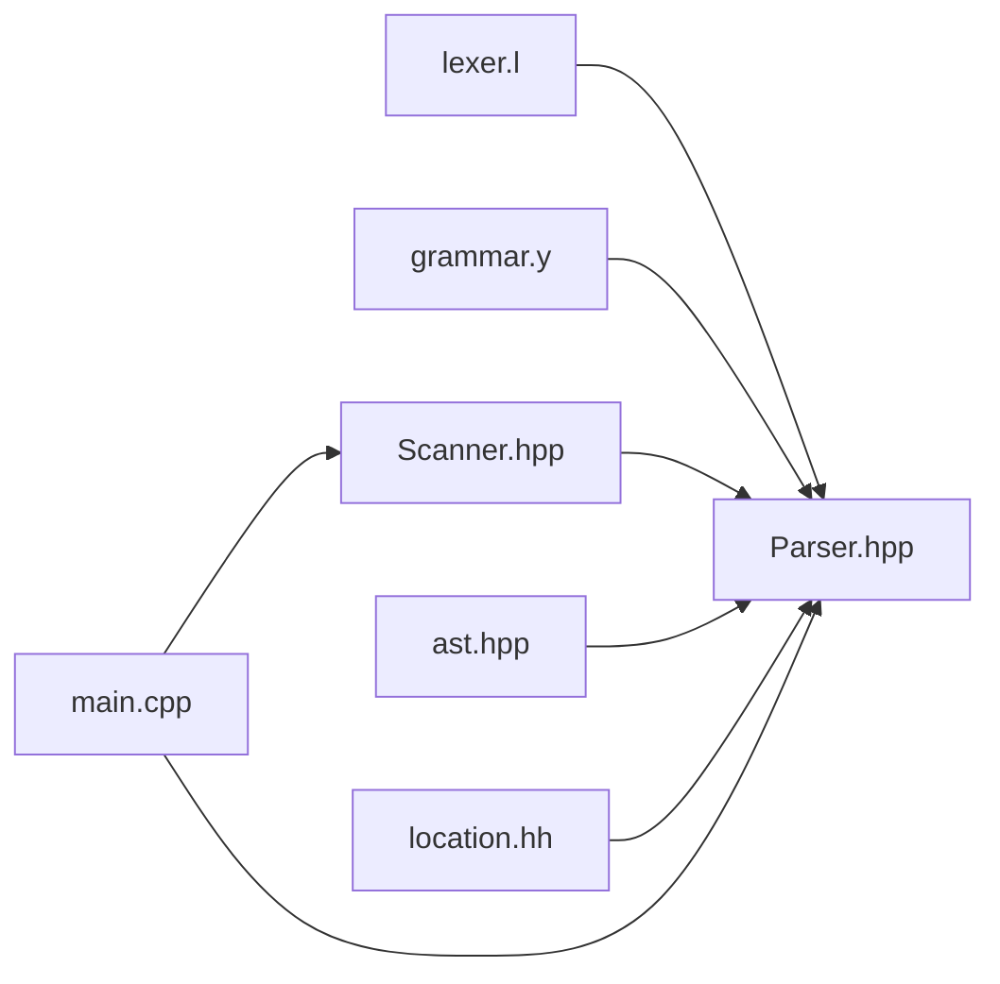
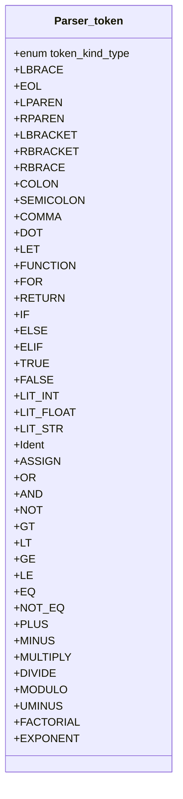

# Scanner and Lexer

<cite>
**Referenced Files in This Document**
- [lexer.l](file://lexer.l)
- [grammar.y](file://grammar.y)
- [Scanner.hpp](file://include/Scanner.hpp)
- [Parser.hpp](file://build/Parser.hpp)
- [location.hh](file://build/location.hh)
- [ast.hpp](file://include/ast.hpp)
- [main.cpp](file://src/main.cpp)
- [demo.txt](file://demo.txt)
- [README.md](file://README.md)
</cite>

## Update Summary
**Changes Made**
- Updated identifier pattern documentation to reflect the critical regex syntax fix
- Enhanced token recognition patterns section with corrected identifier syntax
- Added troubleshooting guidance for regex syntax errors
- Updated examples to demonstrate improved identifier recognition

## Table of Contents
1. [Introduction](#introduction)
2. [Project Structure](#project-structure)
3. [Core Components](#core-components)
4. [Architecture Overview](#architecture-overview)
5. [Detailed Component Analysis](#detailed-component-analysis)
6. [Dependency Analysis](#dependency-analysis)
7. [Performance Considerations](#performance-considerations)
8. [Troubleshooting Guide](#troubleshooting-guide)
9. [Conclusion](#conclusion)
10. [Appendices](#appendices)

## Introduction
This document explains the Flex-based scanner and lexical analyzer for a C++ compiler front-end that integrates with a Bison parser. It covers the lexer specification, token recognition patterns, state management, token classification, location tracking, and the integration between the Flex-generated lexer and the Bison parser. It also includes examples of token recognition, handling of edge cases, performance considerations, and extensibility for adding new token types.

**Updated** Fixed critical regex syntax error in identifier pattern recognition for Monkey language identifiers.

## Project Structure
The project is organized around a small DSL-like language with a REPL and file-based input. The lexer is implemented in a Flex specification, the parser in a Bison grammar, and the integration is handled in C++ classes and headers.

**Diagram sources**
- [lexer.l:1-100](file://lexer.l#L1-L100)
- [grammar.y:1-129](file://grammar.y#L1-L129)
- [Scanner.hpp:1-44](file://include/Scanner.hpp#L1-L44)
- [Parser.hpp:1-689](file://build/Parser.hpp#L1-L689)
- [location.hh:1-307](file://build/location.hh#L1-L307)
- [ast.hpp:1-203](file://include/ast.hpp#L1-L203)
- [main.cpp:1-84](file://src/main.cpp#L1-L84)
- [demo.txt:1-40](file://demo.txt#L1-L40)

**Section sources**
- [README.md:1-41](file://README.md#L1-L41)
- [main.cpp:25-84](file://src/main.cpp#L25-L84)

## Core Components
- Flex scanner (lexer.l): Defines token recognition patterns, actions, and state management for string literals and numeric formats. It integrates with the C++ scanner wrapper and location tracking.
- C++ scanner wrapper (include/Scanner.hpp): Provides a custom lex method, maintains indentation level, and tracks string literal positions.
- Bison parser (grammar.y): Declares tokens and semantic value types, sets up location tracking, and defines parsing rules.
- Generated parser header (build/Parser.hpp): Contains token enumerations and semantic value type infrastructure used by the parser.
- Location tracking (build/location.hh): Implements position and location classes for precise error reporting.
- AST nodes (include/ast.hpp): Nodes carry location information for diagnostics and pretty printing.
- Integration entry point (src/main.cpp): Creates Scanner and Parser instances and runs the REPL or file-based parsing.

**Section sources**
- [lexer.l:1-100](file://lexer.l#L1-L100)
- [Scanner.hpp:1-44](file://include/Scanner.hpp#L1-L44)
- [grammar.y:1-129](file://grammar.y#L1-L129)
- [Parser.hpp:490-689](file://build/Parser.hpp#L490-L689)
- [location.hh:1-307](file://build/location.hh#L1-L307)
- [ast.hpp:1-203](file://include/ast.hpp#L1-L203)
- [main.cpp:25-84](file://src/main.cpp#L25-L84)

## Architecture Overview
The scanner and parser collaborate as follows:
- The Flex scanner reads input and recognizes tokens, invoking the C++ scanner's lex method to pass semantic values and locations to the parser.
- The parser uses Bison's location tracking to annotate AST nodes with precise source spans.
- The AST visitor pretty-prints the parsed program with location-aware output.

**Diagram sources**
- [main.cpp:35-55](file://src/main.cpp#L35-L55)
- [Scanner.hpp:30-30](file://include/Scanner.hpp#L30-L30)
- [lexer.l:6-10](file://lexer.l#L6-L10)
- [grammar.y:34-39](file://grammar.y#L34-L39)
- [ast.hpp:14-21](file://include/ast.hpp#L14-L21)

## Detailed Component Analysis

### Flex-based Lexer Specification and Token Recognition
- Token recognition patterns:
  - Numeric literals: integers and floating-point numbers with optional fractional and exponent parts.
  - **Fixed** Identifiers: alphabetic start followed by alphanumeric and underscore using correct POSIX character class syntax `[[:alpha:]][[:alnum:]_]*`.
  - Keywords: reserved words mapped to specific token kinds.
  - Operators and punctuation: arithmetic, comparison, logical, grouping, and separators.
  - Whitespace and end-of-line: skipped or reported as EOL.
  - Comments: single-line comments are skipped.
  - String literals: delimited by double quotes with a dedicated state for multi-character sequences and escape handling.
- Actions:
  - Populate semantic values (strings for literals and identifiers).
  - Track and report locations using YY_USER_ACTION and FIX_MY_LINES macros.
  - Manage indentation level for block delimiters.
  - Handle EOF and unmatched input gracefully.

**Updated** The identifier pattern has been corrected from the previous invalid syntax `[:alpha:][[:alnum:]_]*` to the proper POSIX character class syntax `[[:alpha:]][[:alnum:]_]*`.

Key implementation references:
- Token definitions and patterns: [lexer.l:21-94](file://lexer.l#L21-L94)
- YY_DECL customization and YY_USER_ACTION/FIX_MY_LINES: [lexer.l:6-11](file://lexer.l#L6-L11)
- String literal state and escapes: [lexer.l:31-49](file://lexer.l#L31-L49)
- Numeric formats: [lexer.l:27-28](file://lexer.l#L27-L28)
- Whitespace, newline, and comments: [lexer.l:89-92](file://lexer.l#L89-L92)
- EOF handling: [lexer.l:93-94](file://lexer.l#L93-L94)

Token classification and categories:
- Literals: LIT_INT, LIT_FLOAT, LIT_STR
- Identifiers: Ident (using corrected POSIX character class syntax)
- Keywords: LET, FUNCTION, FOR, RETURN, IF, ELSE, ELIF, TRUE, FALSE, AND, OR, NOT
- Operators: PLUS, MINUS, MULTIPLY, DIVIDE, MODULO, FACTORIAL, EXPONENT, GT, LT, GE, LE, EQ, NOT_EQ, AND, OR, NOT
- Grouping and separators: LPAREN, RPAREN, LBRACKET, RBRACKET, LBRACE, RBRACE, COLON, SEMICOLON, COMMA, DOT
- Special: EOL, YYEOF

Edge cases and malformed input:
- Unmatched characters fall through to a no-action rule, allowing the parser to trigger errors.
- Newline handling advances line counts via FIX_MY_LINES macro.
- String literal state transitions and escape sequences are supported.

**Section sources**
- [lexer.l:1-100](file://lexer.l#L1-L100)

### C++ Scanner Wrapper and State Management
- Purpose: wrap Flex's lexer, provide a custom lex method signature compatible with the parser, manage indentation level, and track string literal positions.
- Key responsibilities:
  - Initialize location with filename.
  - Provide startStr/endStr and strLocation for accurate string literal spans.
  - Delegate tokenization to Flex and return tokens with semantic values and locations.

Implementation highlights:
- Custom lex method declaration: [Scanner.hpp:30-30](file://include/Scanner.hpp#L30-L30)
- Indentation tracking for braces: [lexer.l:82-83](file://lexer.l#L82-L83)
- String literal position capture: [Scanner.hpp:26-28](file://include/Scanner.hpp#L26-L28)

**Section sources**
- [Scanner.hpp:1-44](file://include/Scanner.hpp#L1-L44)
- [lexer.l:82-83](file://lexer.l#L82-L83)

### Location Tracking and Error Reporting
- Position and location classes maintain begin/end coordinates and filenames.
- YY_USER_ACTION updates the current location step-wise; FIX_MY_LINES updates line counts.
- Parser uses locations to annotate AST nodes, enabling precise diagnostics.

References:
- Position and location classes: [location.hh:61-232](file://build/location.hh#L61-L232)
- YY_USER_ACTION and FIX_MY_LINES usage: [lexer.l:9-10](file://lexer.l#L9-L10)
- Parser error handler printing location: [grammar.y:127-129](file://grammar.y#L127-L129)
- AST nodes carrying location: [ast.hpp:14-21](file://include/ast.hpp#L14-L21)

**Section sources**
- [location.hh:1-307](file://build/location.hh#L1-L307)
- [lexer.l:9-10](file://lexer.l#L9-L10)
- [grammar.y:127-129](file://grammar.y#L127-L129)
- [ast.hpp:14-21](file://include/ast.hpp#L14-L21)

### Integration Between Flex Lexer and Bison Parser
- The parser declares a parse parameter for the scanner and defines a macro to route yylex calls to the scanner's lex method.
- Tokens are declared with semantic value types (e.g., <std::string>, <int>) to match the scanner's payload.
- The parser uses locations extensively for AST nodes and error reporting.

Integration references:
- Parser parse parameter and yylex routing: [grammar.y:20-39](file://grammar.y#L20-L39)
- Token declarations with semantic value types: [grammar.y:41-46](file://grammar.y#L41-L46)
- Generated token enumerations: [Parser.hpp:494-542](file://build/Parser.hpp#L494-L542)

**Section sources**
- [grammar.y:20-39](file://grammar.y#L20-L39)
- [grammar.y:41-46](file://grammar.y#L41-L46)
- [Parser.hpp:494-542](file://build/Parser.hpp#L494-L542)

### Token Classification and Categorization
- Literals: integers, floats, and strings are emitted with semantic values and distinct token kinds.
- Identifiers: emitted as Ident with their textual value using the corrected POSIX character class syntax.
- Keywords: mapped to specific token kinds for parser rules.
- Operators and punctuation: grouped by precedence and associativity in the grammar.
- Whitespace and comments: not emitted as tokens; newlines emit EOL for statement separation.

Examples from the lexer:
- Integer and float literals: [lexer.l:51-52](file://lexer.l#L51-L52)
- Identifier emission: [lexer.l:92-92](file://lexer.l#L92-L92)
- Keyword tokens: [lexer.l:53-64](file://lexer.l#L53-L64)
- Operators and punctuation: [lexer.l:65-88](file://lexer.l#L65-L88)
- Whitespace and comments: [lexer.l:89-92](file://lexer.l#L89-L92)

**Section sources**
- [lexer.l:51-92](file://lexer.l#L51-L92)

### Numeric Formats and String Literals
- Numeric formats:
  - Integer: one or more digits.
  - Floating-point: supports fractional and exponent parts, including forms with or without leading integer parts.
- String literals:
  - Delimited by double quotes with a dedicated state.
  - Supports escape sequences for common characters and preserves raw characters.
  - Captures precise start and end positions for diagnostics.

Numeric and string references:
- Numeric regex fragments and tokens: [lexer.l:21-28](file://lexer.l#L21-L28), [lexer.l:51-52](file://lexer.l#L51-L52)
- String literal state and escapes: [lexer.l:31-49](file://lexer.l#L31-L49)
- String location capture: [Scanner.hpp:26-28](file://include/Scanner.hpp#L26-L28)

**Section sources**
- [lexer.l:21-49](file://lexer.l#L21-L49)
- [Scanner.hpp:26-28](file://include/Scanner.hpp#L26-L28)

### Whitespace, Comments, and Newlines
- Whitespace and tab characters are skipped.
- Single-line comments starting with // are skipped.
- Newlines advance line counts and emit EOL tokens for statement boundaries.

References:
- Whitespace and newline handling: [lexer.l:89-90](file://lexer.l#L89-L90)
- Comment skipping: [lexer.l:91-91](file://lexer.l#L91-L91)

**Section sources**
- [lexer.l:89-91](file://lexer.l#L89-L91)

### Examples of Token Recognition Patterns
- Example input snippets and expected tokens:
  - Assignment and arithmetic: [demo.txt:1-1](file://demo.txt#L1-L1)
  - String literal: [demo.txt:4-4](file://demo.txt#L4-L4)
  - Boolean literal: [demo.txt:7-7](file://demo.txt#L7-L7)
  - Arrays: [demo.txt:10-10](file://demo.txt#L10-L10)
  - Function definition and invocation: [demo.txt:14-16](file://demo.txt#L14-L16)
  - Nested control flow: [demo.txt:21-31](file://demo.txt#L21-L31)

These examples demonstrate how the lexer recognizes keywords, identifiers, literals, operators, and grouping tokens during parsing.

**Section sources**
- [demo.txt:1-40](file://demo.txt#L1-L40)

### Extensibility for Adding New Token Types
To add a new token type:
- Define a pattern and action in the lexer specification.
- Declare the token in the grammar with an appropriate semantic value type.
- Emit the token kind from the scanner's lex method and populate the semantic value.
- Optionally update location handling if the new token spans multiple lines or needs precise bounds.

References for extending:
- Lexer pattern/action area: [lexer.l:33-94](file://lexer.l#L33-L94)
- Grammar token declarations: [grammar.y:41-46](file://grammar.y#L41-L46)
- Generated token enumeration: [Parser.hpp:494-542](file://build/Parser.hpp#L494-L542)

**Section sources**
- [lexer.l:33-94](file://lexer.l#L33-L94)
- [grammar.y:41-46](file://grammar.y#L41-L46)
- [Parser.hpp:494-542](file://build/Parser.hpp#L494-L542)

## Dependency Analysis
The following diagram shows the primary dependencies among components involved in lexical analysis and parsing.

**Diagram sources**
- [lexer.l:1-100](file://lexer.l#L1-L100)
- [grammar.y:1-129](file://grammar.y#L1-L129)
- [Scanner.hpp:1-44](file://include/Scanner.hpp#L1-L44)
- [Parser.hpp:1-689](file://build/Parser.hpp#L1-L689)
- [ast.hpp:1-203](file://include/ast.hpp#L1-L203)
- [location.hh:1-307](file://build/location.hh#L1-L307)
- [main.cpp:1-84](file://src/main.cpp#L1-L84)

**Section sources**
- [lexer.l:1-100](file://lexer.l#L1-L100)
- [grammar.y:1-129](file://grammar.y#L1-L129)
- [Scanner.hpp:1-44](file://include/Scanner.hpp#L1-L44)
- [Parser.hpp:1-689](file://build/Parser.hpp#L1-L689)
- [ast.hpp:1-203](file://include/ast.hpp#L1-L203)
- [location.hh:1-307](file://build/location.hh#L1-L307)
- [main.cpp:1-84](file://src/main.cpp#L1-L84)

## Performance Considerations
- Stream-based scanning: The scanner reads from std::istream, which is efficient for typical REPL and file workloads.
- Minimal overhead: YY_USER_ACTION and FIX_MY_LINES are lightweight macros that update positions without heavy computation.
- State machine: The string literal state avoids repeated allocations by buffering into a fixed-size character buffer.
- Memory usage: The builder buffer for strings is fixed-size, reducing dynamic allocation pressure during tokenization.
- Extensibility: Adding new tokens typically involves pattern additions in the lexer without changing the parser's core logic.

## Troubleshooting Guide
Common issues and resolutions:
- Unexpected EOF or no action on unmatched input:
  - The lexer includes a fallback rule for unmatched characters. If parsing fails, the parser's error handler prints the location.
  - References: [lexer.l:93-94](file://lexer.l#L93-L94), [grammar.y:127-129](file://grammar.y#L127-L129)
- Incorrect line/column reporting:
  - Ensure YY_USER_ACTION and FIX_MY_LINES are applied consistently for all token actions.
  - References: [lexer.l:9-10](file://lexer.l#L9-L10)
- String literal spans incorrect:
  - Verify startStr and endStr are called around string boundaries and strLocation is used to return the span.
  - References: [Scanner.hpp:26-28](file://include/Scanner.hpp#L26-L28)
- Parser cannot find yylex:
  - Confirm the parse parameter and yylex macro are defined so the parser routes to the scanner's lex method.
  - References: [grammar.y:20-39](file://grammar.y#L20-L39)
- **Updated** Identifier recognition failures:
  - Ensure POSIX character class syntax is used correctly in identifier patterns. The pattern should use `[[:alpha:]][[:alnum:]_]*` not `[:alpha:][[:alnum:]_]*`.
  - References: [lexer.l:29](file://lexer.l#L29)

**Section sources**
- [lexer.l:9-10](file://lexer.l#L9-L10)
- [lexer.l:93-94](file://lexer.l#L93-L94)
- [grammar.y:20-39](file://grammar.y#L20-L39)
- [grammar.y:127-129](file://grammar.y#L127-L129)
- [Scanner.hpp:26-28](file://include/Scanner.hpp#L26-L28)

## Conclusion
The Flex-based scanner and C++ wrapper provide a robust foundation for lexical analysis, with precise location tracking and clean integration with the Bison parser. The recent correction to the identifier pattern ensures proper POSIX character class syntax for accurate Monkey language identifier recognition. The design supports straightforward extension for new token types and offers reliable diagnostics through location-aware AST nodes. The REPL and file modes demonstrate practical usage across interactive and batch scenarios.

## Appendices

### Token Enumeration Reference
The generated token kinds enumerate all terminal symbols used by the parser.

**Diagram sources**
- [Parser.hpp:494-542](file://build/Parser.hpp#L494-L542)