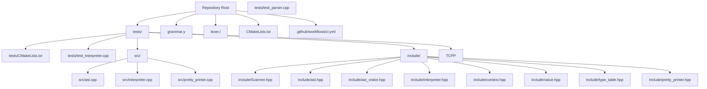
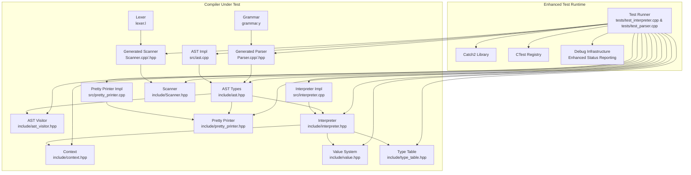
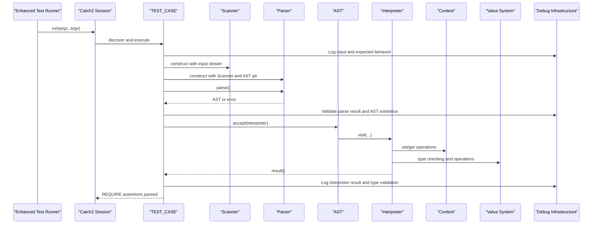
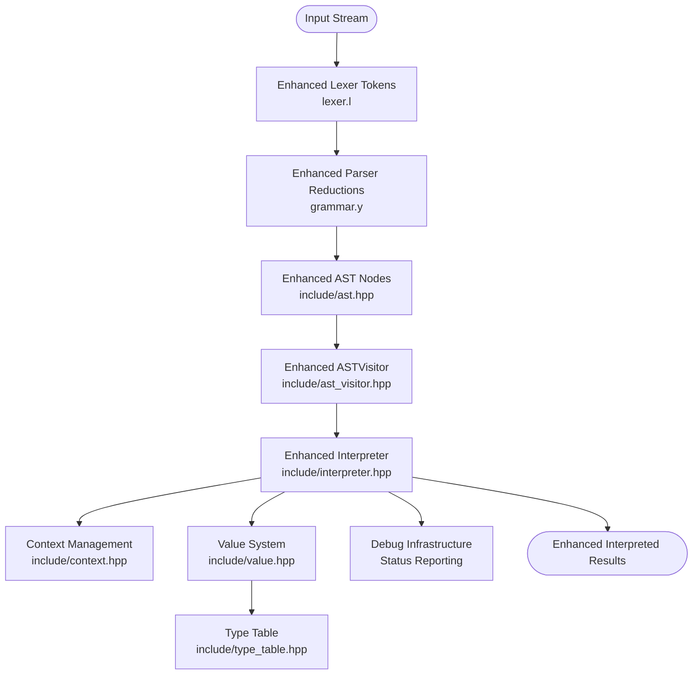
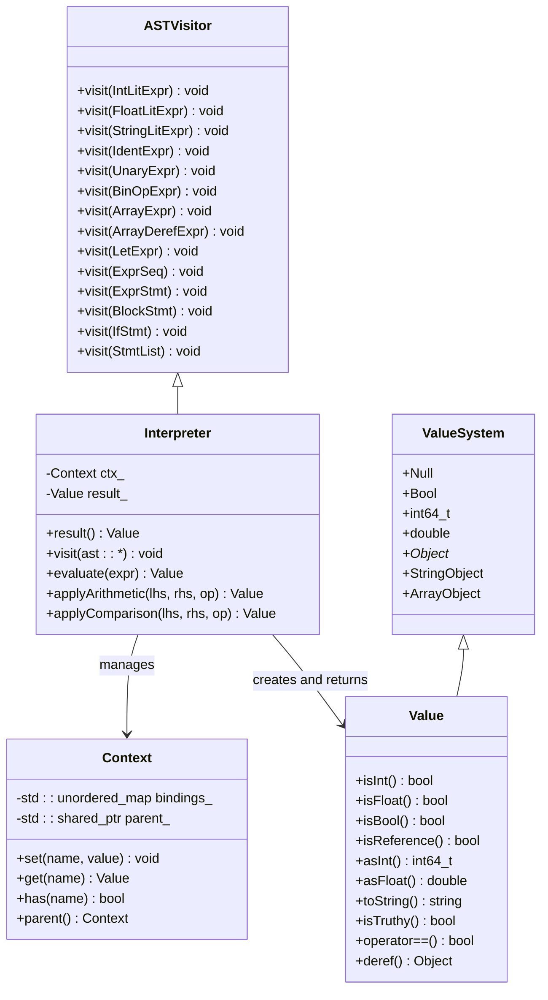

# Testing Framework

<cite>
**Referenced Files in This Document**
- [CMakeLists.txt](file://CMakeLists.txt)
- [.github/workflows/ci.yml](file://.github/workflows/ci.yml)
- [tests/CMakeLists.txt](file://tests/CMakeLists.txt)
- [tests/test_interpreter.cpp](file://tests/test_interpreter.cpp)
- [tests/test_parser.cpp](file://tests/test_parser.cpp)
- [include/Scanner.hpp](file://include/Scanner.hpp)
- [include/ast.hpp](file://include/ast.hpp)
- [include/ast_visitor.hpp](file://include/ast_visitor.hpp)
- [include/interpreter.hpp](file://include/interpreter.hpp)
- [include/context.hpp](file://include/context.hpp)
- [include/pretty_printer.hpp](file://include/pretty_printer.hpp)
- [include/type_table.hpp](file://include/type_table.hpp)
- [include/value.hpp](file://include/value.hpp)
- [src/ast.cpp](file://src/ast.cpp)
- [src/interpreter.cpp](file://src/interpreter.cpp)
- [src/pretty_printer.cpp](file://src/pretty_printer.cpp)
- [grammar.y](file://grammar.y)
- [lexer.l](file://lexer.l)
- [README.md](file://README.md)
</cite>

## Update Summary
**Changes Made**
- Added comprehensive array dereference functionality with new ArrayDerefExpr AST node
- Enhanced interpreter testing with 11 new test cases covering basic indexing, expression-based indexing, chained array access, and error handling scenarios
- Updated parser testing with new test cases for array dereference syntax validation
- Implemented proper error handling for array indexing operations including bounds checking and type validation
- Added grammar precedence rules for array dereference operator with proper associativity
- Integrated array dereference functionality into the complete testing pipeline

## Table of Contents
1. [Introduction](#introduction)
2. [Project Structure](#project-structure)
3. [Core Components](#core-components)
4. [Architecture Overview](#architecture-overview)
5. [Detailed Component Analysis](#detailed-component-analysis)
6. [Enhanced Debugging Infrastructure](#enhanced-debugging-infrastructure)
7. [Test Case Development and Assertion Patterns](#test-case-development-and-assertion-patterns)
8. [Continuous Integration Pipeline](#continuous-integration-pipeline)
9. [Performance Considerations](#performance-considerations)
10. [Troubleshooting Guide](#troubleshooting-guide)
11. [Conclusion](#conclusion)
12. [Appendices](#appendices)

## Introduction
This document describes the unit testing framework for the Monkey language compiler, which uses Catch2 for test execution and integrates with a Flex/Bison-generated lexer and parser. The tests validate:
- Parser correctness against the grammar
- AST generation and traversal
- Language feature implementation (expressions, statements, control flow)
- **Enhanced**: Comprehensive interpreter testing with extensive coverage of arithmetic operations, logical operations, variable binding, string manipulation, array creation, array dereference functionality, and error conditions
- **Enhanced**: Value system testing including primitive types, object references, and type checking
- **Enhanced**: Context management and scope resolution validation
- **Enhanced**: Type table functionality and type categorization
- **Enhanced**: Array dereference functionality with comprehensive test coverage for basic indexing, expression indices, chained dereferences, and error handling scenarios
- Test runner configuration, compilation setup, and continuous integration

The framework now provides comprehensive testing coverage for both the parsing phase and the interpretation phase, enabling thorough validation of the complete language implementation with detailed debugging capabilities and robust error handling mechanisms.

## Project Structure
The repository organizes tests under a dedicated directory and integrates them into the build system via CMake. The test executable compiles test sources, shared AST and interpreter implementations, and the generated parser/scanner artifacts. Continuous integration runs the test suite on a CI platform with comprehensive error reporting.

**Diagram sources**
- [CMakeLists.txt](file://CMakeLists.txt)
- [.github/workflows/ci.yml](file://.github/workflows/ci.yml)
- [tests/CMakeLists.txt](file://tests/CMakeLists.txt)
- [tests/test_interpreter.cpp](file://tests/test_interpreter.cpp)
- [tests/test_parser.cpp](file://tests/test_parser.cpp)
- [include/Scanner.hpp](file://include/Scanner.hpp)
- [include/ast.hpp](file://include/ast.hpp)
- [include/ast_visitor.hpp](file://include/ast_visitor.hpp)
- [include/interpreter.hpp](file://include/interpreter.hpp)
- [include/context.hpp](file://include/context.hpp)
- [include/value.hpp](file://include/value.hpp)
- [include/type_table.hpp](file://include/type_table.hpp)
- [include/pretty_printer.hpp](file://include/pretty_printer.hpp)
- [src/ast.cpp](file://src/ast.cpp)
- [src/interpreter.cpp](file://src/interpreter.cpp)
- [src/pretty_printer.cpp](file://src/pretty_printer.cpp)
- [grammar.y](file://grammar.y)
- [lexer.l](file://lexer.l)

**Section sources**
- [CMakeLists.txt](file://CMakeLists.txt)
- [.github/workflows/ci.yml](file://.github/workflows/ci.yml)
- [tests/CMakeLists.txt](file://tests/CMakeLists.txt)
- [tests/test_interpreter.cpp](file://tests/test_interpreter.cpp)
- [tests/test_parser.cpp](file://tests/test_parser.cpp)

## Core Components
- **Enhanced Test Runner Executable**: Built from test sources plus shared AST, interpreter, and pretty-printer implementations, linked against Catch2, and registered with CTest. Now includes comprehensive interpreter testing alongside parser testing with array dereference functionality.
- **Parser and Scanner**: Generated from grammar.y and lexer.l; integrated into tests via include paths and target linkage. Enhanced with debugging capabilities and improved error reporting.
- **AST and Interpreter**: Provide structured representation and execution of language constructs. The interpreter validates arithmetic operations, logical operations, variable binding, string manipulation, array creation, array dereference functionality, and error conditions.
- **Value System**: Comprehensive type system supporting primitives (null, bool, int, float), object references (strings, arrays), type checking, and equality comparisons.
- **Context Management**: Stack-based variable scoping with parent-child relationships for block-local variable resolution.
- **Type Tables**: Singleton type registry for managing type metadata, array type creation, and type categorization.
- **CI Pipeline**: Installs dependencies, configures with CMake, builds, and runs tests with verbose failure reporting and comprehensive debugging output.

Key responsibilities:
- **Enhanced**: tests/test_interpreter.cpp: Defines comprehensive interpreter test cases covering arithmetic operations, logical operations, variable binding, string manipulation, array creation, array dereference functionality, and error conditions with detailed value assertions and type checking.
- **Enhanced**: tests/test_parser.cpp: Defines parser test cases with comprehensive debugging, constructs Scanner and Parser, parses input, validates parse results and AST existence, and asserts non-empty AST output via PrettyPrinter with array dereference syntax validation.
- tests/CMakeLists.txt: Declares the test executable, includes necessary headers, links Catch2, and registers the test with CTest.
- CMakeLists.txt: Configures FetchContent for Catch2, enables testing, and adds the tests subdirectory.
- grammar.y and lexer.l: Define tokens, precedence, and productions; drive parser behavior validated by tests with enhanced debugging support including array dereference functionality.

**Section sources**
- [tests/test_interpreter.cpp](file://tests/test_interpreter.cpp)
- [tests/test_parser.cpp](file://tests/test_parser.cpp)
- [tests/CMakeLists.txt](file://tests/CMakeLists.txt)
- [CMakeLists.txt](file://CMakeLists.txt)
- [grammar.y](file://grammar.y)
- [lexer.l](file://lexer.l)
- [include/Scanner.hpp](file://include/Scanner.hpp)
- [include/ast.hpp](file://include/ast.hpp)
- [include/ast_visitor.hpp](file://include/ast_visitor.hpp)
- [include/interpreter.hpp](file://include/interpreter.hpp)
- [include/context.hpp](file://include/context.hpp)
- [include/value.hpp](file://include/value.hpp)
- [include/type_table.hpp](file://include/type_table.hpp)
- [include/pretty_printer.hpp](file://include/pretty_printer.hpp)
- [src/ast.cpp](file://src/ast.cpp)
- [src/interpreter.cpp](file://src/interpreter.cpp)
- [src/pretty_printer.cpp](file://src/pretty_printer.cpp)

## Architecture Overview
The testing architecture ties together the generated lexer/parser, AST, interpreter, and value system to validate compiler stages. The test runner uses Catch2 macros to declare test cases and assertions, while CMake orchestrates fetching Catch2, building the parser/scanner, and registering tests. The enhanced architecture now includes comprehensive interpreter testing and detailed status reporting with array dereference functionality.

**Diagram sources**
- [tests/test_interpreter.cpp](file://tests/test_interpreter.cpp)
- [tests/test_parser.cpp](file://tests/test_parser.cpp)
- [tests/CMakeLists.txt](file://tests/CMakeLists.txt)
- [CMakeLists.txt](file://CMakeLists.txt)
- [grammar.y](file://grammar.y)
- [lexer.l](file://lexer.l)
- [include/Scanner.hpp](file://include/Scanner.hpp)
- [include/ast.hpp](file://include/ast.hpp)
- [include/ast_visitor.hpp](file://include/ast_visitor.hpp)
- [include/interpreter.hpp](file://include/interpreter.hpp)
- [include/context.hpp](file://include/context.hpp)
- [include/value.hpp](file://include/value.hpp)
- [include/type_table.hpp](file://include/type_table.hpp)
- [include/pretty_printer.hpp](file://include/pretty_printer.hpp)
- [src/ast.cpp](file://src/ast.cpp)
- [src/interpreter.cpp](file://src/interpreter.cpp)
- [src/pretty_printer.cpp](file://src/pretty_printer.cpp)

## Detailed Component Analysis

### Enhanced Test Runner and Test Case Organization
The test runner executable is defined in tests/CMakeLists.txt and includes both test_interpreter.cpp and test_parser.cpp along with shared sources and generated parser/scanner outputs. It links against Catch2 and registers the test with CTest. The enhanced test runner now includes comprehensive interpreter testing alongside parser testing with array dereference functionality.

**Enhanced**: The test suite now includes comprehensive interpreter coverage with 393 lines of test cases covering:

- **Integer Arithmetic Operations**: Addition, subtraction, multiplication, division, modulo, and exponentiation with precise value assertions
- **Float Arithmetic Operations**: Floating-point calculations with approximate equality testing using Catch::Approx
- **Mixed Type Promotion**: Automatic type conversion between integers and floats in arithmetic operations
- **Unary Operations**: Negation operations for both integers and floats
- **Compound Expressions**: Complex expressions with proper operator precedence and parentheses handling
- **Comparison Operations**: Greater than, less than, equality, inequality, and greater/less than or equal comparisons
- **Logical Operations**: Short-circuit evaluation for "and" and "or" operators with truthiness handling
- **Variable Binding**: Let statements for variable declaration and assignment with proper scoping
- **Identifier Resolution**: Variable reference resolution with context management and error handling for undefined variables
- **String Operations**: String literal creation, equality comparisons, escape sequence handling, and truthiness evaluation
- **Array Operations**: Array literal creation, type checking, element access, and mixed-type error handling
- **Array Dereference Operations**: **New**: Comprehensive array indexing functionality including basic indexing, expression indices, chained dereferences, and extensive error handling scenarios with proper validation
- **Error Conditions**: Division by zero, modulo by zero, undefined variable access, type mismatch errors, and array indexing errors

**Diagram sources**
- [tests/CMakeLists.txt](file://tests/CMakeLists.txt)
- [tests/test_interpreter.cpp](file://tests/test_interpreter.cpp)
- [tests/test_parser.cpp](file://tests/test_parser.cpp)
- [include/Scanner.hpp](file://include/Scanner.hpp)
- [grammar.y](file://grammar.y)
- [include/ast.hpp](file://include/ast.hpp)
- [include/interpreter.hpp](file://include/interpreter.hpp)
- [include/context.hpp](file://include/context.hpp)
- [include/value.hpp](file://include/value.hpp)
- [src/ast.cpp](file://src/ast.cpp)
- [src/interpreter.cpp](file://src/interpreter.cpp)
- [src/pretty_printer.cpp](file://src/pretty_printer.cpp)

**Section sources**
- [tests/CMakeLists.txt](file://tests/CMakeLists.txt)
- [tests/test_interpreter.cpp](file://tests/test_interpreter.cpp)
- [tests/test_parser.cpp](file://tests/test_parser.cpp)

### Parser and Scanner Integration
The generated parser and scanner are produced from grammar.y and lexer.l and included in the test executable via CMake. The test constructs a Scanner and Parser, feeds input, and validates AST output. The enhanced integration now includes comprehensive debugging capabilities and detailed status reporting.

**Enhanced**: The grammar now includes comprehensive language support with production rules for:
- **Arithmetic Operations**: Binary operations (+, -, *, /, %, ^) with proper precedence and associativity
- **Logical Operations**: Boolean operations (and, or) with short-circuit evaluation
- **Comparison Operations**: Relational operators (>, <, >=, <=, ==, !=)
- **Variable Binding**: Let statements for identifier assignment
- **Control Flow**: If statements with optional else-if chains and else blocks
- **Compound Expressions**: Expression sequences and block statements
- **Array Operations**: Array literals and array dereference functionality with proper precedence rules

The enhanced parser integration includes:

- **Comprehensive debugging**: Parse result validation and AST existence checks
- **Detailed status reporting**: Enhanced output with parse success/failure indicators
- **Improved error handling**: Better error reporting and debugging capabilities
- **Array Dereference Precedence**: Proper precedence rules for array dereference operator with right associativity

**Diagram sources**
- [lexer.l](file://lexer.l)
- [grammar.y](file://grammar.y)
- [include/ast.hpp](file://include/ast.hpp)
- [include/ast_visitor.hpp](file://include/ast_visitor.hpp)
- [include/interpreter.hpp](file://include/interpreter.hpp)
- [include/context.hpp](file://include/context.hpp)
- [include/value.hpp](file://include/value.hpp)
- [include/type_table.hpp](file://include/type_table.hpp)
- [src/ast.cpp](file://src/ast.cpp)
- [src/interpreter.cpp](file://src/interpreter.cpp)
- [src/pretty_printer.cpp](file://src/pretty_printer.cpp)

**Section sources**
- [lexer.l](file://lexer.l)
- [grammar.y](file://grammar.y)
- [include/Scanner.hpp](file://include/Scanner.hpp)
- [include/ast.hpp](file://include/ast.hpp)
- [include/ast_visitor.hpp](file://include/ast_visitor.hpp)
- [include/interpreter.hpp](file://include/interpreter.hpp)
- [include/context.hpp](file://include/context.hpp)
- [include/value.hpp](file://include/value.hpp)
- [include/type_table.hpp](file://include/type_table.hpp)
- [src/ast.cpp](file://src/ast.cpp)
- [src/interpreter.cpp](file://src/interpreter.cpp)
- [src/pretty_printer.cpp](file://src/pretty_printer.cpp)

### AST and Interpreter Validation
The AST is composed of nodes for expressions and statements, with accept() methods delegating to a visitor. The Interpreter implements ASTVisitor to evaluate expressions and manage program state. The enhanced interpreter now includes comprehensive arithmetic operations, logical operations, variable binding, string manipulation, array creation, array dereference functionality, and error handling.

**Enhanced**: The interpreter includes comprehensive functionality:

**Diagram sources**
- [include/ast_visitor.hpp](file://include/ast_visitor.hpp)
- [include/interpreter.hpp](file://include/interpreter.hpp)
- [include/context.hpp](file://include/context.hpp)
- [include/value.hpp](file://include/value.hpp)
- [src/interpreter.cpp](file://src/interpreter.cpp)

**Section sources**
- [include/ast_visitor.hpp](file://include/ast_visitor.hpp)
- [include/interpreter.hpp](file://include/interpreter.hpp)
- [include/context.hpp](file://include/context.hpp)
- [include/value.hpp](file://include/value.hpp)
- [src/interpreter.cpp](file://src/interpreter.cpp)

### Array Dereference Functionality
The array dereference functionality provides comprehensive indexing capabilities for array objects. The implementation includes proper error handling, type checking, and support for complex indexing scenarios.

**Enhanced**: Array dereference implementation includes:

- **ArrayDerefExpr AST Node**: Dedicated AST node for array indexing operations with target and index expressions
- **Grammar Precedence**: Proper precedence rules with right associativity for chained array dereferences
- **Interpreter Logic**: Comprehensive error handling for array indexing operations
- **Type Safety**: Validation that targets are array objects and indices are integers
- **Bounds Checking**: Runtime validation of array bounds with appropriate error messages
- **Expression Indices**: Support for complex expressions as array indices
- **Chained Dereferences**: Support for nested array indexing operations

**Enhanced**: Array dereference test coverage includes:

- **Basic Array Indexing**: Simple integer indexing with proper value extraction
- **Expression Indices**: Complex expressions evaluated as array indices
- **Chained Array Dereferences**: Nested array indexing with proper evaluation order
- **Error Conditions**: Comprehensive error handling for invalid operations
- **Type Validation**: Proper type checking for array targets and indices
- **Bounds Validation**: Runtime bounds checking with meaningful error messages

**Section sources**
- [include/ast.hpp](file://include/ast.hpp)
- [grammar.y](file://grammar.y)
- [src/interpreter.cpp](file://src/interpreter.cpp)
- [src/pretty_printer.cpp](file://src/pretty_printer.cpp)
- [tests/test_interpreter.cpp](file://tests/test_interpreter.cpp)
- [tests/test_parser.cpp](file://tests/test_parser.cpp)

### Value System and Type Management
The Value system provides a comprehensive type system supporting primitives, object references, and type checking. The TypeTable manages type metadata and array type creation. The enhanced system now includes detailed type information for arrays and proper type categorization.

**Enhanced**: The value system includes comprehensive functionality:

- **Primitive Types**: Null, Bool, Int (int64_t), Float (double) with proper type checking and conversion
- **Object References**: StringObject and ArrayObject with heap allocation and type safety
- **Type Checking**: Comprehensive type validation with isInt(), isFloat(), isBool(), isReference() methods
- **Equality Comparisons**: Value-based equality for primitives and object-based equality for references
- **Truthiness Evaluation**: Proper boolean evaluation for conditionals
- **Type Tables**: Dynamic array type creation with element type and length information
- **String Manipulation**: Escape sequence handling and proper string representation
- **Array Objects**: Comprehensive array object management with element access and type validation

**Section sources**
- [include/value.hpp](file://include/value.hpp)
- [include/type_table.hpp](file://include/type_table.hpp)
- [src/interpreter.cpp](file://src/interpreter.cpp)

## Enhanced Debugging Infrastructure
The test framework now includes comprehensive debugging infrastructure designed to provide detailed insights into parser behavior, interpreter execution, and test execution. This infrastructure significantly enhances the developer experience by providing clear status reporting and diagnostic information.

### Debugging Capabilities
- **Parse Result Validation**: The enhanced test runner now validates both parse success (`result == 0`) and AST existence (`pAST != null`) before proceeding with interpreter execution.
- **Detailed Status Reporting**: Comprehensive console output provides clear indication of parse success/failure, AST validity, and interpreter results.
- **Enhanced Error Handling**: Improved error detection and reporting mechanisms help identify parsing failures, interpreter errors, and type mismatches.
- **Value Type Inspection**: Detailed output of value types, conversions, and object representations for debugging and validation.
- **Context State Monitoring**: Tracking of variable bindings, scoping, and context hierarchy for variable resolution debugging.
- **Array Dereference Debugging**: Specialized debugging for array indexing operations with detailed error reporting.

### Status Reporting Mechanisms
The enhanced debugging infrastructure provides multiple layers of status reporting:

1. **Parse Execution Status**: Clear indication of parse result (success/failure) and AST validity
2. **Interpreter Execution**: Detailed output of AST traversal, value evaluation, and type checking
3. **Value System Validation**: Comprehensive logging of value types, conversions, and object states
4. **Error Conditions**: Detailed error reporting for failed parse attempts, interpreter errors, and type mismatches
5. **Test Case Execution**: Comprehensive logging of input, expected behavior, actual results, and assertion outcomes
6. **Array Dereference Operations**: Specialized logging for array indexing with target validation and index evaluation

**Section sources**
- [tests/test_interpreter.cpp](file://tests/test_interpreter.cpp)
- [tests/test_parser.cpp](file://tests/test_parser.cpp)
- [src/interpreter.cpp](file://src/interpreter.cpp)
- [src/pretty_printer.cpp](file://src/pretty_printer.cpp)

## Test Case Development and Assertion Patterns
Test cases are declared using Catch2 macros and grouped by tags (e.g., "[interpreter]", "[parser]"). The enhanced framework provides comprehensive debugging and validation capabilities:

**Enhanced**: Interpreting test patterns include:
- **Arithmetic Operations**: `interpret("1 + 2;")` - validates integer arithmetic with precise value assertions using `CHECK(val.asInt() == 3)`
- **Float Operations**: `interpret("1.5 + 2.5;")` - validates floating-point arithmetic with approximate equality using `CHECK(val.asFloat() == Catch::Approx(4.0))`
- **Mixed Type Operations**: `interpret("1 + 2.5;")` - tests automatic type promotion with `REQUIRE(val.isFloat())`
- **Logical Operations**: `interpret("1 and 2;")` - validates short-circuit evaluation with truthiness handling
- **Variable Binding**: `interpret("let x = 42;");` - tests let statement execution with value evaluation
- **Identifier Resolution**: `interpret("let x = 42; x;")` - validates variable reference resolution with proper scoping
- **String Operations**: `interpret("\"hello\";")` - tests string literal creation with reference type validation
- **Array Operations**: `interpret("[1, 2, 3];")` - validates array literal creation with element type checking
- **Array Dereference Operations**: **New**: `interpret("let arr = [10, 20, 30]; arr[0];")` - validates basic array indexing with proper value extraction
- **Expression Indices**: `interpret("let arr = [10, 20, 30]; let i = 1; arr[i + 1];")` - tests complex expression evaluation as indices
- **Chained Array Dereferences**: `interpret("let inner = [1, 2]; let outer = [inner, [3, 4]]; outer[0][1];")` - validates nested array indexing
- **Error Conditions**: `interpret("1 / 0;")` - tests division by zero error handling with `REQUIRE_THROWS_AS`

**Enhanced**: Assertions now include comprehensive debugging and validation:
- **Parse Result Validation**: Check that parsing yields successful results (`result == 0`)
- **AST Existence Verification**: Ensure AST pointer is valid after parsing
- **Interpreter Result Validation**: Assert that interpreter produces expected Value results with proper type checking
- **Enhanced Logging**: Comprehensive input/output logging for quick diagnostics
- **Value Type Assertions**: Validate specific value types (int, float, bool, reference) with detailed error messages
- **Array Dereference Assertions**: Validate array indexing results and error conditions with detailed type checking

**Enhanced**: Example patterns with debugging infrastructure:
- Define an interpret helper that creates Scanner and Parser, invokes parse(), validates results, executes interpreter, and returns Value with comprehensive status reporting
- Use REQUIRE to assert value types and interpreter success with enhanced debugging information
- Log input, parse results, interpreter execution, and final results for quick diagnostics
- Utilize enhanced error handling to identify and report parsing failures, interpreter errors, and type mismatches
- **Enhanced**: Array dereference debugging patterns with specialized error reporting and validation

**Section sources**
- [tests/test_interpreter.cpp](file://tests/test_interpreter.cpp)
- [tests/test_parser.cpp](file://tests/test_parser.cpp)

## Continuous Integration Pipeline
The CI workflow installs dependencies (cmake, flex, bison), configures the build with CMake, builds the project, and runs tests with verbose output on failure. The enhanced pipeline now includes comprehensive interpreter testing alongside parser testing with array dereference functionality.

**Enhanced**: The CI pipeline provides:
- **Comprehensive Dependency Installation**: cmake, flex, bison, and libfl-dev packages
- **Enhanced Build Configuration**: Debug build type with verbose output
- **Detailed Test Execution**: ctest with output-on-failure for comprehensive error reporting
- **Cross-Platform Compatibility**: Ubuntu-based testing environment with consistent toolchain
- **Complete Test Suite**: Both parser and interpreter tests executed in CI environment with array dereference validation

**Section sources**
- [.github/workflows/ci.yml](file://.github/workflows/ci.yml)

## Performance Considerations
- Keep test inputs concise and focused to minimize parsing and interpretation overhead during frequent local runs.
- Prefer incremental additions to test suites; avoid heavy synthetic inputs that stress the parser or interpreter unless necessary.
- Use CTest's output-on-failure to quickly identify slow or failing test cases.
- **Enhanced**: The debugging infrastructure provides detailed performance metrics through status reporting and parse result validation.
- For future benchmarking, isolate parsing, interpretation, and pretty-printing phases and instrument timing around parser.parse(), interpreter execution, and PrettyPrinter result generation.
- **Enhanced**: Monitor interpreter performance for arithmetic operations, logical operations, value type conversions, and array dereference operations.

## Troubleshooting Guide
Common issues and resolutions with enhanced debugging capabilities:

**Enhanced**: Parser fails to generate outputs:
- Verify generated Parser.cpp/.hpp exist in the build directory.
- Ensure CMake configured successfully and Flex/Bison were found.
- **Enhanced**: Check debug output for parse result validation and AST existence indicators.

**Enhanced**: Test runner cannot find headers:
- Confirm include directories in tests/CMakeLists.txt include the build directory and source include paths.
- **Enhanced**: Verify enhanced include path configuration for generated headers, Catch2, and interpreter components.

**Enhanced**: Catch2 linking errors:
- Ensure FetchContent resolved Catch2 and the target is linked to the test executable.
- **Enhanced**: Check enhanced linking configuration and dependency resolution.

**Enhanced**: CI failures:
- Review logs for missing dependencies or configure/build errors.
- Use ctest with verbose output to reproduce locally.
- **Enhanced**: Leverage comprehensive debug output for rapid issue identification.

**Enhanced**: Interpreter test failures:
- Verify the interpreter correctly handles arithmetic operations, logical operations, variable binding, and array dereference functionality.
- Ensure Context properly manages variable scoping and resolution.
- Check Value system type checking and conversion logic.
- **Enhanced**: Use comprehensive status reporting to identify specific interpreter failures.

**Enhanced**: Array dereference issues:
- Verify ArrayDerefExpr AST node is properly constructed and visited by the interpreter.
- Ensure grammar precedence rules are correctly applied for array dereference operations.
- Check interpreter logic for proper type checking and bounds validation.
- **Enhanced**: Validate error handling for out-of-bounds access, negative indices, and non-integer indices.
- **Enhanced**: Test chained array dereferences with proper evaluation order and error propagation.

**Enhanced**: Value system issues:
- Verify Value type checking methods (isInt(), isFloat(), isBool(), isReference()) work correctly.
- Ensure proper type conversion between integers and floats.
- Check StringObject and ArrayObject equality comparisons.
- **Enhanced**: Validate TypeTable functionality for array type creation and type categorization.

**Enhanced**: Context management problems:
- Verify proper parent-child context relationships for block scoping.
- Ensure variable shadowing works correctly in nested contexts.
- Check error handling for undefined variables.
- **Enhanced**: Use context state monitoring to debug variable resolution issues.

**Enhanced**: Debugging tips with new infrastructure:
- Print input, parse results, interpreter execution, and final results with enhanced status reporting to confirm behavior.
- **Enhanced**: Utilize parse result validation, AST existence checks, and interpreter result validation for systematic debugging.
- Temporarily simplify grammar or interpreter logic to isolate regressions.
- Add targeted tests for edge cases (arithmetic overflow, logical short-circuiting, variable scoping, array indexing) to narrow down failures.
- **Enhanced**: For interpreter debugging, test individual components with comprehensive status reporting:
  - Test arithmetic operation evaluation with detailed type checking
  - Test logical operation short-circuiting with truthiness validation
  - Verify variable binding and resolution with context state monitoring
  - Check string and array object creation with proper type validation
  - Validate error condition handling with specific exception types
  - **Enhanced**: Test array dereference operations with comprehensive error handling and validation
  - **Enhanced**: Validate chained array dereferences with proper evaluation order and bounds checking

**Section sources**
- [tests/CMakeLists.txt](file://tests/CMakeLists.txt)
- [tests/test_interpreter.cpp](file://tests/test_interpreter.cpp)
- [tests/test_parser.cpp](file://tests/test_parser.cpp)
- [.github/workflows/ci.yml](file://.github/workflows/ci.yml)

## Conclusion
The testing framework leverages Catch2 to validate parser correctness, AST generation, and language feature coverage with significantly enhanced debugging infrastructure. By integrating generated parser/scanner outputs, shared AST components, interpreter implementations, and a comprehensive value system with detailed status reporting, it provides reliable compiler validation across platforms. The recent enhancements demonstrate the framework's ability to validate new language features effectively while providing developers with powerful debugging tools and detailed status reporting. The CI pipeline automates verification with comprehensive error reporting, while CMake and FetchContent streamline setup and dependency management.

## Appendices

### Adding New Tests for Language Extensions
Steps with enhanced debugging support:
- Extend grammar.y and lexer.l to support new tokens or productions.
- Reconfigure and rebuild to regenerate Parser.cpp/.hpp and Scanner.cpp/.hpp.
- Add new TEST_CASE entries in tests/test_interpreter.cpp and/or tests/test_parser.cpp with representative inputs and comprehensive debugging.
- Use interpreter and PrettyPrinter output assertions with enhanced status reporting to validate AST structure and execution results.
- Run ctest to ensure new tests pass and existing ones remain stable with detailed error reporting.

**Enhanced**: Comprehensive testing approach with interpreter validation:
- Grammar modifications: Add new production rules with proper AST node creation and enhanced validation
- Lexer updates: Add new token recognition with comprehensive status reporting
- AST implementation: Create new AST node types with proper visitor method implementation
- Interpreter updates: Implement new visitor methods with proper value evaluation and type checking
- Value system: Extend type system if needed with proper type registration and validation
- Test coverage: Add comprehensive test cases for new language features with enhanced debugging infrastructure
- Context management: Update context handling if new scoping rules are introduced

**Enhanced**: Regression testing strategy with comprehensive validation:
- Maintain a baseline of representative inputs covering operators, control flow, variable binding, array operations, and error conditions.
- After grammar/lexer/interpreter changes, re-run the full test suite and review diffs in interpreter results and PrettyPrinter outputs for unexpected behavior changes.
- **Enhanced**: Include comprehensive status reporting and debugging output in regression tests.
- **Enhanced**: Monitor parse result validation, AST existence checks, and interpreter result validation for regression detection.

**Enhanced**: Edge case testing checklist with debugging support:
- Comments and whitespace with enhanced status reporting
- Parentheses and precedence with comprehensive validation
- Empty constructs and optional branches with detailed error handling
- Mixed token types and invalid sequences with improved error detection
- **Enhanced**: Interpreter edge cases with comprehensive debugging:
  - Arithmetic overflow and precision issues with detailed value validation
  - Logical operation short-circuiting with truthiness evaluation
  - Variable scoping and shadowing with context state monitoring
  - String escape sequences and Unicode handling with proper type checking
  - Array type validation and element access with comprehensive error handling
  - **Enhanced**: Array dereference edge cases with comprehensive error validation
  - **Enhanced**: Chained array dereferences with proper evaluation order and bounds checking
  - Error condition propagation and exception handling with detailed reporting

**Enhanced**: Coverage considerations with enhanced infrastructure:
- Aim for statement and branch coverage of parser actions, interpreter visitor methods, and value system operations.
- Include negative cases (syntax errors, runtime errors, type mismatches) to verify error handling paths with comprehensive debugging.
- **Enhanced**: Ensure interpreter coverage includes comprehensive debugging and validation:
  - Arithmetic operation coverage with precise value assertions
  - Logical operation coverage with short-circuit evaluation testing
  - Variable binding coverage with scoping validation
  - String and array object coverage with type checking
  - **Enhanced**: Array dereference coverage with comprehensive error handling validation
  - Error condition coverage with specific exception validation

**Enhanced**: Platform and configuration guidelines with comprehensive support:
- Use the provided CI workflow as a baseline; adapt dependency installation for other systems.
- Keep CMake configuration minimal and deterministic; avoid platform-specific assumptions in tests.
- **Enhanced**: Leverage comprehensive debugging infrastructure across all platforms and configurations.
- **Enhanced**: Utilize enhanced status reporting and error handling for consistent debugging experience.

**Section sources**
- [grammar.y](file://grammar.y)
- [lexer.l](file://lexer.l)
- [tests/test_interpreter.cpp](file://tests/test_interpreter.cpp)
- [tests/test_parser.cpp](file://tests/test_parser.cpp)
- [tests/CMakeLists.txt](file://tests/CMakeLists.txt)
- [CMakeLists.txt](file://CMakeLists.txt)
- [.github/workflows/ci.yml](file://.github/workflows/ci.yml)
- [README.md](file://README.md)