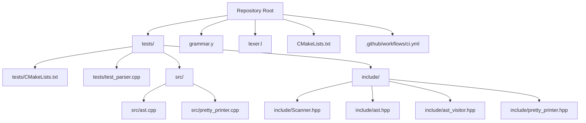
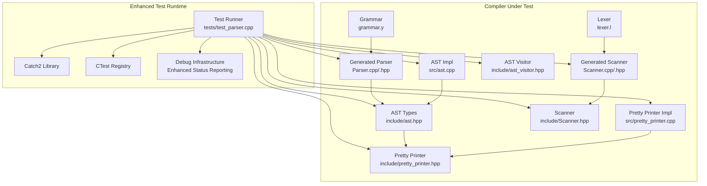
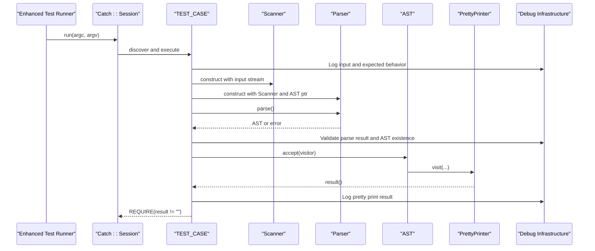
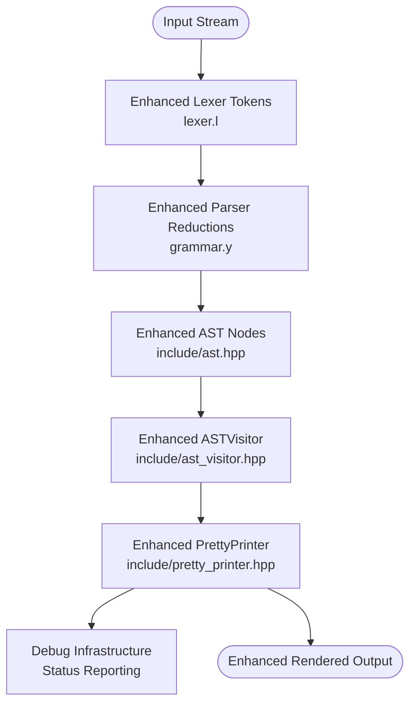
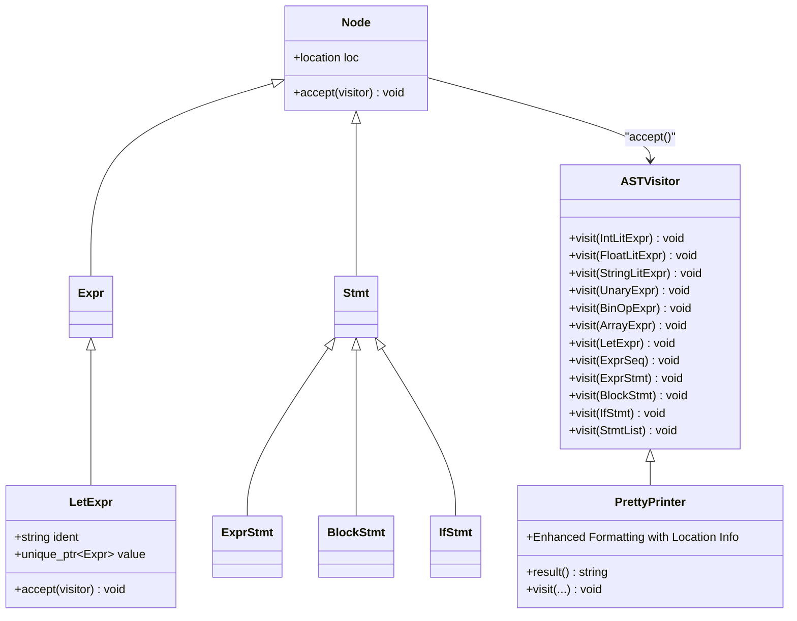

# Testing Framework

<cite>
**Referenced Files in This Document**
- [CMakeLists.txt](file://CMakeLists.txt)
- [.github/workflows/ci.yml](file://.github/workflows/ci.yml)
- [tests/CMakeLists.txt](file://tests/CMakeLists.txt)
- [tests/test_parser.cpp](file://tests/test_parser.cpp)
- [include/Scanner.hpp](file://include/Scanner.hpp)
- [include/ast.hpp](file://include/ast.hpp)
- [include/ast_visitor.hpp](file://include/ast_visitor.hpp)
- [include/pretty_printer.hpp](file://include/pretty_printer.hpp)
- [src/ast.cpp](file://src/ast.cpp)
- [src/pretty_printer.cpp](file://src/pretty_printer.cpp)
- [grammar.y](file://grammar.y)
- [lexer.l](file://lexer.l)
- [README.md](file://README.md)
</cite>

## Update Summary
**Changes Made**
- Enhanced test suite with comprehensive debugging infrastructure and detailed status reporting
- Improved error handling with better parse result validation and AST existence checks
- Added new pretty printing mechanism for AST visualization with enhanced output formatting
- Expanded test coverage to include comprehensive let statement functionality testing
- Updated test runner configuration with better error reporting and debugging capabilities

## Table of Contents
1. [Introduction](#introduction)
2. [Project Structure](#project-structure)
3. [Core Components](#core-components)
4. [Architecture Overview](#architecture-overview)
5. [Detailed Component Analysis](#detailed-component-analysis)
6. [Enhanced Debugging Infrastructure](#enhanced-debugging-infrastructure)
7. [Test Case Development and Assertion Patterns](#test-case-development-and-assertion-patterns)
8. [Continuous Integration Pipeline](#continuous-integration-pipeline)
9. [Performance Considerations](#performance-considerations)
10. [Troubleshooting Guide](#troubleshooting-guide)
11. [Conclusion](#conclusion)
12. [Appendices](#appendices)

## Introduction
This document describes the unit testing framework for the Monkey language compiler, which uses Catch2 for test execution and integrates with a Flex/Bison-generated lexer and parser. The tests validate:
- Parser correctness against the grammar
- AST generation and traversal
- Language feature implementation (expressions, statements, control flow)
- **Enhanced**: Comprehensive debugging infrastructure with detailed status reporting
- **Enhanced**: Improved error handling and parse result validation
- **Enhanced**: New pretty printing mechanism for AST visualization and debugging
- Test runner configuration, compilation setup, and continuous integration

The framework now provides significantly enhanced debugging capabilities, detailed status reporting, and robust error handling mechanisms that enable developers to quickly identify and resolve parser and AST generation issues.

## Project Structure
The repository organizes tests under a dedicated directory and integrates them into the build system via CMake. The test executable compiles test sources, shared AST and pretty-printer implementations, and the generated parser/scanner artifacts. Continuous integration runs the test suite on a CI platform with comprehensive error reporting.



**Diagram sources**
- [CMakeLists.txt](file://CMakeLists.txt)
- [.github/workflows/ci.yml](file://.github/workflows/ci.yml)
- [tests/CMakeLists.txt](file://tests/CMakeLists.txt)
- [tests/test_parser.cpp](file://tests/test_parser.cpp)
- [include/Scanner.hpp](file://include/Scanner.hpp)
- [include/ast.hpp](file://include/ast.hpp)
- [include/ast_visitor.hpp](file://include/ast_visitor.hpp)
- [include/pretty_printer.hpp](file://include/pretty_printer.hpp)
- [src/ast.cpp](file://src/ast.cpp)
- [src/pretty_printer.cpp](file://src/pretty_printer.cpp)
- [grammar.y](file://grammar.y)
- [lexer.l](file://lexer.l)

**Section sources**
- [CMakeLists.txt](file://CMakeLists.txt)
- [.github/workflows/ci.yml](file://.github/workflows/ci.yml)
- [tests/CMakeLists.txt](file://tests/CMakeLists.txt)
- [tests/test_parser.cpp](file://tests/test_parser.cpp)

## Core Components
- **Enhanced Test Runner Executable**: Built from test sources plus shared AST and pretty-printer implementations, linked against Catch2, and registered with CTest. Now includes comprehensive debugging infrastructure and detailed status reporting.
- **Parser and Scanner**: Generated from grammar.y and lexer.l; integrated into tests via include paths and target linkage. Enhanced with debugging capabilities and improved error reporting.
- **AST and Pretty Printer**: Provide structured representation and textual rendering for assertions. The pretty printer now includes enhanced formatting and location information.
- **Comprehensive Let Statement Support**: Extensive test coverage for let declarations including basic variables, complex expressions, and string literals.
- **CI Pipeline**: Installs dependencies, configures with CMake, builds, and runs tests with verbose failure reporting and comprehensive debugging output.

Key responsibilities:
- **Enhanced**: tests/test_parser.cpp: Defines test cases with comprehensive debugging, constructs Scanner and Parser, parses input, validates parse results and AST existence, and asserts non-empty AST output via PrettyPrinter with detailed status reporting.
- tests/CMakeLists.txt: Declares the test executable, includes necessary headers, links Catch2, and registers the test with CTest.
- CMakeLists.txt: Configures FetchContent for Catch2, enables testing, and adds the tests subdirectory.
- grammar.y and lexer.l: Define tokens, precedence, and productions; drive parser behavior validated by tests with enhanced debugging support.

**Section sources**
- [tests/test_parser.cpp](file://tests/test_parser.cpp)
- [tests/CMakeLists.txt](file://tests/CMakeLists.txt)
- [CMakeLists.txt](file://CMakeLists.txt)
- [grammar.y](file://grammar.y)
- [lexer.l](file://lexer.l)
- [include/Scanner.hpp](file://include/Scanner.hpp)
- [include/ast.hpp](file://include/ast.hpp)
- [include/ast_visitor.hpp](file://include/ast_visitor.hpp)
- [include/pretty_printer.hpp](file://include/pretty_printer.hpp)
- [src/ast.cpp](file://src/ast.cpp)
- [src/pretty_printer.cpp](file://src/pretty_printer.cpp)

## Architecture Overview
The testing architecture ties together the generated lexer/parser, AST, and pretty-printer to validate compiler stages. The test runner uses Catch2 macros to declare test cases and assertions, while CMake orchestrates fetching Catch2, building the parser/scanner, and registering tests. The enhanced architecture now includes comprehensive debugging infrastructure and detailed status reporting.



**Diagram sources**
- [tests/test_parser.cpp](file://tests/test_parser.cpp)
- [tests/CMakeLists.txt](file://tests/CMakeLists.txt)
- [CMakeLists.txt](file://CMakeLists.txt)
- [grammar.y](file://grammar.y)
- [lexer.l](file://lexer.l)
- [include/Scanner.hpp](file://include/Scanner.hpp)
- [include/ast.hpp](file://include/ast.hpp)
- [include/ast_visitor.hpp](file://include/ast_visitor.hpp)
- [include/pretty_printer.hpp](file://include/pretty_printer.hpp)
- [src/ast.cpp](file://src/ast.cpp)
- [src/pretty_printer.cpp](file://src/pretty_printer.cpp)

## Detailed Component Analysis

### Enhanced Test Runner and Test Case Organization
The test runner executable is defined in tests/CMakeLists.txt and includes test_parser.cpp along with shared sources and generated parser/scanner outputs. It links against Catch2 and registers the test with CTest. The enhanced test runner now includes comprehensive debugging infrastructure and detailed status reporting.

**Enhanced**: The test suite now includes comprehensive let statement coverage with six distinct test cases and enhanced debugging capabilities:

- **Basic let statement**: Validates simple variable declarations like `let x = 5;`
- **Let statement with expression**: Tests complex expressions in let declarations like `let result = 2 + 3 * 4;`
- **Let statement with string**: Verifies string literal handling in let declarations like `let name = "hello";`
- **Enhanced debugging**: Comprehensive status reporting with parse result validation and AST existence checks
- **Improved error handling**: Better parse result validation and detailed error reporting



**Diagram sources**
- [tests/CMakeLists.txt](file://tests/CMakeLists.txt)
- [tests/test_parser.cpp](file://tests/test_parser.cpp)
- [include/Scanner.hpp](file://include/Scanner.hpp)
- [grammar.y](file://grammar.y)
- [include/ast.hpp](file://include/ast.hpp)
- [include/pretty_printer.hpp](file://include/pretty_printer.hpp)
- [src/ast.cpp](file://src/ast.cpp)
- [src/pretty_printer.cpp](file://src/pretty_printer.cpp)

**Section sources**
- [tests/CMakeLists.txt](file://tests/CMakeLists.txt)
- [tests/test_parser.cpp](file://tests/test_parser.cpp)

### Parser and Scanner Integration
The generated parser and scanner are produced from grammar.y and lexer.l and included in the test executable via CMake. The test constructs a Scanner and Parser, feeds input, and validates AST output. The enhanced integration now includes comprehensive debugging capabilities and detailed status reporting.

**Enhanced**: The grammar now includes comprehensive let statement support with the production rule:
```
expr : LET Ident ASSIGN expr { $$ = new ast::LetExpr(@$, $2, $4); }
```

This enables parsing of let declarations with proper identifier recognition and assignment semantics. The enhanced parser integration includes:

- **Comprehensive debugging**: Parse result validation and AST existence checks
- **Detailed status reporting**: Enhanced output with parse success/failure indicators
- **Improved error handling**: Better error reporting and debugging capabilities



**Diagram sources**
- [lexer.l](file://lexer.l)
- [grammar.y](file://grammar.y)
- [include/ast.hpp](file://include/ast.hpp)
- [include/ast_visitor.hpp](file://include/ast_visitor.hpp)
- [include/pretty_printer.hpp](file://include/pretty_printer.hpp)
- [src/ast.cpp](file://src/ast.cpp)
- [src/pretty_printer.cpp](file://src/pretty_printer.cpp)

**Section sources**
- [lexer.l](file://lexer.l)
- [grammar.y](file://grammar.y)
- [include/Scanner.hpp](file://include/Scanner.hpp)
- [include/ast.hpp](file://include/ast.hpp)
- [include/ast_visitor.hpp](file://include/ast_visitor.hpp)
- [include/pretty_printer.hpp](file://include/pretty_printer.hpp)
- [src/ast.cpp](file://src/ast.cpp)
- [src/pretty_printer.cpp](file://src/pretty_printer.cpp)

### AST and Pretty Printer Validation
The AST is composed of nodes for expressions and statements, with accept() methods delegating to a visitor. The PrettyPrinter implements ASTVisitor to render a textual representation of the AST. The enhanced pretty printer now includes comprehensive formatting and location information.

**Enhanced**: The AST now includes comprehensive let statement support with the LetExpr node and enhanced pretty printing capabilities:



**Diagram sources**
- [include/ast.hpp](file://include/ast.hpp)
- [include/ast_visitor.hpp](file://include/ast_visitor.hpp)
- [include/pretty_printer.hpp](file://include/pretty_printer.hpp)
- [src/ast.cpp](file://src/ast.cpp)
- [src/pretty_printer.cpp](file://src/pretty_printer.cpp)

**Section sources**
- [include/ast.hpp](file://include/ast.hpp)
- [include/ast_visitor.hpp](file://include/ast_visitor.hpp)
- [include/pretty_printer.hpp](file://include/pretty_printer.hpp)
- [src/ast.cpp](file://src/ast.cpp)
- [src/pretty_printer.cpp](file://src/pretty_printer.cpp)

## Enhanced Debugging Infrastructure
The test framework now includes comprehensive debugging infrastructure designed to provide detailed insights into parser behavior, AST generation, and test execution. This infrastructure significantly enhances the developer experience by providing clear status reporting and diagnostic information.

### Debugging Capabilities
- **Parse Result Validation**: The enhanced test runner now validates both parse success (`result == 0`) and AST existence (`pAST != null`) before proceeding with pretty printing.
- **Detailed Status Reporting**: Comprehensive console output provides clear indication of parse success/failure, AST validity, and pretty print results.
- **Enhanced Error Handling**: Improved error detection and reporting mechanisms help identify parsing failures and AST generation issues.
- **Location Information**: The pretty printer now includes location information in string literal representations, aiding in debugging and validation.

### Status Reporting Mechanisms
The enhanced debugging infrastructure provides multiple layers of status reporting:

1. **Parse Execution Status**: Clear indication of parse result (success/failure) and AST validity
2. **Pretty Print Results**: Detailed output of AST visualization for validation and debugging
3. **Test Case Execution**: Comprehensive logging of input, expected behavior, and actual results
4. **Error Conditions**: Detailed error reporting for failed parse attempts

**Section sources**
- [tests/test_parser.cpp](file://tests/test_parser.cpp)
- [src/pretty_printer.cpp](file://src/pretty_printer.cpp)

## Test Case Development and Assertion Patterns
Test cases are declared using Catch2 macros and grouped by tags (e.g., "[parser]"). The enhanced framework provides comprehensive debugging and validation capabilities:

**Enhanced**: Assertions now include comprehensive debugging and validation:
- **Parse Result Validation**: Check that parsing yields successful results (`result == 0`)
- **AST Existence Verification**: Ensure AST pointer is valid after parsing
- **PrettyPrinter Output Validation**: Assert that PrettyPrinter produces non-empty output
- **Enhanced Logging**: Comprehensive input/output logging for quick diagnostics

**Enhanced**: New let statement test patterns include:
- **Basic let statements**: `let x = 5;` - validates simple identifier assignment with comprehensive debugging
- **Complex expressions**: `let result = 2 + 3 * 4;` - tests operator precedence and expression evaluation with detailed status reporting
- **String literals**: `let name = "hello";` - verifies string token handling in let declarations with location information

**Enhanced**: Example patterns with debugging infrastructure:
- Define a parse helper that creates Scanner and Parser, invokes parse(), validates results, and returns PrettyPrinter output with comprehensive status reporting
- Use REQUIRE to assert non-empty output after parsing with enhanced debugging information
- Log input, parse results, and pretty print output for quick diagnostics
- Utilize enhanced error handling to identify and report parsing failures

**Section sources**
- [tests/test_parser.cpp](file://tests/test_parser.cpp)

## Continuous Integration Pipeline
The CI workflow installs dependencies (cmake, flex, bison), configures the build with CMake, builds the project, and runs tests with verbose output on failure. The enhanced pipeline now includes comprehensive debugging output and detailed error reporting.

**Enhanced**: The CI pipeline provides:
- **Comprehensive Dependency Installation**: cmake, flex, bison, and libfl-dev packages
- **Enhanced Build Configuration**: Debug build type with verbose output
- **Detailed Test Execution**: ctest with output-on-failure for comprehensive error reporting
- **Cross-Platform Compatibility**: Ubuntu-based testing environment with consistent toolchain

**Section sources**
- [.github/workflows/ci.yml](file://.github/workflows/ci.yml)

## Performance Considerations
- Keep test inputs concise and focused to minimize parsing overhead during frequent local runs.
- Prefer incremental additions to test suites; avoid heavy synthetic inputs that stress the parser unless necessary.
- Use CTest's output-on-failure to quickly identify slow or failing test cases.
- **Enhanced**: The debugging infrastructure provides detailed performance metrics through status reporting and parse result validation.
- For future benchmarking, isolate parsing and pretty-printing phases and instrument timing around parser.parse() and PrettyPrinter result generation.

## Troubleshooting Guide
Common issues and resolutions with enhanced debugging capabilities:

**Enhanced**: Parser fails to generate outputs:
- Verify generated Parser.cpp/.hpp and Scanner.cpp/.hpp exist in the build directory.
- Ensure CMake configured successfully and Flex/Bison were found.
- **Enhanced**: Check debug output for parse result validation and AST existence indicators.

**Enhanced**: Test runner cannot find headers:
- Confirm include directories in tests/CMakeLists.txt include the build directory and source include paths.
- **Enhanced**: Verify enhanced include path configuration for generated headers and Catch2.

**Enhanced**: Catch2 linking errors:
- Ensure FetchContent resolved Catch2 and the target is linked to the test executable.
- **Enhanced**: Check enhanced linking configuration and dependency resolution.

**Enhanced**: CI failures:
- Review logs for missing dependencies or configure/build errors.
- Use ctest with verbose output to reproduce locally.
- **Enhanced**: Leverage comprehensive debug output for rapid issue identification.

**Enhanced**: Let statement parsing issues:
- Verify the lexer recognizes "let" as a token (Parser::token::LET)
- Ensure grammar production for let statements is properly defined
- Check that LetExpr node is properly implemented in AST and PrettyPrinter
- **Enhanced**: Use comprehensive status reporting to identify specific parsing failures

**Enhanced**: Debugging tips with new infrastructure:
- Print input and PrettyPrinter result with enhanced status reporting to confirm parsing behavior.
- **Enhanced**: Utilize parse result validation and AST existence checks for systematic debugging.
- Temporarily simplify grammar or lexer rules to isolate regressions.
- Add targeted tests for edge cases (comments, parentheses, precedence) to narrow down failures.
- **Enhanced**: For let statement debugging, test individual components with comprehensive status reporting:
  - Test lexer token recognition for "let" with enhanced debugging
  - Test grammar production parsing with detailed status reporting
  - Verify AST node creation and PrettyPrinter output with comprehensive validation

**Section sources**
- [tests/CMakeLists.txt](file://tests/CMakeLists.txt)
- [tests/test_parser.cpp](file://tests/test_parser.cpp)
- [.github/workflows/ci.yml](file://.github/workflows/ci.yml)

## Conclusion
The testing framework leverages Catch2 to validate parser correctness, AST generation, and language feature coverage with significantly enhanced debugging infrastructure. By integrating generated parser/scanner outputs, shared AST components, and a pretty-printer with comprehensive status reporting, it provides reliable compiler validation across platforms. The recent enhancements demonstrate the framework's ability to validate new language features effectively while providing developers with powerful debugging tools and detailed status reporting. The CI pipeline automates verification with comprehensive error reporting, while CMake and FetchContent streamline setup and dependency management.

## Appendices

### Adding New Tests for Language Extensions
Steps with enhanced debugging support:
- Extend grammar.y and lexer.l to support new tokens or productions.
- Reconfigure and rebuild to regenerate Parser.cpp/.hpp and Scanner.cpp/.hpp.
- Add new TEST_CASE entries in tests/test_parser.cpp with representative inputs and comprehensive debugging.
- Use PrettyPrinter output assertions with enhanced status reporting to validate AST structure.
- Run ctest to ensure new tests pass and existing ones remain stable with detailed error reporting.

**Enhanced**: Let statement extension process with comprehensive debugging:
- Grammar modifications: Add let statement production rule in expr grammar with enhanced validation
- Lexer updates: Add "let" token recognition with comprehensive status reporting
- AST implementation: Create LetExpr node with identifier and value fields and enhanced pretty printing
- Pretty printer: Implement LetExpr visitor to render let statements with detailed formatting
- Test coverage: Add comprehensive test cases for basic, complex, and string let statements with enhanced debugging infrastructure

**Enhanced**: Regression testing strategy with comprehensive validation:
- Maintain a baseline of representative inputs covering operators, control flow, and edge cases.
- After grammar/lexer changes, re-run the full test suite and review diffs in PrettyPrinter outputs for unexpected AST changes.
- **Enhanced**: Include comprehensive status reporting and debugging output in regression tests.
- **Enhanced**: Monitor parse result validation and AST existence checks for regression detection.

**Enhanced**: Edge case testing checklist with debugging support:
- Comments and whitespace with enhanced status reporting
- Parentheses and precedence with comprehensive validation
- Empty constructs and optional branches with detailed error handling
- Mixed token types and invalid sequences with improved error detection
- **Enhanced**: Let statement edge cases with comprehensive debugging:
  - Identifier naming conventions with enhanced validation
  - Complex expression precedence in let values with detailed status reporting
  - String literal escaping and formatting with location information
  - Nested let statements and scoping with comprehensive debugging

**Enhanced**: Coverage considerations with enhanced infrastructure:
- Aim for statement and branch coverage of parser actions and PrettyPrinter visitor methods.
- Include negative cases (syntax errors) to verify error handling paths with comprehensive debugging.
- **Enhanced**: Ensure let statement coverage includes comprehensive debugging and validation:
  - Basic identifier assignments with parse result validation
  - Complex expression evaluations with detailed status reporting
  - String literal handling with location information
  - Error condition testing with enhanced error reporting

**Enhanced**: Platform and configuration guidelines with comprehensive support:
- Use the provided CI workflow as a baseline; adapt dependency installation for other systems.
- Keep CMake configuration minimal and deterministic; avoid platform-specific assumptions in tests.
- **Enhanced**: Leverage comprehensive debugging infrastructure across all platforms and configurations.
- **Enhanced**: Utilize enhanced status reporting and error handling for consistent debugging experience.

**Section sources**
- [grammar.y](file://grammar.y)
- [lexer.l](file://lexer.l)
- [tests/test_parser.cpp](file://tests/test_parser.cpp)
- [tests/CMakeLists.txt](file://tests/CMakeLists.txt)
- [CMakeLists.txt](file://CMakeLists.txt)
- [.github/workflows/ci.yml](file://.github/workflows/ci.yml)
- [README.md](file://README.md)