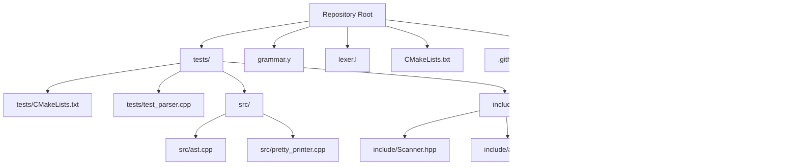
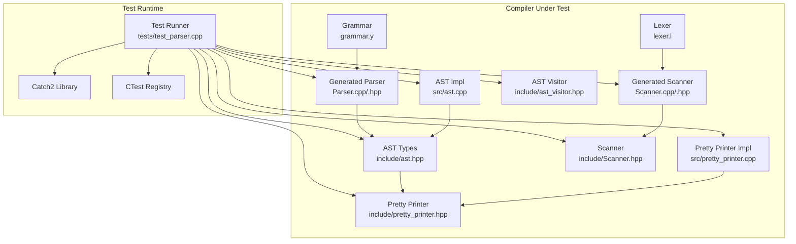
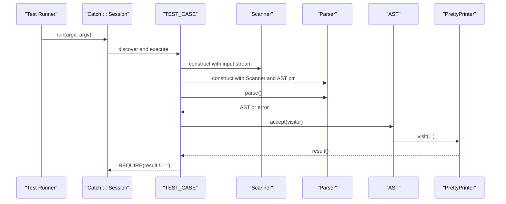
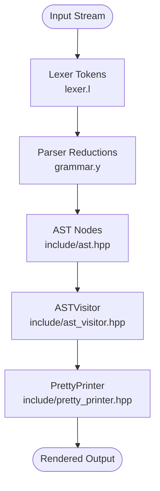
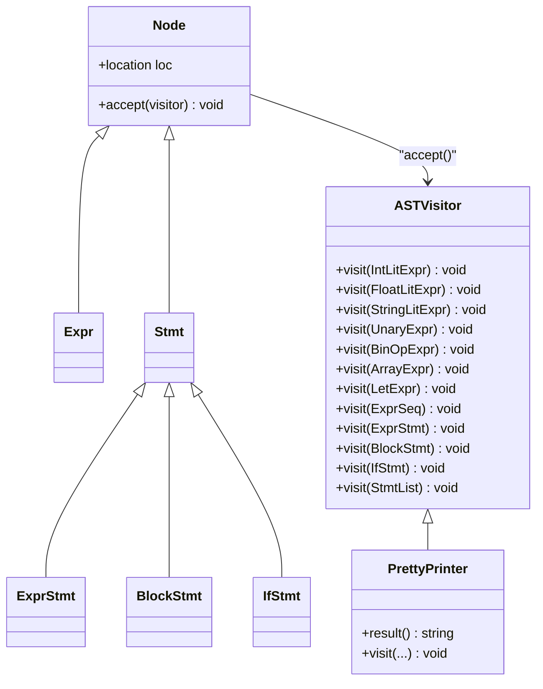
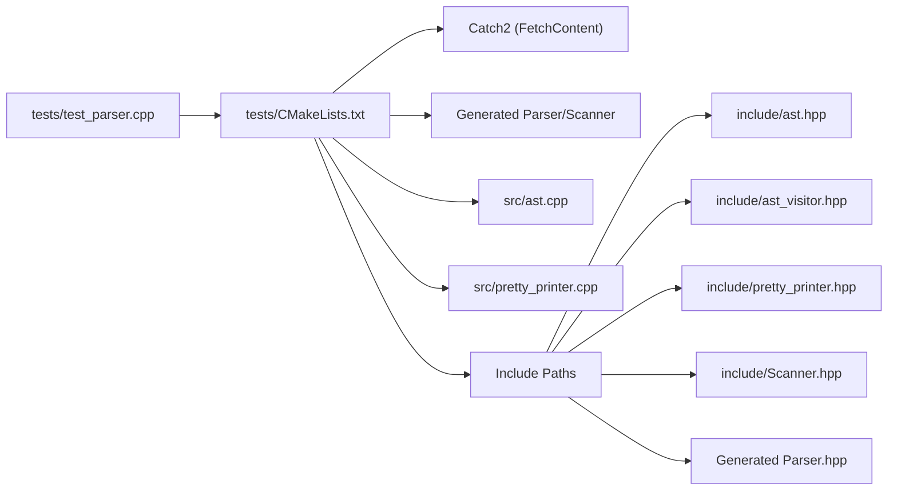

# Testing Framework

<cite>
**Referenced Files in This Document**
- [CMakeLists.txt](file://CMakeLists.txt)
- [.github/workflows/ci.yml](file://.github/workflows/ci.yml)
- [tests/CMakeLists.txt](file://tests/CMakeLists.txt)
- [tests/test_parser.cpp](file://tests/test_parser.cpp)
- [include/Scanner.hpp](file://include/Scanner.hpp)
- [include/ast.hpp](file://include/ast.hpp)
- [include/ast_visitor.hpp](file://include/ast_visitor.hpp)
- [include/pretty_printer.hpp](file://include/pretty_printer.hpp)
- [src/ast.cpp](file://src/ast.cpp)
- [src/pretty_printer.cpp](file://src/pretty_printer.cpp)
- [grammar.y](file://grammar.y)
- [lexer.l](file://lexer.l)
- [README.md](file://README.md)
</cite>

## Table of Contents
1. [Introduction](#introduction)
2. [Project Structure](#project-structure)
3. [Core Components](#core-components)
4. [Architecture Overview](#architecture-overview)
5. [Detailed Component Analysis](#detailed-component-analysis)
6. [Dependency Analysis](#dependency-analysis)
7. [Performance Considerations](#performance-considerations)
8. [Troubleshooting Guide](#troubleshooting-guide)
9. [Conclusion](#conclusion)
10. [Appendices](#appendices)

## Introduction
This document describes the unit testing framework for the Monkey language compiler, which uses Catch2 for test execution and integrates with a Flex/Bison-generated lexer and parser. The tests validate:
- Parser correctness against the grammar
- AST generation and traversal
- Language feature implementation (expressions, statements, control flow)
- Test runner configuration, compilation setup, and continuous integration

It also provides guidance for adding new tests, debugging failures, maintaining test quality, and ensuring reliable validation across platforms.

## Project Structure
The repository organizes tests under a dedicated directory and integrates them into the build system via CMake. The test executable compiles test sources, shared AST and pretty-printer implementations, and the generated parser/scanner artifacts. Continuous integration runs the test suite on a CI platform.

**Diagram sources**
- [CMakeLists.txt](file://CMakeLists.txt)
- [.github/workflows/ci.yml](file://.github/workflows/ci.yml)
- [tests/CMakeLists.txt](file://tests/CMakeLists.txt)
- [tests/test_parser.cpp](file://tests/test_parser.cpp)
- [include/Scanner.hpp](file://include/Scanner.hpp)
- [include/ast.hpp](file://include/ast.hpp)
- [include/ast_visitor.hpp](file://include/ast_visitor.hpp)
- [include/pretty_printer.hpp](file://include/pretty_printer.hpp)
- [src/ast.cpp](file://src/ast.cpp)
- [src/pretty_printer.cpp](file://src/pretty_printer.cpp)
- [grammar.y](file://grammar.y)
- [lexer.l](file://lexer.l)

**Section sources**
- [CMakeLists.txt](file://CMakeLists.txt)
- [.github/workflows/ci.yml](file://.github/workflows/ci.yml)
- [tests/CMakeLists.txt](file://tests/CMakeLists.txt)
- [tests/test_parser.cpp](file://tests/test_parser.cpp)

## Core Components
- Test runner executable: Built from test sources plus shared AST and pretty-printer implementations, linked against Catch2, and registered with CTest.
- Parser and Scanner: Generated from grammar.y and lexer.l; integrated into tests via include paths and target linkage.
- AST and Pretty Printer: Provide structured representation and textual rendering for assertions.
- CI pipeline: Installs dependencies, configures with CMake, builds, and runs tests with verbose failure reporting.

Key responsibilities:
- tests/test_parser.cpp: Defines test cases, constructs Scanner and Parser, parses input, and asserts non-empty AST output via PrettyPrinter.
- tests/CMakeLists.txt: Declares the test executable, includes necessary headers, links Catch2, and registers the test with CTest.
- CMakeLists.txt: Configures FetchContent for Catch2, enables testing, and adds the tests subdirectory.
- grammar.y and lexer.l: Define tokens, precedence, and productions; drive parser behavior validated by tests.

**Section sources**
- [tests/test_parser.cpp](file://tests/test_parser.cpp)
- [tests/CMakeLists.txt](file://tests/CMakeLists.txt)
- [CMakeLists.txt](file://CMakeLists.txt)
- [grammar.y](file://grammar.y)
- [lexer.l](file://lexer.l)
- [include/Scanner.hpp](file://include/Scanner.hpp)
- [include/ast.hpp](file://include/ast.hpp)
- [include/ast_visitor.hpp](file://include/ast_visitor.hpp)
- [include/pretty_printer.hpp](file://include/pretty_printer.hpp)
- [src/ast.cpp](file://src/ast.cpp)
- [src/pretty_printer.cpp](file://src/pretty_printer.cpp)

## Architecture Overview
The testing architecture ties together the generated lexer/parser, AST, and pretty-printer to validate compiler stages. The test runner uses Catch2 macros to declare test cases and assertions, while CMake orchestrates fetching Catch2, building the parser/scanner, and registering tests.

**Diagram sources**
- [tests/test_parser.cpp](file://tests/test_parser.cpp)
- [tests/CMakeLists.txt](file://tests/CMakeLists.txt)
- [CMakeLists.txt](file://CMakeLists.txt)
- [grammar.y](file://grammar.y)
- [lexer.l](file://lexer.l)
- [include/Scanner.hpp](file://include/Scanner.hpp)
- [include/ast.hpp](file://include/ast.hpp)
- [include/ast_visitor.hpp](file://include/ast_visitor.hpp)
- [include/pretty_printer.hpp](file://include/pretty_printer.hpp)
- [src/ast.cpp](file://src/ast.cpp)
- [src/pretty_printer.cpp](file://src/pretty_printer.cpp)

## Detailed Component Analysis

### Test Runner and Test Case Organization
- The test runner executable is defined in tests/CMakeLists.txt and includes test_parser.cpp along with shared sources and generated parser/scanner outputs. It links against Catch2 and registers the test with CTest.
- tests/test_parser.cpp defines test cases using Catch2 macros, constructs a Scanner and Parser, parses input, and asserts that the PrettyPrinter produces non-empty output. The main function delegates to Catch::Session::run to execute tests.

**Diagram sources**
- [tests/CMakeLists.txt](file://tests/CMakeLists.txt)
- [tests/test_parser.cpp](file://tests/test_parser.cpp)
- [include/Scanner.hpp](file://include/Scanner.hpp)
- [grammar.y](file://grammar.y)
- [include/ast.hpp](file://include/ast.hpp)
- [include/pretty_printer.hpp](file://include/pretty_printer.hpp)
- [src/ast.cpp](file://src/ast.cpp)
- [src/pretty_printer.cpp](file://src/pretty_printer.cpp)

**Section sources**
- [tests/CMakeLists.txt](file://tests/CMakeLists.txt)
- [tests/test_parser.cpp](file://tests/test_parser.cpp)

### Parser and Scanner Integration
- The generated parser and scanner are produced from grammar.y and lexer.l and included in the test executable via CMake. The test constructs a Scanner and Parser, feeds input, and validates AST output.
- The grammar defines tokens, precedence, and productions for expressions, statements, blocks, and control flow. The lexer recognizes tokens and manages locations.

**Diagram sources**
- [lexer.l](file://lexer.l)
- [grammar.y](file://grammar.y)
- [include/ast.hpp](file://include/ast.hpp)
- [include/ast_visitor.hpp](file://include/ast_visitor.hpp)
- [include/pretty_printer.hpp](file://include/pretty_printer.hpp)
- [src/ast.cpp](file://src/ast.cpp)
- [src/pretty_printer.cpp](file://src/pretty_printer.cpp)

**Section sources**
- [lexer.l](file://lexer.l)
- [grammar.y](file://grammar.y)
- [include/Scanner.hpp](file://include/Scanner.hpp)
- [include/ast.hpp](file://include/ast.hpp)
- [include/ast_visitor.hpp](file://include/ast_visitor.hpp)
- [include/pretty_printer.hpp](file://include/pretty_printer.hpp)
- [src/ast.cpp](file://src/ast.cpp)
- [src/pretty_printer.cpp](file://src/pretty_printer.cpp)

### AST and Pretty Printer Validation
- The AST is composed of nodes for expressions and statements, with accept() methods delegating to a visitor. The PrettyPrinter implements ASTVisitor to render a textual representation of the AST.
- Tests rely on the PrettyPrinter’s result to validate successful parsing and AST construction.

**Diagram sources**
- [include/ast.hpp](file://include/ast.hpp)
- [include/ast_visitor.hpp](file://include/ast_visitor.hpp)
- [include/pretty_printer.hpp](file://include/pretty_printer.hpp)
- [src/ast.cpp](file://src/ast.cpp)
- [src/pretty_printer.cpp](file://src/pretty_printer.cpp)

**Section sources**
- [include/ast.hpp](file://include/ast.hpp)
- [include/ast_visitor.hpp](file://include/ast_visitor.hpp)
- [include/pretty_printer.hpp](file://include/pretty_printer.hpp)
- [src/ast.cpp](file://src/ast.cpp)
- [src/pretty_printer.cpp](file://src/pretty_printer.cpp)

### Test Case Development and Assertion Patterns
- Test cases are declared using Catch2 macros and grouped by tags (e.g., "[parser]").
- Assertions check that parsing yields a non-empty PrettyPrinter result, indicating successful AST construction.
- Example patterns:
  - Define a parse helper that creates Scanner and Parser, invokes parse(), and returns PrettyPrinter output.
  - Use REQUIRE to assert non-empty output after parsing.
  - Optionally log input and result for quick diagnostics.

**Section sources**
- [tests/test_parser.cpp](file://tests/test_parser.cpp)

### Continuous Integration Pipeline
- The CI workflow installs dependencies (cmake, flex, bison), configures the build with CMake, builds the project, and runs tests with verbose output on failure.
- This ensures consistent validation across environments.

**Section sources**
- [.github/workflows/ci.yml](file://.github/workflows/ci.yml)

## Dependency Analysis
The test executable depends on:
- Catch2 (via FetchContent)
- Generated parser/scanner outputs (Parser.cpp/.hpp, Scanner.cpp/.hpp)
- Shared AST and pretty-printer implementations
- Include paths for generated headers and Catch2

**Diagram sources**
- [tests/CMakeLists.txt](file://tests/CMakeLists.txt)
- [tests/test_parser.cpp](file://tests/test_parser.cpp)
- [CMakeLists.txt](file://CMakeLists.txt)
- [include/ast.hpp](file://include/ast.hpp)
- [include/ast_visitor.hpp](file://include/ast_visitor.hpp)
- [include/pretty_printer.hpp](file://include/pretty_printer.hpp)
- [include/Scanner.hpp](file://include/Scanner.hpp)
- [src/ast.cpp](file://src/ast.cpp)
- [src/pretty_printer.cpp](file://src/pretty_printer.cpp)
- [grammar.y](file://grammar.y)
- [lexer.l](file://lexer.l)

**Section sources**
- [tests/CMakeLists.txt](file://tests/CMakeLists.txt)
- [CMakeLists.txt](file://CMakeLists.txt)

## Performance Considerations
- Keep test inputs concise and focused to minimize parsing overhead during frequent local runs.
- Prefer incremental additions to test suites; avoid heavy synthetic inputs that stress the parser unless necessary.
- Use CTest’s output-on-failure to quickly identify slow or failing test cases.
- For future benchmarking, isolate parsing and pretty-printing phases and instrument timing around parser.parse() and PrettyPrinter result generation.

## Troubleshooting Guide
Common issues and resolutions:
- Parser fails to generate outputs:
  - Verify generated Parser.cpp/.hpp and Scanner.cpp/.hpp exist in the build directory.
  - Ensure CMake configured successfully and Flex/Bison were found.
- Test runner cannot find headers:
  - Confirm include directories in tests/CMakeLists.txt include the build directory and source include paths.
- Catch2 linking errors:
  - Ensure FetchContent resolved Catch2 and the target is linked to the test executable.
- CI failures:
  - Review logs for missing dependencies or configure/build errors.
  - Use ctest with verbose output to reproduce locally.

Debugging tips:
- Print input and PrettyPrinter result inside tests to confirm parsing behavior.
- Temporarily simplify grammar or lexer rules to isolate regressions.
- Add targeted tests for edge cases (comments, parentheses, precedence) to narrow down failures.

**Section sources**
- [tests/CMakeLists.txt](file://tests/CMakeLists.txt)
- [tests/test_parser.cpp](file://tests/test_parser.cpp)
- [.github/workflows/ci.yml](file://.github/workflows/ci.yml)

## Conclusion
The testing framework leverages Catch2 to validate parser correctness, AST generation, and language feature coverage. By integrating generated parser/scanner outputs, shared AST components, and a pretty-printer, it provides reliable compiler validation across platforms. The CI pipeline automates verification, while CMake and FetchContent streamline setup and dependency management.

## Appendices

### Adding New Tests for Language Extensions
Steps:
- Extend grammar.y and lexer.l to support new tokens or productions.
- Reconfigure and rebuild to regenerate Parser.cpp/.hpp and Scanner.cpp/.hpp.
- Add new TEST_CASE entries in tests/test_parser.cpp with representative inputs.
- Use PrettyPrinter output assertions to validate AST structure.
- Run ctest to ensure new tests pass and existing ones remain stable.

Regression testing strategy:
- Maintain a baseline of representative inputs covering operators, control flow, and edge cases.
- After grammar/lexer changes, re-run the full test suite and review diffs in PrettyPrinter outputs for unexpected AST changes.

Edge case testing checklist:
- Comments and whitespace
- Parentheses and precedence
- Empty constructs and optional branches
- Mixed token types and invalid sequences

Coverage considerations:
- Aim for statement and branch coverage of parser actions and PrettyPrinter visitor methods.
- Include negative cases (syntax errors) to verify error handling paths.

Platform and configuration guidelines:
- Use the provided CI workflow as a baseline; adapt dependency installation for other systems.
- Keep CMake configuration minimal and deterministic; avoid platform-specific assumptions in tests.

**Section sources**
- [grammar.y](file://grammar.y)
- [lexer.l](file://lexer.l)
- [tests/test_parser.cpp](file://tests/test_parser.cpp)
- [tests/CMakeLists.txt](file://tests/CMakeLists.txt)
- [CMakeLists.txt](file://CMakeLists.txt)
- [.github/workflows/ci.yml](file://.github/workflows/ci.yml)
- [README.md](file://README.md)